# 流式管道

流式管道是 GodeX 实时交付的核心。它链接可组合的 `TransformStream` 阶段，将提供商特定的 SSE 数据块转换为 OpenAI Responses API 事件，同时验证输出合约、记录追踪、日志诊断和持久化会话。

## 管道概览

```mermaid
flowchart LR
  subgraph upstream["上游提供商"]
    SSE["SSE 数据块"]
  end

  subgraph godex["GodeX 流式管道"]
    T0["TraceTransformer (原始)"]
    T1["ProviderStreamEventBridge"]
    ERR["StreamErrorHandler"]
    T2["OutputContractValidation"]
    T3["TraceTransformer (转换后)"]
    T4["ResponseLogTransformer"]
    T5["SessionPersistence"]
    T6["CompatibilityLog"]
  end

  subgraph server["服务器路由"]
    SSE_ENC["ResponseSseEncoder"]
  end

  subgraph client["客户端"]
    BYTES["SSE 字节"]
  end

  SSE --> T0 --> T1 --> ERR --> T2 --> T3 --> T4 --> T5 --> T6 --> SSE_ENC --> BYTES
```

## 转换器角色

| 阶段 | 转换器 | 输入 | 输出 | 副作用 |
|------|--------|------|------|--------|
| 1 | `TraceTransformer (原始)` | `JsonServerSentEvent` | `JsonServerSentEvent` | 记录原始上游事件到追踪 |
| 2 | `ProviderStreamEventBridge` | `JsonServerSentEvent` | `ResponseStreamEvent` | 通过状态机映射提供商增量 |
| 3 | `StreamErrorHandler` | `ResponseStreamEvent` | `ResponseStreamEvent` | 捕获流错误，发射 `response.failed` |
| 4 | `OutputContractValidation` | `ResponseStreamEvent` | `ResponseStreamEvent` | 在终止事件上验证结构化输出 |
| 5 | `TraceTransformer (转换后)` | `ResponseStreamEvent` | `ResponseStreamEvent` | 记录转换后的事件到追踪 |
| 6 | `ResponseLogTransformer` | `ResponseStreamEvent` | `ResponseStreamEvent` | 日志终止事件 |
| 7 | `SessionPersistence` | `ResponseStreamEvent` | `ResponseStreamEvent` | 在终止事件上保存会话 |
| 8 | `CompatibilityLog` | `ResponseStreamEvent` | `ResponseStreamEvent` | 在流结束时日志兼容性诊断 |

当 `store === false` 时，`SessionPersistence` 转换器被完全跳过。

[Provider 接口](/zh/03-provider-development/provider-interface)
