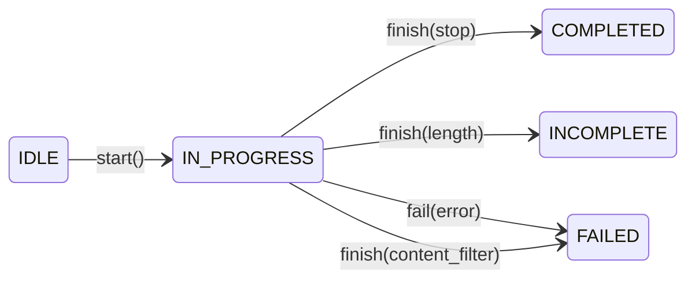
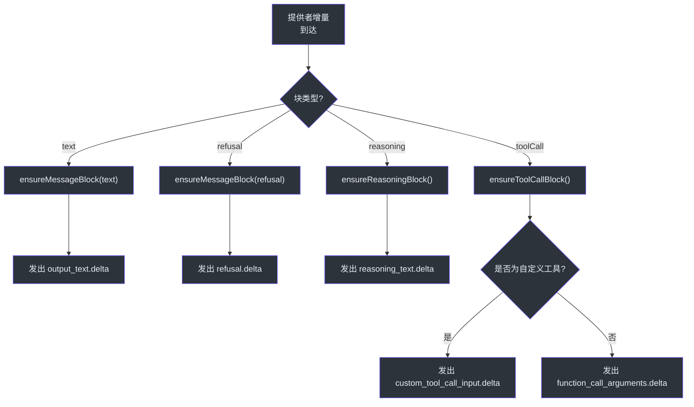
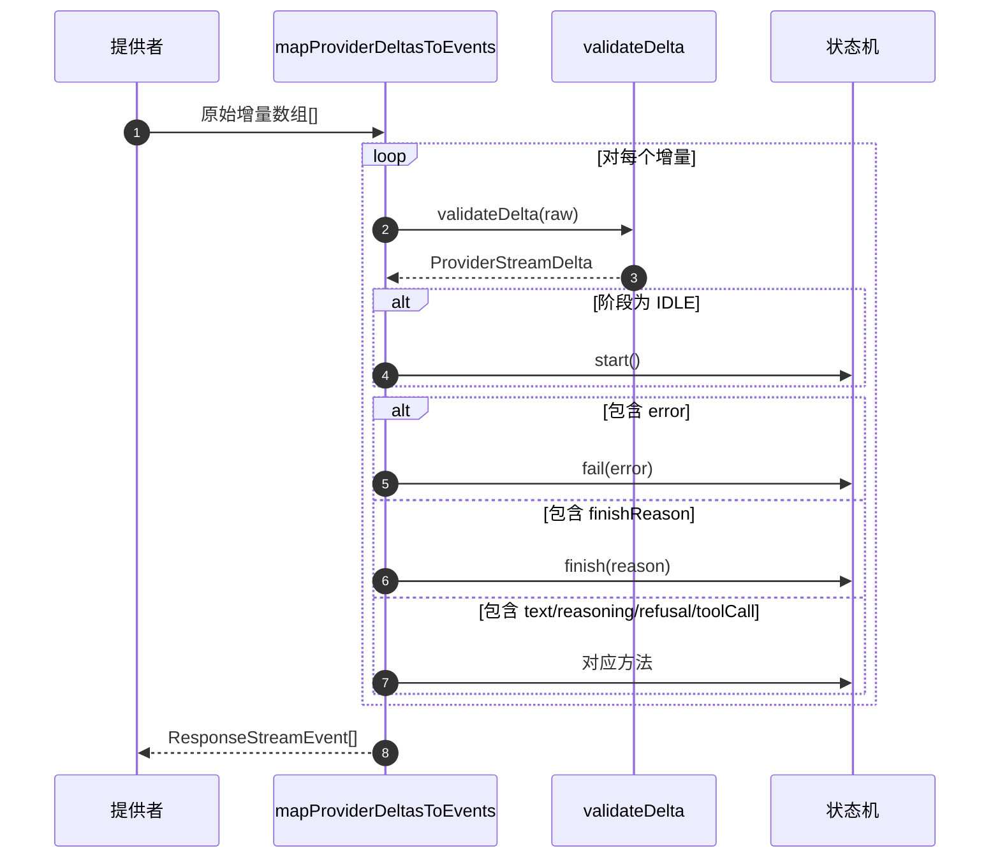
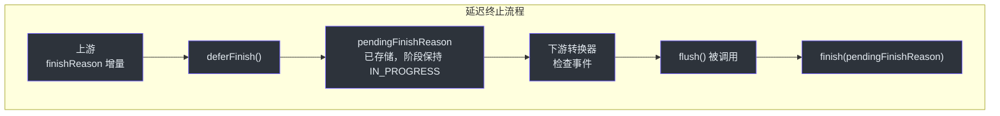

# 流重建

流重建是桥接层，负责将异构的提供者流增量转换为统一的 OpenAI 兼容 `ResponseStreamEvent` 对象序列。没有它，每个上游提供者都会以自己的格式发出数据块，下游消费者（SSE 编码器、追踪日志器、会话持久化）就需要针对每个提供者编写特定逻辑。重建层让 GodeX 拥有单一、可预测的事件模型，无论请求由哪个 LLM 提供者处理。

## 概览

| 关注点 | 组件 | 关键文件 |
|---------|-----------|----------|
| 状态机阶段 | `ResponseStreamStateMachine` | [response-stream-state-machine.ts:37](https://github.com/Ahoo-Wang/GodeX/blob/main/src/bridge/stream/response-stream-state-machine.ts#L37) |
| 增量到事件映射 | `mapProviderDeltasToEvents` | [stream-reconstructor.ts:17](https://github.com/Ahoo-Wang/GodeX/blob/main/src/bridge/stream/stream-reconstructor.ts#L17) |
| 增量验证 | `validateDelta` + 辅助函数 | [stream-reconstructor.ts:69](https://github.com/Ahoo-Wang/GodeX/blob/main/src/bridge/stream/stream-reconstructor.ts#L69) |
| 增量类型契约 | `ProviderStreamDelta` | [stream-delta.ts:28](https://github.com/Ahoo-Wang/GodeX/blob/main/src/bridge/stream/stream-delta.ts#L28) |
| 延迟终止事件 | `deferFinish` / `deferTerminal` | [response-stream-state-machine.ts:263](https://github.com/Ahoo-Wang/GodeX/blob/main/src/bridge/stream/response-stream-state-machine.ts#L263) |

## 流状态机阶段

`ResponseStreamPhase` 枚举定义了每个流经历的五个阶段：

| 阶段 | 描述 |
|-------|-------------|
| `IDLE` | 初始状态；尚未发出任何事件 |
| `IN_PROGRESS` | 流正在活跃接收增量 |
| `COMPLETED` | 流正常结束 |
| `INCOMPLETE` | 流达到长度或上下文窗口限制 |
| `FAILED` | 流因错误而终止 |

转换逻辑位于 [response-stream-state-machine.ts:787](https://github.com/Ahoo-Wang/GodeX/blob/main/src/bridge/stream/response-stream-state-machine.ts#L787)，负责将提供者完成原因映射到正确的终止阶段。

## 块管理

在 `IN_PROGRESS` 阶段，状态机管理四类输出块：

| 块类型 | 字段 | 追踪方式 |
|------------|--------|------------|
| 文本 | `itemId`、`outputIndex`、`contentIndex`、`text` | `activeText` |
| 拒绝 | 与文本相同结构 | `activeRefusal` |
| 推理 | `itemId`、`outputIndex`、`contentIndex`、`text` | `activeReasoning` |
| 工具调用 | `callId`、`providerName`、`arguments`、`customInput` | `activeToolCalls` Map |

每个块在收到第一个增量时延迟创建，当流通过 `closeActiveBlocks` ([response-stream-state-machine.ts:428](https://github.com/Ahoo-Wang/GodeX/blob/main/src/bridge/stream/response-stream-state-machine.ts#L428)) 到达终止阶段时关闭。

## 增量验证管道

`mapProviderDeltasToEvents` ([stream-reconstructor.ts:17](https://github.com/Ahoo-Wang/GodeX/blob/main/src/bridge/stream/stream-reconstructor.ts#L17)) 是核心循环。在任何状态机转换之前，每个原始增量都通过 `validateDelta` 验证，强制执行 `ProviderStreamDelta` 契约 ([stream-delta.ts:28](https://github.com/Ahoo-Wang/GodeX/blob/main/src/bridge/stream/stream-delta.ts#L28))。

| 验证字段 | 规则 |
|----------------|-------|
| `text` | 可选字符串 |
| `reasoning` | 可选字符串 |
| `refusal` | 可选字符串 |
| `toolCall` | 可选对象；`index` 必须为非负整数；`id`/`type`/`name`/`arguments` 必须为字符串 |
| `usage` | 包含必需的 `input_tokens`、`output_tokens`、`total_tokens`（有限数字）的对象 |
| `finishReason` | 字符串、null 或 undefined |
| `error` | 包含必需的 `message` 字符串和可选的 `code` 字符串的对象 |

无法识别的字段会引发错误码为 `BRIDGE_STREAM_INVALID_TRANSITION` 的 `BridgeError` ([stream-reconstructor.ts:120](https://github.com/Ahoo-Wang/GodeX/blob/main/src/bridge/stream/stream-reconstructor.ts#L120))。

## 延迟终止事件

当 `deferTerminal` 为 true（在流式管道中如此）时，状态机的 `deferFinish` 方法存储完成原因而不转换到终止阶段 ([response-stream-state-machine.ts:263](https://github.com/Ahoo-Wang/GodeX/blob/main/src/bridge/stream/response-stream-state-machine.ts#L263))。这允许下游转换器——特别是输出契约验证转换器——在终止事件到达客户端之前检查并可能重写它。

`ProviderStreamEventBridge.flush` 方法 ([stream-pipeline.ts:123](https://github.com/Ahoo-Wang/GodeX/blob/main/src/responses/stream-pipeline.ts#L123)) 在上游流关闭时调用 `machine.finish(machine.deferredFinishReason)`，确保终止事件总是被发出。

## 工具调用重建

工具调用块通过 `streamIndex` 在 `Map<number, ToolCallBlock>` 中追踪 ([response-stream-state-machine.ts:94](https://github.com/Ahoo-Wang/GodeX/blob/main/src/bridge/stream/response-stream-state-machine.ts#L94))。当工具调用块关闭时，状态机：

1. 验证 `callId` 和 `providerName` 都存在（否则抛出 `BRIDGE_STREAM_INCOMPLETE_TOOL_CALL`）
2. 检查 `ToolIdentityMap` 以确定工具是否为自定义工具
3. 调用 `restoreToolCall`（来自 [call-restorer.ts:16](https://github.com/Ahoo-Wang/GodeX/blob/main/src/bridge/tools/call-restorer.ts#L16)）将提供者函数调用映射回正确的 Responses API 类型（`function_call`、`local_shell_call`、`shell_call`、`apply_patch_call` 或 `custom_tool_call`）

## 错误规范化

提供者错误通过 `normalizeError` ([response-stream-state-machine.ts:753](https://github.com/Ahoo-Wang/GodeX/blob/main/src/bridge/stream/response-stream-state-machine.ts#L753)) 进行规范化，将提供者错误代码映射到一组已知的 `ResponseErrorCode` 值。未知代码回退为 `server_error`。

## 交叉引用

- [Streaming Pipeline](./streaming-pipeline.md) -- 编排送入此状态机的转换链
- [Output Contracts](./output-contracts.md) -- 使用延迟终止事件进行 JSON 验证
- [Tool Planning](./tool-planning.md) -- 生成工具调用重建时使用的 `ToolIdentityMap`
- [Sync Pipeline](./sync-pipeline.md) -- 重建完整 `ResponseObject` 的非流式对应管道

## 参考

- [response-stream-state-machine.ts:37](https://github.com/Ahoo-Wang/GodeX/blob/main/src/bridge/stream/response-stream-state-machine.ts#L37) -- `ResponseStreamPhase` 枚举定义
- [response-stream-state-machine.ts:86](https://github.com/Ahoo-Wang/GodeX/blob/main/src/bridge/stream/response-stream-state-machine.ts#L86) -- `ResponseStreamStateMachine` 类
- [stream-reconstructor.ts:17](https://github.com/Ahoo-Wang/GodeX/blob/main/src/bridge/stream/stream-reconstructor.ts#L17) -- `mapProviderDeltasToEvents` 函数
- [stream-reconstructor.ts:69](https://github.com/Ahoo-Wang/GodeX/blob/main/src/bridge/stream/stream-reconstructor.ts#L69) -- `validateDelta` 函数
- [stream-delta.ts:28](https://github.com/Ahoo-Wang/GodeX/blob/main/src/bridge/stream/stream-delta.ts#L28) -- `ProviderStreamDelta` 接口
- [response-stream-state-machine.ts:263](https://github.com/Ahoo-Wang/GodeX/blob/main/src/bridge/stream/response-stream-state-machine.ts#L263) -- `deferFinish` 方法
- [response-stream-state-machine.ts:428](https://github.com/Ahoo-Wang/GodeX/blob/main/src/bridge/stream/response-stream-state-machine.ts#L428) -- `closeActiveBlocks` 方法
