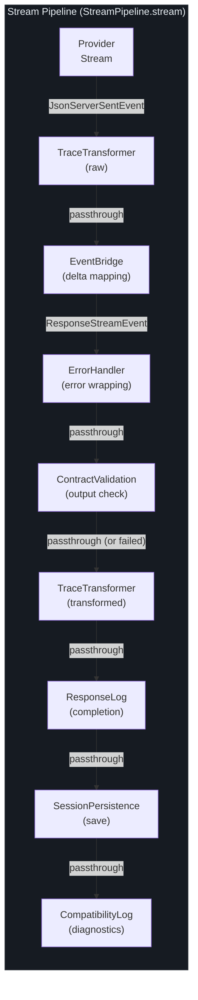
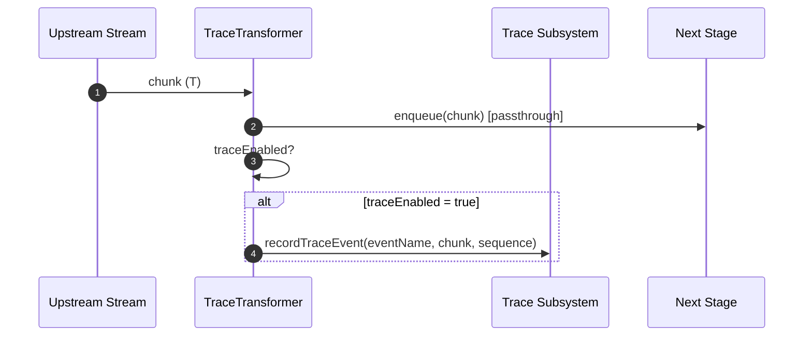
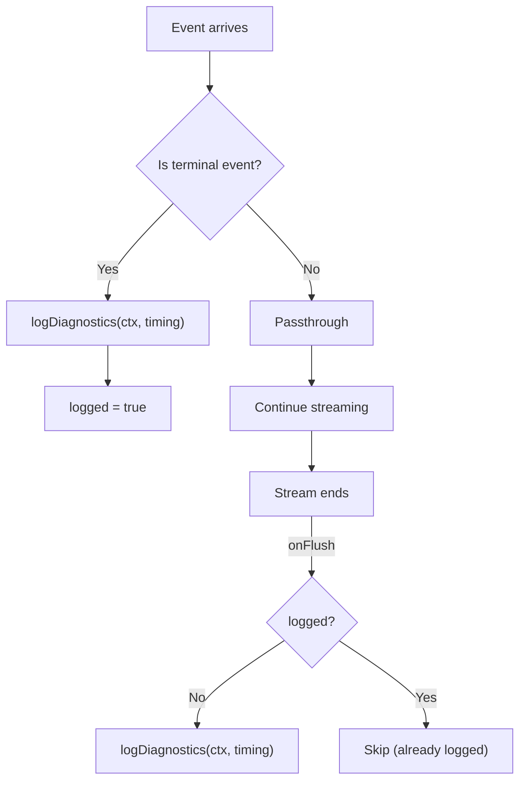
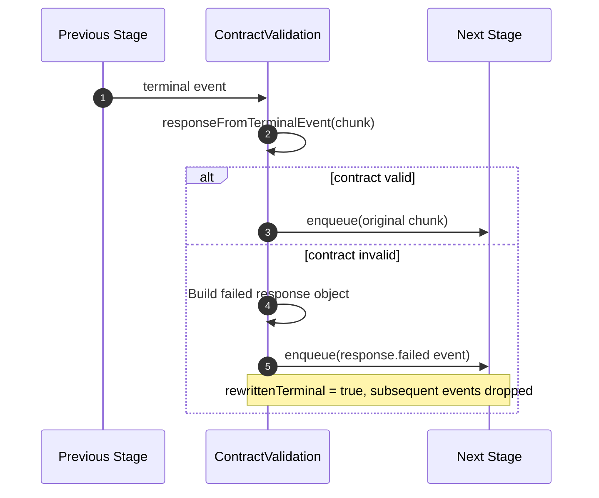
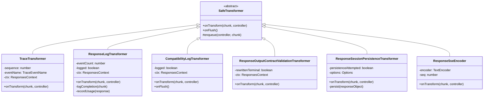

# 流转换

当 GodeX 代理来自上游 LLM 提供商的流式响应时，原始的 SSE 字节流必须经过多个处理阶段才能到达客户端。每个阶段都实现为 `src/responses/stream-transforms/` 中的一个可组合 `TransformStream` 转换器。这种设计使每个关注点相互隔离且可独立测试 -- 追踪记录事件而不涉及日志记录，合约验证可以使响应失败而不影响持久化，SSE 编码在边缘进行而无需上游感知。理解转换链对于调试流式行为、添加新的横切关注点或扩展响应管道至关重要。

## 概览

| 转换器 | 输入类型 | 输出类型 | 用途 |
|---|---|---|---|
| `TraceTransformer` | `T` | `T` | 将原始/已转换事件记录到追踪子系统 |
| `ProviderStreamEventBridge` | `JsonServerSentEvent` | `ResponseStreamEvent` | 将提供商 delta 映射为 OpenAI 兼容事件 |
| `wrapWithErrorHandler` | `ResponseStreamEvent` | `ResponseStreamEvent` | 将流错误转换为 `response.failed` 事件 |
| `ResponseOutputContractValidationTransformer` | `ResponseStreamEvent` | `ResponseStreamEvent` | 在终止事件上验证输出合约 |
| `ResponseLogTransformer` | `ResponseStreamEvent` | `ResponseStreamEvent` | 记录流完成的计时和使用量日志 |
| `ResponseSessionPersistenceTransformer` | `ResponseStreamEvent` | `ResponseStreamEvent` | 在流完成时持久化会话 |
| `CompatibilityLogTransformer` | `ResponseStreamEvent` | `ResponseStreamEvent` | 在流结束时记录兼容性诊断信息 |
| `ResponseSseEncoder` | `ResponseStreamEvent` | `Uint8Array` | 将事件编码为 SSE 文本行 |

## 转换链顺序

[src/responses/stream-pipeline.ts](https://github.com/Ahoo-Wang/GodeX/blob/main/src/responses/stream-pipeline.ts) 中的 `StreamPipeline.stream()` 方法组装完整的链。每个阶段通过 [src/responses/stream-transforms/stream-utils.ts:6](https://github.com/Ahoo-Wang/GodeX/blob/main/src/responses/stream-transforms/stream-utils.ts#L6) 中的 `pipeTransform` 辅助函数连接，该函数将每个转换器包装在标准的 `TransformStream` 中。



管道在 [src/responses/stream-pipeline.ts:37](https://github.com/Ahoo-Wang/GodeX/blob/main/src/responses/stream-pipeline.ts#L37) 处组装，每个 `pipeTransform` 调用将前一个 `ReadableStream` 链接到下一个转换器。

## pipeTransform 辅助函数

所有链式连接使用一个单一的实用函数：

```typescript
export function pipeTransform<I, O>(
  stream: ReadableStream<I>,
  transformer: Transformer<I, O>,
): ReadableStream<O>
```

该函数定义在 [src/responses/stream-transforms/stream-utils.ts:6](https://github.com/Ahoo-Wang/GodeX/blob/main/src/responses/stream-transforms/stream-utils.ts#L6)，它从任意 `Transformer` 创建一个新的 `TransformStream` 并将输入流通过它进行管道传输。这使管道保持可组合 -- 每个阶段都是一个可独立测试的独立转换器。

该模块还导出 `ATTR_UPSTREAM_LATENCY_MILLIS`（[stream-utils.ts:13](https://github.com/Ahoo-Wang/GodeX/blob/main/src/responses/stream-transforms/stream-utils.ts#L13)）和 `responseFromTerminalEvent`（[stream-utils.ts:15](https://github.com/Ahoo-Wang/GodeX/blob/main/src/responses/stream-transforms/stream-utils.ts#L15)），两者都被多个下游转换器使用。

## TraceTransformer

`TraceTransformer` 是一个直通转换器，将每个流事件记录到追踪子系统。它在管道中出现**两次** -- 一次在事件桥接之前（记录原始上游事件），一次在验证之后（记录已转换事件）。



关键实现细节：

- 继承自 `@ahoo-wang/fetcher-eventstream` 中的 `SafeTransformer<T, T>`，提供错误安全的直通语义
- 维护一个自增的 `sequence` 计数器用于有序追踪记录
- 当 `ctx.app.traceEnabled` 为 false 时短路 -- 追踪关闭时无额外内存分配
- 源码：[src/responses/stream-transforms/trace-transformer.ts:8](https://github.com/Ahoo-Wang/GodeX/blob/main/src/responses/stream-transforms/trace-transformer.ts#L8)

## ResponseLogTransformer

`ResponseLogTransformer` 监视终止事件并记录包含计时、使用量和延迟数据的结构化完成记录。

| 日志字段 | 来源 |
|---|---|
| `status` | 终止事件中的 `response.status` |
| `model` | `response.model` |
| `outputCount` | `response.output.length` |
| `durationMillis` | `Date.now() - ctx.createdAt * 1000` |
| `usage` | `response.usage` |
| `cacheHitRatio` | 通过 `cacheHitRatioFromResponseUsage` 从使用量中计算 |
| `upstreamLatencyMillis` | 从 `ctx.attributes` 中读取（在提供商交换期间设置） |
| `streamEventCount` | 目前已看到的事件数 |

它还通过 `recordTraceUsage` 将使用量记录到追踪子系统（[src/responses/stream-transforms/response-log-transformer.ts:13](https://github.com/Ahoo-Wang/GodeX/blob/main/src/responses/stream-transforms/response-log-transformer.ts#L13)）。该转换器只触发一次 -- 后续的终止事件通过 `logged` 守卫被忽略。

## CompatibilityLogTransformer

`CompatibilityLogTransformer` 在流结束时发出兼容性诊断信息。它检查终止事件（`response.completed`、`response.failed`、`response.incomplete`、`response.cancelled`）并使用计时数据调用 `logDiagnostics`。



[src/responses/stream-transforms/compatibility-log-transformer.ts:24](https://github.com/Ahoo-Wang/GodeX/blob/main/src/responses/stream-transforms/compatibility-log-transformer.ts#L24) 处的 `onFlush` 回退确保即使流在没有终止事件的情况下关闭也能记录诊断信息。日志条目的严重级别与最严重的诊断相匹配 -- 错误为 `error` 级别，警告为 `warn` 级别，信息性诊断为 `info` 级别。

## ResponseOutputContractValidationTransformer

此转换器在终止事件到达时验证输出合约。如果响应输出不满足合约（例如，请求了 `json_schema` 格式但输出不是有效的 JSON），转换器会将终止事件**重写**为 `response.failed` 事件。



一旦终止事件被重写，所有后续事件将被静默丢弃（`if (this.rewrittenTerminal) return`，位于 [src/responses/stream-transforms/response-output-contract-validation-transformer.ts:22](https://github.com/Ahoo-Wang/GodeX/blob/main/src/responses/stream-transforms/response-output-contract-validation-transformer.ts#L22)）。这可以防止合约失败后部分输出泄漏到客户端。

## ResponseSessionPersistenceTransformer

`ResponseSessionPersistenceTransformer` 在流完成时将已完成的响应保存到会话存储。它委托给一个可插拔的 `saveSession` 回调（默认为持久化模块中的 `saveResponseSession`）。

关键行为：

- 在尝试持久化之前通过 `enqueue` 立即将每个事件传递
- 使用 `persistenceAttempted` 标志防止重复持久化
- 当 `ctx.request.store === false` 时完全跳过（`StreamPipeline` 在 [src/responses/stream-pipeline.ts:74](https://github.com/Ahoo-Wang/GodeX/blob/main/src/responses/stream-pipeline.ts#L74) 添加转换器之前会检查此条件）
- 以 `warn` 级别捕获并记录会话保存错误，不会导致流失败

源码：[src/responses/stream-transforms/response-session-persistence-transformer.ts:19](https://github.com/Ahoo-Wang/GodeX/blob/main/src/responses/stream-transforms/response-session-persistence-transformer.ts#L19)

## ResponseSseEncoder

`ResponseSseEncoder` 是将 `ResponseStreamEvent` 对象转换为 SSE 传输格式的最终阶段。与其他转换器不同，它将输出类型从 `ResponseStreamEvent` 变为 `Uint8Array`。

每个事件编码为：

```
event: <event.type>
data: <JSON payload with sequence_number>

```

编码器跟踪序列号，如果事件本身有 `sequence_number` 则使用它，否则自动递增（[src/responses/stream-transforms/response-sse-encoder.ts:4](https://github.com/Ahoo-Wang/GodeX/blob/main/src/responses/stream-transforms/response-sse-encoder.ts#L4)）。

此转换器应用于 HTTP 调度层，不在 `StreamPipeline` 内部。[响应调度器](https://github.com/Ahoo-Wang/GodeX/blob/main/src/server/routes/responses/response-dispatcher.ts)将其添加为最后一步：

```typescript
const sseBody = pipeTransform(eventStream, new ResponseSseEncoder());
```

## 共享模式

所有转换器遵循一致的设计模式：

| 模式 | 实现 |
|---|---|
| 基类 | `@ahoo-wang/fetcher-eventstream` 中的 `SafeTransformer<I, O>` |
| 直通 | 在执行工作之前调用 `this.enqueue(controller, chunk)` |
| 一次性操作 | 布尔守卫（`logged`、`logged`、`persistenceAttempted`、`rewrittenTerminal`） |
| 上下文访问 | 所有转换器通过构造函数接收 `ResponsesContext` |
| 错误安全 | `SafeTransformer` 基类确保 `onTransform` 中的错误不会导致流崩溃 |



## 添加新的转换阶段

要向管道添加新的关注点：

1. 在 `src/responses/stream-transforms/` 中创建一个新文件，继承 `SafeTransformer`
2. 实现 `onTransform(chunk, controller)` -- 始终调用 `this.enqueue(controller, chunk)` 来传递数据
3. 在 [src/responses/stream-transforms/index.ts](https://github.com/Ahoo-Wang/GodeX/blob/main/src/responses/stream-transforms/index.ts) 中添加 `export *`
4. 在 [src/responses/stream-pipeline.ts](https://github.com/Ahoo-Wang/GodeX/blob/main/src/responses/stream-pipeline.ts) 的 `StreamPipeline.stream()` 中的正确位置插入 `pipeTransform` 调用
5. 按照现有测试模式添加一个同目录的 `.test.ts` 文件

## 交叉引用

- [流管道](./streaming-pipeline.md) -- 转换如何组装成完整的流式管道
- [架构概览](./overview.md) -- 流转换在系统中的上下文
- [错误处理](../06-error-handling/error-handling.md) -- `wrapWithErrorHandler` 阶段和错误传播
- [会话管理](../04-session-management/session-stores.md) -- 持久化转换器如何保存会话
- [测试](../08-testing/testing.md) -- 每个转换器的同目录单元测试
- [追踪系统](../10-trace/trace-system.md) -- `TraceTransformer` 如何为追踪子系统提供数据

## 参考资料

1. [src/responses/stream-transforms/trace-transformer.ts](https://github.com/Ahoo-Wang/GodeX/blob/main/src/responses/stream-transforms/trace-transformer.ts) -- 原始和已转换事件追踪
2. [src/responses/stream-transforms/response-log-transformer.ts](https://github.com/Ahoo-Wang/GodeX/blob/main/src/responses/stream-transforms/response-log-transformer.ts) -- 带使用量的完成日志
3. [src/responses/stream-transforms/compatibility-log-transformer.ts](https://github.com/Ahoo-Wang/GodeX/blob/main/src/responses/stream-transforms/compatibility-log-transformer.ts) -- 兼容性诊断日志
4. [src/responses/stream-transforms/response-output-contract-validation-transformer.ts](https://github.com/Ahoo-Wang/GodeX/blob/main/src/responses/stream-transforms/response-output-contract-validation-transformer.ts) -- 输出合约验证与重写
5. [src/responses/stream-transforms/response-session-persistence-transformer.ts](https://github.com/Ahoo-Wang/GodeX/blob/main/src/responses/stream-transforms/response-session-persistence-transformer.ts) -- 完成时会话持久化
6. [src/responses/stream-transforms/response-sse-encoder.ts](https://github.com/Ahoo-Wang/GodeX/blob/main/src/responses/stream-transforms/response-sse-encoder.ts) -- SSE 传输格式编码
7. [src/responses/stream-transforms/stream-utils.ts](https://github.com/Ahoo-Wang/GodeX/blob/main/src/responses/stream-transforms/stream-utils.ts) -- `pipeTransform` 辅助函数和共享工具
8. [src/responses/stream-transforms/index.ts](https://github.com/Ahoo-Wang/GodeX/blob/main/src/responses/stream-transforms/index.ts) -- 桶式重新导出
9. [src/responses/stream-pipeline.ts:37-85](https://github.com/Ahoo-Wang/GodeX/blob/main/src/responses/stream-pipeline.ts#L37) -- 管道组装
10. [src/server/routes/responses/response-dispatcher.ts](https://github.com/Ahoo-Wang/GodeX/blob/main/src/server/routes/responses/response-dispatcher.ts) -- SSE 编码的应用位置
