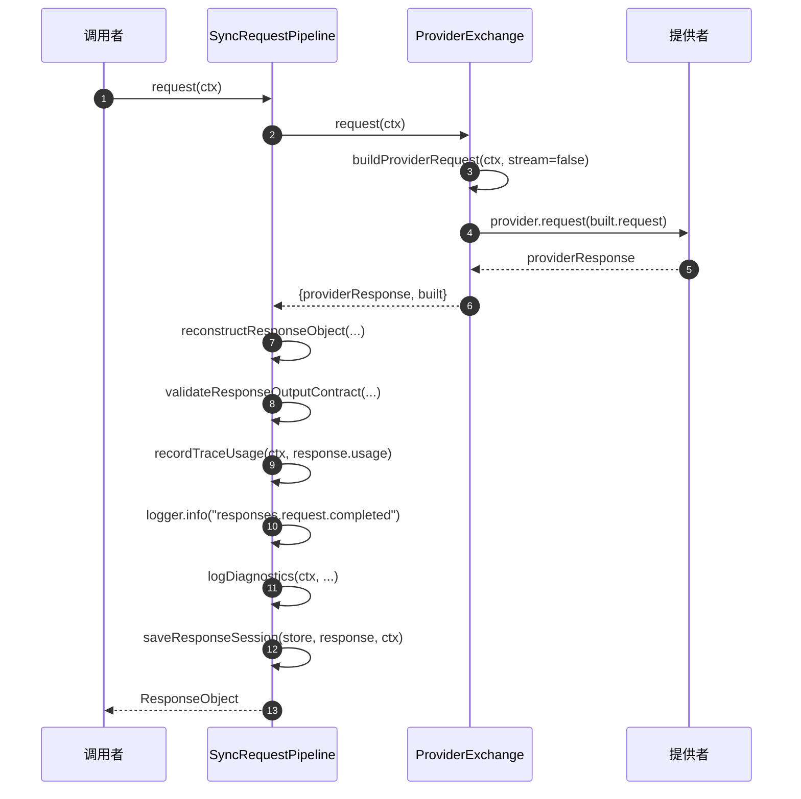
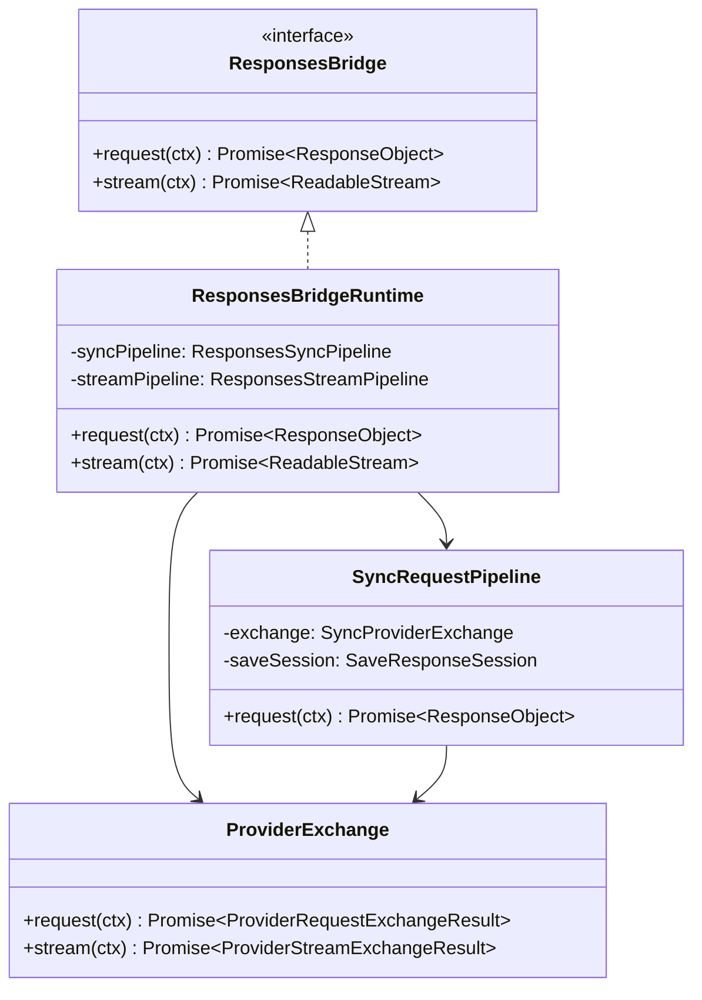

# 同步管道

同步管道端到端处理非流式 Requests API 调用。它是 GodeX 两条执行路径中较简单的一条：向上游提供者发送单个请求，将响应重建为 OpenAI Responses 格式，验证输出契约，持久化会话，并返回完整的 `ResponseObject`。理解同步管道是理解更复杂的流式管道的基础。

## 概览

| 关注点 | 组件 | 关键文件 |
|---------|-----------|----------|
| 管道编排器 | `SyncRequestPipeline` | [sync-request-pipeline.ts:25](https://github.com/Ahoo-Wang/GodeX/blob/main/src/responses/sync-request-pipeline.ts#L25) |
| 提供者交换 | `ProviderExchange` | [provider-exchange.ts:25](https://github.com/Ahoo-Wang/GodeX/blob/main/src/responses/provider-exchange.ts#L25) |
| 桥接接口 | `ResponsesBridge` | [bridge.ts:7](https://github.com/Ahoo-Wang/GodeX/blob/main/src/responses/bridge.ts#L7) |
| 运行时装配 | `ResponsesBridgeRuntime` | [runtime.ts:19](https://github.com/Ahoo-Wang/GodeX/blob/main/src/responses/runtime.ts#L19) |
| 会话持久化 | `saveResponseSession` | [response-session-persistence.ts:5](https://github.com/Ahoo-Wang/GodeX/blob/main/src/responses/response-session-persistence.ts#L5) |

## 管道步骤

`SyncRequestPipeline.request` ([sync-request-pipeline.ts:31](https://github.com/Ahoo-Wang/GodeX/blob/main/src/responses/sync-request-pipeline.ts#L31)) 按顺序执行七个步骤：

| 步骤 | 操作 | 关键代码 |
|------|-----------|----------|
| 1 | 构建提供者请求并调用上游 | `exchange.request(ctx)` |
| 2 | 重建响应对象 | `reconstructResponseObject(...)` |
| 3 | 验证输出契约 | `validateResponseOutputContract(...)` |
| 4 | 记录追踪使用量 | `recordTraceUsage(ctx, response.usage)` |
| 5 | 记录完成日志 | `ctx.logger.info(...)` |
| 6 | 记录诊断日志 | `logDiagnostics(ctx, ...)` |
| 7 | 保存响应会话 | `saveResponseSession(...)` |

## 提供者交换

`ProviderExchange` ([provider-exchange.ts:25](https://github.com/Ahoo-Wang/GodeX/blob/main/src/responses/provider-exchange.ts#L25)) 封装了与上游提供者的交互。对于同步请求：

1. **构建请求**：`buildProviderRequest(ctx, false)` 构建提供者特定的聊天补全请求，包括工具规划和输出契约设置 ([provider-exchange.ts:73](https://github.com/Ahoo-Wang/GodeX/blob/main/src/responses/provider-exchange.ts#L73))
2. **追踪请求**：记录原始提供者请求以用于可观测性
3. **调用上游**：等待 `ctx.provider.request(providerRequest)` -- 实际的 HTTP 调用
4. **追踪响应**：记录原始提供者响应
5. **返回**：同时提供原始响应和构建的请求元数据

交换还记录工具决策诊断 ([provider-exchange.ts:102](https://github.com/Ahoo-Wang/GodeX/blob/main/src/responses/provider-exchange.ts#L102)) 并在上下文中设置输出契约槽 ([provider-exchange.ts:98](https://github.com/Ahoo-Wang/GodeX/blob/main/src/responses/provider-exchange.ts#L98))。

## 响应重建

交换返回后，管道使用以下参数调用 `reconstructResponseObject` ([sync-request-pipeline.ts:34](https://github.com/Ahoo-Wang/GodeX/blob/main/src/responses/sync-request-pipeline.ts#L34))：

| 参数 | 来源 |
|-----------|--------|
| `requestId` | `ctx.requestId` |
| `responseId` | `ctx.responseId` |
| `createdAt` | `ctx.createdAt` |
| `completedAt` | `Math.floor(Date.now() / 1000)` |
| `provider` | `ctx.provider.name` |
| `model` | `ctx.resolved.model` |
| `providerResponse` | 原始提供者响应 |
| `accessor` | `ctx.provider.spec.response` |
| `toolIdentity` | 构建的工具声明 |
| `outputContract` | 构建的输出契约计划 |
| `echo` | 来自 `responseRequestEchoFields` 的请求回显字段 |

回显字段 ([response-request-echo.ts:4](https://github.com/Ahoo-Wang/GodeX/blob/main/src/responses/response-request-echo.ts#L4)) 将选定的请求参数镜像回响应对象，包括 `instructions`、`temperature`、`tools`、`tool_choice` 等许多其他参数。

## 输出契约验证

重建后，`validateResponseOutputContract` 检查输出是否满足规划的契约。这在 `json_schema` 被降级为 `json_object` 时尤为重要：`requiresValidJson` 标志会触发对输出文本的 `JSON.parse`。完整的验证逻辑请参见 [Output Contracts](./output-contracts.md)。

## 会话持久化

`saveResponseSession` ([response-session-persistence.ts:5](https://github.com/Ahoo-Wang/GodeX/blob/main/src/responses/response-session-persistence.ts#L5)) 在 `ctx.request.store !== false` 时存储响应会话。存储的会话包括：

| 部分 | 字段 |
|---------|--------|
| 会话元数据 | `id`、`previous_response_id`、`created_at`、`completed_at`、`status` |
| 请求快照 | `input`、`instructions`、`model`、`tools`、`tool_choice`、`reasoning`、`text`、`truncation` |
| 响应快照 | `id`、`output`、`output_text`、`usage`、`error`、`incomplete_details` |

会话保存错误会被捕获并以 warn 级别记录，永远不会导致请求失败 ([sync-request-pipeline.ts:62](https://github.com/Ahoo-Wang/GodeX/blob/main/src/responses/sync-request-pipeline.ts#L62))。

## 运行时装配

`ResponsesBridgeRuntime` ([runtime.ts:19](https://github.com/Ahoo-Wang/GodeX/blob/main/src/responses/runtime.ts#L19)) 创建一个共享的 `ProviderExchange` 实例，并将其连接到 `SyncRequestPipeline` 和 `StreamPipeline`。它实现了 `ResponsesBridge` 接口：

## 日志与可观测性

同步管道在关键节点发出结构化日志事件：

| 事件 | 级别 | 上下文 |
|-------|-------|---------|
| `provider.request.sending` | debug | provider, model, stream=false |
| `provider.response.received` | debug | provider, model, upstreamDurationMillis |
| `responses.request.completed` | info | status, model, outputCount, durationMillis, usage, cacheHitRatio |
| `session.save.error` | warn | request_id, response_id, error |

追踪事件通过 `recordTraceRequest`、`recordTraceEvent` 和 `recordTraceUsage` 记录原始请求体、原始响应体和使用量指标。

## 交叉引用

- [Streaming Pipeline](./streaming-pipeline.md) -- 具有可组合转换链的流式对应管道
- [Output Contracts](./output-contracts.md) -- 重建后使用的验证逻辑
- [Stream Reconstruction](./stream-reconstruction.md) -- 流式增量如何重建（与同步重建的对比）
- [Tool Planning](./tool-planning.md) -- 请求构建期间消费的工具声明

## 参考

- [sync-request-pipeline.ts:25](https://github.com/Ahoo-Wang/GodeX/blob/main/src/responses/sync-request-pipeline.ts#L25) -- `SyncRequestPipeline` 类
- [provider-exchange.ts:25](https://github.com/Ahoo-Wang/GodeX/blob/main/src/responses/provider-exchange.ts#L25) -- `ProviderExchange` 类
- [bridge.ts:7](https://github.com/Ahoo-Wang/GodeX/blob/main/src/responses/bridge.ts#L7) -- `ResponsesBridge` 接口
- [runtime.ts:19](https://github.com/Ahoo-Wang/GodeX/blob/main/src/responses/runtime.ts#L19) -- `ResponsesBridgeRuntime` 类
- [response-session-persistence.ts:5](https://github.com/Ahoo-Wang/GodeX/blob/main/src/responses/response-session-persistence.ts#L5) -- `saveResponseSession` 函数
- [response-request-echo.ts:4](https://github.com/Ahoo-Wang/GodeX/blob/main/src/responses/response-request-echo.ts#L4) -- `responseRequestEchoFields` 函数
