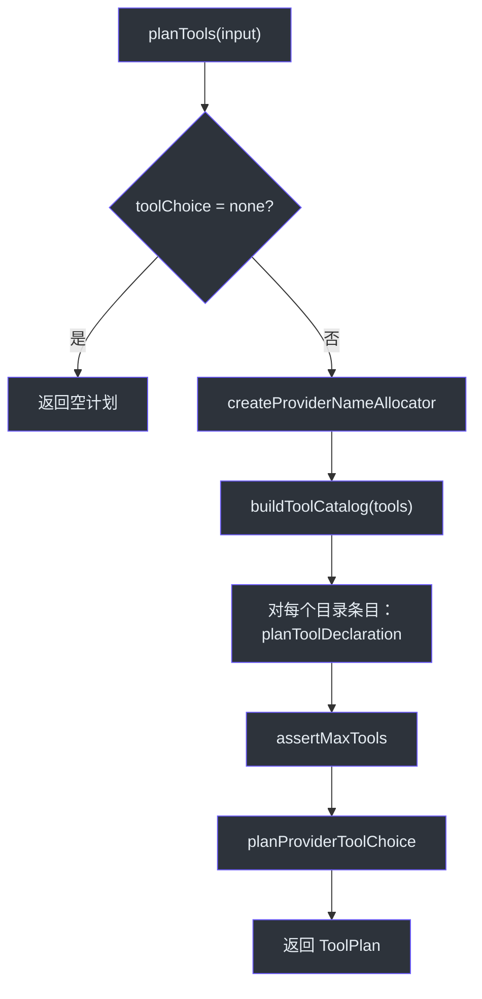
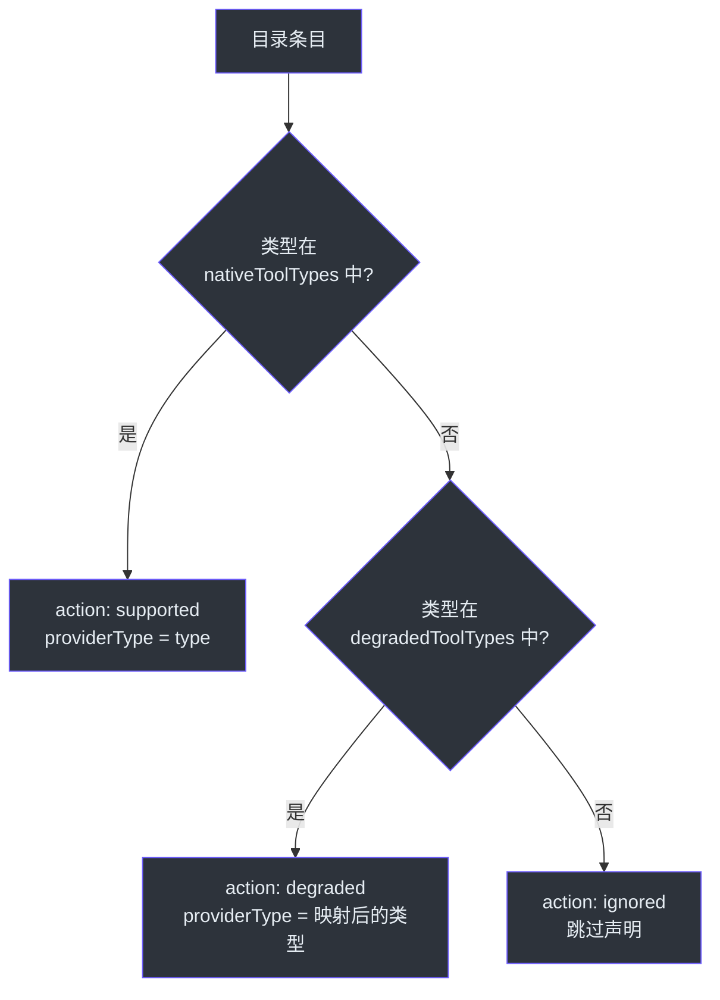
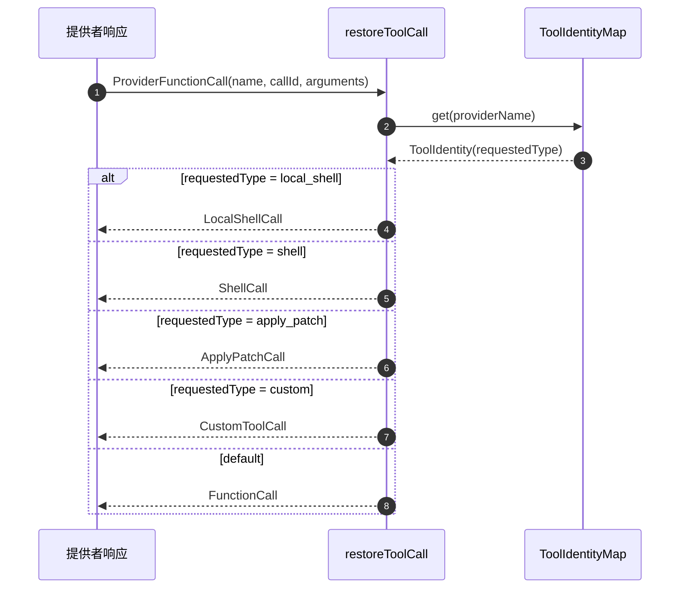

# 工具规划

工具规划是 GodeX 将统一的 Responses API 工具声明集合转换为提供者特定工具配置的过程。由于不同提供者支持不同的工具类型、对工具数量有不同限制、并使用不同的命名约定，GodeX 必须为每个工具决定是原生传递、降级为兼容类型还是完全忽略。此规划在每次请求时执行一次，其结果同时被请求构建器和响应重建器消费。

## 概览

| 关注点 | 组件 | 关键文件 |
|---------|-----------|----------|
| 工具规划编排 | `planTools` | [tool-plan.ts:66](https://github.com/Ahoo-Wang/GodeX/blob/main/src/bridge/tools/tool-plan.ts#L66) |
| 目录构建器 | `buildToolCatalog` | [tool-catalog.ts:9](https://github.com/Ahoo-Wang/GodeX/blob/main/src/bridge/tools/tool-catalog.ts#L9) |
| 单工具声明规划 | `planToolDeclaration` | [tool-plan.ts:108](https://github.com/Ahoo-Wang/GodeX/blob/main/src/bridge/tools/tool-plan.ts#L108) |
| 名称分配 | `createProviderNameAllocator` | [tool-plan.ts:157](https://github.com/Ahoo-Wang/GodeX/blob/main/src/bridge/tools/tool-plan.ts#L157) |
| 身份映射 | `ToolIdentityMap` | [tool-identity.ts:18](https://github.com/Ahoo-Wang/GodeX/blob/main/src/bridge/tools/tool-identity.ts#L18) |
| 调用还原 | `restoreToolCall` | [call-restorer.ts:16](https://github.com/Ahoo-Wang/GodeX/blob/main/src/bridge/tools/call-restorer.ts#L16) |
| 声明渲染 | `renderProviderToolDeclarations` | [declaration-renderer.ts:29](https://github.com/Ahoo-Wang/GodeX/blob/main/src/bridge/tools/declaration-renderer.ts#L29) |
| 工具选择规划 | `planProviderToolChoice` | [tool-plan.ts:198](https://github.com/Ahoo-Wang/GodeX/blob/main/src/bridge/tools/tool-plan.ts#L198) |

## 规划流程

`planTools` 函数 ([tool-plan.ts:66](https://github.com/Ahoo-Wang/GodeX/blob/main/src/bridge/tools/tool-plan.ts#L66)) 编排整个规划过程：

## 单工具决策逻辑

对于目录中的每个工具，`planToolDeclaration` ([tool-plan.ts:108](https://github.com/Ahoo-Wang/GodeX/blob/main/src/bridge/tools/tool-plan.ts#L108)) 做出以下三种决策之一：

| 决策 | 条件 | 结果 |
|----------|-----------|---------|
| **supported（支持）** | 工具类型在 `nativeToolTypes` 中 | 以相同类型直接传递 |
| **degraded（降级）** | 工具类型在 `degradedToolTypes` 中 | 映射为提供者兼容的类型 |
| **ignored（忽略）** | 工具类型完全不支持 | 完全跳过声明 |

## 提供者名称分配

提供者命名约束要求经过清理的唯一工具名称。`createProviderNameAllocator` ([tool-plan.ts:157](https://github.com/Ahoo-Wang/GodeX/blob/main/src/bridge/tools/tool-plan.ts#L157)) 返回一个闭包，该闭包：

1. 应用 `toProviderName` 编解码器（默认为 [tool-identity.ts:54](https://github.com/Ahoo-Wang/GodeX/blob/main/src/bridge/tools/tool-identity.ts#L54) 中的 `defaultToolNameCodec`）
2. 将名称清理为仅包含字母数字、下划线和连字符（最多 64 个字符）
3. 通过后缀追加（`_2`、`_3` 等）进行去重

## 工具身份映射

`ToolIdentityMap` ([tool-identity.ts:18](https://github.com/Ahoo-Wang/GodeX/blob/main/src/bridge/tools/tool-identity.ts#L18)) 维护请求的工具名称与提供者分配名称之间的双向映射。它在规划阶段填充，在响应重建阶段消费，用于将提供者工具调用映射回原始请求类型。

| 字段 | 描述 |
|-------|-------------|
| `requestedName` | 原始 Responses API 请求中的名称 |
| `providerName` | 发送给提供者的清理后名称 |
| `requestedType` | 原始工具类型（如 `custom`、`local_shell`） |
| `providerType` | 提供者侧工具类型（如 `function`） |

该映射强制唯一性：如果两个不同的工具映射到相同的提供者名称，它会抛出 `BRIDGE_REQUEST_UNSUPPORTED_PARAMETER` 错误 ([tool-identity.ts:23](https://github.com/Ahoo-Wang/GodeX/blob/main/src/bridge/tools/tool-identity.ts#L23))。

## 工具选择规划

工具选择在 `planProviderToolChoice` ([tool-plan.ts:198](https://github.com/Ahoo-Wang/GodeX/blob/main/src/bridge/tools/tool-plan.ts#L198)) 中规划：

| 请求的选择 | 解析逻辑 |
|-----------------|-----------------|
| `none` | 返回 `undefined`（不发送工具选择） |
| `"auto"` / `"required"` | 如果提供者支持则直接支持；否则降级为 `"auto"`（如果可用），或拒绝 |
| 显式指定（如 `{type: "function", name: "x"}`） | 与声明匹配；如果提供者无法强制指定类型则降级 |

`renderProviderToolChoice` 函数 ([tool-choice.ts:19](https://github.com/Ahoo-Wang/GodeX/blob/main/src/bridge/tools/tool-choice.ts#L19)) 将规划后的选择转换为提供者特定格式。

## 声明渲染

`renderProviderToolDeclarations` ([declaration-renderer.ts:29](https://github.com/Ahoo-Wang/GodeX/blob/main/src/bridge/tools/declaration-renderer.ts#L29)) 将每个 `ToolDeclarationPlan` 转换为提供者期望的格式：

| 提供者类型 | 渲染逻辑 |
|--------------|----------------|
| `function` | 标准 `ChatFunctionToolDeclaration`，包含 name、description、parameters |
| `web_search` | 提供者特定的网络搜索配置 |
| `retrieval` | 文件搜索，包含来自 `vector_store_ids` 的 `knowledge_id` |
| `mcp` | MCP 服务器配置，包含 `server_label`、`headers` 等 |

自定义工具通过 `degradedCustomToolDescription` 和 `degradedCustomToolParameters`（来自 [custom-tool-degradation.ts:14](https://github.com/Ahoo-Wang/GodeX/blob/main/src/bridge/tools/custom-tool-degradation.ts#L14)）进行降级，将自定义工具的 `input` 字段包装为单个字符串参数。

内置工具类型（`local_shell`、`shell`、`apply_patch`）使用 [builtin.ts:9](https://github.com/Ahoo-Wang/GodeX/blob/main/src/tools/builtin.ts#L9) 中的定义。

## 调用还原

当提供者在响应中返回工具调用时，`restoreToolCall` ([call-restorer.ts:16](https://github.com/Ahoo-Wang/GodeX/blob/main/src/bridge/tools/call-restorer.ts#L16)) 使用身份映射重建正确的 Responses API 项类型：

每种特化类型（如 `LocalShellCall`、`ShellCall`）尝试将原始 JSON 参数解析为结构化操作。如果解析失败，则回退为带有请求名称的通用 `FunctionCall` ([call-restorer.ts:45](https://github.com/Ahoo-Wang/GodeX/blob/main/src/bridge/tools/call-restorer.ts#L45))。

## 最大工具数强制

`assertMaxTools` ([tool-plan.ts:175](https://github.com/Ahoo-Wang/GodeX/blob/main/src/bridge/tools/tool-plan.ts#L175)) 在规划的声明数量超过提供者的 `maxTools` 限制时抛出 `BridgeError`。这防止发送超出提供者处理能力的工具数量。

## 交叉引用

- [Stream Reconstruction](./stream-reconstruction.md) -- 在工具调用块重建期间使用 `ToolIdentityMap`
- [Output Contracts](./output-contracts.md) -- 在桥接层与工具规划并行运行
- [Sync Pipeline](./sync-pipeline.md) -- 在请求构建期间消费工具计划
- [Streaming Pipeline](./streaming-pipeline.md) -- 从规划声明填充 `ToolIdentityMap`

## 参考

- [tool-plan.ts:66](https://github.com/Ahoo-Wang/GodeX/blob/main/src/bridge/tools/tool-plan.ts#L66) -- `planTools` 编排
- [tool-plan.ts:108](https://github.com/Ahoo-Wang/GodeX/blob/main/src/bridge/tools/tool-plan.ts#L108) -- `planToolDeclaration` 决策逻辑
- [tool-plan.ts:157](https://github.com/Ahoo-Wang/GodeX/blob/main/src/bridge/tools/tool-plan.ts#L157) -- `createProviderNameAllocator`
- [tool-catalog.ts:9](https://github.com/Ahoo-Wang/GodeX/blob/main/src/bridge/tools/tool-catalog.ts#L9) -- `buildToolCatalog`
- [tool-identity.ts:18](https://github.com/Ahoo-Wang/GodeX/blob/main/src/bridge/tools/tool-identity.ts#L18) -- `ToolIdentityMap`
- [call-restorer.ts:16](https://github.com/Ahoo-Wang/GodeX/blob/main/src/bridge/tools/call-restorer.ts#L16) -- `restoreToolCall`
- [declaration-renderer.ts:29](https://github.com/Ahoo-Wang/GodeX/blob/main/src/bridge/tools/declaration-renderer.ts#L29) -- `renderProviderToolDeclarations`
- [custom-tool-degradation.ts:14](https://github.com/Ahoo-Wang/GodeX/blob/main/src/bridge/tools/custom-tool-degradation.ts#L14) -- 自定义工具降级辅助函数
