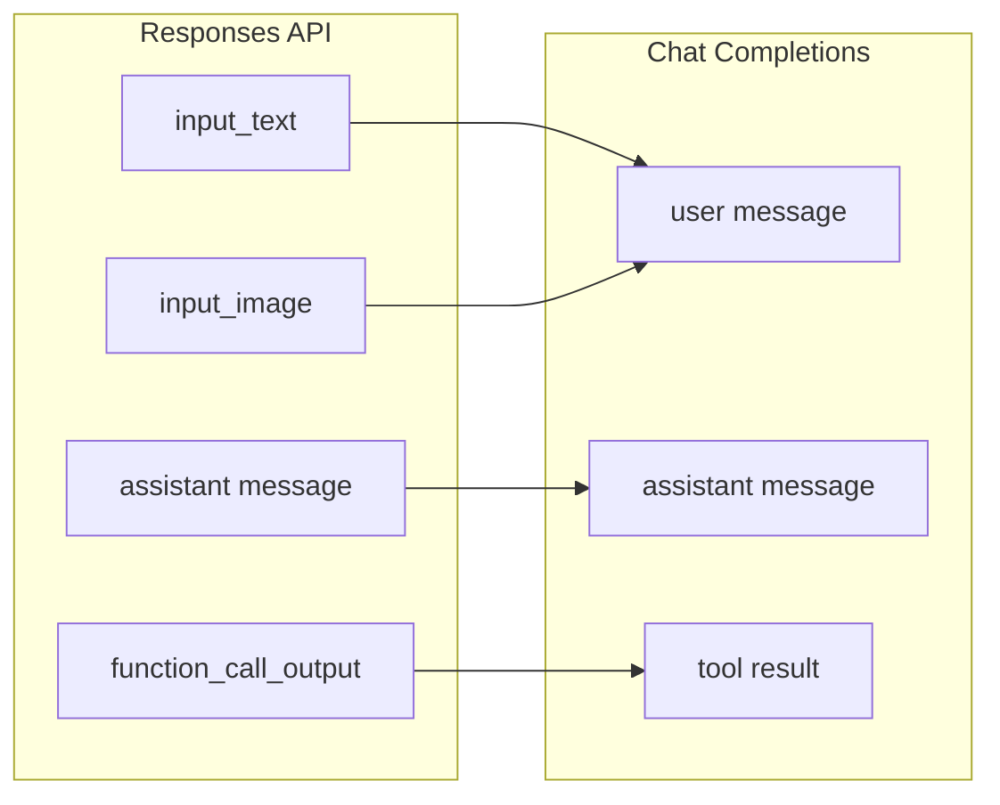
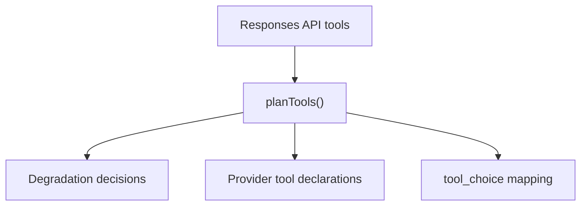

# 消息与工具映射

Bridge 内核（`src/bridge/`）处理协议翻译中最微妙的部分：在 OpenAI Responses API 的消息和工具模型与提供商的 Chat Completions 格式之间转换。

## 消息翻译

Responses API 输入项有几种类型，每种都需要映射为 Chat Completions 消息：

| Responses API 输入类型 | 方向 | 备注 |
|----------------------|------|------|
| `input_text` | 用户消息 | 纯文本内容 |
| `input_image` | 用户消息 | 图片 URL 或 base64 |
| `message` (role=assistant) | 助手消息 | 链中之前的助手输出 |
| `function_call_output` | 工具结果 | 映射为 Chat Completions 工具结果格式 |

`bridge/request/input-normalizer.ts` 中的 `InputNormalizer` 处理转换，包括在将函数调用输出映射回提供商命名空间时恢复工具身份名称。

## 工具映射

Bridge 内核分三步规划工具：

1. **声明规划** — 每个 Responses API 工具映射为提供商工具声明。提供商 `degraded` 映射中的工具类型被降级（如 `local_shell` 变为 `function`）。
2. **工具选择映射** — Responses `tool_choice` 根据提供商能力映射为 Chat Completions `tool_choice`。
3. **身份映射** — `ToolNameCodec` 处理 Responses API 工具名称和提供商工具名称之间的转换。

不支持的工具类型产生 `BridgeError`，代码为 `bridge.request.unsupported_tool`。

## 工具调用恢复

当提供商在响应中返回工具调用时，bridge 恢复它们：

- `call-restorer.ts` 使用 `ToolIdentityMap` 将提供商函数调用名称映射回原始工具名称。
- 自定义工具调用（shell、apply_patch、local_shell）被识别并以正确类型重建。

## 兼容性诊断

每个兼容性决策——降级的工具、忽略的参数、拒绝的格式——都产生一个 `CompatibilityDiagnostic`，累积在 `ResponsesContext.diagnostics` 中，并在响应完成后记录。

[会话存储](/zh/04-session-management/session-store)
