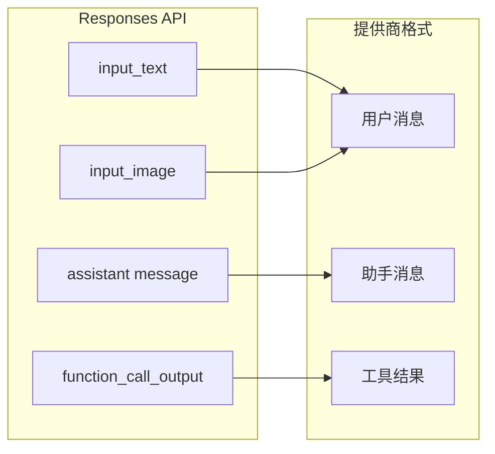

# 消息与工具映射

Mapper 层处理协议转换中最细致的部分：在 OpenAI Responses API 的消息和工具模型与提供商原生格式之间进行转换。

## 消息翻译

Responses API 输入项有几种类型，每种都需要映射到提供商的消息格式：

| Responses API 输入类型 | 方向 | 说明 |
|----------------------|------|------|
| `input_text` | 用户消息 | 纯文本内容 |
| `input_image` | 用户消息 | 图片 URL 或 base64 |
| `message` (role=assistant) | 助手消息 | 链中之前的助手输出 |
| `function_call_output` | 工具结果 | 映射到提供商的工具结果格式 |

## 工具映射

Responses API 使用 `type: "function"` 和包含 `name`、`description`、`parameters` 的 `function` 对象来定义工具。提供商可能使用不同的 Schema：

| Responses API 字段 | 提供商等效 |
|-------------------|----------|
| `type: "function"` | 通过 `supportedToolTypes` 映射或过滤 |
| `function.name` | 可能需要根据提供商限制进行清理 |
| `function.parameters` | JSON Schema，通常直接传递 |

不支持的工具类型（如提供商不支持 web search 时的 `web_search_preview`）会被跳过或产生 `AdapterError`。

[会话存储](/zh/04-session-management/session-store)
