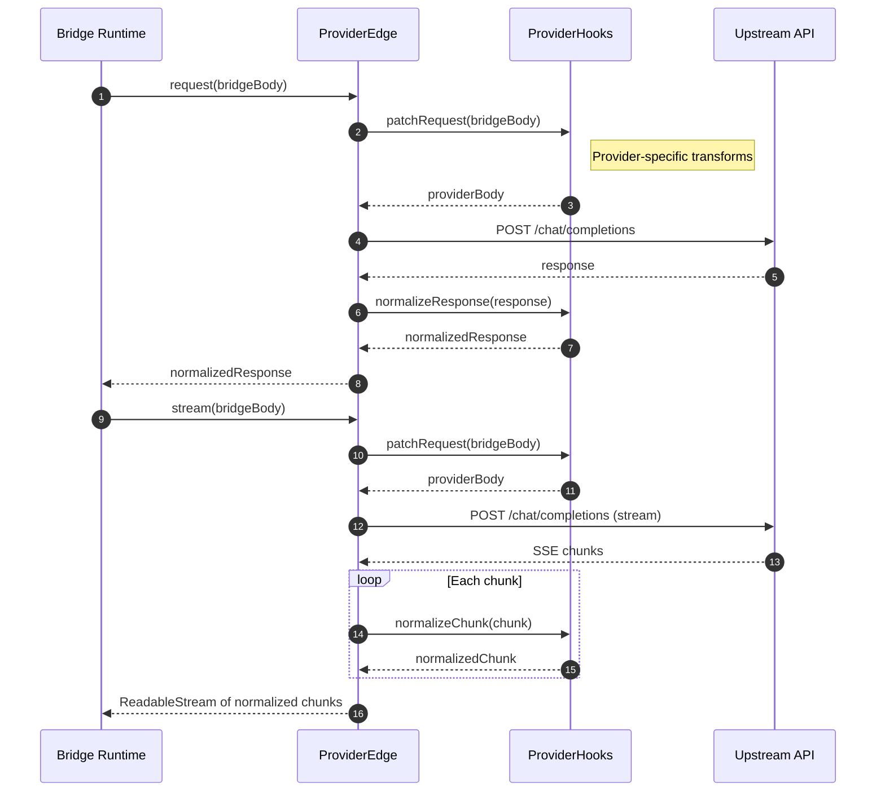
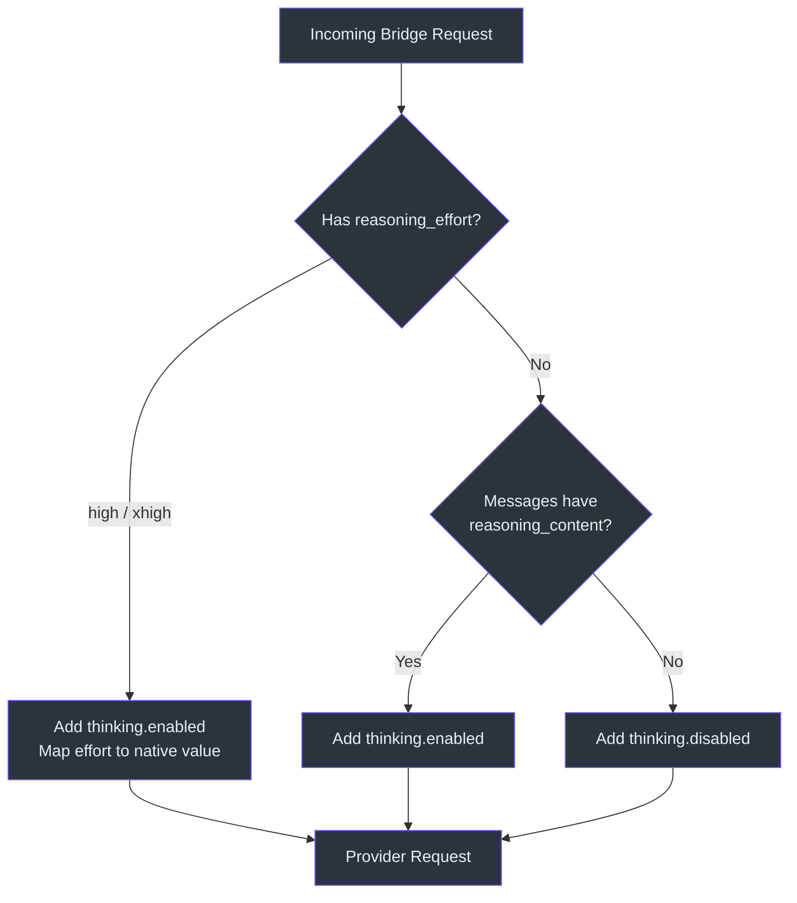
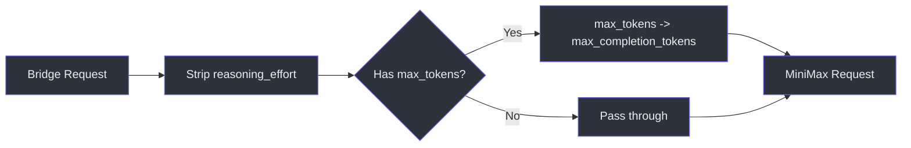

# Provider Hooks

GodeX 的桥接运行时使用一种内部协议，但每个上游提供商都有各自的特点 -- DeepSeek 使用原生的 `reasoning_effort` 参数和 `thinking` 对象，Zhipu 支持 `web_search` 和 `file_search` 工具类型，MiniMax 将 `max_tokens` 重映射为 `max_completion_tokens`，Xiaomi 使用布尔 thinking 开关。`ProviderHooks` 是每个提供商注入其自身规范化逻辑的扩展点。通过保持钩子可选且与提供商规约同目录，GodeX 避免了庞大的适配器层，让每个提供商拥有自己的转换逻辑。

钩子接口定义了三个可选方法（[contract.ts:43-52](https://github.com/Ahoo-Wang/GodeX/blob/main/src/bridge/provider-spec/contract.ts#L43)）：`patchRequest`、`normalizeResponse` 和 `normalizeChunk`。这些方法在 `createProviderEdge` 中、桥接运行时与上游 HTTP 调用之间的边界处被调用。

## 概览

| 钩子 | 签名 | 调用时机 | 用途 |
|---|---|---|---|
| `patchRequest` | `(bridgeReq) => providerReq` | 每次 HTTP 调用之前 | 将桥接格式的请求转换为提供商格式的请求 |
| `normalizeResponse` | `(response) => response` | 非流式响应之后 | 在桥接读取之前修正提供商响应 |
| `normalizeChunk` | `(chunk) => chunk` | 流式模式下每个 SSE 块 | 在桥接读取之前修正提供商块 |

## 钩子调用流程

## DeepSeek 钩子

[hooks.ts:113-136](https://github.com/Ahoo-Wang/GodeX/blob/main/src/providers/deepseek/hooks.ts#L113) 中的 DeepSeek 提供商钩子处理推理努力映射和思维模式激活：

| 场景 | 修补行为 |
|---|---|
| `reasoning_effort` 为 `"high"` 或 `"xhigh"` | 设置 `thinking: { type: "enabled" }` 并将努力映射为原生值（`"high"` -> `"high"`，`"xhigh"` -> `"max"`） |
| 消息包含历史 `reasoning_content` | 设置 `thinking: { type: "enabled" }` 以保持连续性 |
| 默认（无推理） | 显式设置 `thinking: { type: "disabled" }` |

`deepSeekStreamDeltas` 函数（[hooks.ts:149-164](https://github.com/Ahoo-Wang/GodeX/blob/main/src/providers/deepseek/hooks.ts#L149)）通过提取使用量数据、内容文本、工具调用、推理内容和完成原因，将每个 SSE 块映射为 `ProviderStreamDelta` 数组。

## Zhipu 钩子

Zhipu 的 `zhipuPatchRequest`（[hooks.ts:113-134](https://github.com/Ahoo-Wang/GodeX/blob/main/src/providers/zhipu/hooks.ts#L113)）遵循类似的模式，但有 Zhipu 特有的差异：

| 场景 | 修补行为 |
|---|---|
| 请求已设置 `thinking` | 保留它但强制 `clear_thinking: false` |
| 消息包含历史 `reasoning_content` | 注入 `thinking: { type: "enabled", clear_thinking: false }` |
| 默认 | 移除 `reasoning_effort` 并原样传递 |

Zhipu 还支持更广泛的工具类型（[hooks.ts:16-30](https://github.com/Ahoo-Wang/GodeX/blob/main/src/providers/zhipu/hooks.ts#L16)），包括 `web_search`、`file_search`、`mcp` 和 `shell`，带有一个降级映射表，将提供商特有的工具类型转换为标准 Chat Completions 等效项：

| 上游类型 | 降级为 |
|---|---|
| `web_search_2025_08_26` | `web_search` |
| `web_search_preview` | `web_search` |
| `file_search` | `retrieval` |
| `local_shell` / `shell` | `function` |
| `custom` / `tool_search` / `namespace` | `function` |

## MiniMax 钩子

MiniMax 的 `minimaxPatchRequest`（[hooks.ts:112-121](https://github.com/Ahoo-Wang/GodeX/blob/main/src/providers/minimax/hooks.ts#L112)）更简单：

1. 移除 `reasoning_effort`（MiniMax 不支持推理参数）。
2. 当存在时将 `max_tokens` 重映射为 `max_completion_tokens`。

## Xiaomi 钩子

Xiaomi 的 `xiaomiPatchRequest`（[hooks.ts:115-143](https://github.com/Ahoo-Wang/GodeX/blob/main/src/providers/xiaomi/hooks.ts#L115-L143)）遵循 MiMo thinking 模型：

| 场景 | 修补行为 |
|---|---|
| 存在 `reasoning_effort` | 设置 `thinking: { type: "enabled" }` |
| 消息包含历史 `reasoning_content` | 设置 `thinking: { type: "enabled" }` 以保留推理连续性 |
| 默认 | 设置 `thinking: { type: "disabled" }` |
| 存在 `max_tokens` | 重映射为 `max_completion_tokens` |

## 共享流 Delta 映射器

所有四个内置提供商都将工具调用和推理内容提取委托给 [stream-delta-mapper.ts:18-42](https://github.com/Ahoo-Wang/GodeX/blob/main/src/providers/shared/stream-delta-mapper.ts#L18) 中的 `mapCommonChatStreamDelta`。此共享工具处理：

| Delta 字段 | 映射 |
|---|---|
| `reasoning_content` | `{ reasoning: content }` delta |
| `tool_calls[i].id` | 复制到 `toolCall.id` |
| `tool_calls[i].function.name` | 复制到 `toolCall.name` |
| `tool_calls[i].function.arguments` | 复制到 `toolCall.arguments` |
| `tool_calls[i].index` | 复制到 `toolCall.index` |
| `tool_calls[i].type` | 复制到 `toolCall.type` |

每个提供商的流 delta 函数在提取提供商特有的内容 delta 后调用 `mapCommonChatStreamDelta`。例如，DeepSeek 的 `mapDeepSeekChoiceDelta`（[hooks.ts:166-175](https://github.com/Ahoo-Wang/GodeX/blob/main/src/providers/deepseek/hooks.ts#L166)）为 `delta.content` 推入一个 `{ text }` delta，然后在上面展开公共 delta。

## 自定义工具降级

[custom-tool-degradation.ts](https://github.com/Ahoo-Wang/GodeX/blob/main/src/providers/shared/custom-tool-degradation.ts) 提供了辅助函数，当提供商原生不支持时，将 Responses API 的自定义工具转换为 Chat Completions 的函数工具：

- `degradedCustomToolDescription`（[custom-tool-degradation.ts:14-20](https://github.com/Ahoo-Wang/GodeX/blob/main/src/providers/shared/custom-tool-degradation.ts#L14)）附加一个说明工具已被降级的注释并描述输入格式。
- `degradedCustomToolParameters`（[custom-tool-degradation.ts:24-38](https://github.com/Ahoo-Wang/GodeX/blob/main/src/providers/shared/custom-tool-degradation.ts#L24)）生成一个带有单一必需 `input` 字符串参数的 schema。

## 输入兼容性

[input-compatibility.ts:9-34](https://github.com/Ahoo-Wang/GodeX/blob/main/src/providers/shared/input-compatibility.ts#L9) 中的 `warnUnsupportedCurrentInputContent` 在 Responses 请求包含 Chat Completions 无法表示的内容类型（除了 `input_text` / `output_text` 之外的任何类型）时发出诊断信息。这在桥接期间被调用，让用户了解被静默忽略的字段。

## 请求守卫

[chat-request-guard.ts:5-27](https://github.com/Ahoo-Wang/GodeX/blob/main/src/providers/shared/chat-request-guard.ts#L5) 中的 `assertProviderChatRequest` 在将修补后的请求发送到上游提供商之前，验证其包含 `model` 字符串和 `messages` 数组。每个 `patchRequest` 钩子都将此守卫作为其第一步调用。

## 能力对比

| 能力 | DeepSeek | Zhipu | MiniMax | Xiaomi |
|---|---|---|---|---|
| 推理努力 | `native`（high/max） | `boolean`（enabled/disabled） | `none` | `boolean`（enabled/disabled） |
| 最大工具数 | 128 | 128 | 128 | 128 |
| 工具选择模式 | auto、none、required、function | auto、none | auto、none、required、function | auto |
| 响应格式 | text、json_object | text、json_object | text、json_object | text、json_object |
| 流式使用量 | 是 | 是 | 是 | 是 |
| 网页搜索工具 | 否 | 是 | 否 | 否 |

## 交叉引用

- [ProviderSpec 契约](./provider-spec.md) -- 声明钩子的规约接口
- [Chat Provider Client](./chat-provider-client.md) -- 调用 `patchRequest` 和 `normalizeResponse` 的 HTTP 传输层

## 参考资料

- [src/providers/deepseek/hooks.ts](https://github.com/Ahoo-Wang/GodeX/blob/main/src/providers/deepseek/hooks.ts) -- DeepSeek patchRequest、streamDeltas、使用量映射
- [src/providers/zhipu/hooks.ts](https://github.com/Ahoo-Wang/GodeX/blob/main/src/providers/zhipu/hooks.ts) -- Zhipu patchRequest、web_search 降级、streamDeltas
- [src/providers/minimax/hooks.ts](https://github.com/Ahoo-Wang/GodeX/blob/main/src/providers/minimax/hooks.ts) -- MiniMax patchRequest、max_tokens 重映射
- [src/providers/xiaomi/hooks.ts](https://github.com/Ahoo-Wang/GodeX/blob/main/src/providers/xiaomi/hooks.ts) -- Xiaomi patchRequest、thinking 开关、streamDeltas
- [src/providers/shared/stream-delta-mapper.ts](https://github.com/Ahoo-Wang/GodeX/blob/main/src/providers/shared/stream-delta-mapper.ts) -- `mapCommonChatStreamDelta`
- [src/providers/shared/custom-tool-degradation.ts](https://github.com/Ahoo-Wang/GodeX/blob/main/src/providers/shared/custom-tool-degradation.ts) -- 自定义工具到函数工具的降级
- [src/providers/shared/input-compatibility.ts](https://github.com/Ahoo-Wang/GodeX/blob/main/src/providers/shared/input-compatibility.ts) -- 不支持的内容类型警告
- [src/providers/shared/chat-request-guard.ts](https://github.com/Ahoo-Wang/GodeX/blob/main/src/providers/shared/chat-request-guard.ts) -- `assertProviderChatRequest`
- [src/bridge/provider-spec/contract.ts](https://github.com/Ahoo-Wang/GodeX/blob/main/src/bridge/provider-spec/contract.ts) -- `ProviderHooks` 接口定义
