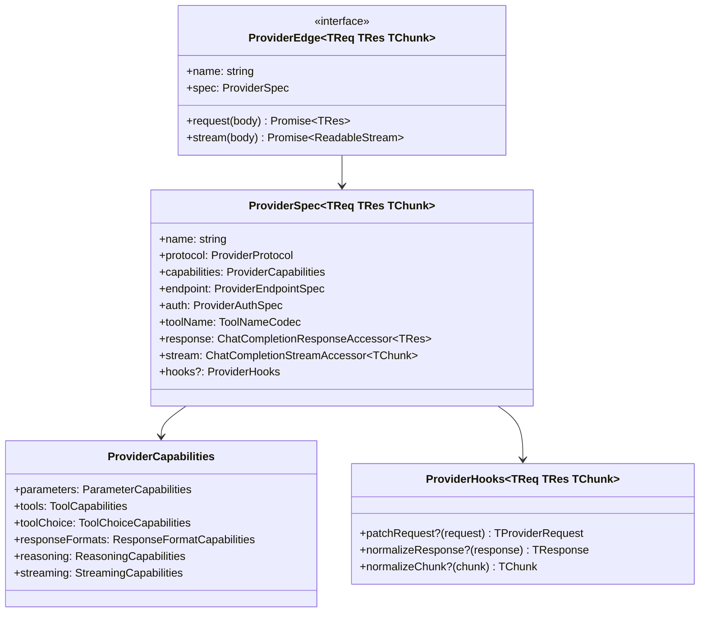

# Provider 接口

向 GodeX 添加新的 LLM 提供商需要声明一个包含能力、响应/流访问器和可选 hooks 的 `ProviderSpec`，并连接 HTTP 客户端。Bridge 内核处理路由、会话管理、兼容性规划和 SSE 编码 — 提供商只处理协议差异和 HTTP 调用。

## 核心接口



## ProviderCapabilities

能力以不可变集合和标志声明。它们告诉 Bridge 内核提供商支持什么，以便规划兼容性决策。

### 能力字段

| 字段 | 类型 | 描述 |
|------|------|------|
| `parameters.supported` | `Set<string>` | 提供商接受的请求参数 |
| `tools.supported` | `Set<string>` | 提供商可处理的工具类型 |
| `tools.degraded` | `Map<string, string>` | 降级到其他类型的工具类型 |
| `tools.maxTools` | `number` | 每个请求的最大工具数 |
| `toolChoice.supported` | `Set<string>` | 提供商支持的 `tool_choice` 模式 |
| `responseFormats.supported` | `Set<string>` | 响应格式类型 |
| `reasoning.effort` | `"none" \| "boolean" \| "native"` | 提供商如何处理推理力度 |
| `streaming.usage` | `boolean` | 提供商是否在流块中返回使用量 |

## 响应访问器

Spec 声明类型化访问器，使 bridge 可以读取提供商响应而无需知道具体类型：

```ts
interface ChatCompletionResponseAccessor<TResponse> {
  firstChoice(response: TResponse): unknown | undefined;
  finishReason(response: TResponse): string | undefined;
  outputText(response: TResponse): string;
  usage(response: TResponse): ResponseUsage | null;
}
```

## Provider Hooks

Hooks 允许提供商特定行为而不污染 bridge 内核：

| Hook | 调用时机 | 用途 |
|------|---------|------|
| `patchRequest` | bridge 构建 Chat Completions 请求后 | 为提供商特定差异转换请求 |
| `normalizeResponse` | 收到同步响应后 | 规范化提供商响应形状 |
| `normalizeChunk` | 收到流块后 | 规范化提供商块形状 |

## 注册

在 `src/providers/builtin.ts` 中注册提供商定义：

```ts
const MY_PROVIDER_DEFINITION = createProviderDefinition(
  "myprovider",
  createMyProviderEdge,
);
```

`Registrar` 遍历 `godex.yaml` 中所有配置的提供商，通过 `spec` 字段匹配工厂，构建 `ProviderEdge` 实例。没有匹配工厂的提供商列在不支持列表中。

[消息与工具映射](/zh/03-provider-development/message-tool-mapping)
