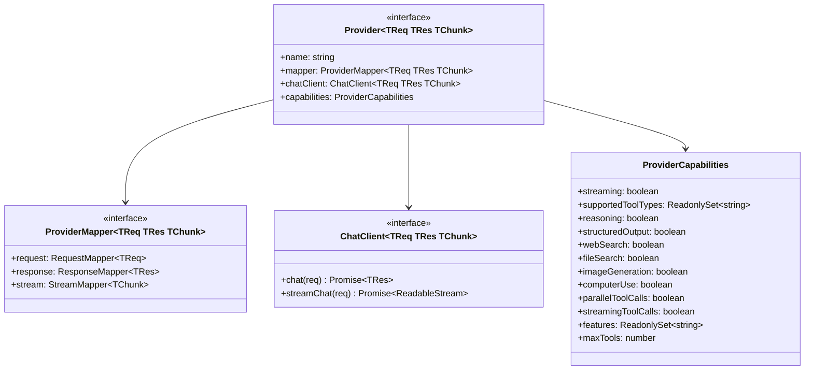

# Provider 接口

向 GodeX 添加新的 LLM 提供商意味着实现四个接口。系统负责路由、会话管理和 SSE 编码——提供商只需处理协议转换和 HTTP 调用。

## 核心接口



## ProviderCapabilities

能力集是**不可变的**——一旦构建完成，集合和标志就不能被修改。使用 `mergeCapabilities()` 创建能力对象：

```ts
import { mergeCapabilities } from "../adapter/capabilities";

const caps = mergeCapabilities({
  streaming: true,
  supportedToolTypes: new Set(["function"]),
  reasoning: false,
  maxTools: 128,
});
```

## 注册

在 `src/providers/builtin.ts` 中注册提供商工厂：

```ts
registrar.registerFactory("myprovider", (config) =>
  createMyProvider(config) as Provider<unknown, unknown, unknown>
);
```

`Registrar.build()` 方法遍历 `godex.yaml` 中所有配置的提供商，调用匹配的工厂并存储结果。如果找不到某个提供商名称的工厂，则将其添加到 `unsupported` 列表。

[智谱参考实现](/zh/03-provider-development/zhipu-reference)
