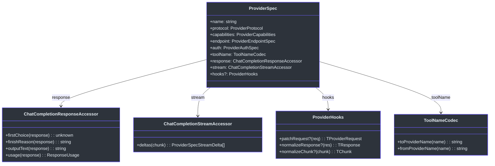
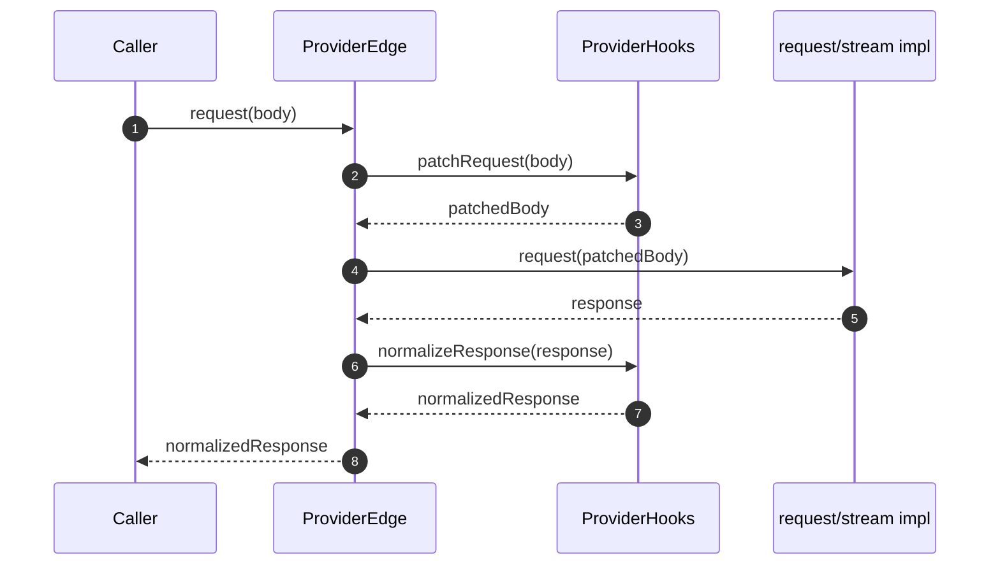
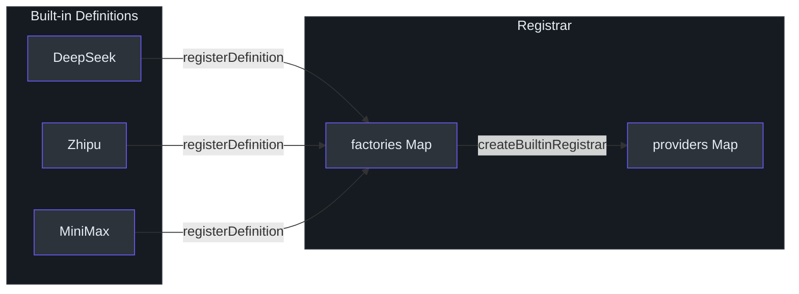
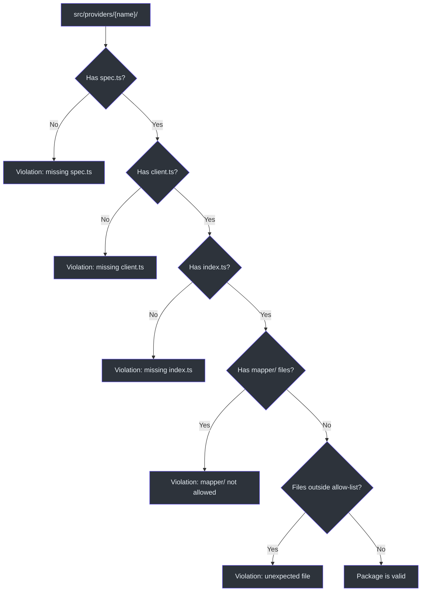

# ProviderSpec 契约

GodeX 中的每个 LLM 提供商由一个 `ProviderSpec` 对象描述，该对象声明了提供商的身份、协议、能力、端点、认证方案、工具名称编解码器和响应/流访问器。该规约是有意设计为声明式的 -- 它不包含任何 HTTP 逻辑。一个单独的 `ProviderEdge` 将规约与传输层（请求/流）组合成一个可运行的提供商。这种分离意味着同一个规约可以为验证、文档生成和运行时请求处理提供支持，而无需与 fetch 内部实现耦合。

这种规约驱动的设计是添加新提供商主要只需填写一个类型化对象并编写可选钩子的原因。桥接运行时读取规约来了解支持哪些参数、需要降级哪些工具，以及如何从响应中提取输出文本。

## 概览

| 概念 | 类型 / 常量 | 用途 |
|---|---|---|
| `ProviderSpec<TReq, TRes, TChunk>` | 接口 | 一个提供商的声明式契约 |
| `ProviderEdge<TReq, TRes, TChunk>` | 接口 | 规约 + `request()` + `stream()` |
| `ProviderRuntimeConfig` | 接口 | 运行时凭证和端点 |
| `ProviderDefinition` | 接口 | 命名工厂（`create(config) -> ProviderEdge`） |
| `BEARER_AUTH_SCHEME` | 常量 | `"bearer"` |
| `CHAT_COMPLETIONS_PROTOCOL` | 常量 | `"chat_completions"` |
| `createProviderEdge` | 工厂函数 | 将规约 + 配置 + 传输层连接成 edge |
| `createProviderDefinition` | 工厂函数 | 将 edge 工厂包装为定义 |

## 规约结构

`ProviderSpec` 接口包含四类字段：身份、协议/能力、访问器和钩子。

### 身份和协议

| 字段 | 类型 | 描述 |
|---|---|---|
| `name` | `string` | 唯一的提供商标识符（如 `"deepseek"`、`"zhipu"`、`"minimax"`） |
| `protocol` | `ProviderProtocol` | 目前始终为 `CHAT_COMPLETIONS_PROTOCOL`（`"chat_completions"`） |
| `capabilities` | `ProviderCapabilities` | 声明支持的参数、工具、工具选择模式、响应格式和推理努力风格 |
| `endpoint` | `ProviderEndpointSpec` | 包含 `defaultBaseURL` |
| `auth` | `ProviderAuthSpec` | 目前始终为 `BEARER_AUTH`（`{ scheme: "bearer" }`） |

### 响应访问器

`ChatCompletionResponseAccessor<TResponse>` 告诉桥接如何从上游响应中提取标准化数据（[contract.ts:32-37](https://github.com/Ahoo-Wang/GodeX/blob/main/src/bridge/provider-spec/contract.ts#L32)）：

| 方法 | 返回值 |
|---|---|
| `firstChoice(response)` | 第一个选择对象或 `undefined` |
| `finishReason(response)` | 停止原因字符串（如 `"stop"`、`"tool_calls"`） |
| `outputText(response)` | 拼接的文本内容 |
| `usage(response)` | 包含 `input_tokens`、`output_tokens`、`total_tokens` 的 `ResponseUsage` |

### 流访问器

`ChatCompletionStreamAccessor<TChunk>` 有一个单一方法 `deltas(chunk)`，返回 `ProviderSpecStreamDelta` 数组 -- 桥接内部的流式 delta 表示（[contract.ts:39-41](https://github.com/Ahoo-Wang/GodeX/blob/main/src/bridge/provider-spec/contract.ts#L39)）。

## ProviderEdge 和工厂

`ProviderEdge` 通过两个可执行方法扩展了 `ProviderSpec`：

- **`request(body)`** -- 发送非流式请求并返回类型化响应。
- **`stream(body)`** -- 发送流式请求并返回 `ReadableStream<JsonServerSentEvent<TChunk>>`。

`createProviderEdge` 工厂（[factory.ts:34-88](https://github.com/Ahoo-Wang/GodeX/blob/main/src/bridge/provider-spec/factory.ts#L34)）将所有内容连接在一起：

1. 从 `config.endpoint.base_url` 解析 `base_url`，如果不存在则回退到 `spec.endpoint.defaultBaseURL`。
2. 应用 `hooks.patchRequest` 将桥接请求转换为提供商请求。
3. 委托给提供的 `request` 或 `stream` 实现。
4. 应用 `hooks.normalizeResponse`（非流式）或通过 `TransformStream` 传输 `normalizeChunk`（流式）。

## ProviderRuntimeConfig

`ProviderRuntimeConfig`（[contract.ts:10-15](https://github.com/Ahoo-Wang/GodeX/blob/main/src/bridge/provider-spec/contract.ts#L10)）是每个提供商从 GodeX 配置层接收的形状：

| 字段 | 类型 | 描述 |
|---|---|---|
| `spec` | `string` | 要查找的提供商规约名称 |
| `credentials.api_key` | `string` | 上游的 Bearer 令牌 |
| `endpoint.base_url` | `string?` | 覆盖默认的 base URL |
| `timeout_ms` | `number?` | 请求超时时间（毫秒） |

## ProviderDefinition 和注册

`ProviderDefinition`（[definition.ts:6-11](https://github.com/Ahoo-Wang/GodeX/blob/main/src/providers/definition.ts#L6)）将提供商名称与工厂函数 `(config) => ProviderEdge` 配对。`createProviderDefinition` 辅助函数（[definition.ts:13-29](https://github.com/Ahoo-Wang/GodeX/blob/main/src/providers/definition.ts#L13)）将类型化工厂转换为 `Registrar` 使用的擦除签名。

内置定义在 [builtin.ts:22-41](https://github.com/Ahoo-Wang/GodeX/blob/main/src/providers/builtin.ts#L22) 中声明，并通过 `createBuiltinRegistrar()`（[builtin.ts:49-55](https://github.com/Ahoo-Wang/GodeX/blob/main/src/providers/builtin.ts#L49)）自动注册。

## 包验证

`validateProviderPackageShape` 函数（[validation.ts:13-51](https://github.com/Ahoo-Wang/GodeX/blob/main/src/bridge/provider-spec/validation.ts#L13)）强制要求每个提供商目录包含所需文件（`spec.ts`、`client.ts`、`index.ts`），并且不包含允许列表之外的文件（`hooks.ts`、测试、`protocol/` DTO）。这使提供商包保持一致性。

## 示例提供商

[src/providers/example/spec.ts](https://github.com/Ahoo-Wang/GodeX/blob/main/src/providers/example/spec.ts) 处的示例提供商演示了最小的规约表面。它定义了内联 DTO（`ExampleChatRequest`、`ExampleChatResponse`、`ExampleChatChunk`）和一个带有直通 `toolName` 编解码器和简单 `response` 访问器的 `EXAMPLE_PROVIDER_SPEC`（[spec.ts:80-126](https://github.com/Ahoo-Wang/GodeX/blob/main/src/providers/example/spec.ts#L80)）。相应的客户端（[client.ts:11-26](https://github.com/Ahoo-Wang/GodeX/blob/main/src/providers/example/client.ts#L11)）使用规约和可选的传输覆盖调用 `createProviderEdge`。

## 交叉引用

- [Provider Hooks](./provider-hooks.md) -- 如何为每个内置提供商实现 `patchRequest`、`normalizeResponse` 和 `normalizeChunk`
- [Chat Provider Client](./chat-provider-client.md) -- 实现传递给 `createProviderEdge` 的 `request` 和 `stream` 函数的 HTTP 传输层

## 参考资料

- [src/bridge/provider-spec/contract.ts](https://github.com/Ahoo-Wang/GodeX/blob/main/src/bridge/provider-spec/contract.ts) -- `ProviderSpec`、`ProviderEdge`、`ProviderRuntimeConfig`、`BEARER_AUTH`、`CHAT_COMPLETIONS_PROTOCOL`
- [src/bridge/provider-spec/factory.ts](https://github.com/Ahoo-Wang/GodeX/blob/main/src/bridge/provider-spec/factory.ts) -- `createProviderEdge`、`normalizeChunkStream`
- [src/bridge/provider-spec/validation.ts](https://github.com/Ahoo-Wang/GodeX/blob/main/src/bridge/provider-spec/validation.ts) -- `validateProviderPackageShape`
- [src/providers/definition.ts](https://github.com/Ahoo-Wang/GodeX/blob/main/src/providers/definition.ts) -- `ProviderDefinition`、`createProviderDefinition`
- [src/providers/builtin.ts](https://github.com/Ahoo-Wang/GodeX/blob/main/src/providers/builtin.ts) -- 内置定义和 `createBuiltinRegistrar`
- [src/providers/example/spec.ts](https://github.com/Ahoo-Wang/GodeX/blob/main/src/providers/example/spec.ts) -- 带内联 DTO 的示例提供商规约
- [src/providers/registrar.ts](https://github.com/Ahoo-Wang/GodeX/blob/main/src/providers/registrar.ts) -- 按名称解析提供商的 `Registrar`

