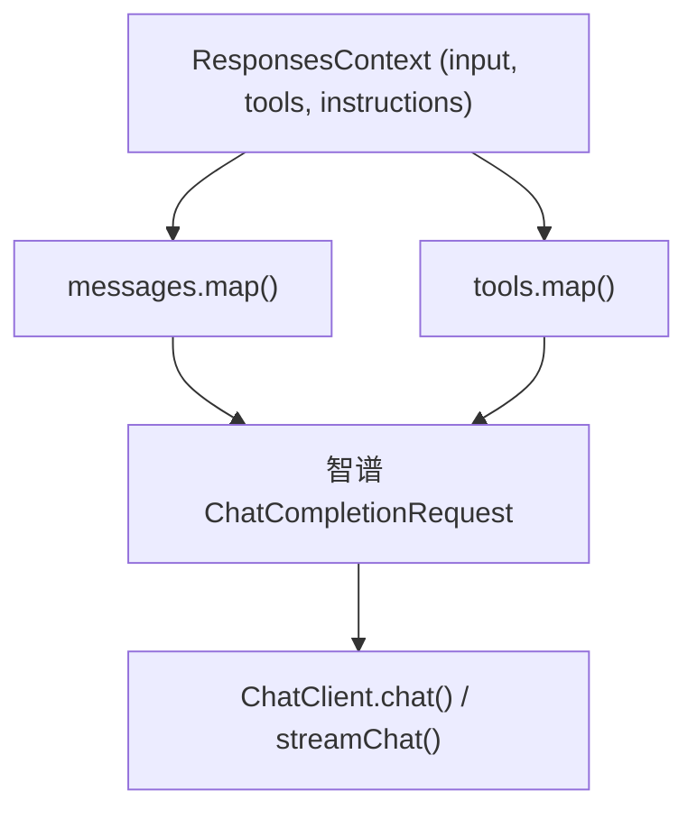

# 智谱参考实现

智谱（Zhipu）提供商是 GodeX 中内置的参考实现。它演示了如何构建一个完整的提供商，在 OpenAI Responses API 和智谱的 Chat Completions API 之间进行映射。

## 模块结构

```
src/providers/zhipu/
├── provider.ts         # createZhipuProvider() 工厂函数
├── factory.ts          # 构建包含 mapper + chatClient 的 Provider
├── capabilities.ts     # 能力标志
├── request.ts          # RequestMapper 实现
├── response.ts         # ResponseMapper 实现
├── response-common.ts  # 共享响应映射工具
├── stream.ts           # StreamMapper 实现
├── messages.ts         # Responses API 输入转智谱消息
├── tools.ts            # 工具映射（Responses API 工具转智谱工具）
├── tool-calls.ts       # 工具调用结果提取
├── chat-client.ts      # 带有 HTTP 流的 ChatClient
├── function-names.ts   # 函数名清理
├── protocol/           # 智谱特定类型定义
└── api/                # 底层 API 客户端
```

## 请求映射流程



## 关键转换细节

- **消息**：`messages.ts` 将 Responses API `input` 项（消息、工具结果等）转换为智谱的 `messages` 数组
- **工具**：`tools.ts` 将 Responses API 工具定义映射为智谱的函数调用格式
- **函数名**：智谱对函数名字符有限制；`function-names.ts` 负责清理
- **流式传输**：流映射器处理增量内容、工具调用增量和使用量累积

[消息与工具映射](/zh/03-provider-development/message-tool-mapping)
