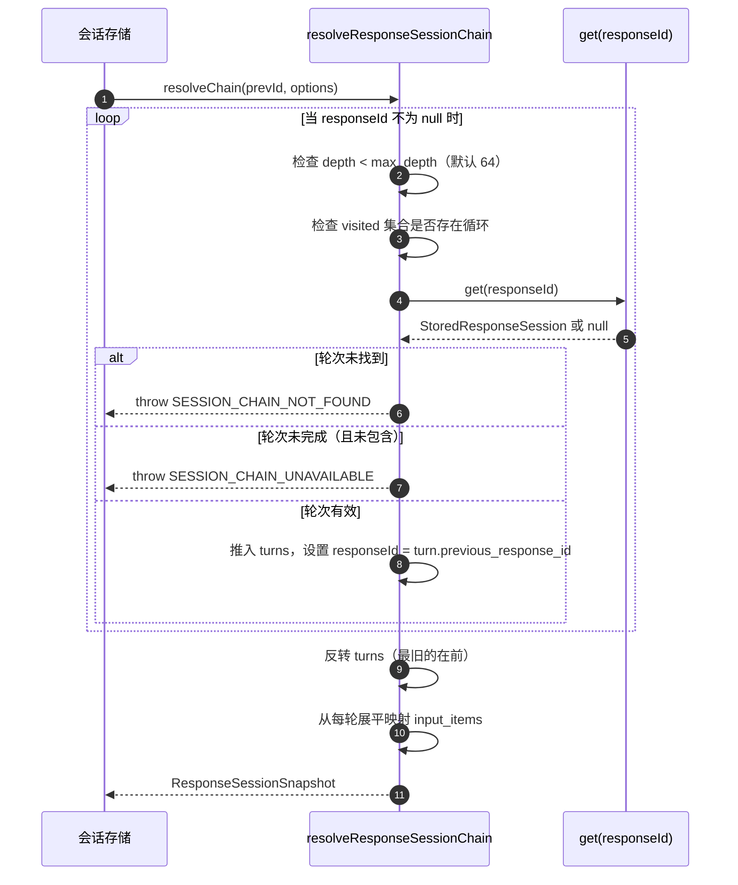
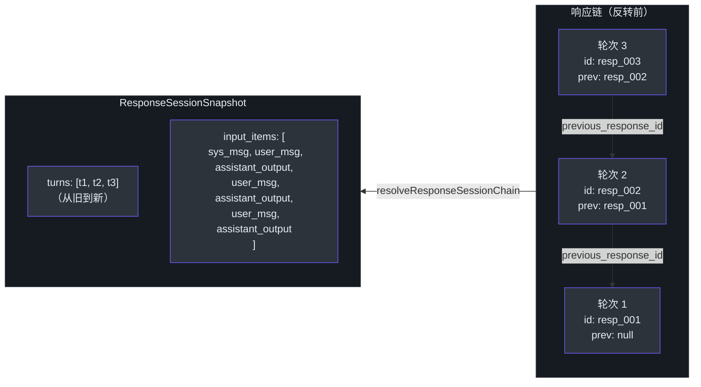
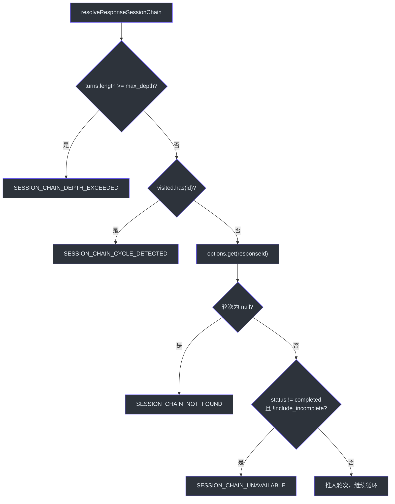

# 链式解析

当调用方发送带有 `previous_response_id` 的 Responses API 请求时，GodeX 必须通过会话存储中的父指针重建整个对话历史。这就是链式解析步骤。`resolveResponseSessionChain` 函数从最新到最旧遍历 `StoredResponseSession` 记录的链表，验证结构完整性，将收集到的对话轮次反转为按时间顺序排列，并将每轮的请求指令、输入和响应输出展平为一个 `input_items` 数组，供桥接运行时输入到提供商的 Chat Completions 请求中。

链式解析是 GodeX 多轮对话支持的基础。没有它，每个请求都将是无状态的，调用方需要自行回放完整的消息历史。

## 概览

| 组件 | 文件 | 用途 |
|---|---|---|
| `resolveResponseSessionChain` | [chain.ts:26-98](https://github.com/Ahoo-Wang/GodeX/blob/main/src/session/chain.ts#L26) | 主遍历函数 |
| `requestHistoryItems` | [chain.ts:100-107](https://github.com/Ahoo-Wang/GodeX/blob/main/src/session/chain.ts#L100) | 将请求快照转换为 `ResponseItem[]` |
| `instructionInputItems` | [chain.ts:109-120](https://github.com/Ahoo-Wang/GodeX/blob/main/src/session/chain.ts#L109) | 将指令包装为系统消息 |
| `requestInputItems` | [chain.ts:122-140](https://github.com/Ahoo-Wang/GodeX/blob/main/src/session/chain.ts#L122) | 将输入包装为用户消息 |
| `ResponseSessionSnapshot` | [types.ts:69-76](https://github.com/Ahoo-Wang/GodeX/blob/main/src/session/types.ts#L69) | 已解析的链结果类型 |
| `ResolveResponseSessionOptions` | [types.ts:78-83](https://github.com/Ahoo-Wang/GodeX/blob/main/src/session/types.ts#L78) | 可配置的深度和未完成处理选项 |
| `SessionError` | [session-error.ts](https://github.com/Ahoo-Wang/GodeX/blob/main/src/error/session-error.ts) | 带有链专用错误码的领域错误 |

## 遍历算法

`resolveResponseSessionChain` ([chain.ts:26-98](https://github.com/Ahoo-Wang/GodeX/blob/main/src/session/chain.ts#L26)) 沿 `previous_response_id` 链表遍历：



### 逐步说明

1. **初始化**：创建一个 `visited` Set 和空的 `turns` 数组。
2. **循环**：当 `responseId` 为真值时：
   - **深度守卫**：如果 `turns.length >= maxDepth`（默认 64），抛出 `SESSION_CHAIN_DEPTH_EXCEEDED`。
   - **循环守卫**：如果 `visited.has(responseId)`，抛出 `SESSION_CHAIN_CYCLE_DETECTED`。
   - **获取**：调用 `options.get(responseId)` 检索存储的轮次。
   - **缺失守卫**：如果轮次为 `null`，抛出 `SESSION_CHAIN_NOT_FOUND`。
   - **状态守卫**：如果 `!includeIncomplete && turn.status !== "completed"`，抛出 `SESSION_CHAIN_UNAVAILABLE`。
   - **收集**：推入轮次并设置 `responseId = turn.previous_response_id`。
3. **反转**：`turns.reverse()` 将轮次按时间顺序（从旧到新）排列。
4. **展平**：对每个轮次，将 `requestHistoryItems(turn.request)` + `turn.response.output` 拼接到 `input_items` 中。

## 完整性守卫

| 守卫 | 错误码 | 默认阈值 | 触发条件 |
|---|---|---|---|
| 最大深度 | `SESSION_CHAIN_DEPTH_EXCEEDED` | 64 | 链长度超过 `max_depth` |
| 循环检测 | `SESSION_CHAIN_CYCLE_DETECTED` | 无 | 同一 `responseId` 被访问两次 |
| 缺失父节点 | `SESSION_CHAIN_NOT_FOUND` | 无 | `get(responseId)` 返回 null |
| 未完成状态 | `SESSION_CHAIN_UNAVAILABLE` | 无 | 轮次 `status !== "completed"` 且 `include_incomplete` 为 false |

所有错误都是 `SessionError` 实例 ([session-error.ts:11-28](https://github.com/Ahoo-Wang/GodeX/blob/main/src/error/session-error.ts#L11))，带有 `"session"` 领域前缀，上下文中包含 `responseId` 和 `previousResponseId`。

## 链结构图



## 输入项展平

每个轮次向最终的 `input_items` 数组贡献两组项。

### requestHistoryItems

`requestHistoryItems` ([chain.ts:100-107](https://github.com/Ahoo-Wang/GodeX/blob/main/src/session/chain.ts#L100)) 组合了：

| 来源 | 函数 | 结果 |
|---|---|---|
| `instructions` | `instructionInputItems` | `{ type: "message", role: "system", content: [{ type: "input_text", text }] }` |
| `input`（字符串） | `requestInputItems` | `{ type: "message", role: "user", content: [{ type: "input_text", text }] }` |
| `input`（数组） | `requestInputItems` | 直接透传（已是 `ResponseItem[]`） |
| `input`（undefined） | `requestInputItems` | 空数组 |

指令到系统消息的转换 ([chain.ts:109-120](https://github.com/Ahoo-Wang/GodeX/blob/main/src/session/chain.ts#L109)) 仅在 `instructions` 存在且非空时触发。字符串输入被包装为用户消息 ([chain.ts:127-135](https://github.com/Ahoo-Wang/GodeX/blob/main/src/session/chain.ts#L127))。

### 最终展平

`input_items` 数组通过对每个轮次进行 flatMap 构建 ([chain.ts:93-96](https://github.com/Ahoo-Wang/GodeX/blob/main/src/session/chain.ts#L93))：

```
input_items = turns.flatMap(turn => [
    ...requestHistoryItems(turn.request),   // system + user 项
    ...turn.response.output,                // assistant 项
])
```

这产生了一个按时间顺序排列的单一数组，适合桥接运行时转换为提供商特定的聊天消息。

## 选项

| 选项 | 类型 | 默认值 | 描述 |
|---|---|---|---|
| `max_depth` | `number?` | `64` | 超过深度错误之前的最大父节点跳转次数 |
| `include_incomplete` | `boolean?` | `false` | 允许链中包含未完成的响应 |

`ResolveResponseSessionChainOptions` 接口 ([chain.ts:19-24](https://github.com/Ahoo-Wang/GodeX/blob/main/src/session/chain.ts#L19)) 扩展了 `ResolveResponseSessionOptions`，增加了一个必需的 `get()` 函数，由调用方（会话存储）注入。

## 错误场景



## 交叉引用

- [会话存储](./session-stores.md) -- 提供 `get()` 函数注入到 `resolveResponseSessionChain` 的 `ResponseSessionStore` 实现

## 参考

- [src/session/chain.ts](https://github.com/Ahoo-Wang/GodeX/blob/main/src/session/chain.ts) -- `resolveResponseSessionChain`、`requestHistoryItems`、`requestInputItems`
- [src/session/types.ts](https://github.com/Ahoo-Wang/GodeX/blob/main/src/session/types.ts) -- `ResponseSessionSnapshot`、`ResolveResponseSessionOptions`、`StoredResponseSession`
- [src/error/session-error.ts](https://github.com/Ahoo-Wang/GodeX/blob/main/src/error/session-error.ts) -- `SessionError` 类
- [src/error/codes.ts](https://github.com/Ahoo-Wang/GodeX/blob/main/src/error/codes.ts) -- `SESSION_CHAIN_NOT_FOUND`、`SESSION_CHAIN_CYCLE_DETECTED`、`SESSION_CHAIN_DEPTH_EXCEEDED`、`SESSION_CHAIN_UNAVAILABLE`
