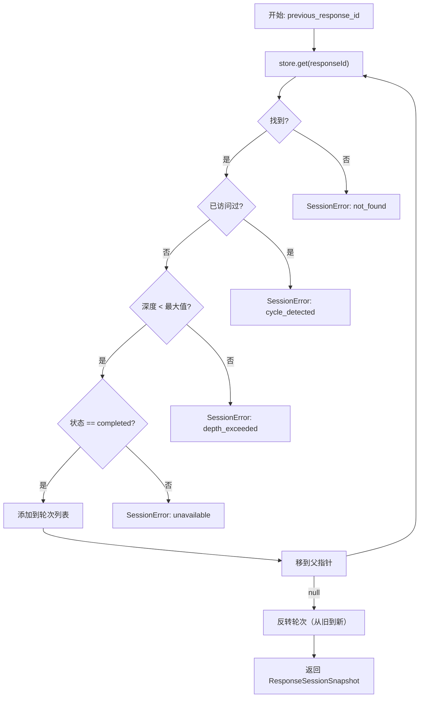

# 链式解析

当请求包含 `previous_response_id` 时，GodeX 必须通过遍历父指针链来重建完整的对话历史。这由 `resolveResponseSessionChain()` 处理。

## 链遍历算法

## 安全检查

| 检查 | 错误码 | 默认阈值 |
|------|--------|---------|
| 链未找到 | `session.chain.not_found` | 无 |
| 循环检测 | `session.chain.cycle_detected` | 无 |
| 深度超限 | `session.chain.depth_exceeded` | 64 跳 |
| 未完成状态 | `session.chain.unavailable` | 仅已完成轮次 |

## 结果结构

`ResponseSessionSnapshot` 包含：
- `previous_response_id`：原始请求的 ID
- `turns`：按时间顺序排列的 `StoredResponseSession` 数组
- `input_items`：所有轮次的输入和输出项的扁平化数组，可直接用于构建提供商消息

[转换器](/zh/05-streaming-pipeline/transformers)
