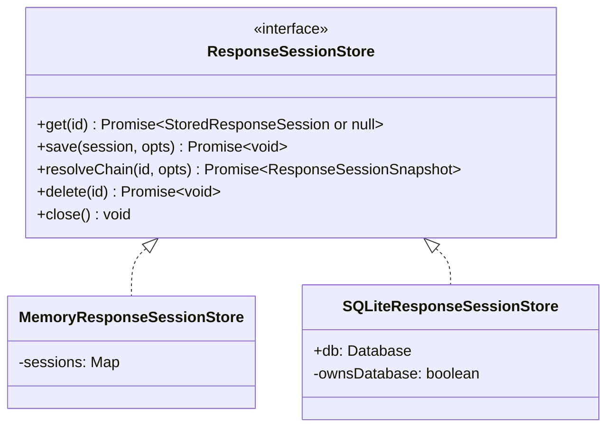

# 会话存储

会话存储持久化响应快照，支持 `previous_response_id` 链式解析模式。每个完成的响应都保存了足够的数据，以便后续重建对话历史。

## 接口



## 存储数据

每个 `StoredResponseSession` 包含：

| 字段 | 说明 |
|------|------|
| `id` | 响应 ID（如 `resp_abc123`） |
| `previous_response_id` | 用于链遍历的父指针 |
| `created_at` / `completed_at` | Unix 时间戳 |
| `status` | 响应状态（`completed` 等） |
| `request` | 输入、指令、模型、工具的快照 |
| `response` | 输出、使用量、错误的快照 |

## 后端选择

```yaml
session:
  backend: sqlite          # 或 "memory"
  sqlite:
    path: ./data/sessions.db
```

| 后端 | 适用场景 |
|------|---------|
| `memory` | 测试、演示、单进程临时部署 |
| `sqlite` | 生产环境，重启后持久化历史 |

## 实现细节

**内存存储**：使用 `Map`，读写时通过 `structuredClone()` 防止引用变异。无需资源清理。

**SQLite 存储**：构造时自动创建数据库文件和 Schema。在异步链解析算法中使用 `bun:sqlite` 进行同步读取。在 `previous_response_id` 和 `conversation_id` 上创建索引以优化链遍历性能。

[链式解析](/zh/04-session-management/chain-resolution)
