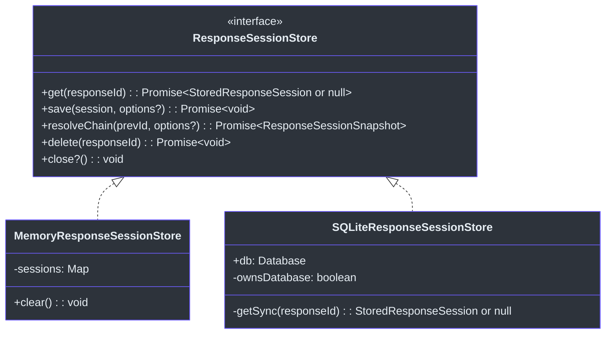
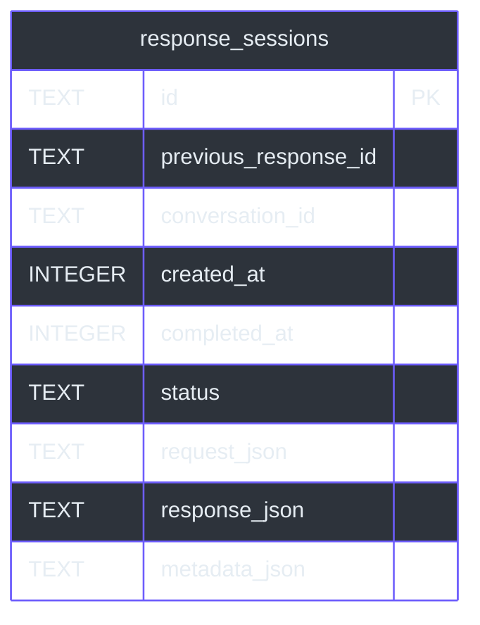
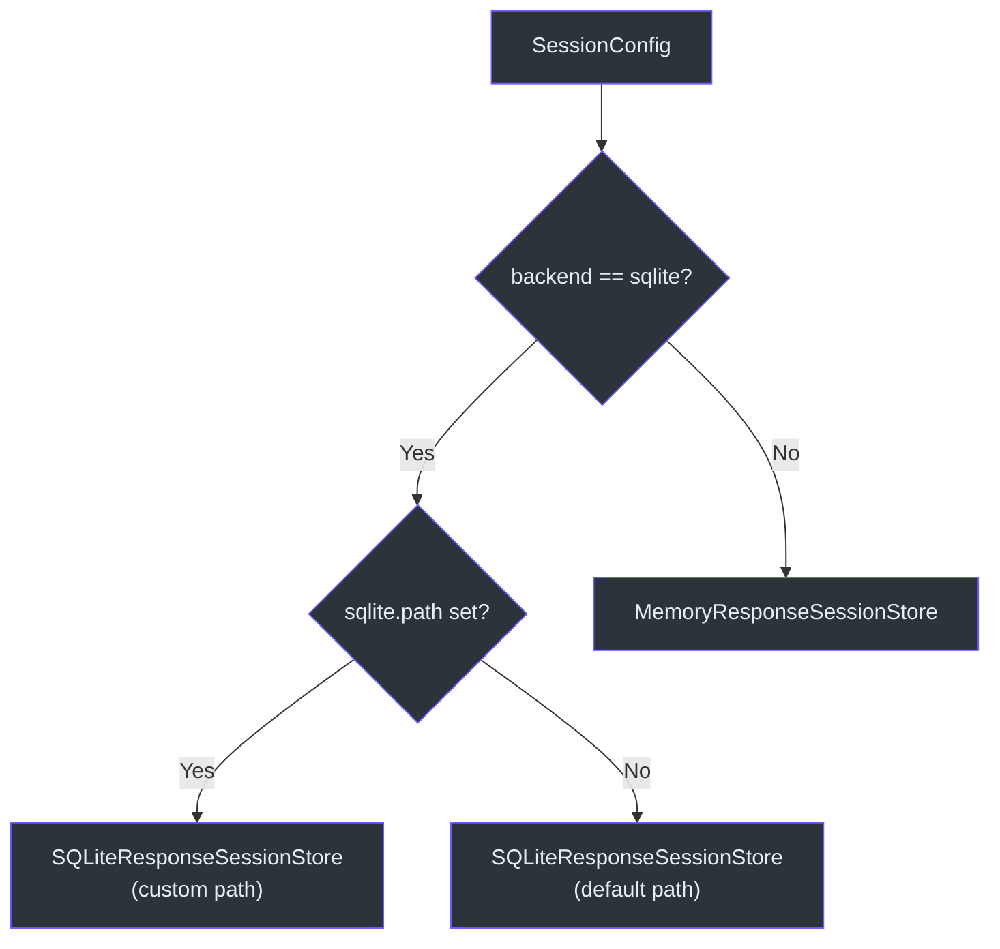

# 会话存储

GodeX 实现了 OpenAI Responses API 的 `previous_response_id` 机制，允许调用方将多个请求串联成一次对话，而无需手动回放消息历史。为了实现这一点，每个生成的响应必须与其请求快照一起持久化，以便后续请求可以沿着父指针链遍历并重建完整的对话上下文。`ResponseSessionStore` 是实现这一功能的存储接口，提供两种实现：用于测试和单进程部署的内存存储，以及用于生产持久化的 SQLite 存储后端。

存储边界被刻意保持狭窄——它持久化的是 API 形态的快照（而非特定于提供商的聊天消息），并将链条遍历委托给共享的 `resolveResponseSessionChain` 函数。这使存储层无需了解特定于提供商的协议细节。

## 概览

| 组件 | 文件 | 用途 |
|---|---|---|
| `ResponseSessionStore` | [types.ts:99-120](https://github.com/Ahoo-Wang/GodeX/blob/main/src/session/types.ts#L99) | 存储接口 |
| `MemoryResponseSessionStore` | [memory.ts:19-66](https://github.com/Ahoo-Wang/GodeX/blob/main/src/session/memory.ts#L19) | 基于 `Map` 的内存存储 |
| `SQLiteResponseSessionStore` | [sqlite.ts:36-149](https://github.com/Ahoo-Wang/GodeX/blob/main/src/session/sqlite.ts#L36) | 启用 WAL 模式的 SQLite 存储 |
| `assertCanSaveSession` | [save-policy.ts:13-40](https://github.com/Ahoo-Wang/GodeX/blob/main/src/session/save-policy.ts#L13) | 防止意外覆盖 |
| `StoredResponseSession` | [types.ts:23-38](https://github.com/Ahoo-Wang/GodeX/blob/main/src/session/types.ts#L23) | 持久化的轮次数据结构 |
| `createResponseSessionStore` | [session-store-factory.ts:8-16](https://github.com/Ahoo-Wang/GodeX/blob/main/src/context/session-store-factory.ts#L8) | 基于配置的工厂函数 |

## 存储类型

### StoredResponseSession

核心持久化类型（[types.ts:23-38](https://github.com/Ahoo-Wang/GodeX/blob/main/src/session/types.ts#L23)）：

| 字段 | 类型 | 描述 |
|---|---|---|
| `id` | `ResponseId` | 响应 ID，被后续请求用作 `previous_response_id` |
| `previous_response_id` | `ResponseId?` | 父指针，形成轮次的链表结构 |
| `conversation_id` | `ConversationId?` | 为未来 Conversation API 兼容性预留 |
| `created_at` | `number` | Unix 时间戳 |
| `completed_at` | `number?` | 生成完成时的时间戳 |
| `status` | `ResponseStatus` | `"completed"`、`"incomplete"` 等 |
| `request` | `StoredResponseRequestSnapshot` | 原始请求的快照 |
| `response` | `StoredResponseSnapshot` | 已生成响应的快照 |
| `metadata` | `Record<string, unknown>?` | 可选的用户自定义元数据 |

### StoredResponseRequestSnapshot

原始请求的最小子集（[types.ts:46-56](https://github.com/Ahoo-Wang/GodeX/blob/main/src/session/types.ts#L46)），用于历史重建：`input`、`instructions`、`model`、`tools`、`tool_choice`、`parallel_tool_calls`、`reasoning`、`text`、`truncation`。

### StoredResponseSnapshot

用于历史和诊断的响应数据（[types.ts:59-66](https://github.com/Ahoo-Wang/GodeX/blob/main/src/session/types.ts#L59)）：`id`、`output`、`output_text`、`usage`、`error`、`incomplete_details`。

## ResponseSessionStore 接口

| 方法 | 描述 |
|---|---|
| `get(responseId)` | 按 ID 返回一个已存储的响应，或 `null` |
| `save(session, options?)` | 持久化响应快照；检查保存策略 |
| `resolveChain(prevId, options?)` | 遍历父指针构建 `ResponseSessionSnapshot` |
| `delete(responseId)` | 按 ID 删除一个响应 |
| `close()` | 释放资源（数据库连接等） |

## MemoryResponseSessionStore

内存实现（[memory.ts:19-66](https://github.com/Ahoo-Wang/GodeX/blob/main/src/session/memory.ts#L19)）使用 `Map<ResponseId, StoredResponseSession>`：

- **读写时克隆**：每次 `get()` 和 `save()` 调用都经过 `cloneStoredResponseSession`（[snapshot-clone.ts:4-7](https://github.com/Ahoo-Wang/GodeX/blob/main/src/session/snapshot-clone.ts#L4)），该函数使用 `structuredClone` 防止调用方通过持有的引用修改已持久化的状态。
- **构造函数预填充**：接受一个可选的初始会话数组用于测试初始化（[memory.ts:22-25](https://github.com/Ahoo-Wang/GodeX/blob/main/src/session/memory.ts#L22)）。
- **清空方法**：暴露 `clear()` 用于测试清理（[memory.ts:63-65](https://github.com/Ahoo-Wang/GodeX/blob/main/src/session/memory.ts#L63)）。

## SQLiteResponseSessionStore

SQLite 实现（[sqlite.ts:36-149](https://github.com/Ahoo-Wang/GodeX/blob/main/src/session/sqlite.ts#L36)）使用 `bun:sqlite` 进行持久化：

### 数据库 Schema

Schema 通过 `migrateResponseSessionSchema`（[sqlite-schema.ts:3-23](https://github.com/Ahoo-Wang/GodeX/blob/main/src/session/sqlite-schema.ts#L3)）自动迁移，并在 `previous_response_id` 和 `conversation_id` 上创建索引以加速链条查询。

### 行映射

`sqlite-row-mapper.ts` 模块处理双向转换：

| 函数 | 方向 |
|---|---|
| `sessionToSQLiteParams` | `StoredResponseSession` -> `SQLiteResponseSessionParams`（JSON 编码快照） |
| `sqliteRowToSession` | `SQLiteResponseSessionRow` -> `StoredResponseSession`（JSON 解析快照） |

JSON 列将 `request_json`、`response_json` 和 `metadata_json` 存储为序列化字符串（[sqlite-row-mapper.ts:32-34](https://github.com/Ahoo-Wang/GodeX/blob/main/src/session/sqlite-row-mapper.ts#L32)）。

### 保存操作

`save` 方法（[sqlite.ts:64-105](https://github.com/Ahoo-Wang/GodeX/blob/main/src/session/sqlite.ts#L64)）使用 `INSERT ... ON CONFLICT(id) DO UPDATE`（upsert），但仅在保存策略通过之后执行。它会检查现有记录并调用 `assertCanSaveSession`。

### 同步读取

所有读取操作都是同步的（`getSync`），因为 `bun:sqlite` 是同步的。`get` 和 `resolveChain` 方法将同步调用包装在 `async` 中以满足 `ResponseSessionStore` 接口（[sqlite.ts:60-62](https://github.com/Ahoo-Wang/GodeX/blob/main/src/session/sqlite.ts#L60)）。

## 保存策略

`assertCanSaveSession`（[save-policy.ts:13-40](https://github.com/Ahoo-Wang/GodeX/blob/main/src/session/save-policy.ts#L13)）执行两项保护检查：

| 保护条件 | 检查内容 | 错误码 |
|---|---|---|
| 父指针不匹配 | `expected_previous_response_id`与会话的 `previous_response_id` 不一致 | `SESSION_CONFLICT` |
| 覆盖防护 | 已存在记录且 `overwrite` 不为 `true` | `SESSION_CONFLICT` |

两者都会抛出带有 `SESSION_CONFLICT` 错误码的 `SessionError`（[codes.ts:43](https://github.com/Ahoo-Wang/GodeX/blob/main/src/error/codes.ts#L43)）。

## 存储工厂

`createResponseSessionStore`（[session-store-factory.ts:8-16](https://github.com/Ahoo-Wang/GodeX/blob/main/src/context/session-store-factory.ts#L8)）读取 `SessionConfig` 来选择后端：

| `config.backend` | 创建的存储 |
|---|---|
| `"sqlite"` | 使用 `config.sqlite.path` 或默认路径的 `SQLiteResponseSessionStore` |
| 其他值 | `MemoryResponseSessionStore` |

## 存储选择流程

## 交叉引用

- [链条解析](./chain-resolution.md) -- `resolveChain` 如何遍历父指针并构建 `input_items`

## 参考文献

- [src/session/types.ts](https://github.com/Ahoo-Wang/GodeX/blob/main/src/session/types.ts) -- `ResponseSessionStore`、`StoredResponseSession`、快照类型
- [src/session/memory.ts](https://github.com/Ahoo-Wang/GodeX/blob/main/src/session/memory.ts) -- `MemoryResponseSessionStore`
- [src/session/sqlite.ts](https://github.com/Ahoo-Wang/GodeX/blob/main/src/session/sqlite.ts) -- `SQLiteResponseSessionStore`
- [src/session/save-policy.ts](https://github.com/Ahoo-Wang/GodeX/blob/main/src/session/save-policy.ts) -- `assertCanSaveSession`
- [src/session/sqlite-schema.ts](https://github.com/Ahoo-Wang/GodeX/blob/main/src/session/sqlite-schema.ts) -- `migrateResponseSessionSchema`
- [src/session/sqlite-row-mapper.ts](https://github.com/Ahoo-Wang/GodeX/blob/main/src/session/sqlite-row-mapper.ts) -- 行与会话的双向转换
- [src/session/snapshot-clone.ts](https://github.com/Ahoo-Wang/GodeX/blob/main/src/session/snapshot-clone.ts) -- `cloneStoredResponseSession`
- [src/context/session-store-factory.ts](https://github.com/Ahoo-Wang/GodeX/blob/main/src/context/session-store-factory.ts) -- `createResponseSessionStore`
- [src/error/session-error.ts](https://github.com/Ahoo-Wang/GodeX/blob/main/src/error/session-error.ts) -- `SessionError`

