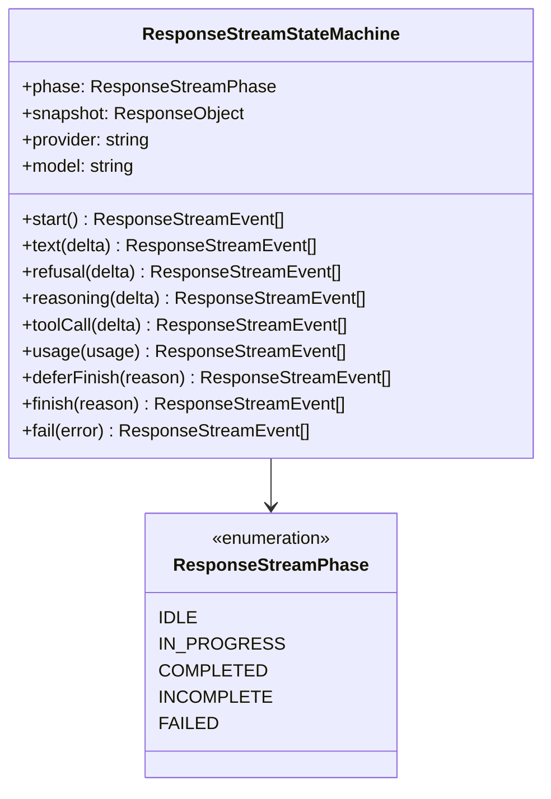

# 流状态

`ResponseStreamStateMachine` 是驱动流式管道的核心状态机。它从每次方法调用中产生 `ResponseStreamEvent` 数组，并维护一个始终反映当前响应状态的 `snapshot` 属性。

## 状态结构



## 生命周期阶段

状态机有五个阶段：

| 阶段 | 描述 |
|------|------|
| `IDLE` | `start()` 调用前的初始状态 |
| `IN_PROGRESS` | 正在处理增量（文本、推理、拒绝、工具调用） |
| `COMPLETED` | 通过 `finish()` 正常结束 |
| `INCOMPLETE` | 通过 `finish()` 输出不完整 |
| `FAILED` | 通过 `fail()` 因错误终止 |

阶段转换经过验证 — 从错误阶段调用会抛出带有适当代码的 `BridgeError`。

## 事件生产

```
start() -> response.created, response.in_progress
  ├── text() -> output_item.added, content_part.added, output_text.delta
  ├── refusal() -> output_item.added, content_part.added, refusal.delta
  ├── reasoning() -> output_item.added, reasoning_text_part.added, reasoning_text.delta
  ├── toolCall() -> output_item.added, function_call_arguments.delta
  └── usage() -> (更新快照，不发射事件)

deferFinish() -> (记录待定原因，不发射事件)
finish() -> 关闭打开的块，发射终止事件 (response.completed/incomplete)
fail() -> response.failed
```

### 完成时自动关闭

当调用 `finish()` 时，状态机自动关闭所有打开的块（活动文本、拒绝、推理和工具调用），在终止事件之前发射所有剩余的完成事件。

## 快照

`snapshot` getter 返回始终最新的 `ResponseObject`。此快照被 `ResponseSessionPersistenceTransformer` 用于会话持久化。

## 错误处理

状态机验证阶段转换并抛出 `BridgeError`：

| 代码 | 触发时机 |
|------|---------|
| `bridge.stream.output_before_start` | `start()` 之前收到增量 |
| `bridge.stream.delta_after_terminal` | `finish()` 或 `fail()` 之后收到增量 |
| `bridge.stream.invalid_transition` | 在意外阶段调用方法 |
| `bridge.stream.incomplete_tool_call` | 流以未完成的工具调用结束 |

[错误层次](/zh/06-error-handling/error-hierarchy)
