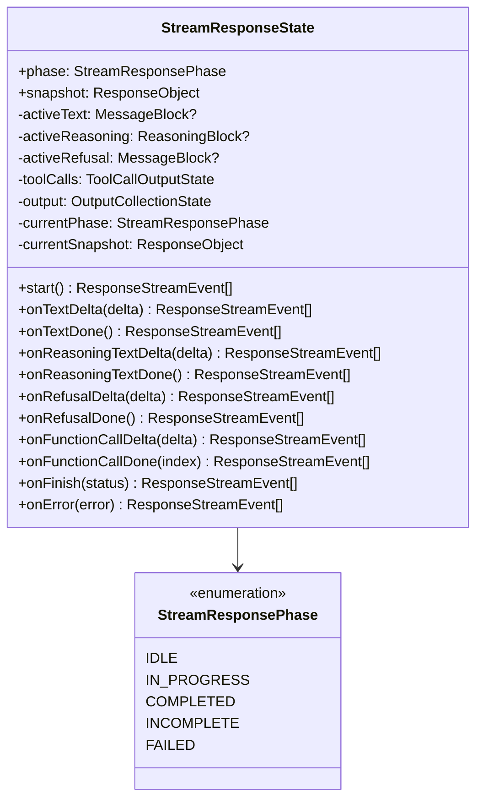

# 流状态

`StreamResponseState` 是驱动流式管道的核心状态机。与简单的累积器不同，它在每次方法调用时产生 `ResponseStreamEvent` 数组，并维护一个实时 `snapshot` 属性，始终反映当前响应状态。

## 状态结构



## 生命周期阶段

状态机有五个阶段，通过 `StreamResponsePhase` 跟踪：

| 阶段 | 描述 |
|------|------|
| `IDLE` | `start()` 调用前的初始状态 |
| `IN_PROGRESS` | 正在处理增量（文本、推理、拒绝、工具调用） |
| `COMPLETED` | 通过 `onFinish({ status: "completed" })` 正常完成流 |
| `INCOMPLETE` | 通过 `onFinish({ status: "incomplete" })` 以不完整输出结束 |
| `FAILED` | 通过 `onError()` 因错误终止 |

阶段转换经过验证 -- 从错误的阶段调用任何方法都会抛出带有适当错误代码的 `AdapterError`。

## 实例管理

`StreamResponseState` 提供三个静态方法用于生命周期控制：

- **`StreamResponseState.create(ctx, options)`** -- 为请求创建新的状态实例。如果已存在则抛出异常（防止双重初始化）。
- **`StreamResponseState.from(ctx)`** -- 检索现有状态实例。如果尚未创建状态则抛出异常。
- **`StreamResponseState.get(ctx)`** -- 返回状态实例，不存在则返回 `undefined`。供持久化转换器进行防御性检查使用。

状态存储在 `ResponsesContext.attributes` 中，键为 `"stream-response-state"`。

## 事件生产

与旧的累积器模式不同，状态机直接从其方法产生事件。每个增量方法返回一个 `ResponseStreamEvent` 对象数组，供提供商的 `StreamMapper` 传递给管道。

### 序列

```
start() -> response.created, response.in_progress
  ├── onTextDelta() -> output_item.added, content_part.added, output_text.delta
  ├── onTextDone() -> output_text.done, content_part.done, output_item.done
  ├── onReasoningTextDelta() -> output_item.added, reasoning_text_part.added, reasoning_text.delta
  ├── onReasoningTextDone() -> reasoning_text.done, reasoning_text_part.done, output_item.done
  ├── onRefusalDelta() -> output_item.added, content_part.added, refusal.delta
  ├── onRefusalDone() -> refusal.done, content_part.done, output_item.done
  ├── onFunctionCallDelta() -> output_item.added, function_call_arguments.delta
  └── onFunctionCallDone() -> function_call_arguments.done, output_item.done

onFinish() -> 关闭打开的块，发出终止事件 (response.completed/incomplete/failed)
onError() -> response.failed
```

### onFinish 自动关闭

当调用 `onFinish()` 时，状态机自动关闭任何打开的块（活跃的推理、文本、拒绝和工具调用），在终止事件之前发出所有剩余完成事件。

## 快照

`snapshot` getter 返回始终最新的 `ResponseObject` -- 它包括实时输出项、输出文本和终止状态字段（如果适用）。此快照由 `ResponseSessionPersistenceTransformer` 用于会话持久化，取代了旧的 `buildResponseObject()` 模式。

## 工具调用状态

工具调用通过 `ToolCallOutputState`（来自 `stream-response-tool-call.ts`）跟踪，为每个调用索引维护累积器。`onFunctionCallDelta()` 应用增量更改并在调用变得足够完整时发出事件。`onFunctionCallDone()` 标记调用完成并发出关闭事件。

[错误层次](/zh/06-error-handling/error-hierarchy)
