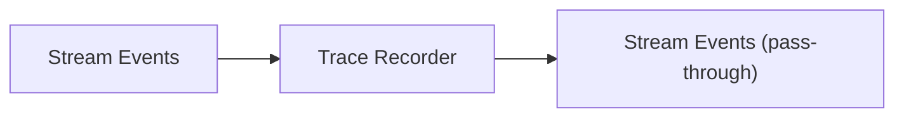
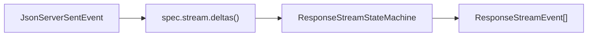
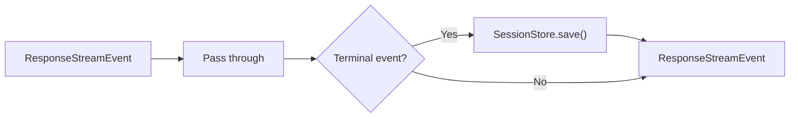

# 转换器

管道中的每个转换器是一个 `TransformStream`，逐个处理事件。它们通过 `pipeTransform()`（`ReadableStream.pipeThrough()` 的轻量封装）连接。

## TraceTransformer

将原始或转换后的流事件记录到追踪数据库。



管道中使用两个实例——一个用于原始上游事件，一个用于转换后的 Responses 事件。每个实例在不同的标签下记录事件（`upstream.stream.event.raw` 和 `upstream.stream.event.transformed`）。

## ProviderStreamEventBridge

将原始提供商 SSE 事件转换为 Responses API `ResponseStreamEvent` 对象。



- 对每个传入 SSE 块调用 `spec.stream.deltas()` 以提取类型化增量
- 将增量送入状态机，状态机产出事件
- 在 `flush()` 中，如果状态机仍为 `IN_PROGRESS`，则使用延迟的完成原因自动完成

## StreamErrorHandler

包装事件流以捕获错误，并在流终止前发射 `response.failed` 事件。

## ResponseOutputContractValidationTransformer

在终止事件上验证结构化输出。如果输出合约要求 `json_schema` 但提供商降级为 `json_object`，此转换器验证最终输出是否为有效 JSON。

无效的同步输出会导致响应失败；无效的流式输出会被重写为终止 `response.failed` 事件。

## ResponseLogTransformer

记录终止事件（completed、incomplete、failed），包含计时、使用量和缓存命中率。

## ResponseSessionPersistenceTransformer

累积流状态，并在流完成时持久化会话。



- 当 `request.store === false` 时完全跳过
- 在终止事件上，从事件中提取 `ResponseObject` 并保存

## CompatibilityLogTransformer

在流结束时记录所有累积的兼容性诊断信息（来自 `ResponsesContext.diagnostics`）。

## ResponseSseEncoder

位于服务器路由中（不在管道本身内），此编码器将 `ResponseStreamEvent` 序列化为客户端期望的 SSE 线格式。

```
event: response.output_item.added
data: {"type":"response.output_item.added","output_index":0,"item":{...}}

```

[流状态](/zh/05-streaming-pipeline/stream-state)
