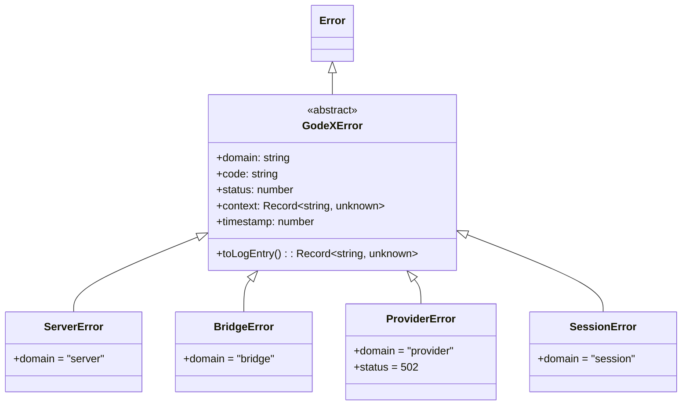
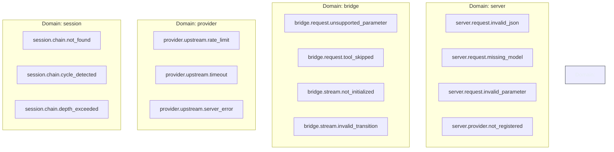
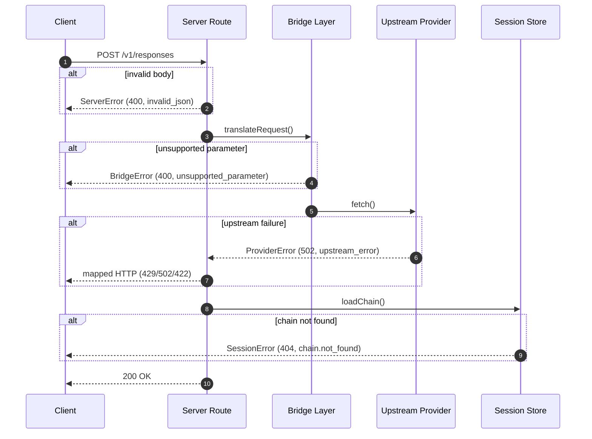
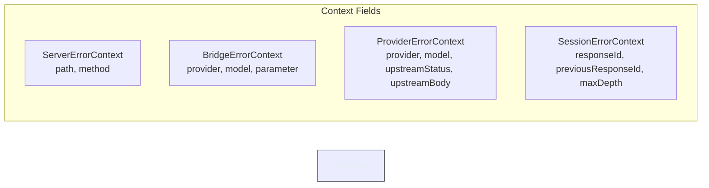

# 错误处理

GodeX 将每种失败建模为类型化的、领域作用域的对象，使调用方、运维人员和日志聚合管道都使用同一种语言。系统没有在整个代码库中散布字符串消息，而是定义了一个抽象基类——`GodeXError`——以及四个与架构层一一对应的具体子类。每个错误携带机器可读的错误码、HTTP 状态码、结构化上下文包和毫秒级精度的时间戳，使从上游提供商超时到返回给客户端的 JSON 响应体的端到端故障追踪变得简单直接。

## 概览

| 方面 | 详情 |
|---|---|
| 基类 | `GodeXError` -- 抽象类，继承自 `Error` |
| 领域 | `server`、`bridge`、`provider`、`session` |
| 关键字段 | `domain`、`code`、`status`、`context`、`timestamp` |
| 日志 | `toLogEntry()` 生成普通对象快照 |
| HTTP 映射 | [server/errors.ts](https://github.com/Ahoo-Wang/GodeX/blob/main/src/server/errors.ts) 中的 `godeXErrorToHttp` / `providerErrorToHttp` |
| 错误码 | 集中定义在 [src/error/codes.ts](https://github.com/Ahoo-Wang/GodeX/blob/main/src/error/codes.ts) |

## 错误类层次结构



抽象类 `GodeXError` 定义在
[src/error/godex-error.ts:2-35](https://github.com/Ahoo-Wang/GodeX/blob/main/src/error/godex-error.ts#L2)。
每个子类声明一个固定的 `domain` 字符串并将构造函数参数转发给基类，由基类标准化 `status` 和 `context` 的默认值。

## 错误领域与错误码

错误码遵循 `<domain>.<subdomain>.<specific>` 的命名模式，作为字符串常量从
[src/error/codes.ts:1-52](https://github.com/Ahoo-Wang/GodeX/blob/main/src/error/codes.ts#L1)
导出。



### Server 领域

在请求解析和配置验证期间抛出。

| 错误码 | HTTP 状态 | 触发时机 |
|---|---|---|
| `server.request.invalid_json` | 400 | 请求体不是有效的 JSON |
| `server.request.missing_model` | 400 | 缺少必需的 `model` 字段 |
| `server.request.invalid_parameter` | 400 | 参数验证失败 |
| `server.provider.not_registered` | 400 | 引用的提供商未注册 |

[来源：src/error/codes.ts:46-51](https://github.com/Ahoo-Wang/GodeX/blob/main/src/error/codes.ts#L46)

### Bridge 领域

在 OpenAI Responses schema 与提供商原生格式之间进行转换时抛出。

| 错误码 | HTTP 状态 | 触发时机 |
|---|---|---|
| `bridge.request.unsupported_parameter` | 400 | 参数在提供商端无对应项 |
| `bridge.request.tool_skipped` | 400 | 提供商不支持该工具 |
| `bridge.request.unsupported_input_item` | 400 | 输入项类型无法转换 |
| `bridge.request.unsupported_input_content` | 400 | 内容类型无法转换 |
| `bridge.request.unsupported_tool` | 400 | 工具定义无法转换 |
| `bridge.response.invalid_output_format` | 400 | 提供商输出无法映射回 |
| `bridge.stream.*` | 400 | 流状态机违规 |

[来源：src/error/codes.ts:3-31](https://github.com/Ahoo-Wang/GodeX/blob/main/src/error/codes.ts#L3)

### Provider 领域

在上游 HTTP 失败时抛出；除非上游状态码具有特定含义，否则始终映射为 502。

| 错误码 | 上游状态 | 映射的 HTTP 状态 |
|---|---|---|
| `provider.upstream.rate_limit` | 429 | 429 |
| `provider.upstream.timeout` | 408 | 408 |
| `provider.upstream.server_error` | >= 500 | 502 |
| `provider.upstream.error` | 其他 | 422 |

[来源：src/error/codes.ts:33-36](https://github.com/Ahoo-Wang/GodeX/blob/main/src/error/codes.ts#L33)，
[来源：src/server/errors.ts:20-44](https://github.com/Ahoo-Wang/GodeX/blob/main/src/server/errors.ts#L20)

### Session 领域

在管理对话链时抛出。

| 错误码 | HTTP 状态 | 触发时机 |
|---|---|---|
| `session.chain.not_found` | 404 | 先前的响应 ID 不存在 |
| `session.chain.cycle_detected` | 400 | 检测到循环链引用 |
| `session.chain.depth_exceeded` | 400 | 链深度超过配置的最大值 |
| `session.chain.unavailable` | 503 | 会话存储暂时不可用 |
| `session.store.conflict` | 409 | 并发写入冲突 |

[来源：src/error/codes.ts:39-43](https://github.com/Ahoo-Wang/GodeX/blob/main/src/error/codes.ts#L39)

## 错误传播流程



路由级错误处理器位于
[src/server/routes/responses/error-handler.ts:12-50](https://github.com/Ahoo-Wang/GodeX/blob/main/src/server/routes/responses/error-handler.ts#L12)，
按优先级顺序分派错误：

1. **ProviderError** -- 以 `error` 级别记录日志，通过 `providerErrorToHttp` 映射。
2. **其他 GodeXError** -- 以 `info` 级别记录日志，返回自身的 `status` 和 `code`。
3. **意外错误** -- 以 `error` 级别记录日志，遮蔽为 500 `server_error`。

## 子类构造

每个子类添加了一个类型化的上下文接口，用于捕获与其领域相关的信息。



| 子类 | 默认状态 | 上下文要点 | 来源 |
|---|---|---|---|
| `ServerError` | 400 | `path`、`method` | [src/error/server-error.ts:10-27](https://github.com/Ahoo-Wang/GodeX/blob/main/src/error/server-error.ts#L10) |
| `BridgeError` | 400 | `provider`、`model`、`parameter` | [src/error/bridge-error.ts:11-28](https://github.com/Ahoo-Wang/GodeX/blob/main/src/error/bridge-error.ts#L11) |
| `ProviderError` | 502 | `provider`、`model`、`upstreamStatus`、`upstreamBody` | [src/error/provider-error.ts:12-29](https://github.com/Ahoo-Wang/GodeX/blob/main/src/error/provider-error.ts#L12) |
| `SessionError` | 400 | `responseId`、`previousResponseId`、`maxDepth` | [src/error/session-error.ts:11-27](https://github.com/Ahoo-Wang/GodeX/blob/main/src/error/session-error.ts#L11) |

## HTTP 映射

`jsonError` 辅助函数位于
[src/server/errors.ts:50-63](https://github.com/Ahoo-Wang/GodeX/blob/main/src/server/errors.ts#L50)，
生成标准 JSON 封装格式：

```json
{
  "error": {
    "code": "server.request.missing_model",
    "message": "Missing required field: model"
  }
}
```

提供商特定的映射（`providerErrorToHttp`）将上游 HTTP 状态码转换为面向客户端的等价值，位于
[src/server/errors.ts:20-44](https://github.com/Ahoo-Wang/GodeX/blob/main/src/server/errors.ts#L20)。

## 通过 toLogEntry 进行结构化日志

每个 `GodeXError` 可以通过 `toLogEntry()` 生成可序列化的日志条目，位于
[src/error/godex-error.ts:24-34](https://github.com/Ahoo-Wang/GodeX/blob/main/src/error/godex-error.ts#L24)。
独立的 `toLogEntry(err)` 重载位于
[第 37 行](https://github.com/Ahoo-Wang/GodeX/blob/main/src/error/godex-error.ts#L37)，
可以优雅处理非 GodeXError 值，将其包装为普通对象。

## 交叉引用

- [错误码参考](./error-codes.md) -- 完整的错误码列表
- [错误层次结构](./error-hierarchy.md) -- 更深入的类图探索
- [请求流程](../02-architecture/request-flow.md) -- 错误在管道中的产生位置
- [流式管道](../05-streaming-pipeline/overview.md) -- 桥接层流状态错误
- [配置 Schema](../07-configuration/config-schema.md) -- 会话深度限制

## 参考文献

- [src/error/godex-error.ts](https://github.com/Ahoo-Wang/GodeX/blob/main/src/error/godex-error.ts) -- 抽象基类
- [src/error/codes.ts](https://github.com/Ahoo-Wang/GodeX/blob/main/src/error/codes.ts) -- 所有领域错误码常量
- [src/error/bridge-error.ts](https://github.com/Ahoo-Wang/GodeX/blob/main/src/error/bridge-error.ts) -- bridge 领域子类
- [src/error/provider-error.ts](https://github.com/Ahoo-Wang/GodeX/blob/main/src/error/provider-error.ts) -- provider 领域子类
- [src/error/server-error.ts](https://github.com/Ahoo-Wang/GodeX/blob/main/src/error/server-error.ts) -- server 领域子类
- [src/error/session-error.ts](https://github.com/Ahoo-Wang/GodeX/blob/main/src/error/session-error.ts) -- session 领域子类
- [src/server/errors.ts](https://github.com/Ahoo-Wang/GodeX/blob/main/src/server/errors.ts) -- HTTP 映射辅助函数
- [src/server/routes/responses/error-handler.ts](https://github.com/Ahoo-Wang/GodeX/blob/main/src/server/routes/responses/error-handler.ts) -- 路由错误处理器
