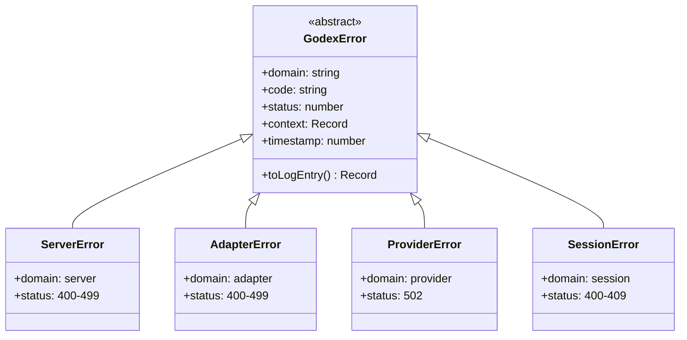

# 错误层次

Godex 中所有错误都继承自抽象 `GodexError` 基类。每个错误携带域、代码、HTTP 状态、结构化上下文和时间戳。

## 类层次

## 错误域

| 域 | 类 | 何时发生 |
|----|-----|---------|
| `server` | `ServerError` | 无效 JSON、缺少模型、未知提供商 |
| `adapter` | `AdapterError` | 不支持的参数、工具或输入项 |
| `provider` | `ProviderError` | 上游速率限制、超时、5xx 错误 |
| `session` | `SessionError` | 链未找到、循环、深度超限 |

[错误码](/zh/06-error-handling/error-codes)
