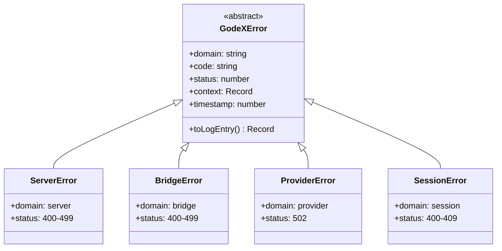

# 错误层次

GodeX 中所有错误都扩展自抽象 `GodeXError` 基类。每个错误携带域、代码、HTTP 状态、结构化上下文和时间戳。

## 类层次

## 错误域

| 域 | 类 | 触发时机 |
|----|-----|---------|
| `server` | `ServerError` | 无效 JSON、缺少 model、未知提供商、配置验证 |
| `bridge` | `BridgeError` | 不支持的参数/工具/输入项、流状态违规、输出合约失败 |
| `provider` | `ProviderError` | 上游速率限制、超时、5xx 错误、无效使用量数据 |
| `session` | `SessionError` | 链未找到、循环、深度超限、不可用会话 |

[错误码](/zh/06-error-handling/error-codes)
