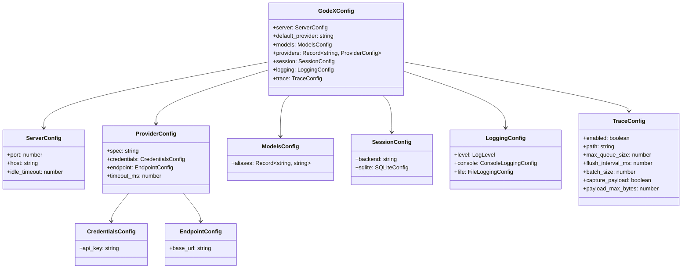

# 配置 Schema

GodeX 通过 `godex.yaml` 文件配置，通常由 `godex init` 创建。环境变量使用 `${VAR_NAME}` 语法插值。

## 完整 Schema

```yaml
server:
  port: 5678              # HTTP 监听端口
  host: "0.0.0.0"         # 监听地址
  idle_timeout: 30000     # 空闲连接超时（毫秒），默认：0（禁用）

default_provider: deepseek   # 模型无斜杠前缀时使用的提供商

models:
  aliases:
    "gpt-5.5": deepseek/deepseek-v4-pro   # 将别名映射到 provider/model
    "glm": zhipu/glm-5.1                   # 将别名映射到 provider/model
    "*": deepseek/deepseek-v4-flash        # 通配符兜底

providers:
  deepseek:
    spec: deepseek                      # 提供商规格名称（必填）
    credentials:
      api_key: ${DEEPSEEK_API_KEY}
    endpoint:
      base_url: https://api.deepseek.com
    timeout_ms: 30000

  zhipu:
    spec: zhipu                         # 提供商规格名称（必填）
    credentials:
      api_key: ${ZHIPU_API_KEY}
    endpoint:
      base_url: https://open.bigmodel.cn/api/coding/paas/v4
    timeout_ms: 30000

  minimax:
    spec: minimax                        # 提供商规格名称（必填）
    credentials:
      api_key: ${MINIMAX_API_KEY}
    endpoint:
      base_url: https://api.minimaxi.com/v1
    timeout_ms: 30000

session:
  backend: sqlite         # "sqlite" 或 "memory"
  sqlite:
    path: ./data/sessions.db

logging:
  level: info             # trace | debug | info | warn | error
  console:
    enabled: true
    level: info
  file:
    enabled: false
    level: debug
    dir: ./logs
    filename: godex.log
    max_size: 10485760    # 10MB
    max_files: 5

trace:
  enabled: true
  path: ./data/trace.db
  max_queue_size: 10000
  flush_interval_ms: 1000
  batch_size: 100
  capture_payload: false
  payload_max_bytes: 65536
```

## 类型定义



## 提供商配置

每个提供商条目必须包含 `spec` 字段，匹配已注册的提供商定义名称。启动时会拒绝没有 `spec` 的旧版提供商配置。

```yaml
providers:
  myprovider:
    spec: myprovider           # 必填：匹配已注册的提供商定义
    credentials:
      api_key: ${MY_API_KEY}
    endpoint:
      base_url: https://api.example.com/v1
    timeout_ms: 30000
```

## 环境变量插值

`${DEEPSEEK_API_KEY}` 等值在加载时从环境变量解析。缺少的变量会产生启动错误。

## 环境变量覆盖

除 YAML 插值外，以下环境变量可直接覆盖配置字段（CLI 标志优先级最高）：

| 变量 | 配置字段 | 说明 |
|------|---------|------|
| `GODEX_PORT` | `server.port` | 覆盖监听端口 |
| `GODEX_HOST` | `server.host` | 覆盖绑定地址 |
| `GODEX_LOG_LEVEL` | `logging.level` | 覆盖日志级别 |
| `GODEX_DEFAULT_PROVIDER` | `default_provider` | 未设置时回退到 `deepseek` |

[CLI 命令](/zh/07-configuration/cli-commands)
