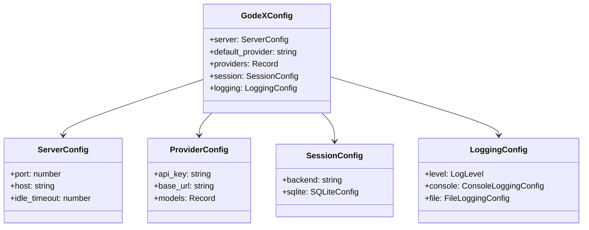

# 配置 Schema

GodeX 通过 `godex.yaml` 文件配置，通常由 `godex init` 创建。环境变量使用 `${VAR_NAME}` 语法插值。

## 完整 Schema

```yaml
server:
  port: 5678              # HTTP 监听端口
  host: "0.0.0.0"         # 监听地址
  idle_timeout: 30000     # 空闲连接超时（毫秒）

default_provider: zhipu   # 模型无斜杠前缀时使用的提供商

providers:
  zhipu:
    api_key: ${ZHIPU_API_KEY}
    base_url: https://open.bigmodel.cn/api/coding/paas/v4
    models:               # 模型名称映射表
      "gpt-4o": glm-4.7   # 将 gpt-4o 映射为提供商原生的 glm-4.7
      "*": glm-5.1        # 兜底映射

session:
  backend: sqlite         # "sqlite" 或 "memory"
  sqlite:
    path: ./data/sessions.db

logging:
  level: info             # trace | debug | info | warn | error
  console:
    enabled: true
    level: info
  file:
    enabled: false
    level: debug
    dir: ./logs
    filename: godex.log
    max_size: 10485760    # 10MB
    max_files: 5
```

## 类型定义



[CLI 命令](/zh/07-configuration/cli-commands)
