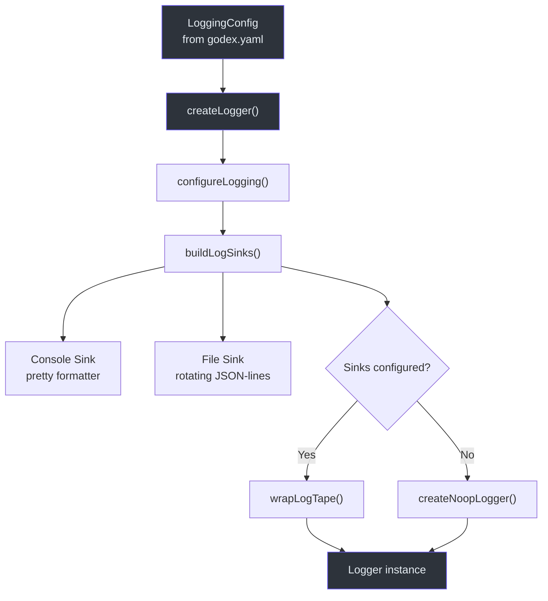
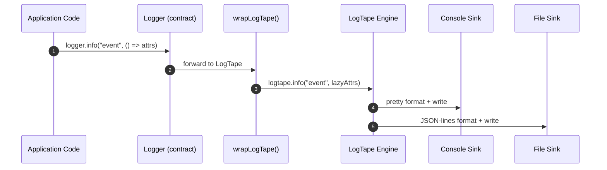

# 日志系统

可观测性是运营多提供商 API 网关的基础。GodeX
使用 LogTape 作为日志引擎，包装在轻量的 `Logger` 契约之后，支持惰性属性求值——属性仅在日志级别激活时才被序列化，防止在热路径上产生不必要的对象分配。系统通过 `godex.yaml` 的 `logging` 部分进行完全配置，支持带美化格式的控制台输出、带 JSON-lines 格式的轮转文件输出，以及每个输出端的级别覆盖。

## 概览

| 方面 | 详情 |
|---|---|
| 引擎 | `@logtape/logtape`，配合 `@logtape/pretty` 和 `@logtape/file` |
| 契约 | [src/logger/contract.ts](https://github.com/Ahoo-Wang/GodeX/blob/main/src/logger/contract.ts) 中的 `Logger` 接口 |
| 级别 | `trace`、`debug`、`info`、`warn`、`error` |
| 输出端 | 控制台（美化格式）、文件（轮转 JSON-lines） |
| 惰性属性 | `LogAttr = Record | () => Record` |
| 空操作回退 | 所有输出端禁用时使用 `NoopLogger` |

## 日志架构



## Logger 契约

`Logger` 接口定义在
[src/logger/contract.ts:6-14](https://github.com/Ahoo-Wang/GodeX/blob/main/src/logger/contract.ts#L6)，
定义了整个代码库中使用的形状：

```typescript
interface Logger {
  readonly level: LogLevel;
  child(bindings: Record<string, unknown>): Logger;
  trace(event: string, attr?: LogAttr): void;
  debug(event: string, attr?: LogAttr): void;
  info(event: string, attr?: LogAttr): void;
  warn(event: string, attr?: LogAttr): void;
  error(event: string, attr?: LogAttr): void;
}
```

`LogAttr` 类型位于
[第 4 行](https://github.com/Ahoo-Wang/GodeX/blob/main/src/logger/contract.ts#L4)，
接受普通对象或**惰性获取函数**。在热路径上推荐使用函数形式：

```typescript
// 立即求值 -- 无论日志级别是否激活都会创建对象
logger.info("event", { data: expensiveCall() });

// 惰性求值 -- 仅在级别激活时才调用函数
logger.info("event", () => ({ data: expensiveCall() }));
```

## Logger 创建

`createLogger` 位于
[src/logger/logger.ts:8-14](https://github.com/Ahoo-Wang/GodeX/blob/main/src/logger/logger.ts#L8)，
在真正的 LogTape 支持的 logger 和空操作回退之间做出选择：

| 条件 | 结果 |
|---|---|
| `configureLogging` 返回 `true` | `wrapLogTape(getLogTapeLogger([]), level)` |
| 没有配置输出端 | `createNoopLogger(level)` |

## LogTape 配置

`configureLogging` 位于
[src/logger/configure.ts:7-26](https://github.com/Ahoo-Wang/GodeX/blob/main/src/logger/configure.ts#L7)，
调用 LogTape 的 `configureSync` 并配置两个日志类别：

| 类别 | 最低级别 | 用途 |
|---|---|---|
| `[]`（根） | 从输出端计算得出 | 所有应用程序日志事件 |
| `["logtape", "meta"]` | `warning` | 抑制 LogTape 内部噪音 |

计算出的 `lowestLevel` 是所有活跃输出端中的最低级别，确保没有输出端会遗漏它应该接收的事件。

## 输出端类型

### 控制台输出端

当 `console.enabled` 未显式设为 `false` 时配置。使用 `@logtape/pretty` 的美化格式化器，位于
[src/logger/sinks.ts:29-45](https://github.com/Ahoo-Wang/GodeX/blob/main/src/logger/sinks.ts#L29)。

| 设置 | 默认值 | 描述 |
|---|---|---|
| `formatter` | pretty（日期时间、属性） | 人类可读输出 |
| `level` | 继承 `logging.level` | 按输出端覆盖 |

### 文件输出端

当 `file.enabled` 为 `true` 时激活。使用 `@logtape/file` 的轮转文件输出端，采用 JSON-lines 格式，位于
[src/logger/sinks.ts:47-62](https://github.com/Ahoo-Wang/GodeX/blob/main/src/logger/sinks.ts#L47)。

| 设置 | 默认值 | 描述 |
|---|---|---|
| `dir` | 必填 | 日志文件目录 |
| `filename` | 必填 | 日志文件名 |
| `max_size` | 10 (MB) | 轮转前的最大文件大小 |
| `max_files` | 5 | 保留的轮转文件数量 |
| `formatter` | JSON-lines（扁平化） | 机器可解析输出 |
| `level` | 继承 `logging.level` | 按输出端覆盖 |



## 日志级别映射

GodeX 使用五个日志级别。到 LogTape 内部级别的映射由 `toLogTapeLevel` 处理，位于
[src/logger/levels.ts:7-13](https://github.com/Ahoo-Wang/GodeX/blob/main/src/logger/levels.ts#L7)：

| GodeX 级别 | LogTape 级别 |
|---|---|
| `trace` | `trace` |
| `debug` | `debug` |
| `info` | `info` |
| `warn` | `warning` |
| `error` | `error` |

`minLogTapeLevel` 位于
[第 19 行](https://github.com/Ahoo-Wang/GodeX/blob/main/src/logger/levels.ts#L19)，
从一组输出端级别中计算最详细级别，确保根 logger 捕获最宽松输出端所需的所有内容。

## NoopLogger

当所有输出端都被禁用时，`createNoopLogger` 位于
[src/logger/noop-logger.ts:3-14](https://github.com/Ahoo-Wang/GodeX/blob/main/src/logger/noop-logger.ts#L3)，
返回一个所有方法都是空操作的 logger。这避免了在有意关闭日志时（例如在轻量级测试中）的 LogTape 开销。

## 文件路径展开

`expandHomeDir` 位于
[src/logger/paths.ts:4-9](https://github.com/Ahoo-Wang/GodeX/blob/main/src/logger/paths.ts#L4)，
使用 `process.env.HOME` 或 Node 的 `homedir()` 解析文件路径中的 `~/` 前缀，允许如下配置：

```yaml
logging:
  file:
    enabled: true
    dir: ~/logs/godex
    filename: godex.log
```

## 配置示例

```yaml
logging:
  level: info
  console:
    enabled: true
    level: debug       # 控制台输出 debug 及以上级别
  file:
    enabled: true
    dir: /var/log/godex
    filename: godex.log
    max_size: 20       # 每个文件 20 MB
    max_files: 10      # 保留 10 个轮转文件
    level: info        # 文件输出 info 及以上级别
```

## 交叉引用

- [配置 Schema](./config-schema.md) -- 完整的 logging 配置节参考
- [CLI 命令](./cli-commands.md) -- `--log-level` CLI 覆盖
- [错误处理](../06-error-handling/error-handling.md) -- 通过 `toLogEntry()` 进行结构化错误日志
- [服务器路由](../02-architecture/server-routes.md) -- 使用 `responseRequestLogEntry` 的每请求日志
- [请求流程](../02-architecture/request-flow.md) -- 管道中日志事件的触发位置

## 参考文献

- [src/logger/logger.ts](https://github.com/Ahoo-Wang/GodeX/blob/main/src/logger/logger.ts) -- `createLogger` 工厂
- [src/logger/contract.ts](https://github.com/Ahoo-Wang/GodeX/blob/main/src/logger/contract.ts) -- `Logger` 接口和 `LogAttr` 类型
- [src/logger/configure.ts](https://github.com/Ahoo-Wang/GodeX/blob/main/src/logger/configure.ts) -- LogTape `configureSync` 设置
- [src/logger/noop-logger.ts](https://github.com/Ahoo-Wang/GodeX/blob/main/src/logger/noop-logger.ts) -- 空操作 logger 回退
- [src/logger/logtape-logger.ts](https://github.com/Ahoo-Wang/GodeX/blob/main/src/logger/logtape-logger.ts) -- LogTape 包装适配器
- [src/logger/sinks.ts](https://github.com/Ahoo-Wang/GodeX/blob/main/src/logger/sinks.ts) -- 控制台和文件输出端构建器
- [src/logger/levels.ts](https://github.com/Ahoo-Wang/GodeX/blob/main/src/logger/levels.ts) -- 级别映射和最小值计算
- [src/logger/paths.ts](https://github.com/Ahoo-Wang/GodeX/blob/main/src/logger/paths.ts) -- 主目录路径展开
