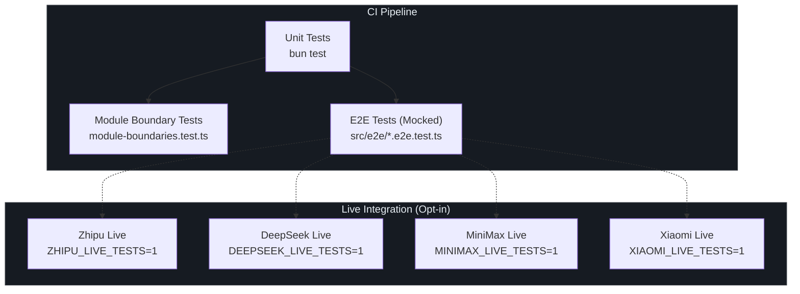
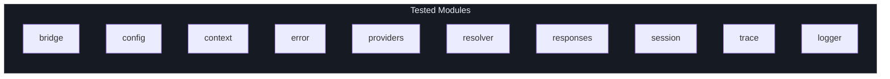
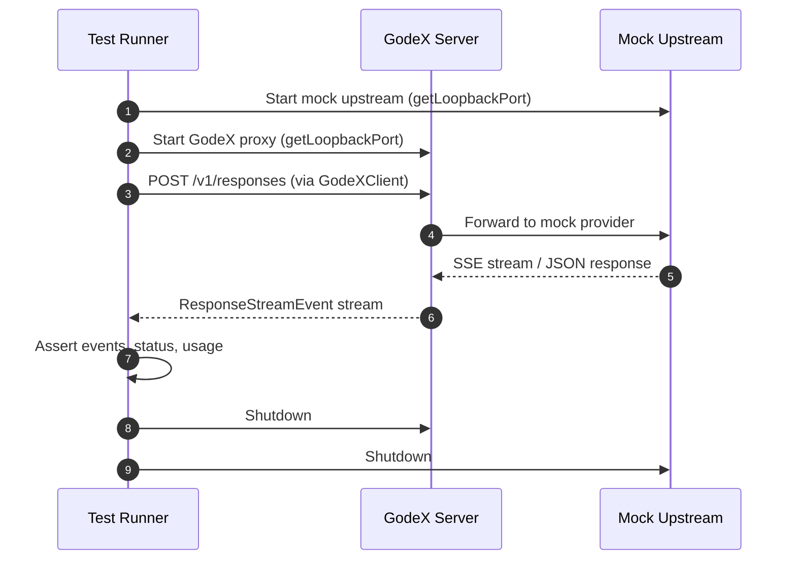
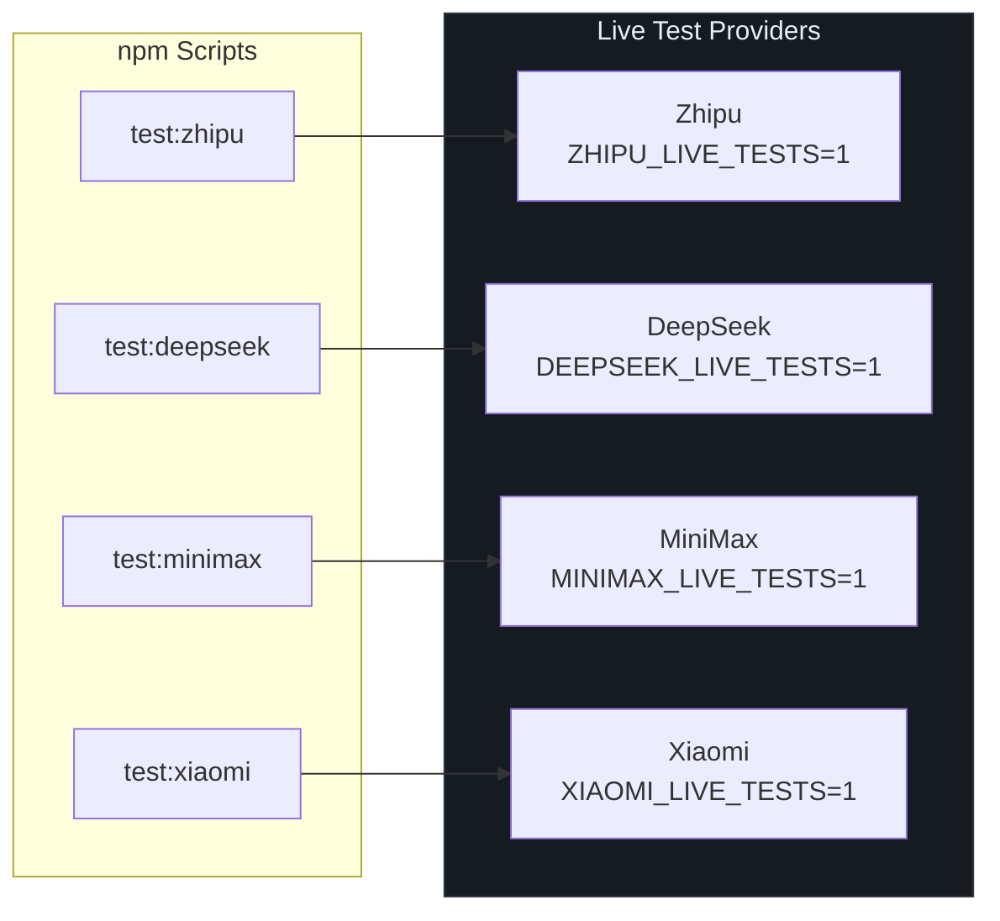
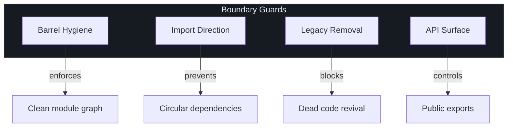

# 测试策略

GodeX 采用多层测试策略，在每个层级捕获缺陷——从单个转换函数到针对真实提供商 API 的完整代理往返。每个模块都有同目录下的 `*.test.ts` 文件，项目在测试时强制执行架构不变量，提供商兼容性通过一个共享测试套件验证，任何新提供商都必须通过。理解此策略对于希望安全添加功能的贡献者以及在部署到生产之前需要信心的运维人员都至关重要。

## 概览

| 层级 | 范围 | 运行命令 | 触发方式 |
|---|---|---|---|
| 单元测试 | 所有模块（`bridge`、`config`、`context`、`error`、`providers`、`resolver`、`responses`、`session`、`trace`、`logger`） | `bun test` | 每次提交 |
| 模块边界测试 | 架构不变量（桶文件、导入规范、遗留清理） | `bun test` | 每次提交 |
| E2E 测试（模拟） | 带模拟上游服务器的完整代理往返 | `bun test src/e2e` | CI 管道 |
| 实时测试（智谱） | 真实智谱 API 调用 | `ZHIPU_LIVE_TESTS=1` | 手动 / CI 可选 |
| 实时测试（DeepSeek） | 真实 DeepSeek API 调用 | `DEEPSEEK_LIVE_TESTS=1` | 手动 / CI 可选 |
| 实时测试（MiniMax） | 真实 MiniMax API 调用 | `MINIMAX_LIVE_TESTS=1` | 手动 / CI 可选 |
| 实时测试（Xiaomi） | 真实 Xiaomi MiMo API 调用 | `XIAOMI_LIVE_TESTS=1` | 手动 / CI 可选 |
| 兼容性套件 | 每个提供商的输入/工具降级行为 | `bun test` | 每次提交 |

## 测试架构概览



## 单元测试

所有生产模块都有同目录下的 `*.test.ts` 文件覆盖。测试使用 [Bun 内置测试运行器](https://bun.sh/docs/cli/test)，通过 `bun:test` 导入 `describe`/`expect`/`test`。



测试命令通过 path-ignore-patterns 默认排除 E2E 测试：

```json
"test": "bun test --path-ignore-patterns 'src/e2e/**'"
```

这保持了单元测试套件的快速和确定性（[package.json:31](https://github.com/Ahoo-Wang/GodeX/blob/main/package.json#L31)）。

## 测试夹具

GodeX 提供专用的测试夹具模块，使构造测试上下文变得简单，无需连接真实服务。

### 上下文夹具

[context/test-fixtures.ts](https://github.com/Ahoo-Wang/GodeX/blob/main/src/context/test-fixtures.ts) 提供：

| 导出 | 用途 |
|---|---|
| `baseConfig` | 最小化的 `GodeXConfig`，使用内存会话和禁用的 trace |
| `createRegistrar(names)` | 预加载模拟提供商边缘的注册器 |
| `createCapturingLogger(logs)` | 将所有日志事件捕获到数组中用于断言的 Logger |
| `CapturedLog` | 捕获的日志条目类型（level、event、attr） |

`baseConfig` 夹具禁用 trace 并使用 error 级别的日志阈值以保持测试输出整洁（[src/context/test-fixtures.ts:6](https://github.com/Ahoo-Wang/GodeX/blob/main/src/context/test-fixtures.ts#L6)）。

### 会话夹具

[session/test-fixtures.ts](https://github.com/Ahoo-Wang/GodeX/blob/main/src/session/test-fixtures.ts) 提供预构建的会话数据：

| 导出 | 用途 |
|---|---|
| `userInput` | 标准的用户输入文本项 |
| `completedTurn(id, prevId)` | 构建已完成状态的 `StoredResponseSession` |
| `incompleteTurn(id, prevId)` | 构建 `in_progress` 状态的会话 |
| `cycleTurns()` | 返回两个互相引用的会话（用于循环检测测试） |

`completedTurn` 辅助函数位于 [src/session/test-fixtures.ts:16](https://github.com/Ahoo-Wang/GodeX/blob/main/src/session/test-fixtures.ts#L16)，创建一个包含输出、使用量统计和元数据的完整响应会话。

### 服务器 / 响应夹具

[server/routes/responses/test-fixtures.ts](https://github.com/Ahoo-Wang/GodeX/blob/main/src/server/routes/responses/test-fixtures.ts) 提供：

| 导出 | 用途 |
|---|---|
| `testConfig` | 路由级测试的服务器配置 |
| `createTestApp(options)` | 带模拟提供商的完整 `ApplicationContext` |
| `responseObject(ctx)` | 从 `ResponsesContext` 构建 `ResponseObject` |
| `jsonRequest(body)` / `textRequest(body)` | 为处理器测试构造 `Request` 对象 |
| `basicRequest` | 最小的 `ResponseCreateRequest` |

## 带模拟上游的 E2E 测试

E2E 测试套件（[src/e2e/e2e.test.ts](https://github.com/Ahoo-Wang/GodeX/blob/main/src/e2e/e2e.test.ts)）启动一个真实的 GodeX 服务器和一个模拟上游服务器。不需要真实的 API 密钥。



### GodeX E2E 客户端

[GodeXClient](https://github.com/Ahoo-Wang/GodeX/blob/main/src/e2e/godex-client.ts) 是一个使用 `@ahoo-wang/fetcher` 装饰器构建的类型化 HTTP 客户端。它暴露三个 API 组（[src/e2e/godex-client.ts:39](https://github.com/Ahoo-Wang/GodeX/blob/main/src/e2e/godex-client.ts#L39)）：

| API | 端点 | 方法 |
|---|---|---|
| `health.get()` | `GET /health` | 健康检查 |
| `models.list()` | `GET /v1/models` | 模型列表 |
| `responses.create(req)` | `POST /v1/responses` | 非流式响应 |
| `responses.stream(req)` | `POST /v1/responses` | 流式响应（SSE） |

`collectGodexStreamEvents` 辅助函数（[src/e2e/godex-client.ts:114](https://github.com/Ahoo-Wang/GodeX/blob/main/src/e2e/godex-client.ts#L114)）将整个 SSE 流读入数组用于断言。

### 端口分配

[`getLoopbackPort()`](https://github.com/Ahoo-Wang/GodeX/blob/main/src/e2e/ports.ts#L3) 函数通过临时在端口 0 上打开一个 TCP 服务器、读取分配的端口号然后关闭服务器来分配临时环回端口。这避免了并行测试运行中的端口冲突。

## 实时集成测试

实时测试针对真实的提供商 API 运行完整的代理管道。它们是**可选**的，除非通过环境变量显式启用，否则将被跳过。



每个实时测试文件（例如 [src/e2e/zhipu-live.test.ts](https://github.com/Ahoo-Wang/GodeX/blob/main/src/e2e/zhipu-live.test.ts)）启动一个配置了提供商真实 base URL 的 GodeX 服务器，然后使用类型化的 `GodeXClient` 发送请求。测试验证流式和非流式响应结构、工具调用行为以及多轮对话。

## 模块边界测试

[module-boundaries.test.ts](https://github.com/Ahoo-Wang/GodeX/blob/main/src/module-boundaries.test.ts) 套件使用 TypeScript 编译器 API 强制执行架构不变量：

| 测试 | 不变量 |
|---|---|
| `every src subdirectory has an index barrel` | 没有目录缺少 `index.ts` |
| `index.ts files only re-export local modules` | 桶文件不包含逻辑 |
| `index.ts files only re-export from own directory` | 无跨目录重导出 |
| `non-index modules do not re-export` | 只有桶文件进行重导出 |
| `legacy modules stay removed` | 禁止的路径不得存在 |
| `output contract slot` | 遗留访问器已被清理 |
| `bridge does not import responses context` | 桥接层保持独立 |
| `root index.ts stays executable entrypoint` | 入口点结构保持不变 |
| `session helpers do not leak through protocol barrel` | 公共 API 表面受控 |

这些测试作为标准 `bun test` 套件的一部分运行，充当架构漂移的守护者（[src/module-boundaries.test.ts:95](https://github.com/Ahoo-Wang/GodeX/blob/main/src/module-boundaries.test.ts#L95)）。



## 提供商兼容性测试套件

位于 [src/providers/shared/compatibility-test-suite.ts](https://github.com/Ahoo-Wang/GodeX/blob/main/src/providers/shared/compatibility-test-suite.ts) 的共享兼容性测试套件验证每个提供商是否正确处理内容和工具降级场景：

| 函数 | 验证内容 |
|---|---|
| `describeCurrentInputContentCompatibility` | 不支持的内容类型被剥离、支持的文本被保留、诊断信息被记录 |
| `describeUnsupportedToolCompatibility` | 不支持的工具类型被跳过并记录诊断信息，而非引发错误 |

每个提供商集成导入这些套件函数并提供提供商特定的映射和断言回调（[src/providers/shared/compatibility-test-suite.ts:30](https://github.com/Ahoo-Wang/GodeX/blob/main/src/providers/shared/compatibility-test-suite.ts#L30)）。

## 共享测试工具

[src/testing/](https://github.com/Ahoo-Wang/GodeX/blob/main/src/testing) 模块导出可复用的测试基础设施：

| 导出 | 用途 |
|---|---|
| `createTestProviderEdge(options)` | 构建完全配置的模拟 `ProviderEdge`，支持可配置的请求/流行为 |
| `completedTextResponse(text, usage)` | 创建用于断言的标准聊天补全响应 |
| `CreateTestProviderEdgeOptions` | 控制模拟响应、流事件和回调的选项接口 |

`createTestProviderEdge` 函数位于 [src/testing/provider-edge.ts:34](https://github.com/Ahoo-Wang/GodeX/blob/main/src/testing/provider-edge.ts#L34)，创建一个带有可配置回调（`onRequest`、`onStream`）、预构建流事件和完整提供商规格（包括能力和工具支持）的模拟提供商。

## 测试执行命令

| 命令 | 运行内容 |
|---|---|
| `bun test` | 单元测试 + 边界测试（排除 E2E） |
| `bun test src/e2e` | 模拟的 E2E 测试 |
| `bun run test:e2e` | 模拟的 E2E 测试（别名） |
| `ZHIPU_LIVE_TESTS=1 bun test src/e2e/zhipu-live.test.ts` | 智谱实时测试 |
| `DEEPSEEK_LIVE_TESTS=1 bun test src/e2e/deepseek-live.test.ts` | DeepSeek 实时测试 |
| `MINIMAX_LIVE_TESTS=1 bun test src/e2e/minimax-live.test.ts` | MiniMax 实时测试 |
| `XIAOMI_LIVE_TESTS=1 bun test src/e2e/xiaomi-live.test.ts` | Xiaomi 实时测试 |
| `bun run test:coverage` | 带覆盖率报告的单元测试 |
| `bun run check` | 类型检查 + 代码检查 + 单元测试 |
| `bun run ci` | 完整 CI：类型检查 + 代码检查 + 单元测试 + E2E |

所有脚本定义在 [package.json:36-53](https://github.com/Ahoo-Wang/GodeX/blob/main/package.json#L36-L53)。

## 交叉引用

- [流式管道](../02-architecture/streaming-pipeline.md) -- 单元测试的转换器如何组装成响应管道
- [架构概览](../02-architecture/overview.md) -- 被测试模块与系统架构的关系
- [提供商开发](../03-provider-development/provider-spec.md) -- 兼容性测试套件如何应用于新提供商
- [会话管理](../04-session-management/session-stores.md) -- 会话夹具和多轮测试场景
- [追踪系统](../10-trace/trace-system.md) -- 追踪相关的单元测试和实时追踪验证

## 参考文献

1. [src/module-boundaries.test.ts](https://github.com/Ahoo-Wang/GodeX/blob/main/src/module-boundaries.test.ts) -- 架构不变量测试
2. [src/e2e/e2e.test.ts](https://github.com/Ahoo-Wang/GodeX/blob/main/src/e2e/e2e.test.ts) -- 模拟的端到端测试套件
3. [src/e2e/godex-client.ts](https://github.com/Ahoo-Wang/GodeX/blob/main/src/e2e/godex-client.ts) -- 类型化 E2E HTTP 客户端
4. [src/e2e/ports.ts](https://github.com/Ahoo-Wang/GodeX/blob/main/src/e2e/ports.ts) -- 临时端口分配
5. [src/context/test-fixtures.ts](https://github.com/Ahoo-Wang/GodeX/blob/main/src/context/test-fixtures.ts) -- 上下文和配置夹具
6. [src/session/test-fixtures.ts](https://github.com/Ahoo-Wang/GodeX/blob/main/src/session/test-fixtures.ts) -- 会话数据夹具
7. [src/server/routes/responses/test-fixtures.ts](https://github.com/Ahoo-Wang/GodeX/blob/main/src/server/routes/responses/test-fixtures.ts) -- 路由处理器夹具
8. [src/providers/shared/compatibility-test-suite.ts](https://github.com/Ahoo-Wang/GodeX/blob/main/src/providers/shared/compatibility-test-suite.ts) -- 共享提供商兼容性测试
9. [src/testing/provider-edge.ts](https://github.com/Ahoo-Wang/GodeX/blob/main/src/testing/provider-edge.ts) -- 模拟提供商边缘工厂
10. [package.json](https://github.com/Ahoo-Wang/GodeX/blob/main/package.json) -- 测试脚本（第 25-44 行）
