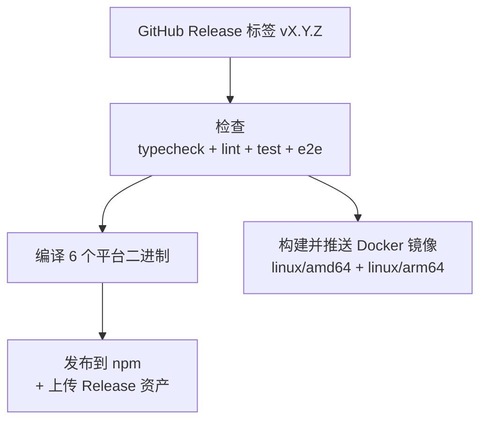

# CI/CD 与发布

## CI 流水线

CI 流水线通过 GitHub Actions 在每次推送和拉取请求时运行：

1. **类型检查**（`bun run typecheck`）— `tsc --noEmit`
2. **代码检查**（`bun run lint`）— Biome 检查
3. **单元测试**（`bun run test`）
4. **E2E 测试**（`bun run test:e2e`）

## 发布流程

### 平台二进制

| 平台 | 包名 |
|------|------|
| macOS Apple Silicon | `@ahoo-wang/godex-darwin-arm64` |
| macOS Intel | `@ahoo-wang/godex-darwin-x64` |
| Linux x86_64 | `@ahoo-wang/godex-linux-x64` |
| Linux ARM64 | `@ahoo-wang/godex-linux-arm64` |
| Windows x86_64 | `@ahoo-wang/godex-win32-x64` |
| Windows ARM64 | `@ahoo-wang/godex-win32-arm64` |

### 包架构

主 `@ahoo-wang/godex` npm 包是一个轻量外壳：
- `engines: { node: ">=18.0.0" }` — 仅在 `postinstall` 时需要
- `postinstall: scripts/install.cjs` — 检测平台，链接二进制
- `optionalDependencies` — 平台特定包

### Release 工作流

1. 标记为 `vX.Y.Z` 的 GitHub Release 触发 Release 工作流
2. **Checks** 作业运行类型检查、lint、单元测试和 mock e2e
3. **Compile** 作业构建全部 6 个平台二进制（并行，每个平台独立运行器）
4. **Publish** 作业下载二进制，打包归档和 SHA256 校验和，上传到 Release 资产，然后发布到 npm
5. **Docker** 作业构建多架构镜像并推送到 Docker Hub 和 GHCR（与 Publish 并行运行）

## Docker 发布

Docker 镜像与 npm 包一起在每次发布时构建并推送。

| Registry | 镜像 |
|----------|------|
| Docker Hub | `ahoowang/godex` |
| GitHub Container Registry | `ghcr.io/ahoo-wang/godex` |

镜像使用语义化版本标签：

- `ahoowang/godex:X.Y.Z` — 精确版本
- `ahoowang/godex:X.Y` — 最新 minor
- `ahoowang/godex:X` — 最新 major
- `ahoowang/godex:latest` — 最新发布

支持平台：`linux/amd64`、`linux/arm64`。

### Dockerfile

Dockerfile 使用多阶段构建：

1. **构建阶段** — 使用 `oven/bun` 通过 `bun build --compile` 编译独立二进制
2. **运行阶段** — `debian:bookworm-slim`，仅包含二进制和 `ca-certificates`

### 配置

| 构建参数 | 默认值 | 说明 |
|----------|--------|------|
| `VERSION` | `0.0.0` | 注入到二进制的发布版本号 |

| 仓库变量 | 必填 | 说明 |
|----------|------|------|
| `DOCKERHUB_IMAGE` | 否 | Docker Hub 组织/用户名。未设置时使用 `github.repository_owner` |

| 仓库密钥 | 必填 | 说明 |
|----------|------|------|
| `DOCKERHUB_USERNAME` | 当 `DOCKERHUB_IMAGE` 已设置 | Docker Hub 登录用户名 |
| `DOCKERHUB_TOKEN` | 当 `DOCKERHUB_IMAGE` 已设置 | Docker Hub 访问令牌 |

当 `DOCKERHUB_IMAGE` 未设置时，仅启用 GHCR 发布。

[返回概述](/zh/01-getting-started/overview)
