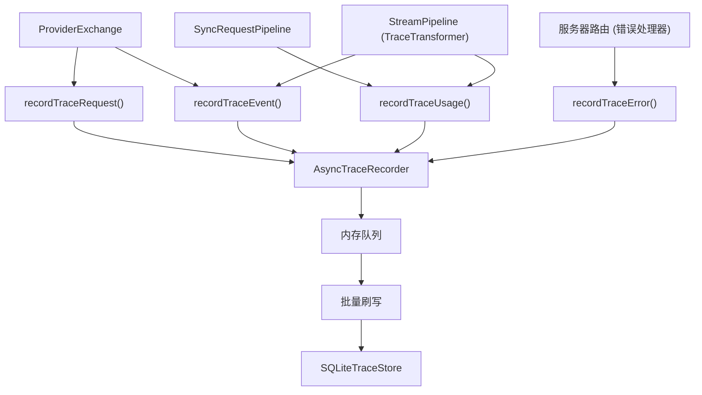

# 追踪记录

追踪记录默认启用，将结构化行写入 SQLite。它捕获每个请求的完整生命周期 — 从提供商请求到流事件再到使用量和错误 — 不影响请求延迟。

## 架构



## 记录类型

追踪子系统记录四种行，所有行共享 `request_id`、`response_id`、`provider` 和 `model` 元数据：

### 请求记录

当 `ProviderExchange` 发送提供商请求时写入。

| 字段 | 描述 |
|------|------|
| `request_id` | 唯一请求标识符 |
| `response_id` | 唯一响应标识符 |
| `provider` | 提供商名称（如 `deepseek`） |
| `model` | 上游模型名称 |
| `stream` | 是否为流式请求 |
| `payload_hash` | 请求载荷的 SHA-256 哈希 |
| `payload_bytes` | 请求载荷字节大小 |
| `payload_json` | 完整载荷 JSON（仅在 `capture_payload: true` 时） |

### 使用量记录

在同步响应完成或流结束后写入。

| 字段 | 描述 |
|------|------|
| `input_tokens` | 消耗的提示令牌数 |
| `output_tokens` | 生成的响应令牌数 |
| `total_tokens` | 总令牌数（输入 + 输出） |
| `cached_tokens` | 缓存命中令牌数（上游报告时） |
| `reasoning_tokens` | 推理消耗令牌数（上游报告时） |
| `cache_hit_ratio` | 缓存命中占总输入令牌的比率 |

### 事件记录

在请求处理的关键点写入。

| 事件名称 | 记录时机 |
|---------|---------|
| `provider.request.body` | 发送到上游之前 |
| `provider.response.body` | 收到同步响应后 |
| `upstream.stream.event.raw` | 来自上游的原始 SSE 块 |
| `upstream.stream.event.transformed` | Bridge 内核转换后 |

每个事件记录包含可选的 `sequence` 序号，用于请求内排序。

### 错误记录

在请求处理过程中发生错误时写入。

| 字段 | 描述 |
|------|------|
| `event_name` | 点分隔事件名称（如 `responses.request.provider.error`） |
| `error_type` | JavaScript 错误类名 |
| `domain` | GodeX 错误域（`server`、`bridge`、`provider`、`session`） |
| `code` | 域特定错误码 |
| `message` | 人类可读错误消息 |
| `status` | HTTP 状态码 |

## 异步记录器

`AsyncTraceRecorder` 在内存队列中缓冲记录，批量刷写到 SQLite：

- **`max_queue_size`**：队列满时丢弃记录并记录警告（默认：1000）。
- **`batch_size`**：每次批量插入的记录数（默认：50）。
- **`flush_interval_ms`**：两次刷写之间的最大间隔（默认：1000ms）。
- **优雅关闭**：`close()` 等待进行中的刷写完成后再关闭存储。

当追踪禁用时（`trace.enabled: false`），使用 `NoopTraceRecorder`，零开销丢弃所有记录。

## SQLite 模式

追踪数据库使用四张表，索引优化用于请求级查询：

```sql
trace_requests    — 索引于 request_id, response_id
trace_usage       — 索引于 request_id, response_id
trace_events      — 索引于 (request_id, sequence), event_name
trace_errors      — 索引于 request_id, response_id, code
```

数据库文件在启动时自动创建。使用 `trace.path` 配置位置。

## 载荷捕获

默认情况下，载荷仅摘要（哈希 + 字节数）。启用 `trace.capture_payload: true` 可存储完整 JSON 载荷（最大 `trace.payload_max_bytes`）：

```yaml
trace:
  enabled: true
  path: ./data/trace.db
  capture_payload: true
  payload_max_bytes: 102400
```

捕获的载荷包含完整请求和响应内容，应视为敏感数据。

## 配置参考

```yaml
trace:
  enabled: true                # 启用/禁用追踪记录
  path: ./data/trace.db        # SQLite 数据库路径
  max_queue_size: 1000         # 内存队列最大记录数（超出丢弃）
  flush_interval_ms: 1000      # 批量刷写最大间隔（毫秒）
  batch_size: 50               # 每次批量插入的记录数
  capture_payload: false       # 存储完整 JSON 载荷
  payload_max_bytes: 102400    # 载荷 JSON 最大字节数
```

[测试指南](/zh/08-testing/testing-guide)
