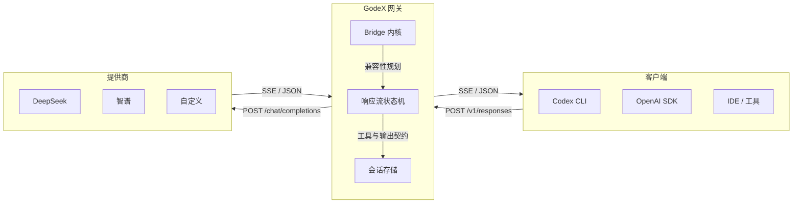

## 工作原理



GodeX 位于你的工具和上游模型提供商之间。它接收 OpenAI Responses API 请求，通过 Bridge 内核和提供商规格将其转换为 Chat Completions API 调用，并流式返回结果 — 完整保留 Codex 所期望的协议语义。

## 快速开始

```bash
# 安装 — 运行时无需 Bun
npm install -g @ahoo-wang/godex

# 交互式创建配置
godex init

# 启动网关
godex serve
```

将 Codex CLI 指向你的 GodeX 实例：

```bash
export OPENAI_BASE_URL=http://localhost:5678/v1
export OPENAI_API_KEY=any-value
codex
```

---

::: info
阅读完整的[快速入门指南](/zh/01-getting-started/overview)或探索[架构概览](/zh/02-architecture/overview)。
:::
