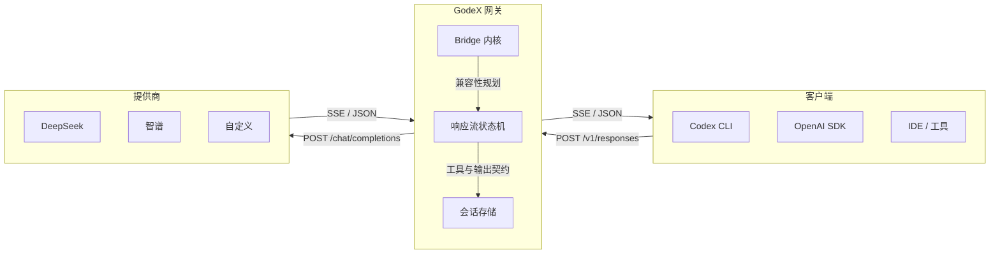

## 工作原理



GodeX 位于你的工具和上游模型提供商之间。它接收 OpenAI Responses API 请求，通过 Bridge 内核和提供商规格将其转换为 Chat Completions API 调用，并流式返回结果 — 完整保留 Codex 所期望的协议语义。

## 快速开始

```bash
# 安装 — 运行时无需 Bun
npm install -g @ahoo-wang/godex

# 交互式创建配置
godex init

# 启动网关
godex serve
```

将 Codex CLI 指向你的 GodeX 实例：

```bash
export OPENAI_BASE_URL=http://localhost:5678/v1
export OPENAI_API_KEY=any-value
codex
```

---

::: info
阅读完整的[快速入门指南](/zh/01-getting-started/overview)或探索[架构概览](/zh/02-architecture/overview)。
:::

## 文档导航

| 章节 | 说明 | 入口 |
|------|------|------|
| [快速入门](/zh/01-getting-started/overview) | 概述、安装、配置、提供商 | [概述](/zh/01-getting-started/overview) |
| [架构](/zh/02-architecture/overview) | 请求流程、核心类型 | [系统总览](/zh/02-architecture/overview) |
| [提供商开发](/zh/03-provider-development/provider-interface) | 如何接入新 LLM 提供商 | [Provider 接口](/zh/03-provider-development/provider-interface) |
| [会话管理](/zh/04-session-management/session-store) | 多轮对话支持 | [会话存储](/zh/04-session-management/session-store) |
| [流式管道](/zh/05-streaming-pipeline/transformers) | 流式转换与状态管理 | [转换器](/zh/05-streaming-pipeline/transformers) |
| [错误处理](/zh/06-error-handling/error-codes) | 错误码参考 | [错误码](/zh/06-error-handling/error-codes) |
| [配置](/zh/07-configuration/config-schema) | godex.yaml 配置参考 | [配置 Schema](/zh/07-configuration/config-schema) |
| [测试](/zh/08-testing/testing-guide) | 单元、E2E、Live 测试 | [测试指南](/zh/08-testing/testing-guide) |
| [追踪](/zh/10-trace/trace-recording) | 请求追踪与可观测性 | [追踪记录](/zh/10-trace/trace-recording) |
| [部署](/zh/09-deployment/ci-cd) | Docker、原生二进制、CI/CD | [CI/CD 与发布](/zh/09-deployment/ci-cd) |
