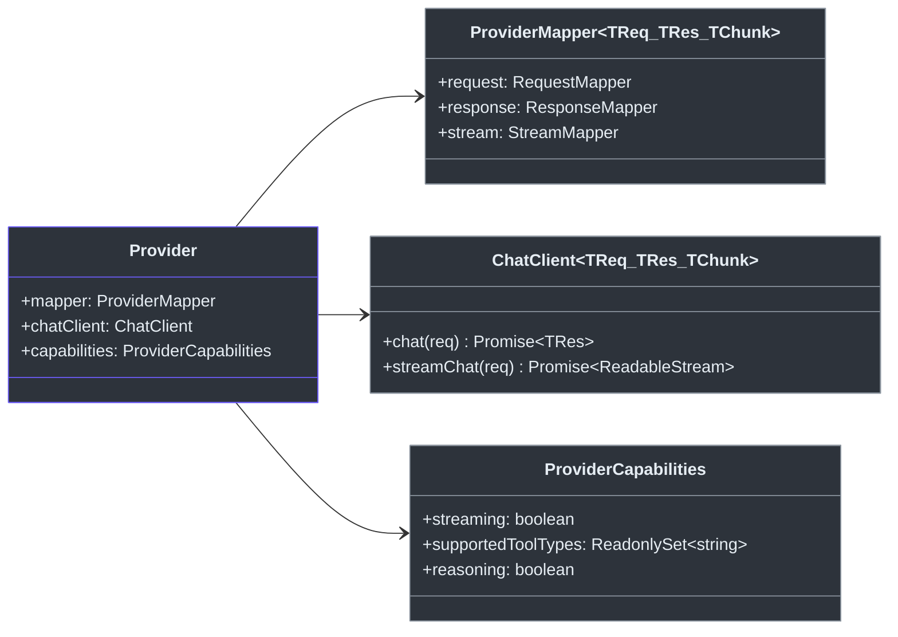

# 贡献者指南

## 项目简介

Godex 是一个 **OpenAI Responses API 网关**。它接受 OpenAI Responses API (`POST /v1/responses`) 请求，转换为上游提供商的 Chat Completions API 调用。一次编写客户端代码，Godex 路由到任何已配置的提供商。

## 环境准备

| 工具 | 版本 | 安装 |
|------|------|------|
| [Bun](https://bun.sh/) | >= 1.2 | `curl -fsSL https://bun.sh/install \| bash` |
| Node.js | >= 18 | （可选，用于 npm 发布） |
| Git | 任意 | 系统包管理器 |

```bash
git clone https://github.com/Ahoo-Wang/Godex.git
cd Godex
bun install
bun run dev          # 开发服务器，热重载，端口 13145
```

## 项目结构

```
src/
├── cli/              Commander CLI（serve, config, init）
├── config/           godex.yaml 模式定义、环境变量插值、默认值
├── context/          ApplicationContext（DI）、ResponsesContext（每请求上下文）
├── adapter/          Adapter 接口、DefaultAdapter、流式转换器
│   ├── mapper/       RequestMapper/ResponseMapper/StreamMapper 契约、StreamState
│   └── transformers/ ProviderEvent → Response → SSE 编码管道
├── providers/        Provider 注册表 + 内置工厂
│   └── zhipu/        参考提供商实现
├── resolver/         ModelResolver（模型选择器 → provider + model）
├── server/           Bun HTTP 服务器、路由
├── session/          ResponseSessionStore（Memory + SQLite）、链式解析
├── error/            GodexError 层次结构与领域错误码
├── protocol/openai/  OpenAI Responses API 类型定义
└── logger/           结构化 JSON 日志
```

## 核心概念

### Provider

`Provider` 将三个关注点打包：



<!-- Sources: src/adapter/provider.ts, src/adapter/mapper/contract.ts -->

### 请求流程

```mermaid
sequenceDiagram
    autonumber
    participant Client as 客户端
    participant Server as Bun HTTP 服务器
    participant Ctx as ResponsesContext
    participant Resolver as ModelResolver
    participant Adapter as DefaultAdapter
    participant Provider as Provider
    participant Upstream as 上游 API

    Client->>Server: POST /v1/responses
    Server->>Ctx: create(app, body)
    Ctx->>Resolver: resolve(body.model)
    Resolver-->>Ctx: ResolvedModel
    Ctx-->>Server: 上下文就绪
    Server->>Adapter: request(ctx) 或 stream(ctx)
    Adapter->>Provider: mapper.request.map(ctx)
    Provider->>Upstream: HTTP /chat/completions
    Upstream-->>Provider: 响应
    Provider-->>Adapter: 映射后的 ResponseObject
    Adapter-->>Server: 结果
    Server-->>Client: JSON 或 SSE 流

    style Client fill:#2d333b,stroke:#6d5dfc,color:#e6edf3
    style Server fill:#2d333b,stroke:#8b949e,color:#e6edf3
    style Ctx fill:#2d333b,stroke:#8b949e,color:#e6edf3
    style Resolver fill:#2d333b,stroke:#8b949e,color:#e6edf3
    style Adapter fill:#2d333b,stroke:#8b949e,color:#e6edf3
    style Provider fill:#2d333b,stroke:#8b949e,color:#e6edf3
    style Upstream fill:#2d333b,stroke:#6d5dfc,color:#e6edf3
```

<!-- Sources: src/server/routes/responses/index.ts, src/adapter/default-adapter.ts -->

### 错误层次

所有领域错误继承自 `GodexError`，使用 [src/error/codes.ts](https://github.com/Ahoo-Wang/Godex/blob/main/src/error/codes.ts) 中的结构化错误码：

| 错误类 | 领域 | 示例错误码 |
|--------|------|-----------|
| `ServerError` | server | `server.request.invalid_json` |
| `AdapterError` | adapter | `adapter.request.unsupported_tool` |
| `ProviderError` | provider | `provider.upstream.timeout` |
| `SessionError` | session | `session.chain.not_found` |

## 开发工作流

```bash
bun run dev              # 开发服务器（热重载）
bun run typecheck        # TypeScript 类型检查
bun run lint             # Biome 检查
bun run lint:fix         # Biome 自动修复
bun run format           # Biome 格式化
bun run check            # typecheck + lint + test（提交前运行）
bun run ci               # 完整 CI：typecheck + biome ci + test + e2e
```

### 运行测试

```bash
bun test                           # 所有单元 + 集成测试
bun test src/adapter/              # 测试特定模块
bun run test:e2e                   # E2E 测试（模拟上游）
bun run test:coverage              # 带覆盖率报告的测试
```

### 添加新 Provider

添加新 LLM 提供商（例如 "acme"）的步骤：

1. 创建 `src/providers/acme/` 目录
2. 实现 `Provider` 接口——需要：
   - `ProviderMapper`（请求/响应/流映射）
   - `ChatClient`（到上游的 HTTP 边界）
   - `ProviderCapabilities`（功能声明）
3. 创建 `ProviderFactory` 函数
4. 在 [src/providers/builtin.ts](https://github.com/Ahoo-Wang/Godex/blob/main/src/providers/builtin.ts) 中注册
5. 在源文件旁添加测试（`*.test.ts`）
6. 在 `godex.yaml` 中配置提供商

`src/providers/zhipu/` 中的 Zhipu 提供商是完整的参考实现。

## 代码风格

- **TypeScript** strict 模式、ESNext 目标、ESM 模块
- **Biome** 用于检查和格式化（Tab 缩进）
- **Bun 测试运行器** — 不使用外部测试框架
- **GodexError 层次** 用于所有领域错误 — adapter/provider 代码中不抛出原生 `Error`
- **不写注释** 除非解释为什么（WHY），而非是什么（WHAT）

## 常见陷阱

| 陷阱 | 解决方法 |
|------|---------|
| 使用 Node.js API 而非 Bun 等价物 | 使用 `Bun.serve()`、`bun:sqlite` 等 |
| 在 provider 代码中抛出原生 `Error` | 使用 `ProviderError` 或 `AdapterError` 配合领域错误码 |
| 忘记注册新 Provider 工厂 | 在 `src/providers/builtin.ts` 的 `createBuiltinRegistrar()` 中添加 |
| 运行 Jest/Vitest 测试 | 使用 `bun test` — 项目使用 Bun 内置运行器 |

## 关键文件参考

| 路径 | 用途 |
|------|------|
| [src/index.ts](https://github.com/Ahoo-Wang/Godex/blob/main/src/index.ts) | 入口点，委托给 CLI |
| [src/cli/serve.ts](https://github.com/Ahoo-Wang/Godex/blob/main/src/cli/serve.ts) | 服务器启动、配置加载 |
| [src/context/application-context.ts](https://github.com/Ahoo-Wang/Godex/blob/main/src/context/application-context.ts) | DI 容器，组装所有组件 |
| [src/adapter/default-adapter.ts](https://github.com/Ahoo-Wang/Godex/blob/main/src/adapter/default-adapter.ts) | 请求/流编排 |
| [src/providers/zhipu/](https://github.com/Ahoo-Wang/Godex/blob/main/src/providers/zhipu/) | 参考提供商实现 |
| [src/error/codes.ts](https://github.com/Ahoo-Wang/Godex/blob/main/src/error/codes.ts) | 所有领域错误码 |

[架构概览](/zh/02-architecture/overview) · [Provider 开发](/zh/03-provider-development/provider-interface) · [测试指南](/zh/08-testing/testing-guide)
