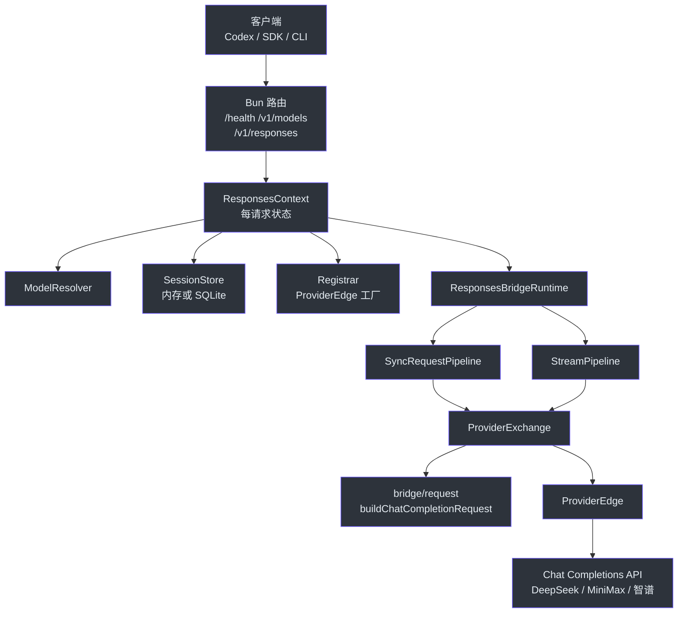
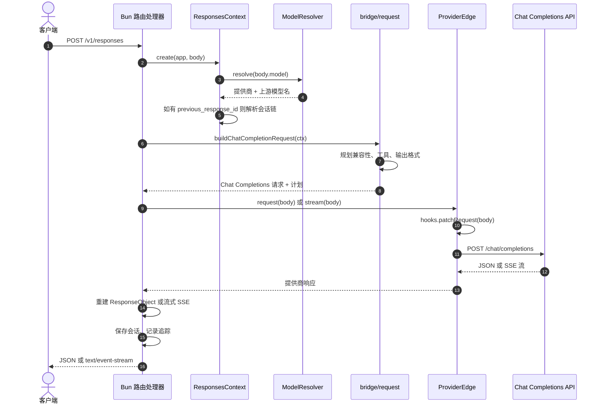
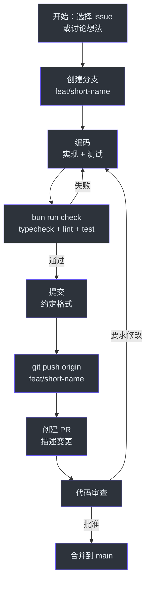

# 贡献者指南

本指南带你从克隆 GodeX 到提交第一个 Pull Request。你需要熟悉 TypeScript 或 JavaScript，以及基本的 HTTP/REST 知识。

## 第一部分：基础

### TypeScript 速查（面向 JavaScript 工程师）

GodeX 使用 TypeScript 在 Bun 上运行。如果你熟悉 JavaScript，关键区别如下：

| 概念 | JavaScript | TypeScript |
|------|-----------|------------|
| 类型注解 | 无 | `const x: string = "hello"` |
| 接口 | 不适用 | `interface User { name: string; age?: number }` |
| 联合类型 | 不适用 | `type Result = Success \| Error` |
| 泛型 | 不适用 | `function first<T>(arr: T[]): T \| undefined` |
| 只读 | `Object.freeze()` | `interface Config { readonly port: number }` |

GodeX 大量使用 `readonly` 接口保证不可变性，以及可辨识联合类型定义协议。示例：

```typescript
// 可辨识联合 — 通过 `type` 字段收窄
type ResponseStreamEvent =
  | { type: "response.created"; response: ResponseObject }
  | { type: "response.output_text.delta"; delta: string }
  | { type: "response.completed"; response: ResponseObject };
```

### Bun 速查（面向 Node.js 工程师）

Bun 是运行时，不是 Node。关键区别：

| 功能 | Node.js | Bun |
|------|---------|-----|
| 包管理 | npm/yarn/pnpm | `bun install`（内置） |
| 测试 | jest/vitest | `bun test`（内置） |
| SQLite | better-sqlite3 | `bun:sqlite`（内置） |
| 热重载 | nodemon | `bun --hot`（内置） |
| Fetch API | node-fetch polyfill | 原生 |
| `ReadableStream` | Polyfill | 原生，零拷贝 |
| 启动时间 | ~200ms | ~10ms |

GodeX 使用 Bun 原生的 `ReadableStream` 和 `TransformStream` 构建流式管道 — 无需 polyfill 或外部库。

### OpenAI Responses API

Responses API 是 GodeX 暴露的线路协议。它与 Chat Completions 的区别：

| 方面 | Chat Completions (`/v1/chat/completions`) | Responses (`/v1/responses`) |
|------|------------------------------------------|----------------------------|
| 输入 | `messages: Message[]` | `input: string \| InputItem[]` |
| 工具 | `tools: { type: "function" }[]` | `tools: { type: "function" \| "local_shell" \| ... }[]` |
| 工具选择 | `tool_choice: "auto" \| ...` | `tool_choice: "auto" \| ...`（相同） |
| 会话 | 手动消息数组 | `previous_response_id` 链 |
| 输出 | `choices[].message` | `output: OutputItem[]` |
| 流式 | `text/event-stream` | 相同 SSE 格式，不同事件名 |

GodeX 的核心工作：接收 Responses 请求 → 翻译为 Chat Completions → 调用上游 → 翻译回来。

## 第二部分：代码库

### 全局概览

GodeX 是一个协议翻译网关。单个 Bun HTTP 服务器接收 OpenAI Responses API 调用，通过提供商适配器路由到 Chat Completions 上游。

核心实体：

| 实体 | 位置 | 职责 |
|------|------|------|
| `ProviderSpec` | `src/bridge/provider-spec/contract.ts` | 声明提供商能力和 hooks |
| `ProviderEdge` | `src/bridge/provider-spec/contract.ts` | 请求/流的运行时边界 |
| `ApplicationContext` | `src/context/application-context.ts` | 配置、会话、追踪的 DI 容器 |
| `ResponsesContext` | `src/context/responses-context.ts` | 每请求状态（模型、提供商、会话） |
| `ModelResolver` | `src/resolver/model-resolver.ts` | 模型选择器到提供商+上游模型的映射 |
| `CompatibilityPlan` | `src/bridge/compatibility/compatibility-plan.ts` | 参数适配计划 |
| `ResponseStreamStateMachine` | `src/bridge/stream/response-stream-state-machine.ts` | Chat 增量事件转 Responses SSE |

架构图：

<!-- Sources: src/context/application-context.ts, src/bridge/provider-spec/contract.ts, src/resolver/model-resolver.ts -->


### 项目结构

```
src/
├── cli/              Commander CLI（serve、config、init）
├── config/           godex.yaml 模式、环境变量插值、默认值
├── context/          ApplicationContext（DI）、ResponsesContext（每请求）
├── bridge/           与提供商无关的 Responses-to-Chat bridge 内核
│   ├── compatibility/  参数和响应格式兼容性规划
│   ├── request/        输入规范化和消息构建
│   ├── tools/          工具声明、tool_choice、身份映射
│   ├── output/         结构化输出合约规划和验证
│   ├── response/       同步 ResponseObject 重建
│   ├── stream/         流状态机和增量映射
│   ├── provider-spec/  ProviderSpec、ProviderEdge、工厂辅助
│   └── finish-reason/  提供商完成原因映射
├── providers/        提供商注册表、spec、hooks、客户端
│   ├── deepseek/      DeepSeek 提供商
│   ├── minimax/       MiniMax 提供商
│   ├── zhipu/         智谱提供商
│   ├── example/       仅 spec 的示例提供商
│   └── shared/        共享提供商工具（ChatProviderClient 等）
├── responses/        同步和流式编排管道
│   └── stream-transforms/  可组合 TransformStream 阶段
├── server/           Bun 路由（/health、/v1/models、/v1/responses）
├── resolver/         ModelResolver（模型选择器到提供商 + 模型）
├── session/          内存和 SQLite 响应会话存储
├── trace/            SQLite 追踪记录器
├── error/            GodeXError 层次与域代码
├── protocol/         OpenAI 协议类型定义
├── tools/            内置工具定义（shell、apply_patch 等）
└── e2e/              使用模拟上游的端到端测试
```

### 数据流：请求的旅程

当 `POST /v1/responses` 到达时：

<!-- Sources: src/server/routes.ts, src/context/responses-context.ts, src/responses/ -->


步骤分解：

1. **路由处理器**（`src/server/`）解析 JSON body 并验证信封格式。
2. **ResponsesContext**（`src/context/responses-context.ts`）为每个请求创建，包含已解析的模型、提供商和可选的会话链。
3. **ModelResolver**（`src/resolver/model-resolver.ts`）将客户端的模型选择器（别名、`provider/model` 或裸名称）映射到提供商名称和上游模型。
4. **Bridge 请求构建器**（`src/bridge/request/request-builder.ts`）构建 Chat Completions 请求：
   - `input-normalizer.ts` 将 Responses `input` 转换为 Chat `messages`
   - `tool-plan.ts` 规划工具降级和身份映射
   - `compatibility/planner.ts` 根据 `ProviderCapabilities` 规划参数过滤
   - `output/output-contract.ts` 规划结构化输出处理
5. **ProviderEdge**（`src/bridge/provider-spec/`）调用上游：
   - 应用 `hooks.patchRequest()` 进行提供商特定调整
   - 通过 `ChatProviderClient`（`src/providers/shared/`）发送
6. **响应重建**（`src/bridge/response/` 或 `src/bridge/stream/`）将上游响应转回 Responses 格式。
7. **流式变换**（`src/responses/stream-transforms/`）应用可组合阶段：追踪、验证输出、日志、持久化会话、诊断。
8. **Session store** 在 `store !== false` 时保存响应。

### 关键模式：ProviderSpec

每个提供商遵循相同结构。Spec 声明能力；hooks 处理提供商特有差异。

来自 [src/bridge/provider-spec/contract.ts](https://github.com/Ahoo-Wang/GodeX/blob/main/src/bridge/provider-spec/contract.ts)：

```typescript
interface ProviderSpec<TBridgeReq, TResponse, TChunk, TProviderReq> {
  readonly name: string;
  readonly protocol: ProviderProtocol;
  readonly capabilities: ProviderCapabilities;
  readonly endpoint: ProviderEndpointSpec;
  readonly auth: ProviderAuthSpec;
  readonly toolName: ToolNameCodec;
  readonly response: ChatCompletionResponseAccessor<TResponse>;
  readonly stream: ChatCompletionStreamAccessor<TChunk>;
  readonly hooks?: ProviderHooks<...>;
}
```

关键能力（来自 `src/bridge/compatibility/`）：

| 能力 | 控制内容 |
|------|---------|
| `reasoning` | 提供商是否支持推理强度 |
| `tool_choice_modes` | 支持的 tool_choice 值：`"auto"`、`"none"`、`"required"`、`"function"` |
| `response_formats` | 支持的格式：`"text"`、`"json_object"` |
| `supports_stream_usage` | 提供商是否在流块中返回 usage |
| `supports_cached_tokens` | 提供商是否在 usage 中报告缓存 token |

### 关键模式：工具身份

Codex 发送内置工具类型如 `local_shell` 和 `apply_patch`。大多数提供商只支持 `function` 类型工具。GodeX 的处理方式：

1. **降级**（`src/bridge/tools/tool-plan.ts`）：Codex 工具类型转换为 `function`，保留已知名称。
2. **声明渲染**（`src/bridge/tools/declaration-renderer.ts`）：工具定义渲染为 Chat Completions `function` 对象。
3. **身份恢复**（`src/bridge/tools/call-restorer.ts`）：当上游返回 `function` 调用时，GodeX 映射回原始 Codex 类型（如 `local_shell` → `local_shell_call` 带结构化 `action`）。

### 关键模式：流式管道

流式管道使用可组合的 `TransformStream` 阶段：

```mermaid
graph LR
  Upstream["上游 SSE<br>Chat Completions 块"] --> Bridge["Bridge 变换<br>状态机映射增量"]
  Bridge --> Validate["输出验证器<br>检查 json_object"]
  Validate --> Trace["追踪变换<br>记录事件 + usage"]
  Trace --> Log["日志变换<br>结构化日志"]
  Log --> Persist["会话持久化<br>保存完成的响应"]
  Persist --> Diag["诊断变换<br>计时和计数"]
  Diag --> SSE["SSE 编码<br>Responses 事件流"]

  style Upstream fill:#2d333b,stroke:#6d5dfc,color:#e6edf3
  style Bridge fill:#2d333b,stroke:#6d5dfc,color:#e6edf3
  style Validate fill:#2d333b,stroke:#6d5dfc,color:#e6edf3
  style Trace fill:#2d333b,stroke:#6d5dfc,color:#e6edf3
  style Log fill:#2d333b,stroke:#6d5dfc,color:#e6edf3
  style Persist fill:#2d333b,stroke:#6d5dfc,color:#e6edf3
  style Diag fill:#2d333b,stroke:#6d5dfc,color:#e6edf3
  style SSE fill:#2d333b,stroke:#6d5dfc,color:#e6edf3
```

<!-- Sources: src/responses/stream-transforms/, src/bridge/stream/response-stream-state-machine.ts -->


每个变换是独立的 `TransformStream`，通过管道串联。状态机（`ResponseStreamStateMachine`）将 Chat 增量格式转换为 Responses 增量格式。

### 关键模式：会话链

当请求包含 `previous_response_id` 时，GodeX：

1. 从会话存储（内存或 SQLite）查找已保存的响应。
2. 提取 `output` 条目和原始请求。
3. 将它们转换为 Chat Completions 消息历史。
4. 前置到当前请求的消息中。

链支持循环检测和最大深度限制，防止无限增长。会话存储通过 `src/session/` 中的 `ResponseSessionStore` 抽象。

### 错误处理

错误使用领域特定的层次结构（`src/error/`）：

| 错误类 | 域 | 触发时机 |
|--------|-----|---------|
| `GodeXError` | 基类 | 所有 GodeX 错误 |
| `ServerError` | `server` | 路由级失败（无效 JSON、未知路由） |
| `BridgeError` | `bridge` | 翻译失败（不兼容参数） |
| `ProviderError` | `provider` | 上游失败（HTTP 错误、超时） |
| `SessionError` | `session` | 链解析失败（未找到、检测到循环） |

每个错误包含结构化上下文（提供商名称、模型、上游状态）用于追踪关联。

## 第三部分：实际开发

### 开发环境搭建

| 工具 | 版本 | 安装 |
|------|------|------|
| Bun | >= 1.2 | `curl -fsSL https://bun.sh/install \| bash` |
| Git | >= 2.40 | 系统包管理器 |
| curl | 任意 | 用于手动 API 测试 |

搭建步骤：

```bash
git clone https://github.com/Ahoo-Wang/GodeX.git
cd GodeX
bun install
bun run check    # typecheck + lint + test
```

预期 `bun run check` 输出：所有检查通过，0 错误。

### 你的第一个任务：添加提供商功能标志

这个演练向现有提供商添加一个假设的 `supports_parallel_tool_calls` 能力标志。

**步骤 1**：在提供商的 `spec.ts` 中定义能力：

```typescript
// src/providers/minimax/spec.ts — 已使用 MINIMAX_SPEC_CAPABILITIES
// capabilities 对象在 hooks.ts 中定义
```

**步骤 2**：在 `hooks.ts` 中添加标志：

```typescript
// src/providers/minimax/hooks.ts
export const MINIMAX_SPEC_CAPABILITIES: ProviderCapabilities = {
  // ... 现有标志 ...
  supports_parallel_tool_calls: false,
};
```

**步骤 3**：在 bridge 兼容性规划器中使用标志：

```typescript
// src/bridge/compatibility/planner.ts
// 检查 ctx.provider.spec.capabilities.supports_parallel_tool_calls
// 如果 false，从请求中移除 parallel_tool_calls
```

**步骤 4**：编写测试：

```typescript
// 测试 parallel_tool_calls 在不支持时被移除
```

**步骤 5**：运行质量门禁：

```bash
bun run typecheck   # TypeScript 类型检查
bun run lint        # Biome lint
bun run test        # 单元和集成测试
```

**步骤 6**：使用约定格式提交：

```bash
git commit -m "feat(bridge): add supports_parallel_tool_calls capability flag"
```

### 开发工作流

<!-- Sources: package.json scripts -->


提交格式：`type(scope): description`，其中 type 为 `feat`、`fix`、`refactor`、`test`、`docs` 或 `chore`。

### 运行测试

```bash
bun run test              # 所有单元 + 集成测试（不含 e2e）
bun run test:e2e          # 模拟端到端测试
bun run test:deepseek     # DeepSeek 实时测试（需要 DEEPSEEK_API_KEY）
bun run test:minimax      # MiniMax 实时测试（需要 MINIMAX_API_KEY）
bun run test:zhipu        # 智谱实时测试（需要 ZHIPU_API_KEY）
bun run check             # typecheck + lint + test
bun run ci                # typecheck + biome ci + test + e2e
```

运行单个测试文件：

```bash
bun test src/providers/minimax/hooks.test.ts
```

运行单个测试（按名称）：

```bash
bun test -t "maps usage" src/providers/minimax/hooks.test.ts
```

### 调试指南

| 症状 | 原因 | 修复 |
|------|------|------|
| `TypeError: Cannot read properties of undefined` 在 `firstChoice()` | 提供商返回意外响应格式 | 检查提供商的 `response.firstChoice` hook — 上游可能更改了响应格式 |
| `ProviderError: upstream error (status 400)` | 发送到上游的请求无效 | 启用 `trace.capture_payload: true` 并在追踪 DB 中检查请求 payload |
| 流中途停止 | 上游关闭连接 | 检查上游速率限制；查看追踪 DB 中断开前最后一个事件 |
| `SessionError: cycle detected` | `previous_response_id` 链循环 | 会话链内置循环检测；修复客户端不要创建循环引用 |
| `BridgeError: incompatible parameter` | 客户端发送了提供商不支持的参数 | 兼容性规划器应该已移除；检查能力标志 |
| 测试失败 `ECONNREFUSED` | 模拟上游未运行 | E2e 测试会启动自己的 mock；检查端口冲突 `lsof -i :PORT` |
| `bun install` 卡住 | 网络或 registry 问题 | 尝试 `bun install --no-cache` |

### 常见陷阱

1. **不要在运行时修改 `ProviderCapabilities`。** 能力在每个提供商的 `hooks.ts` 中声明为不可变对象。Bridge 在兼容性规划期间只读取一次。

2. **不要跳过兼容性规划器。** 添加新请求参数时，始终检查是否有提供商需要移除或转换。将逻辑添加到 `src/bridge/compatibility/planner.ts`。

3. **不要忘记工具身份恢复。** 当提供商返回工具调用时，bridge 必须恢复 Codex 特定类型（如 `local_shell_call`）。如果添加新的内置工具类型，更新 `src/bridge/tools/tool-identity.ts` 和 `src/bridge/tools/call-restorer.ts`。

4. **不要硬编码提供商 URL。** 使用 `spec.endpoint.defaultBaseURL` 作为回退，但始终允许配置通过 `providers.<name>.endpoint.base_url` 覆盖。

5. **不要在 `src/bridge/` 中写提供商特定逻辑。** Bridge 内核是与提供商无关的。提供商差异放在 `src/providers/<name>/hooks.ts`。如果多个提供商需要相同逻辑，考虑在 `src/providers/shared/` 添加共享工具。

6. **不要忘记 e2e 测试。** 添加提供商功能时，在 `src/e2e/<provider>.e2e.test.ts` 中添加模拟 e2e 测试。这些测试启动模拟上游和真实的 GodeX 服务器。

## 附录

### 术语表

| 术语 | 定义 |
|------|------|
| **Bridge** | 在 Responses 和 Chat Completions 协议之间翻译的内核 |
| **兼容性计划** | 关于给定提供商应移除或转换哪些参数的决策 |
| **ProviderEdge** | 包装 ProviderSpec 和 HTTP 客户端方法的运行时边界 |
| **ProviderSpec** | 提供商能力和 hooks 的不可变声明 |
| **ProviderCapabilities** | 描述提供商支持什么的功能标志 |
| **Registrar** | 将提供商名称映射到 ProviderEdge 工厂的注册表 |
| **ModelResolver** | 将客户端模型选择器映射到提供商 + 上游模型 |
| **会话链** | 通过 `previous_response_id` 连接的响应链表 |
| **Session Store** | 会话链的持久化后端（内存或 SQLite） |
| **Trace DB** | 记录请求/响应元数据和事件的 SQLite 数据库 |
| **工具降级** | 将 Codex 内置工具类型转换为通用 `function` 类型 |
| **工具身份恢复** | 将提供商函数调用映射回 Codex 工具类型 |
| **ToolNameCodec** | 在 Codex 和提供商之间编码/解码工具名称的接口 |
| **ResponseStreamStateMachine** | 将 Chat 增量事件转换为 Responses SSE 事件的状态机 |
| **输入规范化器** | 将 Responses `input` 条目转换为 Chat `messages` |
| **输出验证器** | 验证结构化输出（JSON 语法检查） |
| **ApplicationContext** | 持有配置、会话存储、追踪记录器、日志器的 DI 容器 |
| **ResponsesContext** | 包含已解析模型、提供商、会话、诊断的每请求上下文 |
| **ChatProviderClient** | 调用 Chat Completions 上游的共享 HTTP 客户端 |
| **GodeXError** | 带有域代码、消息和结构化上下文的基错误类 |
| **SSE** | Server-Sent Events — 用于流式传输的 text/event-stream 协议 |
| **增量 (Delta)** | 流式响应中的增量文本或事件片段 |
| **完成原因 (Finish Reason)** | 模型停止生成的原因：`stop`、`tool_calls`、`length` |
| **Bun** | GodeX 使用的 JavaScript/TypeScript 运行时（Node.js 的替代品） |
| **TransformStream** | Web Streams API 中用于通过处理阶段管道传输数据的原语 |
| **只读 (Readonly)** | TypeScript 防止修改对象属性的修饰符 |
| **可辨识联合** | 通过公共属性（如 `type` 字段）收窄的类型联合 |
| **桶导出 (Barrel Export)** | 从兄弟模块重新导出的 `index.ts` 文件 |
| **协议类型** | 定义线路格式的 TypeScript 接口 |
| **Hook** | 用于修补请求、规范化响应的提供商特定函数 |
| **模拟上游** | e2e 测试中使用的假 Chat Completions 服务器 |

### 关键文件参考

| 路径 | 用途 | 重要原因 |
|------|------|---------|
| [src/bridge/provider-spec/contract.ts](https://github.com/Ahoo-Wang/GodeX/blob/main/src/bridge/provider-spec/contract.ts) | `ProviderSpec` 和 `ProviderEdge` 接口 | 每个提供商实现的核心抽象 |
| [src/bridge/provider-spec/factory.ts](https://github.com/Ahoo-Wang/GodeX/blob/main/src/bridge/provider-spec/factory.ts) | `createProviderEdge()` 工厂 | 从 spec 创建运行时边界 |
| [src/bridge/compatibility/planner.ts](https://github.com/Ahoo-Wang/GodeX/blob/main/src/bridge/compatibility/planner.ts) | `planCompatibility()` | 按提供商决定参数过滤 |
| [src/bridge/request/request-builder.ts](https://github.com/Ahoo-Wang/GodeX/blob/main/src/bridge/request/request-builder.ts) | `buildChatCompletionRequest()` | 主 bridge 入口：Responses → Chat |
| [src/bridge/request/input-normalizer.ts](https://github.com/Ahoo-Wang/GodeX/blob/main/src/bridge/request/input-normalizer.ts) | 输入规范化 | 将 Responses input 转换为 messages |
| [src/bridge/tools/tool-plan.ts](https://github.com/Ahoo-Wang/GodeX/blob/main/src/bridge/tools/tool-plan.ts) | 工具规划 | 处理工具降级和映射 |
| [src/bridge/tools/call-restorer.ts](https://github.com/Ahoo-Wang/GodeX/blob/main/src/bridge/tools/call-restorer.ts) | 调用恢复 | 从提供商调用恢复 Codex 工具类型 |
| [src/bridge/response/response-reconstructor.ts](https://github.com/Ahoo-Wang/GodeX/blob/main/src/bridge/response/response-reconstructor.ts) | 同步响应重建 | Chat 响应 → Responses 对象 |
| [src/bridge/stream/response-stream-state-machine.ts](https://github.com/Ahoo-Wang/GodeX/blob/main/src/bridge/stream/response-stream-state-machine.ts) | 流状态机 | 将 Chat 增量转换为 Responses SSE |
| [src/context/application-context.ts](https://github.com/Ahoo-Wang/GodeX/blob/main/src/context/application-context.ts) | `ApplicationContext` | DI 容器，应用级单例 |
| [src/context/responses-context.ts](https://github.com/Ahoo-Wang/GodeX/blob/main/src/context/responses-context.ts) | `ResponsesContext` | 每请求状态工厂 |
| [src/resolver/model-resolver.ts](https://github.com/Ahoo-Wang/GodeX/blob/main/src/resolver/model-resolver.ts) | `ModelResolver` | 模型别名和提供商解析 |
| [src/session/](https://github.com/Ahoo-Wang/GodeX/blob/main/src/session/) | 会话存储 | 内存和 SQLite 后端 |
| [src/trace/](https://github.com/Ahoo-Wang/GodeX/blob/main/src/trace/) | 追踪记录器 | 基于 SQLite 的请求/响应追踪 |
| [src/server/](https://github.com/Ahoo-Wang/GodeX/blob/main/src/server/) | 路由处理器 | `/health`、`/v1/models`、`/v1/responses` |
| [src/providers/minimax/spec.ts](https://github.com/Ahoo-Wang/GodeX/blob/main/src/providers/minimax/spec.ts) | MiniMax 提供商 spec | 完整提供商 spec 示例 |

### 快速参考卡

```bash
# 开发
bun install                    # 安装依赖
bun run dev                    # 端口 13145 热重载服务器
bun run start                  # 从源码启动服务器

# 质量门禁
bun run typecheck              # TypeScript 类型检查
bun run lint                   # Biome lint
bun run lint:fix               # Biome 自动修复
bun run format                 # Biome 格式化
bun run test                   # 单元 + 集成测试
bun run test:e2e               # 模拟 e2e 测试
bun run check                  # typecheck + lint + test
bun run ci                     # typecheck + biome ci + test + e2e

# 单个测试
bun test src/path/to/file.test.ts
bun test -t "测试名称模式"

# 构建
bun run build                  # 当前平台二进制
bun run compile:all            # 交叉编译所有平台

# 手动 API 测试
curl http://localhost:5678/health
curl http://localhost:5678/v1/models
curl http://localhost:5678/v1/responses \
  -H 'content-type: application/json' \
  -d '{"model":"deepseek/deepseek-v4-pro","input":"Hello"}'
```

[架构师指南](./staff-engineer-guide.md) — 深入架构理解。
