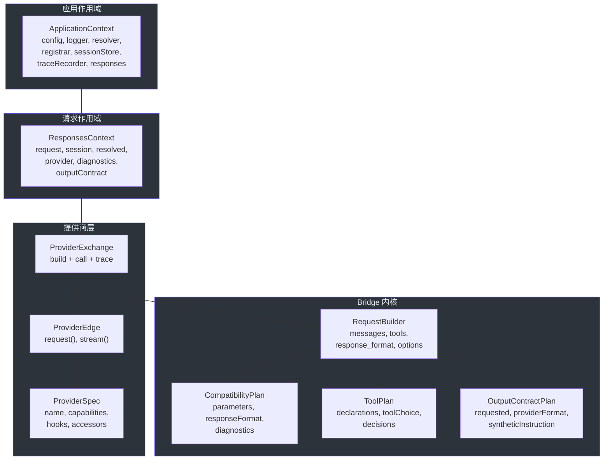
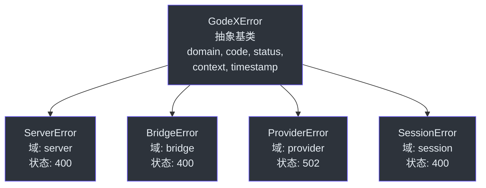

# 贡献者指南

欢迎来到 GodeX。本指南将带你从零了解代码库到提交第一个 Pull Request。它面向熟悉 TypeScript 或 JavaScript 和 HTTP API 但可能还不了解 GodeX 领域、Bun 运行时或此处使用的架构模式的工程师。

---

## 第一部分：语言和框架基础

### 1.1 TypeScript 严格模式和 ESNext

GodeX 使用严格模式的 TypeScript，目标为 ESNext，使用 ESM 模块。[tsconfig.json](https://github.com/Ahoo-Wang/GodeX/blob/main/tsconfig.json) 启用了这些标志：

| 标志 | 效果 |
|------|------|
| `"strict": true` | 启用所有严格类型检查选项 |
| `"target": "ESNext"` | 面向最新的 ECMAScript 特性 |
| `"module": "Preserve"` | 保持 import/export 语法原样（ESM） |
| `"moduleResolution": "bundler"` | 以 Bun 的方式解析模块 |
| `"verbatimModuleSyntax": true` | 要求纯类型导入使用显式 `import type` |
| `"noUncheckedIndexedAccess": true` | 数组/对象索引访问返回 `T \| undefined` |
| `"noImplicitOverride": true` | 覆盖成员必须使用 `override` 关键字 |
| `"noFallthroughCasesInSwitch": true` | 每个 switch case 必须以 break/return/throw 结束 |

对贡献者影响最大的规则是 `verbatimModuleSyntax`。当你导入一个类型、接口或任何只存在于编译时的东西时，必须写 `import type`：

```typescript
// 正确 — 纯类型导入
import type { ProviderCapabilities } from "../compatibility";
import type { ResponseObject } from "../protocol/openai/responses";

// 错误 — 运行时或构建时会失败
import { ProviderCapabilities } from "../compatibility";
```

另一个影响较大的规则是 `noUncheckedIndexedAccess`。当你索引数组或对象时，结果可能为 `undefined`：

```typescript
const items: string[] = ["a", "b", "c"];
const first = items[0]; // 类型：string | undefined，不是 string
```

你必须处理 `undefined` 情况。这对新贡献者来说是最常见的类型检查错误来源。

### 1.2 Bun 运行时（不是 Node.js）

GodeX 在 [Bun](https://bun.sh/) 上运行，而不是 Node.js。Bun 是一个快速的 JavaScript/TypeScript 运行时，内置包管理器、测试运行器、打包器和内置 API。最重要的区别是 Bun 原生支持 `ReadableStream`、`TransformStream`、`Response`、`Request` 和 `fetch` — 无需 polyfill。

如果你来自 Node.js，这里是对照参考：

| 你知道的（Node.js） | 在 Bun 中 |
|---------------------|--------|
| `npm install` | `bun install` |
| `jest` 或 `vitest` | `bun test`（内置，[Bun 测试运行器](https://github.com/Ahoo-Wang/GodeX/blob/main/package.json)） |
| `better-sqlite3` | `bun:sqlite`（内置） |
| `nodemon` | `bun --hot`（内置） |
| `node-fetch` | 原生 `fetch` |
| `stream.Readable` | 原生 `ReadableStream` |
| `express` 或 `fastify` | Bun 内置的 `Bun.serve()` |
| `ts-node` 或 `tsx` | Bun 原生运行 TypeScript |
| `esbuild` 或 `webpack` | Bun 原生打包 |
| `child_process.spawn` | `Bun.spawn()` |

如果你了解 Go，对比更简单：

| 你知道的（Go） | 在 GodeX 中（Bun/TypeScript） |
|---------------|---------------------------|
| `go test ./...` | `bun test` |
| `go run main.go` | `bun src/index.ts` |
| `go build` | `bun run build` |
| `database/sql` + 驱动 | `bun:sqlite` |
| `net/http` | `Bun.serve()` |
| `context.Context` | `ApplicationContext` / `ResponsesContext` |
| `interface { ServeHTTP(...) }` | `ProviderEdge` 接口 |
| `io.Reader` | `ReadableStream` |
| `fmt.Errorf("... %w", err)` | `new BridgeError(code, msg, ctx, { cause: err })` |

如果你了解 Python：

| 你知道的（Python） | 在 GodeX 中（Bun/TypeScript） |
|-------------------|---------------------------|
| `pytest` | `bun test` |
| `typing.Protocol` | TypeScript `interface` |
| `dataclass(frozen=True)` | `readonly` 接口字段 |
| `asyncio` | Bun 原生 async/await |
| `sqlite3` stdlib | `bun:sqlite` |
| `FastAPI` | `Bun.serve()` 带路由处理器 |

Bun 的测试运行器使用 `describe`、`test`、`expect`、`beforeEach` 和 `afterEach` — 任何用过 Jest 或 Vitest 的人都很熟悉。测试以 `*.test.ts` 文件与它们测试的源码同位置。

### 1.3 Biome 用于格式化和代码检查

GodeX 使用 [Biome](https://biomejs.dev/) 进行格式化和代码检查。配置在 [biome.json](https://github.com/Ahoo-Wang/GodeX/blob/main/biome.json) 中。关键约定：

- **Tab** 缩进（不是空格）。
- **有组织的导入** — Biome 通过 `assist` 功能自动组织 import 语句。
- **推荐规则** 已启用，并有少量项目特定的覆盖（例如，`noTemplateCurlyInString` 关闭，因为配置文件使用 `${ENV_VAR}` 插值）。

经常运行这些命令：

| 命令 | 用途 |
|------|------|
| `bun run lint` | 检查 lint 错误 |
| `bun run lint:fix` | 自动修复 lint 错误 |
| `bun run format` | 自动格式化代码 |
| `bun run typecheck` | 运行 TypeScript 类型检查 |

提交前始终运行 `bun run check`。这同时运行 typecheck、lint 和测试。

### 1.4 Commander.js 用于 CLI

GodeX 使用 [Commander.js](https://github.com/tj/commander.js) 作为命令行界面。CLI 位于 `src/cli/`。关键命令：

- `godex serve --config ./godex.yaml` — 启动网关服务器
- `godex init` — 交互式创建 `godex.yaml`
- `godex config check` — 验证配置文件
- `godex config print` — 打印解析后的配置

CLI 模块解析参数、读取配置文件、创建 `ApplicationContext` 并启动 Bun HTTP 服务器。CLI 还通过 `@clack/prompts` 为 `init` 向导提供交互式提示。

### 1.5 LogTape 用于结构化日志

GodeX 使用 [LogTape](https://github.com/robot-love/logtape) 进行结构化日志。日志器通过工厂创建并附加到 `ApplicationContext`。日志消息使用命名空间字符串如 `"providers.built"` 或 `"session.save.error"` 和结构化内容对象。

日志模块（[src/logger/](https://github.com/Ahoo-Wang/GodeX/blob/main/src/logger)）支持可配置的日志级别和接收器（控制台、文件）。`Logger` 接口定义在 [src/logger/contract.ts](https://github.com/Ahoo-Wang/GodeX/blob/main/src/logger/contract.ts)。

日志消息使用惰性求值 — 内容包装在 thunk 函数中，只有在日志级别激活时才计算：

```typescript
ctx.logger.info("responses.request.completed", () => ({
  status: response.status,
  model: response.model,
  usage: response.usage,
}));
```

---

## 第二部分：此代码库的架构和领域模型

### 2.1 GodeX 做什么

GodeX 是一个 API 网关，将 OpenAI 的 **Responses API** 翻译为提供商特定的 **Chat Completions API** 调用。它不是代理 — 它在两个根本不同的 API 表面之间主动翻译。

Responses API 是 OpenAI 较新的对话式 AI API。它使用 `previous_response_id` 进行多轮对话、通过 `text.format` 实现结构化输出，以及 `function`、`shell`、`apply_patch` 和 `custom` 等工具类型。然而，大多数 LLM 提供商仅支持较旧的 Chat Completions API，后者使用扁平的 `messages` 数组、`function` 工具和 `response_format` 进行结构化输出。

GodeX 弥合了这个差距。当客户端发送 Responses API 请求时，GodeX：

1. 解析哪个提供商处理请求的模型
2. 如果提供了 `previous_response_id` 则解析会话历史
3. 规划兼容性 — 提供商支持什么、什么必须降级、什么必须拒绝
4. 规划工具声明 — 将 Responses 工具类型映射为 Chat Completions 工具类型
5. 规划输出合约 — 处理提供商仅支持 `json_object` 时的 `json_schema`
6. 从翻译后的输入构建 Chat Completions 请求
7. 调用上游提供商
8. 从 Chat Completions 响应重建 Responses API 响应
9. 持久化会话并记录追踪

### 2.2 领域词汇

| 术语 | 定义 |
|------|------|
| **Responses API** | OpenAI 的对话式 AI API。使用 `ResponseObject`、`ResponseCreateRequest`、`previous_response_id` 和类型化工具调用。 |
| **Chat Completions API** | 较旧的、广泛支持的 API。使用 `messages`、`function` 工具、`response_format` 和流式 SSE 块。 |
| **ProviderSpec** | 声明提供商能力、端点、认证、工具编解码器、响应访问器、流访问器和 hooks 的类型化契约。定义在 [src/bridge/provider-spec/contract.ts](https://github.com/Ahoo-Wang/GodeX/blob/main/src/bridge/provider-spec/contract.ts)。 |
| **ProviderEdge** | ProviderSpec 周围的可调用包装器。有 `request()` 和 `stream()` 方法用于调用上游提供商。 |
| **Bridge** | `src/bridge/` 中的核心翻译逻辑。将 Responses API 语义转换为 Chat Completions 语义 — 以及反向。 |
| **兼容性计划 (Compatibility Plan)** | 提供商支持、降级、忽略或拒绝什么的每请求分析。由 `planBridgeCompatibility` 生成。 |
| **工具计划 (Tool Plan)** | 工具声明、tool_choice、降级、身份映射和调用恢复的每请求计划。由 `planTools` 生成。 |
| **输出合约 (Output Contract)** | 结构化输出的每请求计划。处理带合成指令和后验证的 `json_schema` 到 `json_object` 降级。由 `planOutputContract` 生成。 |
| **会话链 (Session Chain)** | 通过 `previous_response_id` 父指针连接的 `StoredResponseSession` 条目链表。由 `ResponseSessionStore.resolveChain` 解析。 |
| **追踪 (Trace)** | 基于 SQLite 的请求、usage、事件和错误记录，用于可观测性。 |
| **注册器 (Registrar)** | 将提供商名称映射到工厂并解析 `ProviderEdge` 实例的注册表。 |
| **模型解析器 (Model Resolver)** | 将模型别名解析为 `{ provider, model }` 对。处理裸模型名和 `provider/model` 选择器。 |
| **ApplicationContext** | 应用作用域容器，持有配置、日志、解析器、注册器、会话存储、追踪记录器和 bridge 运行时。 |
| **ResponsesContext** | 每请求上下文，持有请求、已解析模型、提供商边界、会话快照、诊断和输出合约槽位。 |
| **诊断 (Diagnostic)** | 附加到请求的结构化兼容性警告或错误。携带代码、严重级别、路径、操作、消息和元数据。 |
| **增量 (Delta)** | 来自提供商的规范化流式数据单元。包含文本、推理、拒绝、工具调用、usage、完成原因或错误字段。 |
| **流状态机 (Stream State Machine)** | 将提供商增量映射为 Responses SSE 生命周期事件的有状态处理器。 |

### 2.3 目录布局

```
src/
  cli/                Commander CLI、命令、init 向导、运行时配置
    errors/           CLI 特定错误类型
  config/             godex.yaml 解析、默认值、验证、环境变量插值
  context/            ApplicationContext 和请求作用域的 ResponsesContext
  bridge/             与提供商无关的 Responses-to-Chat 翻译内核
    compatibility/    功能支持规划和诊断
    request/          输入规范化和 Chat Completions 请求构建
    tools/            工具声明规划、身份映射、调用恢复
    output/           结构化输出合约和验证
    response/         从提供商响应同步重建 ResponseObject
    stream/           流式状态机和增量到事件映射
    provider-spec/    ProviderSpec、ProviderEdge 契约和工厂
    finish-reason/    提供商完成原因到 Responses 状态映射
  providers/          提供商注册表、spec、客户端、hooks、协议 DTO
    deepseek/         DeepSeek 提供商（spec、client、hooks、protocol）
    xiaomi/           Xiaomi 提供商（spec、client、hooks、protocol）
    zhipu/            智谱提供商（spec、client、hooks、protocol）
    minimax/          MiniMax 提供商（spec、client、hooks、protocol）
    shared/           共享提供商工具（ChatProviderClient、ChatApi）
    example/          Spec 示例模板（不是运行时提供商）
  responses/          同步和流式编排管道
    stream-transforms/ 流式传输的可组合 TransformStream 阶段
  server/             Bun 路由：/health、/v1/models、/v1/responses
    routes/
      responses/      主 /v1/responses 路由处理器、解析器、分发器、SSE 编码器
  resolver/           模型选择器和别名解析
  session/            previous_response_id 的内存和 SQLite 会话存储
  trace/              请求、usage、事件、错误的 SQLite 追踪记录
  logger/             基于 LogTape 的结构化日志配置
  error/              GodeXError 层次和域代码
  protocol/           OpenAI 协议类型定义
    openai/
      responses/      Responses API 类型（ResponseObject、ResponseCreateRequest、items、tools）
      completions/    Chat Completions API 类型（ChatCompletion、ChatCompletionCreateRequest）
      shared/         共享类型（ResponseFormat、ResponseError）
  tools/              Codex 内置工具定义（shell、apply_patch、local_shell 等）
  testing/            共享测试提供商工具
```

### 2.4 核心类型关系

系统有分层的类型架构。顶层是应用作用域；底层是提供商调用。



流程为：`ApplicationContext` 在启动时创建一次。对于每个请求，创建一个 `ResponsesContext`。`ProviderExchange` 使用 bridge 内核（`compatibility`、`tools`、`output`、`request`）构建 Chat Completions 请求，然后调用 `ProviderEdge`。`ProviderEdge` 委托给其 `ProviderSpec` 的 hooks 和访问器。

### 2.5 Bridge 内核：为什么这是最难的问题

[src/bridge/](https://github.com/Ahoo-Wang/GodeX/blob/main/src/bridge) 中的 bridge 内核是 GodeX 的心脏。它解决了在两个从未设计为兼容的 API 表面之间翻译的根本问题。

**多轮语义不同。** Responses API 使用 `previous_response_id` — 一个指向服务器存储的过去响应的指针。Chat Completions API 使用客户端每次发送的扁平 `messages` 数组。GodeX 必须解析会话链，将其扁平化为 API 形状的输入项，规范化为 Chat Completions 消息，并附加当前输入。[src/bridge/request/input-normalizer.ts](https://github.com/Ahoo-Wang/GodeX/blob/main/src/bridge/request/input-normalizer.ts) 中的规范化逻辑处理每种项类型：消息、函数调用、函数调用输出、shell 调用、shell 调用输出、local shell 调用、apply patch 调用、自定义工具调用和推理项。带有工具调用的相邻助手消息由 [src/bridge/request/message-builder.ts](https://github.com/Ahoo-Wang/GodeX/blob/main/src/bridge/request/message-builder.ts) 合并，以产生有效的 Chat Completions 消息序列。

**工具类型不同。** Responses API 支持 `function`、`shell`、`apply_patch`、`custom`、`mcp`、`tool_search` 和 `namespace` 工具。Chat Completions 仅支持 `function` 工具。GodeX 必须规划哪些工具类型原生支持、哪些降级为 `function`、哪些必须拒绝。[src/bridge/tools/declaration-renderer.ts](https://github.com/Ahoo-Wang/GodeX/blob/main/src/bridge/tools/declaration-renderer.ts) 中的工具声明渲染器为每个降级的工具类型生成正确的函数声明，包括指示模型如何使用降级接口的自定义工具描述。[src/bridge/tools/call-restorer.ts](https://github.com/Ahoo-Wang/GodeX/blob/main/src/bridge/tools/call-restorer.ts) 中的工具调用恢复器反转此映射：它从提供商获取函数调用并通过查找工具身份重建原始 Responses 工具调用类型（shell_call、apply_patch_call、custom_tool_call 等）。

**输出合约不同。** Responses API 支持带严格验证的 `json_schema`。许多提供商仅支持 `json_object`（仅表示"返回 JSON"）。GodeX 必须将 `json_schema` 降级为 `json_object`，注入带 schema 的合成系统指令，并在事后验证输出 JSON。

**流式传输是状态机。** Responses 流式 API 发出结构化事件（`response.created`、`response.output_text.delta`、`response.completed`）。提供商 SSE 块没有这样的结构。GodeX 必须维护跟踪消息块、工具调用块和推理块的状态机 — 并发出正确序列的 Responses 事件，包括在所有活动块关闭后才发出的终端事件。

bridge 内核是与提供商无关的。它永远不导入提供商特定代码。它完全针对 `ProviderSpec` 接口操作。这是关键架构不变量：添加新提供商不需要对 bridge 内核做任何修改。

### 2.6 会话模型：父指针链

会话模型使用**父指针链**，不是可变对话游标。每个 `StoredResponseSession` 有一个 `previous_response_id` 字段指向其父节点。此设计：

- **允许分支。** 多个响应可以引用同一个父节点，实现对话分支。
- **不可变。** 一旦存储，会话快照永远不被修改。新轮次被追加。
- **需要链解析。** 当提供 `previous_response_id` 时，GodeX 从最新到最旧跟随父指针，沿路收集轮次。

会话存储（[src/session/](https://github.com/Ahoo-Wang/GodeX/blob/main/src/session)）处理：

- 带循环检测的链遍历
- 最大深度强制以防止无限链
- 状态过滤（跳过不完整的响应）
- 保存时的冲突检测

`ResponseSessionStore` 接口定义了契约：

| 方法 | 用途 |
|------|------|
| `get(responseId)` | 按 ID 返回一个存储的响应，或 null |
| `save(session, options?)` | 生成后持久化响应快照 |
| `resolveChain(id, options?)` | 解析从最旧到最新排序的父链 |
| `delete(responseId)` | 删除一个响应快照 |
| `close()` | 释放此存储持有的资源 |

会话存储必须保持 **API 形状快照** — 存储的数据镜像 Responses API 类型。提供商特定的 Chat Completions 转换属于 bridge，不属于会话存储。这种分离很关键：如果转换逻辑变更，存储的会话必须仍然可解释。

支持两种后端：`memory`（进程内 map）和 `sqlite`（持久化）。后端在 `godex.yaml` 的 `session.backend` 中配置。

### 2.7 提供商模式：Spec + Client + Hooks + 协议 DTO

每个提供商遵循 [src/providers/](https://github.com/Ahoo-Wang/GodeX/blob/main/src/providers) 中定义的一致结构：

```
src/providers/<name>/
  spec.ts       能力、端点、认证、工具编解码器、访问器、hooks
  client.ts     create<Name>ProviderEdge(config)
  hooks.ts      提供商特定的请求补丁、usage、完成原因、流增量
  protocol/     提供商特定的 Chat Completions DTO
  index.ts      桶导出
```

**ProviderSpec**（[src/bridge/provider-spec/contract.ts](https://github.com/Ahoo-Wang/GodeX/blob/main/src/bridge/provider-spec/contract.ts)）是核心契约。它声明：

| 字段 | 类型 | 用途 |
|------|------|------|
| `name` | `string` | 提供商标识符（如 `"deepseek"`） |
| `protocol` | `"chat_completions"` | 总是 `CHAT_COMPLETIONS_PROTOCOL` |
| `capabilities` | `ProviderCapabilities` | 提供商支持什么 |
| `endpoint` | `{ defaultBaseURL }` | 默认基础 URL |
| `auth` | `{ scheme: "bearer" }` | 认证方案（总是 `BEARER_AUTH`） |
| `toolName` | `ToolNameCodec` | 双向名称映射 |
| `response` | `ChatCompletionResponseAccessor` | 同步响应数据的访问器 |
| `stream` | `ChatCompletionStreamAccessor` | SSE 块增量的访问器 |
| `hooks` | `ProviderHooks` | 可选的提供商特定补丁 |

`ProviderCapabilities` 类型声明提供商支持什么：

| 能力字段 | 类型 | 控制 |
|---------|------|------|
| `parameters.supported` | `Set<string>` | 转发哪些请求参数（如 `"stream"`、`"temperature"`、`"max_output_tokens"`） |
| `tools.supported` | `Set<string>` | 原生处理哪些工具类型（如 `"function"`） |
| `tools.degraded` | `Map<string, string>` | 工具类型降级映射（如 `"shell"` 映射为 `"function"`） |
| `tools.maxTools` | `number?` | 最大工具声明数量 |
| `toolChoice.supported` | `Set<string>` | 支持哪些 tool_choice 模式（如 `"auto"`、`"required"`、`"function"`） |
| `responseFormats.supported` | `Set<string>` | 支持哪些响应格式（如 `"text"`、`"json_object"`） |
| `reasoning.effort` | `"none" \| "boolean" \| "native"` | 推理强度的处理方式 |
| `streaming.usage` | `boolean` | 提供商是否在流中返回 usage |

**ProviderEdge** 是可调用的包装器。它有两个方法：

- `request(body)` — 发送同步 Chat Completions 请求
- `stream(body)` — 发送流式 Chat Completions 请求，返回 `ReadableStream<JsonServerSentEvent>`

**hooks** 是 bridge 在特定点调用的可选函数：

| Hook | 签名 | 用途 |
|------|------|------|
| `patchRequest` | `(bridgeRequest) -> providerRequest` | 将 bridge 构建的请求转换为提供商的格式 |
| `normalizeResponse` | `(response) -> response` | 在 bridge 处理之前规范化提供商响应 |
| `normalizeChunk` | `(chunk) -> chunk` | 在增量提取之前规范化提供商 SSE 块 |

`patchRequest` hook 是最常用的。例如，DeepSeek 在 [src/providers/deepseek/hooks.ts](https://github.com/Ahoo-Wang/GodeX/blob/main/src/providers/deepseek/hooks.ts) 的 hook 为启用推理的请求添加 `thinking` 字段：

**协议 DTO** 是定义提供商特定的 Chat Completions 请求和响应形状的 TypeScript 接口。例如，DeepSeek 有自己的 `ChatCompletionRequest` 类型，添加了 `thinking` 和 `reasoning_effort` 字段。这些类型位于 `src/providers/<name>/protocol/`。

### 2.8 错误层次

GodeX 使用 [src/error/](https://github.com/Ahoo-Wang/GodeX/blob/main/src/error) 中定义的结构化错误层次。所有预期运行时失败使用域特定的错误类：



| 错误类 | 域 | 使用时机 | 默认状态 |
|--------|-----|---------|---------|
| `ServerError` | `server` | 路由/请求/配置验证失败 | 400 |
| `BridgeError` | `bridge` | Responses-to-Chat 兼容性和重建错误 | 400 |
| `ProviderError` | `provider` | 上游 HTTP/fetch 失败 | 502 |
| `SessionError` | `session` | 会话链和持久化错误 | 400 |

每个 `GodeXError` 携带结构化上下文：

- `domain` — 哪个子系统产生了错误
- `code` — 点分隔的字符串，如 `"bridge.stream.invalid_transition"`
- `status` — 要返回的 HTTP 状态码
- `context` — 带域特定字段（如 `provider`、`model`、`parameter`）的类型化记录
- `timestamp` — 错误创建时间

所有错误代码在 [src/error/codes.ts](https://github.com/Ahoo-Wang/GodeX/blob/main/src/error/codes.ts) 中定义为字符串常量：

| 域 | 示例代码 |
|------|---------|
| bridge | `bridge.request.unsupported_parameter`、`bridge.request.tool_skipped`、`bridge.request.unsupported_input_item`、`bridge.request.unsupported_input_content`、`bridge.request.unsupported_tool`、`bridge.response.invalid_output_format`、`bridge.stream.not_initialized`、`bridge.stream.already_initialized`、`bridge.stream.invalid_transition`、`bridge.stream.output_before_start`、`bridge.stream.delta_after_terminal`、`bridge.stream.missing_options`、`bridge.stream.missing_output_block`、`bridge.stream.incomplete_tool_call` |
| provider | `provider.upstream.rate_limit`、`provider.upstream.timeout`、`provider.upstream.server_error`、`provider.upstream.error` |
| session | `session.chain.not_found`、`session.chain.cycle_detected`、`session.chain.depth_exceeded`、`session.chain.unavailable`、`session.store.conflict` |
| server | `server.request.invalid_json`、`server.request.missing_model`、`server.request.invalid_parameter`、`server.provider.not_registered`、`server_error` |

**规则：** 永远不要对预期运行时失败抛出原始 `Error`。始终使用带正确域代码的适当 `GodeXError` 子类。

### 2.9 关键文件参考

| 文件 | 描述 |
|------|------|
| [src/index.ts](https://github.com/Ahoo-Wang/GodeX/blob/main/src/index.ts) | 入口点 — 运行 CLI |
| [src/context/application-context.ts](https://github.com/Ahoo-Wang/GodeX/blob/main/src/context/application-context.ts) | 应用作用域容器：配置、日志、解析器、注册器、会话存储、追踪记录器 |
| [src/context/responses-context.ts](https://github.com/Ahoo-Wang/GodeX/blob/main/src/context/responses-context.ts) | 每请求上下文：请求、会话、已解析模型、提供商、诊断、输出合约 |
| [src/bridge/provider-spec/contract.ts](https://github.com/Ahoo-Wang/GodeX/blob/main/src/bridge/provider-spec/contract.ts) | 核心接口：`ProviderSpec`、`ProviderEdge`、`ProviderHooks`、访问器 |
| [src/bridge/compatibility/planner.ts](https://github.com/Ahoo-Wang/GodeX/blob/main/src/bridge/compatibility/planner.ts) | 兼容性规划 — 什么是 supported、degraded、ignored、rejected |
| [src/bridge/compatibility/compatibility-plan.ts](https://github.com/Ahoo-Wang/GodeX/blob/main/src/bridge/compatibility/compatibility-plan.ts) | `ProviderCapabilities`、`CompatibilityPlan`、`CompatibilityDecision` 类型 |
| [src/bridge/tools/tool-plan.ts](https://github.com/Ahoo-Wang/GodeX/blob/main/src/bridge/tools/tool-plan.ts) | 工具声明规划、tool_choice 映射、身份分配 |
| [src/bridge/tools/tool-identity.ts](https://github.com/Ahoo-Wang/GodeX/blob/main/src/bridge/tools/tool-identity.ts) | 工具名称身份映射和 `ToolIdentityMap` |
| [src/bridge/tools/call-restorer.ts](https://github.com/Ahoo-Wang/GodeX/blob/main/src/bridge/tools/call-restorer.ts) | 工具调用重建 — 将函数调用转回 shell_call、apply_patch_call 等 |
| [src/bridge/tools/declaration-renderer.ts](https://github.com/Ahoo-Wang/GodeX/blob/main/src/bridge/tools/declaration-renderer.ts) | 降级工具类型的工具声明渲染 |
| [src/bridge/tools/custom-tool-degradation.ts](https://github.com/Ahoo-Wang/GodeX/blob/main/src/bridge/tools/custom-tool-degradation.ts) | 自定义工具降级描述和参数 |
| [src/bridge/output/output-contract.ts](https://github.com/Ahoo-Wang/GodeX/blob/main/src/bridge/output/output-contract.ts) | 结构化输出规划 — `json_schema` 到 `json_object` 降级 |
| [src/bridge/output/output-validator.ts](https://github.com/Ahoo-Wang/GodeX/blob/main/src/bridge/output/output-validator.ts) | 降级输出合约的响应后 JSON 验证 |
| [src/bridge/request/request-builder.ts](https://github.com/Ahoo-Wang/GodeX/blob/main/src/bridge/request/request-builder.ts) | 从 Responses API 输入构建 Chat Completions 请求 |
| [src/bridge/request/input-normalizer.ts](https://github.com/Ahoo-Wang/GodeX/blob/main/src/bridge/request/input-normalizer.ts) | Responses 输入到 Chat 消息的规范化 |
| [src/bridge/request/message-builder.ts](https://github.com/Ahoo-Wang/GodeX/blob/main/src/bridge/request/message-builder.ts) | 合并带工具调用的相邻助手消息 |
| [src/bridge/response/response-reconstructor.ts](https://github.com/Ahoo-Wang/GodeX/blob/main/src/bridge/response/response-reconstructor.ts) | 同步响应重建 |
| [src/bridge/stream/response-stream-state-machine.ts](https://github.com/Ahoo-Wang/GodeX/blob/main/src/bridge/stream/response-stream-state-machine.ts) | 流式状态机 — 跟踪阶段、块并发出 Responses 事件 |
| [src/bridge/stream/stream-reconstructor.ts](https://github.com/Ahoo-Wang/GodeX/blob/main/src/bridge/stream/stream-reconstructor.ts) | 将提供商增量映射为 Responses SSE 事件 |
| [src/bridge/finish-reason/finish-reason.ts](https://github.com/Ahoo-Wang/GodeX/blob/main/src/bridge/finish-reason/finish-reason.ts) | 将提供商完成原因映射为 Responses 终端状态 |
| [src/responses/runtime.ts](https://github.com/Ahoo-Wang/GodeX/blob/main/src/responses/runtime.ts) | `ResponsesBridgeRuntime` — 委托给同步和流式管道 |
| [src/responses/provider-exchange.ts](https://github.com/Ahoo-Wang/GodeX/blob/main/src/responses/provider-exchange.ts) | `ProviderExchange` — 构建提供商请求、调用上游、记录追踪 |
| [src/responses/sync-request-pipeline.ts](https://github.com/Ahoo-Wang/GodeX/blob/main/src/responses/sync-request-pipeline.ts) | 同步管道：调用提供商、重建响应、验证输出、持久化会话 |
| [src/responses/stream-pipeline.ts](https://github.com/Ahoo-Wang/GodeX/blob/main/src/responses/stream-pipeline.ts) | 流式管道：通过可组合阶段将提供商 SSE 转换为 Responses 事件 |
| [src/providers/builtin.ts](https://github.com/Ahoo-Wang/GodeX/blob/main/src/providers/builtin.ts) | 内置提供商定义和注册器工厂 |
| [src/providers/registrar.ts](https://github.com/Ahoo-Wang/GodeX/blob/main/src/providers/registrar.ts) | `Registrar` — 将提供商名称映射到工厂，解析 `ProviderEdge` 实例 |
| [src/providers/shared/chat-provider-client.ts](https://github.com/Ahoo-Wang/GodeX/blob/main/src/providers/shared/chat-provider-client.ts) | 提供商的共享 HTTP 客户端 |
| [src/resolver/model-resolver.ts](https://github.com/Ahoo-Wang/GodeX/blob/main/src/resolver/model-resolver.ts) | `ModelResolver` — 解析模型别名和裸模型名称 |
| [src/session/types.ts](https://github.com/Ahoo-Wang/GodeX/blob/main/src/session/types.ts) | 会话类型：`StoredResponseSession`、`ResponseSessionStore`、链解析 |
| [src/error/codes.ts](https://github.com/Ahoo-Wang/GodeX/blob/main/src/error/codes.ts) | 所有域错误代码作为字符串常量 |
| [src/error/godex-error.ts](https://github.com/Ahoo-Wang/GodeX/blob/main/src/error/godex-error.ts) | `GodeXError` 抽象基类 |

---

## 第三部分：高效开发

### 3.1 搭建

**前提条件：** 安装 [Bun](https://bun.sh/)（推荐 v1.2+）和 Git。

```bash
# 克隆仓库
git clone https://github.com/Ahoo-Wang/GodeX.git
cd GodeX

# 安装依赖
bun install

# 验证一切正常
bun run check
```

`bun run check` 成功后，你就可以开始开发了。

构建原生二进制：

```bash
bun run build                    # 为当前平台构建
bun run compile:all              # 交叉编译所有支持的平台
```

### 3.2 开发工作流

启动带热重载的开发服务器：

```bash
bun run dev
```

这会在端口 13145 上启动服务器并启用热重载。编辑任何源文件，Bun 会自动重新加载。

从源码以生产模式启动：

```bash
bun run start
```

默认配置端口为 `5678`；`bun run dev` 显式覆盖为 `13145`。

创建或验证配置文件：

```bash
godex init                       # 交互式创建 godex.yaml
godex config check --config ./godex.yaml
godex config print --config ./godex.yaml
```

**每次提交前运行：**

```bash
bun run check
```

这按顺序运行 `typecheck + lint + test`。如果任何步骤失败，先修复再提交。

**当修改路由、提供商、会话、流式、追踪或 CLI 行为时：**

```bash
bun run test:e2e
```

E2E 测试使用模拟上游验证端到端行为，不需要真实的 API 密钥。

### 3.3 测试策略

GodeX 使用三层测试方法：

**单元测试**以 `*.test.ts` 文件与源码同位置。它们独立测试单个函数和类。运行：

```bash
bun test                          # 所有单元/集成测试
bun test src/bridge/tools/tool-plan.test.ts  # 指定文件
```

Bun 的测试运行器提供 `describe`、`test`、`expect`、`beforeEach`、`afterEach` 和 `mock`。测试 API 与 Jest 最常见的模式兼容。

**带模拟上游的 E2E 测试**位于 `src/e2e/`。它们启动完整服务器，模拟上游提供商，并发送真实的 HTTP 请求。运行：

```bash
bun run test:e2e
```

E2E 测试验证请求路由、提供商选择、会话持久化、追踪记录、流行为和错误处理 — 全部无需真实 API 密钥。

**实时测试**调用真实的提供商 API，需要 API 密钥。它们是可选的：

```bash
ZHIPU_API_KEY=sk-xxx bun run test:zhipu
DEEPSEEK_API_KEY=sk-xxx bun run test:deepseek
MINIMAX_API_KEY=sk-xxx bun run test:minimax
```

实时测试仅在推送到 `main` 且配置了相应 API 密钥 secret 时在 CI 中运行。

**覆盖率：**

```bash
bun run test:coverage
```

CI 管道（`bun run ci`）运行 typecheck、Biome CI 模式（无自动修复）、单元/集成测试、E2E 测试和覆盖率。

### 3.4 添加新提供商

按照以下步骤添加新提供商。作为示例，我们将概述添加假设的 "acme" 提供商需要做什么。

**步骤 1：创建提供商目录结构。**

```
src/providers/acme/
  protocol/
    completions.ts    # Acme 特定的 Chat Completions DTO
    index.ts          # 桶导出
  hooks.ts            # Acme 特定的请求补丁、usage、流增量
  spec.ts             # Acme ProviderSpec
  client.ts           # createAcmeProviderEdge(config)
  index.ts            # 桶导出
```

**步骤 2：定义协议 DTO。**

在 `src/providers/acme/protocol/completions.ts` 中创建描述 Acme 提供商 Chat Completions 请求和响应形状的 TypeScript 接口。从标准 Chat Completions 类型开始，添加提供商特定字段。例如，如果 Acme 在其请求中添加 `thinking` 字段：

```typescript
// src/providers/acme/protocol/completions.ts
export interface AcmeChatCompletionRequest extends ChatCompletionCreateRequest {
  thinking?: { type: "enabled" | "disabled" };
}
```

**步骤 3：声明能力。**

在 `src/providers/acme/hooks.ts` 中，定义类型为 `ProviderCapabilities` 的 `ACME_SPEC_CAPABILITIES` 常量。这声明提供商支持哪些参数、工具类型、工具选择模式、响应格式和推理模式。

对工具类型使用四类别系统：
- **Supported** — 提供商原生处理的类型（如 `"function"`）
- **Degraded** — 必须映射到其他类型的类型（如 `"shell"` 映射为 `"function"`）
- **Ignored** — 静默跳过的类型（不在 supported 或 degraded 中）
- **Rejected** — 当存在不支持的参数时由兼容性规划器处理

对于大多数提供商，工具能力声明如下：

```typescript
export const ACME_SPEC_CAPABILITIES: ProviderCapabilities = {
  parameters: {
    supported: new Set([
      "stream",
      "temperature",
      "top_p",
      "max_output_tokens",
      "user",
    ]),
  },
  tools: {
    supported: new Set(["function"]),
    degraded: new Map([
      ["local_shell", "function"],
      ["shell", "function"],
      ["apply_patch", "function"],
      ["custom", "function"],
    ]),
    maxTools: 128,
  },
  toolChoice: { supported: new Set(["auto", "none", "required", "function"]) },
  responseFormats: {
    supported: new Set(["text", "json_object"]),
  },
  reasoning: { effort: "none" },
  streaming: { usage: true },
};
```

**步骤 4：实现 hooks。**

在 `hooks.ts` 中编写访问器函数：

| 函数 | 签名 | 用途 |
|------|------|------|
| `acmeFirstChoice` | `(response) => choice \| undefined` | 从响应中提取第一个 choice |
| `acmeFinishReason` | `(response) => string \| undefined` | 提取完成原因 |
| `acmeOutputText` | `(response) => string` | 提取输出文本 |
| `acmeResponseUsage` | `(response) => ResponseUsage \| null` | 提取并映射 usage 数据 |
| `acmeStreamDeltas` | `(chunk) => ProviderStreamDelta[]` | 从 SSE 块中提取规范化增量 |
| `acmePatchRequest` | `(request) => AcmeChatCompletionRequest` | 将 bridge 构建的请求转换为 Acme 的格式 |

流增量函数是提供商的 SSE 块格式和 bridge 内核规范化增量格式之间的桥梁。每个增量可包含：`text`、`reasoning`、`refusal`、`toolCall`、`usage`、`finishReason` 或 `error`。

**步骤 5：创建 ProviderSpec。**

在 `spec.ts` 中，创建类型为 `ProviderSpec` 的 `ACME_PROVIDER_SPEC` 常量。接入能力、端点、认证、工具名称编解码器、响应访问器、流访问器和 hooks：

```typescript
export const ACME_PROVIDER_SPEC: ProviderSpec<...> = {
  name: "acme",
  protocol: CHAT_COMPLETIONS_PROTOCOL,
  capabilities: ACME_SPEC_CAPABILITIES,
  endpoint: { defaultBaseURL: "https://api.acme.com" },
  auth: BEARER_AUTH,
  toolName: DEFAULT_TOOL_NAME_CODEC,
  response: {
    firstChoice: acmeFirstChoice,
    finishReason: acmeFinishReason,
    outputText: acmeOutputText,
    usage: acmeResponseUsage,
  },
  stream: { deltas: acmeStreamDeltas },
  hooks: { patchRequest: acmePatchRequest },
};
```

**步骤 6：创建客户端。**

在 `client.ts` 中，创建 `createAcmeProviderEdge(config)`。除非有明确的提供商特定传输原因，否则使用 `src/providers/shared/` 的 `ChatProviderClient`。使用 `src/bridge/provider-spec/factory.ts` 的 `createProviderEdge` 将客户端和 spec 包装为 `ProviderEdge`。

**步骤 7：注册提供商。**

将提供商定义添加到 [src/providers/builtin.ts](https://github.com/Ahoo-Wang/GodeX/blob/main/src/providers/builtin.ts)：

1. 导入 `createAcmeProviderEdge`、`ACME_PROVIDER_NAME` 和 `ACME_PROVIDER_SPEC`
2. 使用 `createProviderDefinition` 创建 `ACME_PROVIDER_DEFINITION`
3. 将其添加到 `BUILTIN_PROVIDER_DEFINITIONS` 和 `BUILTIN_PROVIDER_SPECS`

**步骤 8：添加测试。**

为 hooks、spec 和至少一个带模拟上游的 E2E 测试编写测试。`src/testing/` 中的共享测试工具提供了创建模拟提供商的辅助函数。

### 3.5 添加新 Bridge 功能

Bridge 功能分为以下类别：兼容性规划、工具规划、输出合约和流式传输。

**添加新的兼容性参数：**

1. 如果参数由 GodeX 拥有（不转发到上游），在 [src/bridge/compatibility/planner.ts](https://github.com/Ahoo-Wang/GodeX/blob/main/src/bridge/compatibility/planner.ts) 中将参数名添加到 `GODEX_OWNED_PARAMETERS`
2. 或者，如果需要提供商感知规划，添加新的 `planXxxParameter` 函数
3. 在支持该参数的提供商 spec 中将其添加到 `ProviderCapabilities.parameters.supported`
4. 如果需要转发到提供商，在 [src/bridge/request/request-builder.ts](https://github.com/Ahoo-Wang/GodeX/blob/main/src/bridge/request/request-builder.ts) 中添加参数映射

**添加新的工具类型：**

1. 在相关提供商 spec 中将类型添加到 `ToolCapabilities.supported` 或 `ToolCapabilities.degraded`
2. 如果类型有非 function 的提供商表示，更新 [src/bridge/tools/declaration-renderer.ts](https://github.com/Ahoo-Wang/GodeX/blob/main/src/bridge/tools/declaration-renderer.ts) 中的 `renderProviderToolDeclarations`
3. 如果类型需要特殊的响应重建，更新 [src/bridge/tools/call-restorer.ts](https://github.com/Ahoo-Wang/GodeX/blob/main/src/bridge/tools/call-restorer.ts) 中的 `restoreToolCall`
4. 如果类型需要输入消息转换，更新 [src/bridge/request/input-normalizer.ts](https://github.com/Ahoo-Wang/GodeX/blob/main/src/bridge/request/input-normalizer.ts) 中的输入规范化器
5. 如果类型需要流特定事件处理，更新 [src/bridge/stream/response-stream-state-machine.ts](https://github.com/Ahoo-Wang/GodeX/blob/main/src/bridge/stream/response-stream-state-machine.ts) 中的流状态机

**添加新的输出合约：**

1. 更新 [src/bridge/output/output-contract.ts](https://github.com/Ahoo-Wang/GodeX/blob/main/src/bridge/output/output-contract.ts) 中的 `planOutputContract`
2. 在 [src/bridge/output/output-validator.ts](https://github.com/Ahoo-Wang/GodeX/blob/main/src/bridge/output/output-validator.ts) 中添加验证逻辑
3. 将验证接入同步和流式管道

### 3.6 Git 工作流

- **主分支：** `main`
- **PR 目标：** `main`
- **PR 标题格式：** 约定式提交 — `fix:`、`feat:`、`docs:`、`refactor:`、`test:`、`chore:`
- **CI 运行：** typecheck、Biome lint、单元/集成测试、模拟 E2E、覆盖率、原生二进制编译

CI 管道定义在仓库的 GitHub Actions 中。在 Pull Request 上运行 `bun run ci`，相当于：

```bash
bun run typecheck    # TypeScript 类型检查
biome ci src         # Biome lint CI 模式（无自动修复）
bun run test         # 单元 + 集成测试
bun run test:e2e     # 模拟 E2E 测试
```

推送到 `main` 时，如果 `ZHIPU_API_KEY` 配置为仓库 secret，实时智谱测试会运行。

### 3.7 常见模式

**模式：可辨识联合收窄。** Responses API 大量使用可辨识联合。始终通过检查 `type` 字段进行收窄：

```typescript
// 正确 — 通过 type 收窄
if (tool.type === "function") {
  // TypeScript 知道 tool 有 'name' 和 'parameters'
}

// 也正确 — switch 语句
switch (item.type) {
  case "function_call":
    return assistantToolCallMessage(item.call_id, ...);
  case "shell_call":
    return assistantToolCallMessage(item.call_id, ...);
  default:
    throw unsupportedInputItemError(item);
}
```

**模式：只读接口。** 大多数接口使用 `readonly` 字段。当你需要构造可变对象并作为 readonly 返回时，将其构建为普通对象然后返回：

```typescript
function buildPlan(): ToolPlan {
  const decisions: PlannedToolDecision[] = [];
  // ... 填充 decisions ...
  return {
    enabled: true,
    declarations: [...],
    decisions,
  };
}
```

**模式：ProviderSpec 上的访问器函数。** `ProviderSpec` 上的 `response` 和 `stream` 字段是带访问器函数的对象，不是原始数据。bridge 调用这些访问器从提供商响应中提取数据：

```typescript
const text = spec.response.outputText(providerResponse);
const reason = spec.response.finishReason(providerResponse);
const usage = spec.response.usage(providerResponse);
```

**模式：诊断收集。** 兼容性诊断在请求构建期间收集，并通过 `ctx.addDiagnostic()` 附加到 `ResponsesContext`。管道然后记录它们：

```typescript
ctx.addDiagnostic({
  code: "bridge.param.degraded",
  severity: "warn",
  path: "text.format",
  action: "degraded",
  message: "...",
  metadata: { provider, model },
});
```

**模式：TransformStream 管道。** 流式管道使用可组合的 `TransformStream` 阶段。每个阶段是处理事件并传递给下一阶段的 `Transformer` 实现：

```typescript
const stream1 = pipeTransform(providerStream, new TraceTransformer(...));
const stream2 = pipeTransform(stream1, new EventBridge(...));
const stream3 = pipeTransform(stream2, new OutputContractValidator(...));
```

### 3.8 反模式

**反模式：在提供商 hooks 中重复兼容性决策。** 提供商 hooks 应暴露协议差异（例如，如何从此提供商的响应格式中提取 usage）。bridge 决定支持、降级、拒绝和诊断。如果你发现自己在提供商的 `hooks.ts` 中编写兼容性逻辑，将其移到 `src/bridge/`。

**反模式：创建映射器森林。** 代码库明确避免每提供商的映射器类。bridge 内核处理所有翻译。提供商特定数据仅放在 hooks 和协议 DTO 中。永远不要创建 `src/adapter/mapper/` 这样的目录或 `src/adapter/provider.ts` 这样的文件。

**反模式：抛出原始 `Error`。** 对于预期运行时失败，始终使用 [src/error/codes.ts](https://github.com/Ahoo-Wang/GodeX/blob/main/src/error/codes.ts) 中正确域代码的 `ServerError`、`BridgeError`、`ProviderError` 或 `SessionError`。原始 `Error` 仅适用于路由级错误处理器捕获的真正意外故障（bug）。

**反模式：在会话中存储提供商特定数据。** 会话存储必须保持 API 形状快照。提供商特定的聊天消息转换属于 bridge，不属于会话存储。如果你发现自己在将 Chat Completions 消息序列化到会话中，停下来 — 改为存储 Responses API 类型。

**反模式：未经讨论添加运行时依赖。** 运行时依赖影响二进制大小、启动时间和供应链攻击面。添加新的运行时依赖前务必讨论。当前的运行时依赖是有意保持最小的：`@logtape/logtape`、`@logtape/file`、`@logtape/pretty`、`commander` 和 `nanoid`。

**反模式：提交秘密。** 永远不要提交 API 密钥、追踪数据库、会话数据库或包含真实凭证的本地配置文件。在配置文件中使用环境变量插值（`${API_KEY}`）。

### 3.9 术语表

| 术语 | 定义 |
|------|------|
| **Bridge 内核** | `src/bridge/` 中与提供商无关的翻译层 |
| **兼容性计划** | 提供商支持级别的每请求分析 |
| **降级 (Degraded)** | 必须被降级的功能（如 `json_schema` 到 `json_object`） |
| **忽略 (Ignored)** | 被静默跳过的功能 |
| **拒绝 (Rejected)** | 导致请求失败并报错的功能 |
| **工具计划** | 工具声明和 tool_choice 的每请求映射 |
| **工具身份** | 请求的工具名称/类型和提供商名称/类型之间的映射 |
| **工具身份映射** | 调用恢复期间用于反转工具名称/类型映射的查找表 |
| **输出合约** | 每请求的结构化输出策略 |
| **会话链** | 通过 `previous_response_id` 连接的存储响应链表 |
| **提供商边界 (Provider edge)** | 调用提供商的可调用包装器 |
| **提供商规范 (Provider spec)** | 声明提供商能力的类型化契约 |
| **注册器 (Registrar)** | 将提供商名称映射到工厂的注册表 |
| **模型解析器 (Model resolver)** | 将模型别名解析为提供商+模型对 |
| **流状态机** | 将提供商增量映射为 Responses 事件的有状态处理器 |
| **增量 (Delta)** | 来自提供商的规范化流式数据单元 |
| **诊断 (Diagnostic)** | 附加到请求的兼容性警告或错误 |
| **追踪 (Trace)** | 基于 SQLite 的可观测性记录 |
| **ApplicationContext** | 启动时创建一次的应用作用域容器 |
| **ResponsesContext** | 每个 `/v1/responses` 调用创建的每请求上下文 |
| **完成原因 (Finish reason)** | 提供商发出的生成完成信号（如 `"stop"`、`"tool_calls"`、`"length"`） |
| **合成指令 (Synthetic instruction)** | 输出合约需要降级时 bridge 注入的系统消息 |
| **调用恢复 (Call restoration)** | 将函数调用转换回原始工具类型（shell_call、apply_patch_call 等） |
| **ProviderExchange** | 构建提供商请求、调用上游并记录追踪的编排步骤 |

### 3.10 关键文件参考附录

下表按子系统提供最重要文件的快速参考。

**上下文层：**

| 文件 | 用途 |
|------|------|
| [src/context/application-context.ts](https://github.com/Ahoo-Wang/GodeX/blob/main/src/context/application-context.ts) | 应用作用域容器 |
| [src/context/responses-context.ts](https://github.com/Ahoo-Wang/GodeX/blob/main/src/context/responses-context.ts) | 每请求上下文 |
| [src/context/application-services.ts](https://github.com/Ahoo-Wang/GodeX/blob/main/src/context/application-services.ts) | 应用作用域服务的工厂 |
| [src/context/output-contract-slot.ts](https://github.com/Ahoo-Wang/GodeX/blob/main/src/context/output-contract-slot.ts) | ResponsesContext 中输出合约的可变槽位 |

**Bridge 内核：**

| 文件 | 用途 |
|------|------|
| [src/bridge/provider-spec/contract.ts](https://github.com/Ahoo-Wang/GodeX/blob/main/src/bridge/provider-spec/contract.ts) | 核心接口：`ProviderSpec`、`ProviderEdge`、`ProviderHooks`、访问器 |
| [src/bridge/provider-spec/factory.ts](https://github.com/Ahoo-Wang/GodeX/blob/main/src/bridge/provider-spec/factory.ts) | 创建 `ProviderEdge` 实例的工厂 |
| [src/bridge/compatibility/compatibility-plan.ts](https://github.com/Ahoo-Wang/GodeX/blob/main/src/bridge/compatibility/compatibility-plan.ts) | `ProviderCapabilities`、`CompatibilityPlan`、`CompatibilityDecision` 类型 |
| [src/bridge/compatibility/planner.ts](https://github.com/Ahoo-Wang/GodeX/blob/main/src/bridge/compatibility/planner.ts) | `planBridgeCompatibility` 函数 |
| [src/bridge/compatibility/diagnostic.ts](https://github.com/Ahoo-Wang/GodeX/blob/main/src/bridge/compatibility/diagnostic.ts) | `CompatibilityDiagnostic` 类型 |
| [src/bridge/tools/tool-plan.ts](https://github.com/Ahoo-Wang/GodeX/blob/main/src/bridge/tools/tool-plan.ts) | 工具声明规划 |
| [src/bridge/tools/tool-identity.ts](https://github.com/Ahoo-Wang/GodeX/blob/main/src/bridge/tools/tool-identity.ts) | 工具名称身份映射 |
| [src/bridge/tools/call-restorer.ts](https://github.com/Ahoo-Wang/GodeX/blob/main/src/bridge/tools/call-restorer.ts) | 工具调用重建 |
| [src/bridge/tools/declaration-renderer.ts](https://github.com/Ahoo-Wang/GodeX/blob/main/src/bridge/tools/declaration-renderer.ts) | 降级工具类型的工具声明渲染 |
| [src/bridge/tools/custom-tool-degradation.ts](https://github.com/Ahoo-Wang/GodeX/blob/main/src/bridge/tools/custom-tool-degradation.ts) | 自定义工具降级辅助 |
| [src/bridge/output/output-contract.ts](https://github.com/Ahoo-Wang/GodeX/blob/main/src/bridge/output/output-contract.ts) | 结构化输出规划 |
| [src/bridge/output/output-validator.ts](https://github.com/Ahoo-Wang/GodeX/blob/main/src/bridge/output/output-validator.ts) | 响应后 JSON 验证 |
| [src/bridge/request/request-builder.ts](https://github.com/Ahoo-Wang/GodeX/blob/main/src/bridge/request/request-builder.ts) | Chat Completions 请求构建 |
| [src/bridge/request/input-normalizer.ts](https://github.com/Ahoo-Wang/GodeX/blob/main/src/bridge/request/input-normalizer.ts) | Responses 输入到 Chat 消息的规范化 |
| [src/bridge/request/message-builder.ts](https://github.com/Ahoo-Wang/GodeX/blob/main/src/bridge/request/message-builder.ts) | 合并相邻助手消息 |
| [src/bridge/response/response-reconstructor.ts](https://github.com/Ahoo-Wang/GodeX/blob/main/src/bridge/response/response-reconstructor.ts) | 同步响应重建 |
| [src/bridge/stream/response-stream-state-machine.ts](https://github.com/Ahoo-Wang/GodeX/blob/main/src/bridge/stream/response-stream-state-machine.ts) | 流式状态机 |
| [src/bridge/stream/stream-reconstructor.ts](https://github.com/Ahoo-Wang/GodeX/blob/main/src/bridge/stream/stream-reconstructor.ts) | 增量到事件映射 |
| [src/bridge/stream/stream-delta.ts](https://github.com/Ahoo-Wang/GodeX/blob/main/src/bridge/stream/stream-delta.ts) | 规范化增量类型 |
| [src/bridge/finish-reason/finish-reason.ts](https://github.com/Ahoo-Wang/GodeX/blob/main/src/bridge/finish-reason/finish-reason.ts) | 完成原因映射 |

**提供商层：**

| 文件 | 用途 |
|------|------|
| [src/providers/builtin.ts](https://github.com/Ahoo-Wang/GodeX/blob/main/src/providers/builtin.ts) | 内置提供商定义 |
| [src/providers/registrar.ts](https://github.com/Ahoo-Wang/GodeX/blob/main/src/providers/registrar.ts) | 提供商注册表 |
| [src/providers/shared/chat-provider-client.ts](https://github.com/Ahoo-Wang/GodeX/blob/main/src/providers/shared/chat-provider-client.ts) | 提供商的共享 HTTP 客户端 |
| [src/providers/deepseek/spec.ts](https://github.com/Ahoo-Wang/GodeX/blob/main/src/providers/deepseek/spec.ts) | DeepSeek ProviderSpec |
| [src/providers/deepseek/hooks.ts](https://github.com/Ahoo-Wang/GodeX/blob/main/src/providers/deepseek/hooks.ts) | DeepSeek hooks 和能力 |
| [src/providers/deepseek/client.ts](https://github.com/Ahoo-Wang/GodeX/blob/main/src/providers/deepseek/client.ts) | DeepSeek 客户端工厂 |

**编排层：**

| 文件 | 用途 |
|------|------|
| [src/responses/runtime.ts](https://github.com/Ahoo-Wang/GodeX/blob/main/src/responses/runtime.ts) | Bridge 运行时入口 |
| [src/responses/provider-exchange.ts](https://github.com/Ahoo-Wang/GodeX/blob/main/src/responses/provider-exchange.ts) | 提供商请求交换 |
| [src/responses/sync-request-pipeline.ts](https://github.com/Ahoo-Wang/GodeX/blob/main/src/responses/sync-request-pipeline.ts) | 同步请求管道 |
| [src/responses/stream-pipeline.ts](https://github.com/Ahoo-Wang/GodeX/blob/main/src/responses/stream-pipeline.ts) | 带可组合变换器的流式管道 |

**会话和追踪：**

| 文件 | 用途 |
|------|------|
| [src/session/types.ts](https://github.com/Ahoo-Wang/GodeX/blob/main/src/session/types.ts) | 会话类型和存储接口 |
| [src/trace/types.ts](https://github.com/Ahoo-Wang/GodeX/blob/main/src/trace/types.ts) | 追踪记录类型 |

**错误处理：**

| 文件 | 用途 |
|------|------|
| [src/error/codes.ts](https://github.com/Ahoo-Wang/GodeX/blob/main/src/error/codes.ts) | 域错误代码 |
| [src/error/godex-error.ts](https://github.com/Ahoo-Wang/GodeX/blob/main/src/error/godex-error.ts) | 基础错误类 |
| [src/error/bridge-error.ts](https://github.com/Ahoo-Wang/GodeX/blob/main/src/error/bridge-error.ts) | Bridge 域错误 |
| [src/error/provider-error.ts](https://github.com/Ahoo-Wang/GodeX/blob/main/src/error/provider-error.ts) | Provider 域错误 |
| [src/error/session-error.ts](https://github.com/Ahoo-Wang/GodeX/blob/main/src/error/session-error.ts) | Session 域错误 |
| [src/error/server-error.ts](https://github.com/Ahoo-Wang/GodeX/blob/main/src/error/server-error.ts) | Server 域错误 |

**配置：**

| 文件 | 用途 |
|------|------|
| [tsconfig.json](https://github.com/Ahoo-Wang/GodeX/blob/main/tsconfig.json) | TypeScript 配置 |
| [biome.json](https://github.com/Ahoo-Wang/GodeX/blob/main/biome.json) | Biome 代码检查和格式化配置 |
| [package.json](https://github.com/Ahoo-Wang/GodeX/blob/main/package.json) | 包清单、脚本、依赖 |

### 3.11 配置参考

GodeX 通过 `godex.yaml` 文件配置。配置由 [src/config/](https://github.com/Ahoo-Wang/GodeX/blob/main/src/config) 中的配置模块解析为 `GodeXConfig` 对象。主要配置部分：

**服务器设置：**

```yaml
server:
  port: 5678           # 默认端口（可被 --port CLI 标志覆盖）
  host: "0.0.0.0"     # 绑定地址
  idle_timeout: 255    # 空闲连接关闭前的秒数
```

**默认提供商和模型别名：**

```yaml
default_provider: deepseek

models:
  aliases:
    codex: "deepseek/deepseek-v4-pro"
    smart: "deepseek/deepseek-reasoner"
    fast: "zhipu/glm-4-flash"
```

模型别名值必须遵循 `provider/model` 格式。模型解析器首先检查别名，然后回退到 `default_provider/model`。

**提供商配置：**

```yaml
providers:
  deepseek:
    spec: deepseek                              # 必须匹配注册的 spec 名称
    credentials:
      api_key: ${DEEPSEEK_API_KEY}              # 环境变量插值
    endpoint:
      base_url: https://api.deepseek.com        # 可选覆盖
    timeout_ms: 30000                           # 可选请求超时
```

`spec` 字段是**必需的**。没有 `spec` 的遗留提供商配置会被有意拒绝。

**会话配置：**

```yaml
session:
  backend: memory    # 或 "sqlite"
  # path: ./data/sessions.db  # sqlite 后端需要
```

**追踪配置：**

```yaml
trace:
  enabled: true
  path: ./data/trace.db
  capture_payload: false         # 设为 true 以存储完整请求/响应内容
  payload_max_bytes: 65536       # 捕获的最大内容大小
```

**日志配置：**

```yaml
logging:
  level: info          # debug, info, warn, error
  console: true        # 记录到 stdout
  file:                # 可选文件日志
    path: ./logs/godex.log
    level: debug
```

环境变量插值支持所有字符串值中的 `${ENV_VAR}` 和 `${ENV_VAR:-default}` 语法。

### 3.12 快速参考：常用命令

| 命令 | 描述 |
|------|------|
| `bun install` | 安装依赖 |
| `bun run dev` | 启动带热重载的开发服务器（端口 13145） |
| `bun run start` | 从源码启动服务器（端口 5678） |
| `bun run build` | 为当前平台构建原生二进制 |
| `bun run compile:all` | 交叉编译所有支持的平台 |
| `bun run typecheck` | TypeScript 类型检查（`tsc --noEmit`） |
| `bun run lint` | 检查 lint 错误（`biome check src`） |
| `bun run lint:fix` | 自动修复 lint 错误 |
| `bun run format` | 自动格式化代码 |
| `bun run test` | 单元 + 集成测试（不含 E2E） |
| `bun run test:e2e` | 带模拟上游的 E2E 测试 |
| `bun run test:coverage` | 非 E2E 测试的覆盖率 |
| `bun run check` | typecheck + lint + test（提交前运行） |
| `bun run ci` | typecheck + biome ci + test + E2E（CI 管道） |
| `godex init` | 交互式创建 godex.yaml |
| `godex serve --config ./godex.yaml` | 用配置启动服务器 |
| `godex config check --config ./godex.yaml` | 验证配置 |
| `godex config print --config ./godex.yaml` | 打印解析后的配置 |
