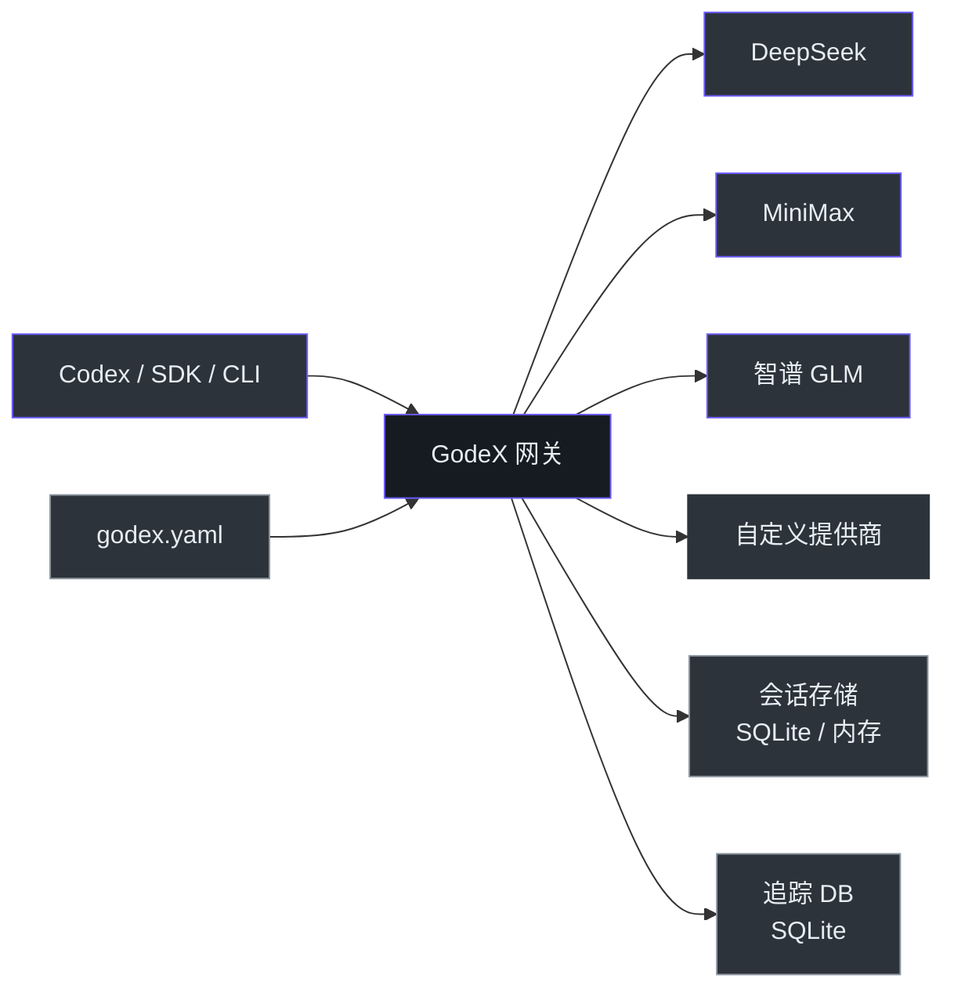
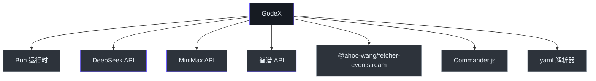

# 管理者指南

## 系统概览

GodeX 是一个 API 网关，将 OpenAI 的 Responses API 翻译为提供商特定的 Chat Completions API 调用。它使团队能够使用 Codex CLI 和其他 OpenAI 兼容工具连接 DeepSeek、MiniMax、智谱或任何 Chat Completions 提供商 — 无需修改客户端代码。基于 TypeScript 和 Bun 运行时构建，具有高吞吐量和低延迟。

## 能力地图

| 能力 | 状态 | 成熟度 | 依赖 |
|------|------|--------|------|
| OpenAI Responses API 代理 | 已完成 | 稳定 | 上游提供商 API |
| 流式传输（SSE） | 已完成 | 稳定 | 上游 SSE 支持 |
| 多提供商路由 | 已完成 | 稳定 | 提供商配置 |
| 模型名称别名 | 已完成 | 稳定 | — |
| 会话链式解析 | 已完成 | 稳定 | SQLite 或内存后端 |
| 工具/函数调用 | 已完成 | 稳定 | 上游工具支持 |
| 结构化输出 (json_object) | 已完成 | 稳定 | 上游 JSON 支持 |
| 结构化输出 (json_schema) | 已完成 | Beta | 当提供商不支持时降级为 json_object |
| 推理/思考 Token | 已完成 | Beta | 提供商特定（DeepSeek 原生，智谱布尔值） |
| 缓存 Token 追踪 | 已完成 | 稳定 | 提供商支持 |
| 追踪记录 | 已完成 | 稳定 | SQLite |
| Docker 部署 | 已完成 | 稳定 | linux/amd64, linux/arm64 |
| 网页搜索透传 | 计划中 | — | 上游网页搜索 API |
| 多租户隔离 | 未建设 | — | — |

## 架构一览

<!-- Sources: src/server/index.ts, src/providers/ -->

## 团队拓扑

| 组件 | 负责人 | 关键程度 | 巴士因子 |
|------|--------|---------|---------|
| Bridge 内核 (`src/bridge/`) | 核心贡献者 | 关键 — 所有请求流经此处 | 1-2 |
| 提供商 Spec (`src/providers/`) | 核心贡献者 + 社区 | 高 — 每个提供商独立 | 2-3 |
| 会话管理 | 核心贡献者 | 中 — 可降级为仅内存 | 1-2 |
| 追踪系统 | 核心贡献者 | 低 — 仅诊断 | 1-2 |
| CLI 和配置 | 核心贡献者 | 低 — 仅启动时 | 1-2 |
| Wiki 文档 | 核心贡献者 | 低 — 信息性 | 1-2 |

## 技术投资论点

| 技术 | 用途 | 考虑的替代方案 | 风险级别 |
|------|------|--------------|---------|
| Bun 运行时 | 性能、原生 TypeScript、单二进制编译 | Node.js, Deno | 低 — Bun 已生产就绪 |
| TypeScript | 跨提供商 spec 的类型安全 | JavaScript, Go | 低 — 行业标准 |
| SQLite (bun:sqlite) | 会话持久化和追踪记录，零外部依赖 | Redis, PostgreSQL | 低 — 嵌入式，ACID |
| Web Streams API | 流式管道组合 | RxJS, 自定义事件系统 | 低 — 原生平台 API |
| Biome | 代码检查 + 格式化（单一工具） | ESLint + Prettier | 低 — 活跃开发中 |

## 风险评估

| 风险 | 可能性 | 影响 | 缓解措施 | 负责人 |
|------|--------|------|---------|--------|
| 上游提供商 API 变更 | 中 | 高 | Provider 抽象层隔离变更到单个提供商 hooks | 贡献者 |
| 提供商凭证泄露 | 中 | 高 | 配置使用环境变量插值；代码中无凭证 | 运维 |
| Bun 运行时回归 | 低 | 中 | Bun 保持 Node.js 兼容性；CI 中锁定 Bun 版本 | 外部 |
| 会话数据丢失（SQLite） | 低 | 中 | ACID 事务；可添加备份或迁移到外部 DB | 运维 |
| 单进程瓶颈 | 低 | 中 | 垂直扩展对单网关使用足够；可在负载均衡器后部署多实例 | 运维 |

## 成本与扩展模型

GodeX 是轻量级单进程网关。资源成本很低：

| 资源 | 使用量 | 扩展因素 |
|------|--------|---------|
| CPU | 每并发请求 <5% | 与并发流式连接成正比 |
| 内存 | ~50MB 基础 + 每活跃会话 ~1KB | 与会话存储大小成正比 |
| 磁盘 | SQLite 文件（会话 + 追踪） | 与请求量和追踪保留成正比 |
| 网络 | 透传到上游 | 与请求/响应 payload 大小成正比 |

扩展限制：单进程事件循环。对于高吞吐场景，在负载均衡器后部署多个实例，使用粘性会话（支持 `previous_response_id`）。

## 依赖地图

<!-- Sources: package.json -->

| 依赖 | 类型 | 不可用时的风险 |
|------|------|--------------|
| Bun 运行时 | 平台 | 完全不可用 — 无回退运行时 |
| DeepSeek API | 服务 | DeepSeek 提供商不可用；其他提供商不受影响 |
| MiniMax API | 服务 | MiniMax 提供商不可用；其他提供商不受影响 |
| 智谱 API | 服务 | 智谱提供商不可用；其他提供商不受影响 |
| `@ahoo-wang/fetcher-eventstream` | 库 | 流式功能失效；必要时可内联 |

## 关键指标与可观测性

| 指标 | 来源 | 备注 |
|------|------|------|
| 健康检查 | `GET /health` | 服务器就绪时返回 200 |
| 结构化日志 | JSON 日志器 | 日志级别通过 `godex.yaml` 配置 |
| 错误代码 | 领域特定代码 | `server`、`bridge`、`provider`、`session` 域 |
| 请求追踪 | SQLite 追踪 DB | 记录请求、响应、流事件、usage、错误 |
| 追踪 payload 捕获 | 可配置 | `trace.capture_payload: true` 启用完整 payload 记录 |

## 技术债务摘要

| 问题 | 业务影响 | 修复成本 | 优先级 |
|------|---------|---------|--------|
| 无客户端认证层 | 依赖网络安全 | 中 | 高 |
| 无限流机制 | 共享环境中易被滥用 | 低 | 中 |
| 无管理 API 进行配置重载 | 变更提供商配置需重启 | 低 | 中 |
| 无 Prometheus/OpenTelemetry 指标 | 生产可观测性有限 | 中 | 中 |
| 无每提供商请求超时 | 使用 fetch 默认值；慢提供商可能挂起 | 低 | 低 |

## 建议

1. **添加客户端认证** — 在将网关暴露到可信网络之外之前，即使简单的 API key 检查也能防止未授权使用
2. **添加 Prometheus 指标**（请求延迟、错误率、上游延迟）提升生产可观测性
3. **实现限流** — 在将网关暴露给外部流量之前
4. **添加热配置重载** — 避免提供商配置变更时的停机
5. **扩展提供商覆盖** — 随着采用增长添加更多提供商 — 基于 spec 的架构使这成为低成本操作

[贡献者指南](./contributor-guide.md) · [架构师指南](./staff-engineer-guide.md)
