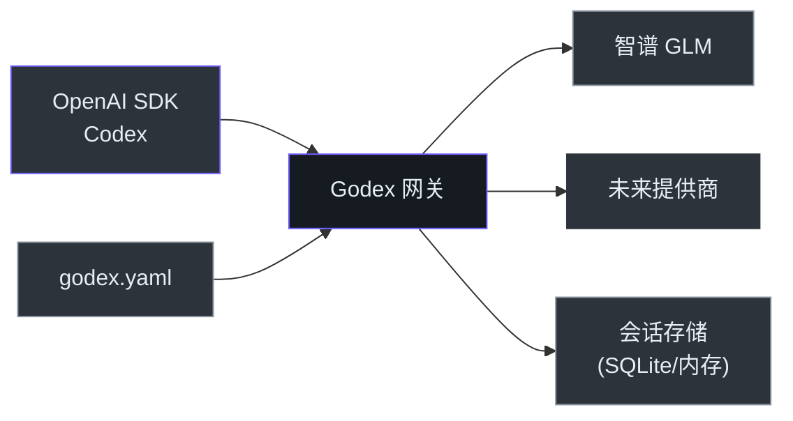

# 管理者指南

## 系统概览

Godex 是一个 **API 网关**，将 OpenAI 的 Responses API 翻译为提供商特定的 Chat Completions API 调用。它使团队能够使用 Codex 和其他 OpenAI 兼容客户端连接任何已配置的 LLM 提供商，无需修改客户端代码。基于 TypeScript 和 Bun 构建，具有高吞吐量和低延迟。

## 能力地图

| 能力 | 状态 | 成熟度 | 依赖 |
|------|------|--------|------|
| OpenAI Responses API 代理 | 已完成 | 稳定 | 上游提供商 API |
| 流式传输（SSE） | 已完成 | 稳定 | 上游 SSE 支持 |
| 多提供商路由 | 已完成 | 稳定 | 提供商配置 |
| 模型名称别名 | 已完成 | 稳定 | — |
| 会话链式解析 | 已完成 | 稳定 | SQLite 或内存后端 |
| 工具/函数调用 | 已完成 | 稳定 | 上游工具支持 |
| 结构化输出 | 已完成 | Beta | 上游 JSON Schema 支持 |
| 推理/思考 Token | 已完成 | Beta | 上游思考支持 |
| 网页搜索透传 | 计划中 | — | 上游网页搜索 API |
| 多租户隔离 | 未建设 | — | — |

## 架构一览

<!-- Sources: src/server/index.ts, src/providers/builtin.ts -->

## 风险评估

| 风险 | 可能性 | 影响 | 缓解措施 |
|------|--------|------|---------|
| 上游提供商 API 变更 | 中 | 高 | Provider 抽象隔离变更 |
| 单一提供商依赖（智谱） | 低 | 高 | Provider 接口设计为可扩展 |
| Bun 运行时回归 | 低 | 中 | Bun 保持 Node.js 兼容性 |
| 会话数据丢失（SQLite） | 低 | 中 | ACID 事务，可添加备份 |

## 技术债务

| 问题 | 业务影响 | 修复成本 | 优先级 |
|------|---------|---------|--------|
| 单一提供商（仅智谱） | 限制提供商选择 | 中 | 高 |
| 无管理 API 进行配置重载 | 变更需重启 | 低 | 中 |
| 无限流机制 | 易被滥用 | 低 | 中 |

## 建议

1. **添加第二个提供商**（如 OpenAI、DeepSeek）以验证 adapter 模式并降低单一提供商风险
2. **添加请求级指标**（延迟直方图、错误率）提升生产可观测性
3. **实现限流**在暴露网关给外部流量之前
4. **添加热配置重载**避免提供商配置变更时的停机

[贡献者指南](./contributor-guide.md) · [架构师指南](./staff-engineer-guide.md)
