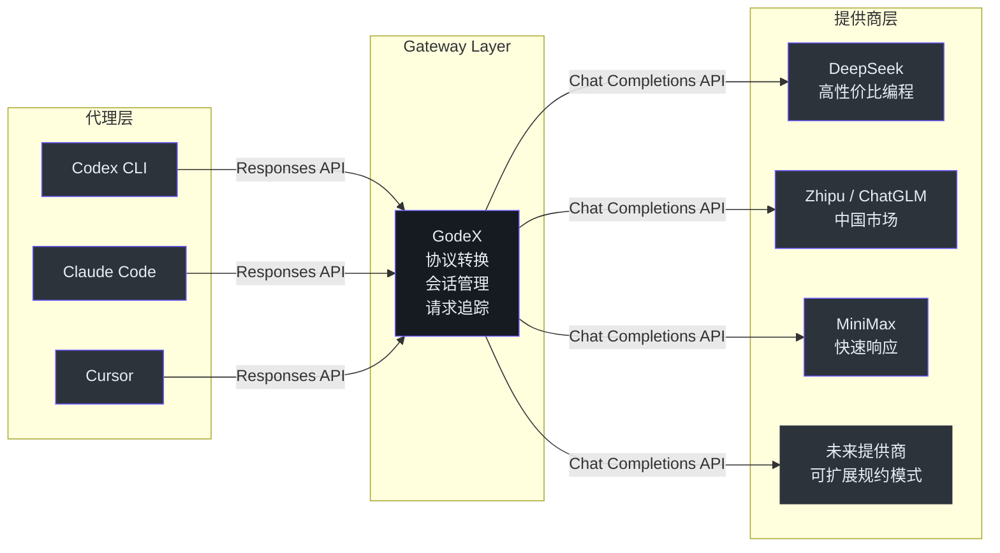
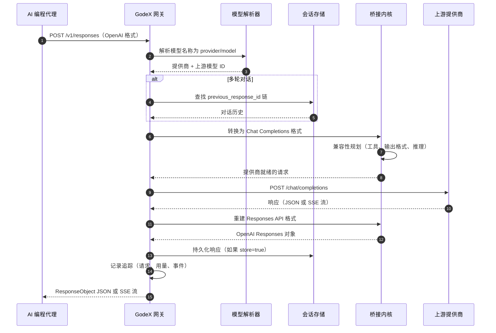
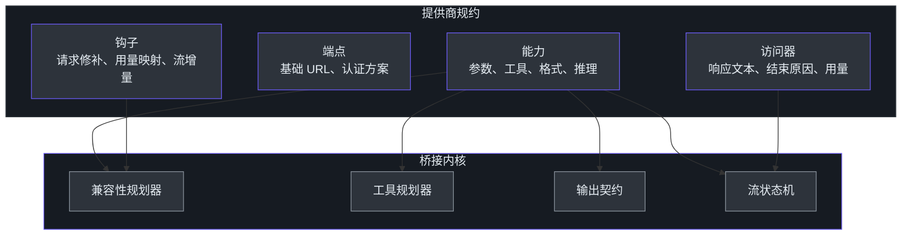

# 高管指南

> **受众**：评估 GodeX 用于组织采纳、成本优化或战略 AI 基础设施决策的 VP/总监级工程领导者。
>
> **阅读时间**：约 15 分钟。
>
> **无代码片段** -- 本指南仅使用服务级图表和表格。

---

## GodeX 是什么

GodeX 是一个兼容 OpenAI 的 Responses API 网关。它位于 AI 编程代理（Codex CLI、Claude Code、Cursor）和非 OpenAI LLM 提供商（DeepSeek、Zhipu/ChatGLM、MiniMax）之间，在两种协议之间透明地转换请求和响应。

代理以 OpenAI 的 Responses API 格式发出请求。GodeX 将这些请求转换为每个提供商的 Chat Completions API 格式，调用上游提供商，再将响应转换回来。代理完全感知不到它并非在与 OpenAI 对话。

这之所以重要，是因为 Responses API 正在成为下一代 AI 编程工具的标准协议。没有 GodeX，每个非 OpenAI 提供商都需要针对每个代理进行定制集成工作。有了 GodeX，一个网关就能处理所有提供商。

---

## 能力矩阵

### 核心服务能力

| 能力 | 描述 | 商业价值 |
|-----------|-------------|----------------|
| **协议转换** | 将 OpenAI Responses API 请求转换为提供商特定的 Chat Completions API 调用，并反向转换 | 客户端零代码改动 |
| **多提供商路由** | 通过单一配置文件支持 DeepSeek、Zhipu/ChatGLM 和 MiniMax | 供应商多元化而无需碎片化 |
| **流式支持** | 实时透传服务器发送事件（SSE） | 代理获得与 OpenAI 无异的流式响应 |
| **会话管理** | 通过 `previous_response_id` 链式解析实现多轮对话 | 代理在多轮之间保持对话上下文 |
| **模型别名** | 将友好的模型名称（如 `gpt-5.5`）映射到实际的提供商/模型组合 | 团队切换提供商无需更改代理配置 |
| **工具调用** | 将 Codex 工具声明（shell、apply_patch、function）转换为提供商等价物 | 代理在非 OpenAI 提供商上执行工具 |
| **结构化输出** | 当提供商不支持时，将 JSON Schema 降级为 JSON Object | 跨提供商一致的输出格式保证 |
| **请求追踪** | 基于 SQLite 的请求、用量、事件和错误的追踪记录 | 完整的审计追踪和调试能力 |
| **用量追踪** | 跟踪每个请求的输入令牌、输出令牌、缓存令牌和推理令牌 | 成本可见性和费用分摊能力 |
| **Docker 部署** | 预构建的 linux/amd64 和 linux/arm64 镜像 | 标准化容器部署 |

### 能力成熟度

| 能力 | 成熟度 | 备注 |
|-----------|----------|-------|
| 协议转换（同步） | 稳定 | 核心路径，经过充分测试 |
| 协议转换（流式） | 稳定 | 基于状态机的 SSE 重建 |
| 工具调用降级 | 稳定 | 内置 Codex 工具映射到所有提供商的 `function` |
| JSON Schema 结构化输出 | Beta | 降级为 `json_object` 并带校验 |
| 推理/思维令牌 | Beta | DeepSeek：原生支持。Zhipu：布尔开关。MiniMax：不支持 |
| 缓存令牌追踪 | 稳定 | 当提供商返回缓存元数据时报告 |
| 会话链式解析 | 稳定 | 循环检测、深度限制、未完成响应处理 |
| 网页搜索透传 | 计划中 | 尚未实现 |
| 多租户隔离 | 未建设 | 目前为单租户 |
| 自动提供商故障转移 | 未建设 | 目标提供商宕机时请求失败 |

---

## 技术投资逻辑

### 为什么存在这个项目

AI 编程代理正在向 OpenAI Responses API 收敛为标准协议。但最好和最便宜的模型并不总是来自 OpenAI。团队面临选择：锁定 OpenAI，或者为每个替代提供商构建和维护定制集成。

GodeX 消除了这种权衡。一个网关，一个配置文件，任意支持的提供商。

### 商业价值驱动因素

| 驱动因素 | 说明 |
|--------|-------------|
| **成本优化** | DeepSeek 和 MiniMax 模型比 GPT-4 级别模型便宜得多。GodeX 让团队使用这些更便宜的提供商，无需重写代理代码或维护提供商特定的 SDK 集成。 |
| **供应商多元化** | 依赖单一 LLM 提供商是战略风险。GodeX 让路由到多个提供商变得轻而易举，减少锁定并提供谈判筹码。 |
| **中国市场接入** | Zhipu（ChatGLM）和 MiniMax 是领先的中国市场 LLM 提供商。GodeX 使在中国部署 AI 编程工具的团队能够使用国内提供商而无需定制集成工作。Zhipu 编程端点已预配置。 |
| **协议面向未来** | Responses API 是 OpenAI 面向代理式 AI 交互的较新标准。随着更多工具采纳它，GodeX 使组织能够使用任何 Chat Completions 提供商，无需等待原生的 Responses API 支持。 |
| **运维简单性** | 单个二进制文件或 Docker 容器。无外部数据库。无消息队列。SQLite 用于会话和追踪。一个 YAML 配置文件。 |

### 战略定位

GodeX 占据代理工具和模型提供商之间的转换层。添加新提供商只需实现一个规约接口 -- 无需更改代理，无需更改桥接内核。

---

## 架构概览

### 服务图

下图展示了从 AI 编程代理经 GodeX 到上游提供商再返回的请求流程。

### 组件职责

| 组件 | 职责 |
|-----------|---------------|
| **服务器路由** | 接受 `/v1/responses`、`/v1/models` 和 `/health` HTTP 请求 |
| **模型解析器** | 将模型名称和别名转换为提供商/模型对 |
| **会话存储** | 持久化和检索多轮对话链 |
| **桥接内核** | 在 Responses API 和 Chat Completions API 之间转换；规划兼容性；处理工具映射、输出契约和流式状态 |
| **提供商规约** | 声明每个提供商的能力、端点配置和协议特性 |
| **追踪记录器** | 将请求元数据、用量、事件和错误记录到 SQLite |
| **错误层级** | 面向服务器、桥接、提供商和会话失败的领域特定错误码 |

### 提供商规约模式

每个提供商由一个精简的规约定义，声明其能力而非实现。桥接内核读取这些声明并自动规划兼容性。

这种分离意味着添加新提供商不需要修改桥接内核。新提供商声明其支持的能力，内核自动适配。

---

## 风险评估

### 技术风险

| 风险 | 可能性 | 影响 | 缓解措施 |
|------|-----------|--------|------------|
| **协议漂移** -- OpenAI 以 GodeX 尚不支持的方式更改 Responses API | 中 | 高 | GodeX 将变更隔离在桥接内核内。代理代码和提供商规约不受影响。社区更新通常在 OpenAI 发布后数天内跟进。 |
| **提供商 API 变更** -- 上游提供商修改其 Chat Completions 端点 | 中 | 中 | 提供商抽象将变更隔离到各个提供商钩子中。其他提供商不受影响。每个提供商规约是独立的。 |
| **流式复杂性** -- SSE 状态机边界情况（不完整块、乱序事件、缺失终止事件） | 低 | 中 | 状态机具有明确的转换和终止状态验证。无效的流输出被重写为 `response.failed` 事件，而非静默损坏。 |
| **结构化输出降级差距** -- JSON Schema 降级损失校验精度 | 低 | 低 | GodeX 验证输出是否为有效 JSON。不执行完整的 JSON Schema 一致性检查，但对大多数用例已足够。 |
| **会话链损坏** -- 具有缺失父节点或循环的长链 | 低 | 中 | 内置循环检测、深度溢出保护和未完成响应处理。损坏的链返回结构化错误，而非静默失败。 |

### 运维风险

| 风险 | 可能性 | 影响 | 缓解措施 |
|------|-----------|--------|------------|
| **单点故障** -- GodeX 是单进程网关 | 中 | 高 | 在负载均衡器后部署多个实例。对于会话连续性，使用 SQLite 后端和粘性会话，或迁移到共享会话存储。 |
| **延迟开销** -- GodeX 在代理和提供商之间增加处理 | 低 | 低 | 实测开销约为每请求 10-50ms，包括转换、兼容性规划和会话解析。远小于上游提供商延迟。 |
| **会话存储扩展** -- 高并发下 SQLite 写入争用 | 低 | 中 | SQLite 能很好地处理并发读取。写入争用可通过 WAL 模式和批量追踪写入来缓解。对于非常高吞吐量，将会话迁移到外部数据库。 |
| **配置错误** -- 无效的 godex.yaml 阻止启动 | 中 | 低 | 配置校验在启动时运行并给出清晰的错误消息。`godex config check` 可在不启动服务器的情况下验证配置。没有 `spec` 的旧版提供商配置会被明确拒绝。 |
| **提供商凭证轮换** -- API 密钥过期或被撤销 | 中 | 中 | 环境变量插值（`${DEEPSEEK_API_KEY}`）支持标准密钥管理。目前密钥轮换需要重启。 |

### 安全风险

| 风险 | 可能性 | 影响 | 缓解措施 |
|------|-----------|--------|------------|
| **配置文件中 API 密钥泄露** | 中 | 高 | 使用环境变量插值。切勿将包含硬编码密钥的 `godex.yaml` 提交到版本控制。CI 管道应在部署时注入密钥。 |
| **追踪载荷敏感性** -- 捕获的载荷包含完整的请求/响应文本 | 低 | 高 | 载荷捕获默认禁用（`trace.capture_payload: false`）。启用后，应将追踪数据库视为敏感数据。限制保留期限和访问权限。 |
| **无客户端认证** -- 任何网络可达的客户端都可以使用网关 | 高 | 中 | 部署在带认证的反向代理之后。不要直接暴露在互联网上。这是生产部署中最高优先级的安全缺口。 |
| **无速率限制** -- 网关接受无限制的请求 | 高 | 低 | 部署在带速率限制的反向代理之后。对于内部团队使用，风险较低。对于共享环境，添加外部速率限制。 |
| **透传数据** -- GodeX 将所有请求内容转发给上游提供商 | 设计如此 | 取决于上下文 | GodeX 不检查、记录或修改超出协议转换范围的请求内容。组织必须信任其配置的上游提供商。 |

---

## 成本与扩展模型

### 资源需求

GodeX 被设计为轻量级单进程网关。与上游 LLM 提供商相比，资源消耗极少。

| 资源 | 基线 | 每请求 | 扩展因子 |
|----------|----------|-------------|----------------|
| **CPU** | 空闲 <5% | 约 10-50ms 转换开销 | 与并发请求数成正比（事件循环模型） |
| **内存** | 约 50MB 基础 | 每活跃会话约 1KB | 与会话存储大小和并发流连接数成正比 |
| **磁盘** | 极少 | SQLite 写入用于会话和追踪 | 与请求量和追踪保留策略成正比 |
| **网络** | 透传 | 与上游请求/响应相同 | 取决于上游提供商载荷大小 |

### 延迟特征

| 操作 | GodeX 开销 | 总计（典型） |
|-----------|---------------|-----------------|
| 请求解析和验证 | <1ms | -- |
| 模型解析 | <1ms | -- |
| 会话链查找（SQLite） | <10ms | -- |
| 兼容性规划和请求构建 | <5ms | -- |
| 提供商调用（网络） | 0ms（透传） | 500ms - 10s（取决于提供商） |
| 响应重建 | <5ms | -- |
| 追踪记录（异步批量） | 0ms（非阻塞） | -- |
| **GodeX 总开销** | **约 10-50ms** | **远小于上游** |

### 扩展限制

| 维度 | 限制 | 策略 |
|-----------|-------|----------|
| 并发连接 | 单进程事件循环 | 垂直扩展足以满足单团队使用 |
| 会话存储 | SQLite 单写入者 | WAL 模式用于读取并发；迁移到外部数据库以支持多写入者 |
| 追踪吞吐量 | 批量异步写入 | 队列 + 刷新间隔（可配置） |
| 水平扩展 | 实例间无共享状态 | 部署在带粘性会话的负载均衡器后；需要共享会话存储 |

### 成本对比

主要成本节省来自使用更便宜的提供商。GodeX 本身增加的基础设施成本可忽略不计。

| 场景 | 没有 GodeX | 有 GodeX |
|----------|--------------|------------|
| 代理使用 OpenAI GPT-4 | 仅 OpenAI 定价 | -- |
| 代理改用 DeepSeek | 定制集成工程成本 | 一次性 GodeX 设置 + DeepSeek 定价 |
| 切换提供商 | 每个代理的代码更改 + 测试 | 更新 `godex.yaml` 中的一行配置 |
| 多提供商支持 | N 倍集成工作量 | 单一网关，N 个提供商配置 |

---

## 技术栈

| 技术 | 角色 | 选择理由 |
|-----------|------|---------------|
| **Bun 运行时** | 执行环境 | 原生 TypeScript、快速启动、单二进制编译、Web Streams API 支持 |
| **TypeScript** | 编程语言 | 跨提供商规约的类型安全；严格模式搭配 `verbatimModuleSyntax` |
| **SQLite (bun:sqlite)** | 会话和追踪持久化 | 零外部依赖、ACID 事务、进程内嵌入 |
| **Web Streams API** | 流式管道 | 用于可组合 SSE 转换阶段的原生平台 API |
| **Biome** | 代码检查和格式化 | 单一工具替代 ESLint + Prettier；基于 Rust 的高性能工具 |
| **LogTape** | 结构化日志 | JSON 结构化日志，可配置级别和文件输出 |
| **Commander.js** | CLI 框架 | 支持 `godex init`、`godex serve`、`godex config check` 命令 |
| **Docker** | 容器化部署 | Docker Hub 和 GHCR 上的多架构镜像（amd64、arm64） |

### 关键架构决策

| 决策 | 理由 |
|----------|-----------|
| 基于规约的提供商模型 | 提供商声明能力而非实现。桥接内核集中规划兼容性。这防止了每个提供商的映射器丛林，保持代码库可维护。 |
| 集中式桥接内核 | 所有 Responses 到 Chat 的策略都在 `src/bridge/` 中。提供商钩子仅暴露协议差异。这消除了跨提供商的重复兼容性决策。 |
| SQLite 持久化 | 无外部数据库依赖。适合单网关部署。可替换为外部存储以支持水平扩展。 |
| 领域错误层级 | 结构化错误码（server、bridge、provider、session）替代原始错误。每个预期失败都有领域码，使监控和告警更可靠。 |

---

## 提供商覆盖

### 已支持的提供商

| 提供商 | 默认模型 | 推理 | 工具选择 | 响应格式 | 缓存令牌 | 特别说明 |
|----------|--------------|-----------|-------------|----------------|---------------|---------------|
| **DeepSeek** | `deepseek-v4-pro` | 原生（high、max） | auto、none、required、function | text、json_object | 是 | 最适合高性价比编程。原生推理支持。 |
| **MiniMax** | `MiniMax-M2.7` | 不支持 | auto、none、required、function | text、json_object | 是 | 快速响应。完整的工具选择支持。 |
| **Zhipu / ChatGLM** | `glm-5.1` | 布尔开关 | auto、none | text、json_object | 是 | 中国市场提供商。预配置编程端点。网页搜索工具支持。 |

### 添加新提供商

提供商规约模式专为可扩展性设计。新提供商需要：

1. 一个 `ProviderSpec` 声明能力、端点和认证方案
2. 用于请求修补和响应/流访问器的钩子
3. 如果提供商的 Chat Completions 格式不同，需要协议特定的 DTO

无需更改桥接内核、代理代码或其他提供商规约。

---

## 可观测性

### 内置可观测性

| 信号 | 来源 | 配置 |
|--------|--------|---------------|
| **健康端点** | `GET /health` | 始终可用。返回已注册和不支持的提供商。 |
| **结构化日志** | LogTape JSON 日志器 | 级别可通过 `godex.yaml` 配置。控制台和文件输出。 |
| **请求追踪** | SQLite 追踪数据库 | 默认启用。记录请求元数据、用量、事件和错误。 |
| **载荷捕获** | 追踪子系统 | 默认禁用。启用 `trace.capture_payload: true` 用于调试。视为敏感数据。 |
| **错误领域码** | GodeXError 层级 | 每个预期失败映射到领域码：`server.*`、`bridge.*`、`provider.*`、`session.*` |
| **用量追踪** | 每响应 `usage` 字段 | 输入令牌、输出令牌、缓存令牌、推理令牌。 |

### 尚未建设的部分

| 缺口 | 影响 | 优先级 |
|-----|--------|----------|
| 无 Prometheus/OpenTelemetry 指标 | 无法与标准可观测性栈集成 | 中 |
| 无用于配置重载的管理 API | 提供商变更需要重启 | 中 |
| 无仪表板或 UI | 追踪数据需要直接查询 SQLite | 低 |

---

## 团队上手

### 产出价值所需时间

| 角色 | 首次产出价值时间 | 路径 |
|------|-------------------|------|
| 使用 GodeX 的开发者 | 15 分钟 | 安装、运行 `godex init`、配置一个提供商、将代理指向 GodeX |
| 部署 GodeX 的运维人员 | 30 分钟 | Docker 拉取、创建 `godex.yaml`、使用环境变量部署 API 密钥 |
| 添加提供商的贡献者 | 2-4 小时 | 研究现有提供商规约模式，实现规约 + 钩子 + 测试 |
| 修改桥接内核的贡献者 | 1-2 天 | 理解兼容性规划器、工具规划器、流状态机 |

### 上手路径

| 如果你是... | 阅读这个... |
|---------------|-------------|
| 为团队设置 GodeX 的开发者 | Getting Started 指南 |
| 加入项目的贡献者 | [贡献者指南](./contributor-guide.md) |
| 评估架构决策的主任工程师 | [主任工程师指南](./staff-engineer-guide.md) |
| 了解功能的产品经理 | [产品经理指南](./product-manager-guide.md) |

---

## 建议

基于 GodeX 的当前状态，以下建议按优先级排列供领导层参考：

### 1. 在面向生产环境之前添加客户端认证

GodeX 没有内置认证。在将网关暴露到受信任的内部网络之外之前，至少实现一个 API 密钥检查。这是最高优先级的安全缺口。带认证的反向代理是可接受的临时解决方案。

### 2. 添加 Prometheus 指标以实现生产可观测性

标准指标 -- 请求延迟直方图、按提供商的错误率、上游延迟、会话存储大小、追踪队列深度 -- 将无需定制工具即可实现生产监控。这是最高优先级的可观测性缺口。

### 3. 实现速率限制

在多团队或外部访问之前，添加速率限制。这可以防止单个配置错误的代理消耗所有网关容量。通过反向代理的外部速率限制是可接受的。

### 4. 规划水平扩展

目前，GodeX 是带有本地会话存储的单进程网关。对于多团队部署，规划共享会话存储（Redis 或 PostgreSQL）以在负载均衡器后实现水平扩展，无需粘性会话。

### 5. 主动扩展提供商覆盖

基于规约的架构使添加提供商变得低成本。随着采纳增长，主动添加团队请求的提供商。每个新提供商都在不增加消费者集成复杂度的情况下提升网关价值。

---

## 总结

GodeX 提供了一项聚焦的高价值能力：让 AI 编程代理通过单一 OpenAI 兼容网关使用任何 Chat Completions 提供商。架构清晰，提供商模型可扩展，运维开销最小。

主要风险是运维层面的（单点故障、无认证、无速率限制）而非技术层面的。这些可以通过标准基础设施模式解决，无需更改 GodeX 本身。

投资逻辑直截了当：减少供应商锁定、实现成本优化、提供中国市场接入 -- 所有这些都无需修改代理代码。

---

[贡献者指南](./contributor-guide.md) · [主任工程师指南](./staff-engineer-guide.md) · [产品经理指南](./product-manager-guide.md) · [上手索引](./index.md)
