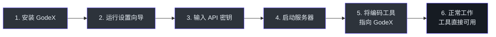
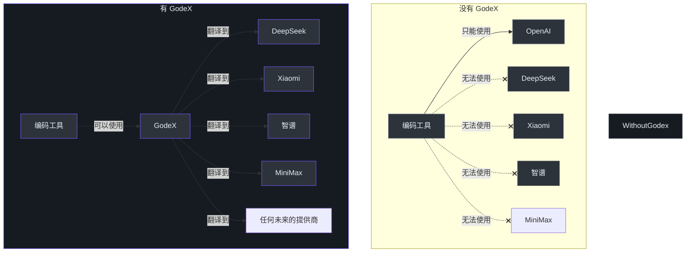
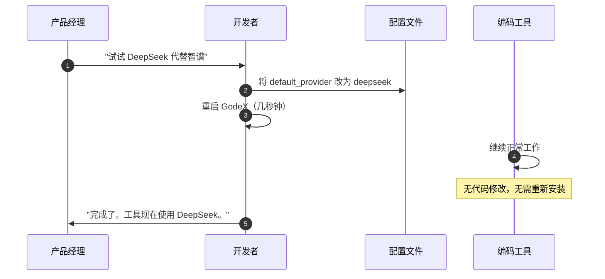
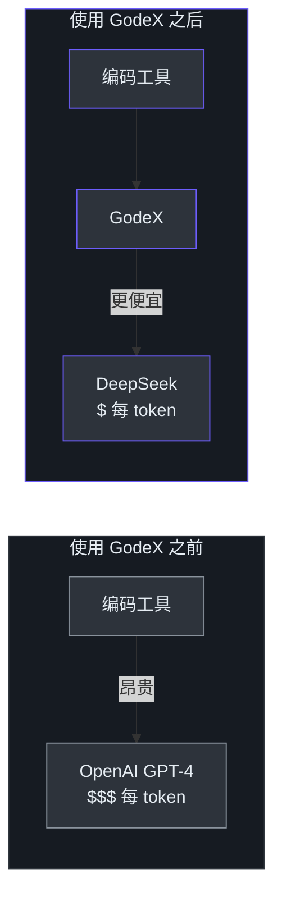
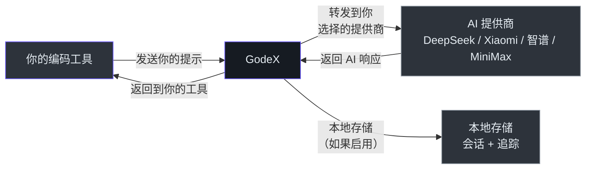

# 产品经理指南

> **受众**：产品经理、业务分析师、项目经理以及需要了解 GodeX 功能、价值和边界的非技术利益相关者。
>
> **阅读时间**：约 15 分钟。
>
> **无工程术语** — 技术术语在术语表中定义。

---

## GodeX 做什么（通俗解释）

### AI 编码工具的万能适配器

想象你在出国旅行。你的手机充电器是美标插头，但欧洲的墙上插座形状不同。你使用一个**万能电源适配器** — 它转换插头形状，让你的充电器在任何地方都能用。

GodeX 就是这样的适配器，不过它是为 AI 编码工具设计的。

你的 AI 编码助手（如 Codex CLI）期望以 OpenAI 的特定格式进行通信。但你可能想使用不同的 AI 提供商 — 比如 DeepSeek（更便宜）或智谱（在中国更好用）。这些提供商使用不同的格式。

**GodeX 在中间进行翻译。** 你的编码助手以 OpenAI 格式与 GodeX 通信。GodeX 翻译并将请求转发到你配置的任何提供商。提供商响应后，GodeX 将响应翻译回 OpenAI 格式，你的助手就像什么都没变一样继续工作。

你的编码工具永远不知道它不是在与 OpenAI 通信。你不需要修改工具的代码。只需配置一次 GodeX，一切就自动连接。

### 一句话总结

GodeX 让你的团队能够使用更便宜或特定区域的 AI 模型来驱动为 OpenAI 构建的编码工具，无需修改任何代码。

---

## 用户旅程地图

### 旅程 1：开发者搭建 GodeX（顺利路径）

**每一步发生的事情：**

1. **安装 GodeX** — 下载工具（npm 包或 Docker 镜像）
2. **运行设置向导** — 引导式命令（`godex init`）询问使用哪些 AI 提供商
3. **输入 API 密钥** — 提供每个 AI 提供商的访问密钥（类似 AI 服务的密码）
4. **启动服务器** — 运行 `godex serve` 启动翻译服务
5. **将编码工具指向 GodeX** — 告诉编码助手将请求发送到 GodeX 而不是 OpenAI
6. **正常工作** — 编码助手和之前完全一样工作，但使用你选择的 AI 提供商

**完成时间**：熟悉命令行工具的开发者约需 10-15 分钟。

### 旅程 2：没有 GodeX vs 有 GodeX

**没有 GodeX**：你的编码工具只能使用 OpenAI。要使用其他提供商，必须为每个工具和每个提供商编写自定义集成代码。

**有 GodeX**：你的编码工具可以使用任何支持的提供商。切换提供商只需修改一行配置。

### 旅程 3：切换提供商

这是对产品经理来说的核心价值主张：**提供商决策变成配置，而不是工程工作。**

---

## 功能能力地图

### 已上线的功能

| 功能 | 状态 | 对用户的意义 |
|------|------|-------------|
| **文本生成** | 已上线 | 发送问题或指令，获得 AI 生成的响应 |
| **流式响应** | 已上线 | 实时观看 AI 逐字生成响应 |
| **多轮对话** | 已上线 | AI 记住同一对话中的历史消息 |
| **工具/函数调用** | 已上线 | AI 可以在对话中触发操作（如运行代码或应用更改） |
| **模型名称别名** | 已上线 | 使用友好名称如 "coding-assistant" 代替技术模型名 |
| **同时使用多个提供商** | 已上线 | 不同团队成员或项目可以同时使用不同的 AI 提供商 |
| **JSON 输出格式** | 已上线 | 强制 AI 以 JSON 格式响应以获取结构化数据 |
| **推理/思考** | Beta | 查看 AI 在最终回答前的推理过程（依赖提供商） |
| **缓存 Token 追踪** | 已上线 | 查看有多少 Token 从缓存提供（更便宜更快） |
| **请求追踪** | 已上线 | 每个请求的完整审计追踪，用于调试和合规 |
| **Docker 部署** | 已上线 | 在任何云平台或本地机器的容器中运行 |

### 有功能限制的

| 功能 | 限制 | 用户影响 |
|------|------|---------|
| **推理支持** | 因提供商而异：DeepSeek 原生支持，Xiaomi、智谱和 MiniMax 使用布尔 thinking 开关 | 根据任务需要选择合适的 thinking 行为 |
| **工具选择控制** | Xiaomi 仅支持 "auto"；智谱仅支持 "auto" 和 "none"（不支持 "required" 或指定函数） | 在 Xiaomi 或智谱上，无法强制 AI 总是调用特定工具 |
| **JSON Schema 验证** | 当提供商不支持 schema 时降级为 JSON Object 格式 | AI 会生成 JSON，但不保证所有提供商都进行严格的 schema 验证 |
| **网页搜索** | 尚未支持 | AI 无法在对话中搜索网页获取信息 |

### 尚未支持的功能

| 功能 | 状态 | 时间计划 |
|------|------|---------|
| **网页搜索集成** | 计划中 | 未来版本 |
| **图像生成** | 计划中 | 未来版本 |
| **自动故障转移** | 评估中 | 当一个提供商宕机时，请求不会自动路由到另一个 |
| **内置认证** | 未内置 | 能访问服务器的任何人都能使用 |
| **速率限制** | 未内置 | 没有防止过量请求的保护 |
| **管理面板** | 评估中 | 配置修改需要编辑文件 |

---

## 支持的 AI 模型

### 提供商概览

| 提供商 | 最适用场景 | 默认模型 | 可用模型 |
|--------|-----------|---------|---------|
| **DeepSeek** | 高性价比编码和推理 | `deepseek-v4-pro` | `deepseek-v4-pro`、`deepseek-v4-flash` 及 DeepSeek 目录中的其他模型 |
| **Xiaomi / MiMo** | 推理和中国市场部署 | `mimo-v2.5-pro` | `mimo-v2.5-pro`、`mimo-v2.5`、`mimo-v2-flash` 及 MiMo 目录中的其他模型 |
| **MiniMax** | 快速响应、工具调用和图片/视频理解 | `MiniMax-M3` | `MiniMax-M3` 及 MiniMax 目录中的其他模型 |
| **智谱 / ChatGLM** | 中国市场部署和中文编程 | `glm-5.2` | `glm-5.2`、`glm-5.1` 及智谱目录中的其他模型 |

> **注意**：GodeX 路由到你配置的提供商提供的任何模型。上面的默认模型只是推荐的起点。你可以配置每个提供商目录中的任何模型。

### 提供商对比

| 能力 | DeepSeek | Xiaomi | MiniMax | 智谱 |
|------|----------|--------|---------|------|
| 文本生成 | 是 | 是 | 是 | 是 |
| 流式传输 | 是 | 是 | 是 | 是 |
| 工具调用（函数） | 是 | 是 | 是 | 是 |
| 工具选择：auto | 是 | 是 | 是 | 是 |
| 工具选择：none | 是 | 否 | 是 | 是 |
| 工具选择：required | 是 | 否 | 是 | 否 |
| 工具选择：指定函数 | 是 | 否 | 是 | 否 |
| JSON 输出 | 是 | 是 | 是 | 是 |
| 推理/思考 | 是（原生） | 是（布尔） | 是（布尔） | 是（基础） |
| 图片/视频理解 | 否 | 否 | 是 | 否 |
| 缓存 Token | 是 | 是 | 是 | 是 |
| 网页搜索工具 | 否 | 否 | 否 | 是（通过智谱的 web_search） |
| 最大并发工具数 | 128 | 128 | 128 | 128 |

---

## 使用场景

### 场景 1：成本节约

**场景描述**：你的团队使用 Codex CLI 进行编码辅助。目前每个请求都发送到 OpenAI，这是最昂贵的选择。

**使用 GodeX**：将请求路由到 DeepSeek。DeepSeek 模型每个 token 的价格远低于 GPT-4 级别模型。

**谁受益**：追踪云成本的工程经理、审核 AI 支出的财务团队、高频率使用编码辅助的团队。

### 场景 2：中国市场部署

**场景描述**：你的公司在中国有工程团队。OpenAI 服务在中国无法可靠访问。

**使用 GodeX**：将请求路由到智谱（ChatGLM），一家领先的中国市场 AI 提供商，具有预配置的编码端点。编码工具的工作方式不变 — 团队不需要特殊培训。

**谁受益**：在中国有团队的全球化工程组织、在中国市场部署 AI 工具的公司。

### 场景 3：提供商对比和评估

**场景描述**：你的团队正在评估哪个 AI 模型能为你的场景生成最佳代码。你希望并排比较输出结果。

**使用 GodeX**：为每个提供商设置模型别名。通过修改请求中的一行，让同一个提示分别通过 DeepSeek、Xiaomi、MiniMax 和智谱运行。无需切换工具或编写集成代码即可比较输出。

**谁受益**：评估 AI 模型的技术产品经理、基准测试提供商的 ML 工程师、决定使用哪个提供商的团队。

### 场景 4：提供商故障转移

**场景描述**：你的主要 AI 提供商发生故障。你的编码工具停止工作。

**使用 GodeX**：通过修改配置文件中的一行并重启来切换到备用提供商。你的团队在几秒钟内恢复工作。

**谁受益**：依赖 AI 编码工具完成日常工作的团队、无法容忍工具宕机的组织。

### 场景 5：多团队提供商管理

**场景描述**：你管理多个工程团队。一个团队处理敏感数据，必须使用特定提供商。另一个团队注重成本，想用最便宜的选项。

**使用 GodeX**：部署具有不同配置的独立 GodeX 实例。每个团队的编码工具指向各自的 GodeX 实例及其提供商设置。

**谁受益**：管理多个团队的工程经理、管理 AI 基础设施的平台团队、有合规要求的组织。

---

## 已知限制

### 影响用户的限制

| 限制 | 含义 | 变通方案 |
|------|------|---------|
| **无内置登录或访问控制** | 能访问 GodeX 服务器的任何人都能使用它 | 部署在安全网络后面或添加带认证的反向代理 |
| **无自动故障转移** | 如果你选择的 AI 提供商宕机，请求会失败，直到你切换提供商 | 保持第二个提供商已配置；在配置文件中手动切换 |
| **重启后会话丢失（内存模式）** | 如果你使用默认的会话存储并重启 GodeX，对话历史会丢失 | 使用 SQLite 会话存储（`session.backend: sqlite`）来持久化对话 |
| **无管理界面** | 配置修改需要编辑文件并重启服务器 | 使用 CLI 向导（`godex init`）进行初始设置 |
| **提供商差异存在** | 不是所有提供商都支持所有功能（参见上面的提供商对比） | 根据团队需要的功能选择提供商 |
| **配置修改需要重启** | 更改提供商或模型别名需要重启 GodeX | 重启只需几秒钟；在低使用时段进行修改 |
| **无请求排队** | 所有请求立即处理 | 确保你的部署能处理峰值负载 |

### 影响管理员的限制

| 限制 | 含义 | 变通方案 |
|------|------|---------|
| **无速率限制** | 网关接受无限请求 | 在共享环境中部署在带速率限制的代理后面 |
| **无每用户使用配额** | 无法限制一个人或一个团队的使用量 | 通过追踪数据库监控使用情况 |
| **无 Prometheus 指标** | 无法连接标准监控面板 | 直接查询追踪数据库，或解析结构化日志 |
| **单进程架构** | GodeX 作为单个进程运行；无内置集群 | 在负载均衡器后面部署多个实例以实现高可用 |
| **SQLite 写入限制** | 非常高的请求量可能在会话/追踪写入上产生竞争 | 调整追踪批量设置；对极高吞吐量考虑外部数据库 |

---

## 数据和隐私概览

### GodeX 处理哪些数据

了解数据流对隐私和合规决策很重要。

### 数据存储详情

| 数据类型 | 去向 | 谁能看到 | 保留时间 |
|---------|------|---------|---------|
| **你的提示和问题** | 传递给你选择的 AI 提供商 | 你配置的 AI 提供商（如 DeepSeek、智谱） | 按提供商的数据政策 |
| **AI 响应** | 传递回你的编码工具 | 只有发起请求的人 | 除非启用会话存储，否则 GodeX 不存储 |
| **对话历史** | 存储在运行 GodeX 的机器本地（如果启用了会话存储） | 能访问 GodeX 服务器的任何人 | 直到手动删除 |
| **请求追踪** | 存储在运行 GodeX 的机器本地（如果启用了追踪） | 能访问 GodeX 服务器的任何人 | 直到手动删除 |
| **完整请求/响应内容** | 仅在明确启用时存储在本地（`trace.capture_payload: true`） | 能访问追踪数据库的任何人 | 直到手动删除 |
| **API 密钥** | 存储在 GodeX 服务器上的配置文件或环境变量中 | 能访问服务器配置的任何人 | 直到管理员轮换 |

### 关键隐私要点

- **GodeX 不会将你的数据发送给你配置的 AI 提供商以外的任何第三方。**
- **GodeX 没有云服务** — 它完全运行在你的基础设施上。
- **完整内容捕获默认关闭** — 你必须明确启用。
- **API 密钥永远不会发送给第三方** — 它们仅用于与你选择的 AI 提供商进行认证。
- **数据驻留由你部署 GodeX 的位置和你配置的提供商决定。**

### 合规考量

| 关注点 | GodeX 如何处理 |
|--------|--------------|
| **数据驻留** | GodeX 运行在你的基础设施上。选择满足你驻留要求的提供商。 |
| **审计追踪** | 追踪记录提供所有请求和响应的完整记录（启用时）。 |
| **访问控制** | 目前无内置访问控制。部署在安全网络或认证代理后面。 |
| **数据保留** | 你通过管理 SQLite 数据库来控制保留。GodeX 不会自动删除数据。 |
| **追踪中的敏感数据** | 完整内容捕获默认关闭。启用时，应将追踪数据库视为敏感数据。 |

---

## 常见问题

### 入门

**问：使用 GodeX 需要什么？**

答：你需要三样东西：(1) 安装了 GodeX 的机器，(2) 至少一个 AI 提供商的 API 密钥（DeepSeek、Xiaomi、MiniMax 或智谱），(3) 支持 OpenAI API 格式的编码工具（如 Codex CLI）。

**问：搭建需要多长时间？**

答：熟悉命令行工具的人大约 10-15 分钟。运行设置向导，输入 API 密钥，启动服务器，将编码工具指向 GodeX。

**问：需要修改编码工具的代码吗？**

答：不需要。大多数 OpenAI 兼容工具允许你在设置中更改"base URL"（服务器地址）。将其指向你的 GodeX 服务器而不是 OpenAI，其他一切都照常工作。

### 提供商问题

**问：可以同时使用多个 AI 提供商吗？**

答：可以。在设置文件中配置所有提供商。然后使用模型名将请求路由到不同提供商。例如，`deepseek/deepseek-v4-pro` 路由到 DeepSeek，`zhipu/glm-5.1` 路由到智谱。

**问：AI 提供商宕机会怎样？**

答：对该提供商的请求会失败并返回错误消息。其他提供商不受影响。你可以通过更新配置文件并重启 GodeX 来切换到正常工作的提供商。

**问：应该使用哪个提供商？**

答：取决于你的优先级：
- **最便宜**：DeepSeek
- **在中国使用**：Xiaomi、智谱
- **最快响应**：MiniMax
- **最佳推理**：DeepSeek

你可以尝试多个提供商并比较结果。

**问：可以添加支持列表以外的提供商吗？**

答：添加新提供商需要开发工作。架构设计使这变得简单直接 — 开发者为新提供商实现一个规范。详见贡献者指南。

### 成本问题

**问：GodeX 多少钱？**

答：GodeX 是开源软件（Apache-2.0 许可证）。使用免费。你只需支付 GodeX 路由到的 AI 提供商 API 调用费用。

**问：GodeX 会增加每请求的额外费用吗？**

答：不会。GodeX 不收取每请求费用。它仅增加极少量的处理时间（约 10-50 毫秒），与 AI 提供商的响应时间相比可以忽略不计。

**问：使用更便宜的提供商能省多少？**

答：DeepSeek 模型每个 token 的价格通常远低于 OpenAI GPT-4 级别模型。确切节省取决于你的使用量。查看每个提供商的定价页面获取当前费率。

### 安全问题

**问：GodeX 安全吗？**

答：GodeX 设计用于在受信任的内部网络中运行。它没有内置的用户认证或速率限制。生产环境使用时，建议部署在安全网络或带认证的反向代理后面。

**问：我的 API 密钥存储在哪里？**

答：API 密钥存储在 GodeX 配置文件中或作为服务器上的环境变量。它们只会发送给所属的 AI 提供商，不会发送给其他任何人。

**问：有人能读到我的对话吗？**

答：对话历史存储在 GodeX 服务器的本地。能直接访问该机器的人可以读取会话数据。完整的请求/响应内容只有在你明确启用内容捕获时才会记录（默认关闭）。

### 技术问题

**问：哪些编码工具与 GodeX 兼容？**

答：任何支持 OpenAI Responses API 或可以配置指向自定义服务器的工具。主要使用场景是 Codex CLI，但 Claude Code 和 Cursor 等其他工具也可以工作。

**问：GodeX 支持我的操作系统吗？**

答：GodeX 支持 macOS、Linux 和 Windows。所有主要平台都有预编译二进制文件。Docker 镜像支持 linux/amd64 和 linux/arm64。

**问：可以在 Docker 中部署 GodeX 吗？**

答：可以。预构建的 Docker 镜像可在 Docker Hub 和 GitHub Container Registry 上获取。配置和数据通过卷挂载。

**问：GodeX 重启后对话历史会怎样？**

答：如果你使用基于内存的会话存储（默认），重启后对话历史会丢失。如果你使用 SQLite 会话存储，对话在重启后会保留。

**问：GodeX 支持流式响应吗？**

答：支持。响应实时逐字显示，就像直接从 OpenAI 流式传输一样。翻译是透明进行的。

---

## 术语表

GodeX 文档中使用的每个技术术语，用通俗语言定义。

| 术语 | 通俗定义 |
|------|---------|
| **AI 编码代理** | 使用 AI 帮你写代码的软件工具，像一个能为你读、写和编辑代码的助手。例如：Codex CLI、Claude Code、Cursor。 |
| **AI 模型** | AI "大脑"的一个特定版本。比如 "GPT-4" 或 "deepseek-v4-pro"。每个模型有不同的优势、速度和成本。 |
| **AI 提供商** | 提供可用 AI 模型的公司。比如 OpenAI、DeepSeek、Xiaomi、智谱或 MiniMax。每个提供商有自己的 AI 模型。 |
| **别名** | 模型的昵称。不用记 "deepseek/deepseek-v4-pro"，你可以叫它 "coding-assistant" 或 "gpt-5.5"。 |
| **API** | 应用程序编程接口 — 软件之间通信的标准化方式。在此上下文中，指你的编码工具与 AI 通信的方式。 |
| **API 密钥** | 让 GodeX 与 AI 提供商认证的密码。每个提供商给你自己的密钥。 |
| **缓存 Token** | AI 提供商之前已处理过的请求部分，可以更快更便宜地处理。类似重复信息的捷径。 |
| **Chat Completions API** | 大多数 AI 提供商（DeepSeek、Xiaomi、MiniMax、智谱）用于接收请求和返回响应的格式。 |
| **编码工具** | 见 "AI 编码代理"。 |
| **配置文件** | 一个文本文件（名为 `godex.yaml`），你在这里告诉 GodeX 使用哪些提供商以及如何连接。 |
| **对话历史** | 对话中历史消息的记录，让 AI 能记住你之前讨论的内容。 |
| **Docker** | 在容器中运行软件的工具 — 轻量、一致的包，在任何计算机上以相同方式运行。 |
| **故障转移** | 当主系统故障时自动切换到备用系统。GodeX 目前不自动执行此操作。 |
| **函数调用** | 见 "工具调用"。 |
| **网关** | 位于你的工具和 AI 提供商之间的服务，翻译请求和响应。GodeX 就是一个网关。 |
| **JSON** | 一种常用于组织数据的结构化文本格式。可以把它想象成一种非常严格的填空表格，计算机可以轻松读取。 |
| **JSON Schema** | 描述 JSON 响应应该长什么样的规范 — 哪些字段是必需的，什么类型等。 |
| **延迟** | 某事需要多长时间。"低延迟"意味着快。"高延迟"意味着慢。 |
| **LLM** | 大语言模型 — 生成文本的 AI 的技术术语。本指南中提到的所有 "AI 模型" 都是 LLM。 |
| **模型** | 见 "AI 模型"。 |
| **多轮对话** | AI 记住历史消息的来回对话。像聊天线程，而不是单个问答对。 |
| **OpenAI** | 创建了 ChatGPT 和 GodeX 翻译的 API 格式的公司。 |
| **内容载荷 (Payload)** | 请求或响应的实际内容 — 你的问题、AI 的回答等。 |
| **提供商** | 见 "AI 提供商"。 |
| **速率限制** | 控制一个人在一段时间内可以发送多少请求，以防止过载。 |
| **推理 Token** | AI 在回答前用于 "思考" 的 token。某些提供商会展示这些思考步骤。 |
| **Responses API** | 较新的 OpenAI AI 交互格式，专为 Codex CLI 等高级工具设计。GodeX 将此格式翻译为每个提供商能理解的格式。 |
| **反向代理** | 位于 GodeX 前面的服务器，可以添加登录和速率限制等安全功能。 |
| **Server-Sent Events (SSE)** | 从服务器向客户端实时发送数据的方法。这是流式传输的工作方式 — AI 在生成时逐字发送。 |
| **会话** | AI 稍后可以继续的已保存对话。像在书中保存你的阅读位置。 |
| **规范 (Spec)** | "规范 (specification)" 的简称 — 描述提供商能做什么的正式描述。GodeX 使用规范来知道如何为每个提供商进行翻译。 |
| **SQLite** | 将数据存储在单个文件中的轻量数据库。GodeX 用它来保存对话和请求追踪。不需要单独的数据库服务器。 |
| **流式传输** | 实时逐段获取 AI 响应，而不是等待完整回答。像看着某人打字而不是收到一封信。 |
| **Token** | AI 用来衡量使用量的一小段文本。粗略来说，一个 token 大约是 3/4 个词。你按 token 付费。 |
| **工具调用** | AI 在对话中触发操作的能力 — 比如运行 shell 命令、应用代码更改或调用函数。 |
| **追踪** | 请求期间发生的事件的详细记录，用于调试和审计。 |
| **翻译** | 在 GodeX 的上下文中，将请求从一种格式（OpenAI）转换为另一种（提供商特定），使它们能互相理解。 |
| **万能适配器** | GodeX 的比喻 — 就像旅行电源适配器让你的设备在任何国家使用。 |

---

[贡献者指南](./contributor-guide.md) · [架构师指南](./staff-engineer-guide.md) · [入门索引](./index.md)
