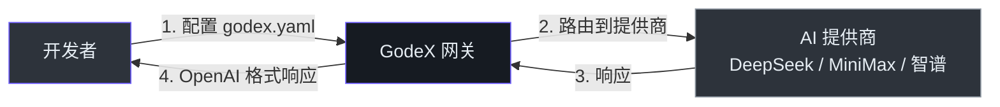
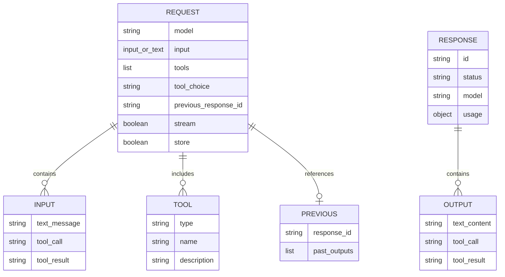

# 产品经理指南

## 系统简介

GodeX 是两种 AI API 格式之间的**翻译器**。你的团队只需用 OpenAI 的 Responses API 编写一次代码，GodeX 自动将请求转换为不同 AI 提供商（如 DeepSeek、MiniMax、智谱）的格式。可以把它想象成一个万能适配器 — 接入任何支持的 AI 模型，现有工具（如 Codex CLI）就能直接使用。

客户端无需修改代码。只需将工具指向 GodeX，配置要使用的提供商，一切自动连接。

## 用户旅程

<!-- Sources: src/server/routes/, src/config/ -->

开发者在 `godex.yaml` 中一次性配置提供商，然后使用 OpenAI 格式发送请求。GodeX 透明地处理翻译。

## 支持的提供商

| 提供商 | 适用场景 | 默认模型 | 特殊功能 |
|--------|---------|---------|---------|
| DeepSeek | 通用编程、推理任务 | `deepseek-v4-pro` | 原生推理、缓存 Token |
| MiniMax | 快速响应、工具调用 | `MiniMax-M2.7` | 缓存 Token |
| 智谱 | 中文编程 | `glm-5.1` | 布尔推理、缓存 Token |

## 功能能力地图

| 功能 | 状态 | 用户可见行为 | 限制 |
|------|------|-------------|------|
| 文本生成 | 已上线 | 发送消息，获得 AI 响应 | 取决于提供商模型 |
| 流式响应 | 已上线 | 实时看到响应逐步出现 | 仅 SSE，不支持 WebSocket |
| 多轮对话 | 已上线 | 使用 `previous_response_id` 继续之前的对话 | 会话存储在本地 |
| 工具/函数调用 | 已上线 | AI 可以调用你定义的工具 | 仅限提供商支持的类型 |
| 模型路由 | 已上线 | 使用 `"provider/model"` 选择提供商和模型 | 需预先配置 |
| 模型别名 | 已上线 | 将友好名称如 `"gpt-5.5"` 映射到实际模型 | 静态配置，无自动发现 |
| 推理/思考 | Beta | 看到 AI 的推理过程 | 仅在提供商支持时可用 |
| 结构化输出 (JSON) | 已上线 | 强制 AI 按 JSON 格式响应 | 提供商需支持 json_object |
| 结构化输出 (JSON Schema) | Beta | 强制 AI 按指定 JSON Schema 响应 | 当提供商不支持时自动降级为 json_object |
| 缓存 Token 追踪 | 已上线 | 追踪有多少 Token 从缓存提供 | 提供商需支持 |
| 追踪记录 | 已上线 | 调试和审计所有请求和响应 | 需要 SQLite |
| Docker 部署 | 已上线 | 在任何平台的容器中运行 | linux/amd64, linux/arm64 |
| 网页搜索 | 不可用 | — | 计划中 |
| 图像生成 | 不可用 | — | 计划中 |

## 数据模型（产品视角）

<!-- Sources: src/protocol/openai/responses.ts -->

一个请求包含输入（消息或工具结果）、可选的工具，可以引用之前的对话轮次。响应包含输出条目（文本、工具调用）和使用统计。

## 配置与设置

| 设置 | 控制内容 | 默认值 | 谁可以修改 |
|------|---------|--------|-----------|
| `server.port` | 网关监听端口 | `5678` | 运维人员（配置文件） |
| `default_provider` | 未指定前缀时使用的默认提供商 | — | 运维人员（配置文件） |
| `providers.*.api_key` | AI 提供商认证密钥 | — | 运维人员（环境变量或配置） |
| `models.aliases` | 模型名快捷映射（如 `"gpt-5.5"` → `deepseek/deepseek-v4-pro`） | — | 运维人员（配置文件） |
| `session.backend` | 会话历史存储方式 | `memory` | 运维人员（配置文件） |
| `trace.enabled` | 是否记录请求追踪 | `true` | 运维人员（配置文件） |
| `trace.capture_payload` | 是否保存完整请求/响应 body | `false` | 运维人员（配置文件） |
| `logging.level` | 日志详细程度 | `info` | 运维人员（配置文件） |

## API 能力

| 端点 | 方法 | 用途 | 备注 |
|------|------|------|------|
| `/v1/responses` | POST | 主要 AI 请求端点（同步或流式） | OpenAI Responses API 格式 |
| `/v1/models` | GET | 列出已配置的模型别名 | 不包含通配别名 `*` |
| `/health` | GET | 检查网关是否运行 | 健康时返回 200 |

集成合作伙伴应使用 OpenAI SDK，将 `baseURL` 指向 GodeX。

## 性能与 SLA

| 操作 | 预期延迟 | 备注 |
|------|---------|------|
| 非流式请求 | 上游延迟 + ~1ms 开销 | 网关翻译开销极小 |
| 流式首 Token | 上游首 Token 时间 | 网关翻译后透传 |
| 会话链解析 | <10ms | 本地 SQLite 查询 |
| 模型别名解析 | <1ms | 内存查找 |

没有硬性 SLA。性能主要由上游提供商延迟决定。

## 已知限制与约束

| 限制 | 用户影响 | 变通方案 | 计划修复 |
|------|---------|---------|---------|
| 无内置认证 | 无法限制谁使用网关 | 部署带认证的反向代理 | 是 |
| 无限流 | 网关易被过量请求影响 | 外部限流器 | 是 |
| 无自动故障转移 | 提供商宕机时，该提供商的请求失败 | 配置多个提供商并手动路由 | 考虑中 |
| 内存后端重启丢失会话 | 网关重启时对话历史消失 | 使用 SQLite 后端（`session.backend: sqlite`） | 设计如此 |
| 无管理界面 | 配置需编辑文件 | CLI 命令用于基本设置（`godex init`） | 考虑中 |
| 通配别名 `*` 不在列表中 | 模型端点不显示兜底别名 | 直接查看配置文件 | 设计如此 |
| 无请求排队 | 所有请求立即处理 | 按峰值负载部署 | 不计划 |

## 数据与隐私

| 数据类型 | 存储位置 | 保留期限 | 备注 |
|---------|---------|---------|------|
| 会话历史 | 本地（内存或 SQLite） | 直到手动清除 | 仅在 `store: true`（默认）时 |
| 请求追踪 | 本地 SQLite | 直到手动清除 | 仅在 `trace.enabled: true` 时 |
| 请求 payload | 本地 SQLite（需手动开启） | 直到手动清除 | 仅在 `trace.capture_payload: true` 时 |
| API 密钥 | 配置文件或环境变量 | 直到手动轮换 | 不会发送给第三方 |
| AI 响应 | 仅透传 | 默认不存储 | 仅在 `store: true` 时存储在会话中 |

GodeX 是直通网关。除了配置的上游提供商外，不会将数据发送给任何第三方。所有持久化数据都保存在 GodeX 运行的机器上。

## 术语表

| 术语 | 简明解释 |
|------|---------|
| **网关** | 位于你的应用和 AI 提供商之间，翻译请求的服务 |
| **提供商** | 实际生成 AI 响应的服务（如 DeepSeek 或 MiniMax） |
| **会话** | 保存的对话，可以稍后继续 |
| **流式传输** | 实时逐段获取 AI 响应，而非等待完整回答 |
| **工具调用** | 让 AI 在对话中触发操作（如运行 shell 命令） |
| **模型** | AI 的一个特定版本（如 "deepseek-v4-pro"） |
| **SSE** | Server-Sent Events — 从服务器向客户端流式传输数据的方式 |
| **别名** | 模型的友好名称（如 "gpt-5.5" 代替 "deepseek/deepseek-v4-pro"） |
| **缓存 Token** | AI 提供商之前已处理过的 Token，因此更快更便宜 |
| **追踪** | 请求期间发生的事件记录，用于调试 |

## 常见问题

**问：我需要修改 OpenAI SDK 代码才能使用 GodeX 吗？**
答：不需要。只需将 OpenAI SDK 的 `baseURL` 指向 GodeX，并在 `godex.yaml` 中配置提供商。SDK 发送 OpenAI 格式；GodeX 负责翻译。

**问：可以同时使用多个 AI 提供商吗？**
答：可以。在 model 字段中使用 `"provider/model"` 语法路由到不同提供商。也可以设置别名以方便使用。

**问：上游 AI 提供商宕机会怎样？**
答：GodeX 返回带有提供商特定错误码的结构化错误。目前不会自动重试或切换到其他提供商。

**问：我的数据会被发送到已配置的 AI 提供商以外的地方吗？**
答：不会。GodeX 是直通网关。会话数据和追踪存储在本地的内存或 SQLite 中。不会将数据发送给第三方。

**问：可以在生产环境部署 GodeX 吗？**
答：可以。GodeX 编译为独立二进制文件并支持 Docker。生产环境建议通过反向代理添加认证和限流。

**问：如何添加新的 AI 提供商？**
答：需要开发者实现提供商接口。详见[贡献者指南](./contributor-guide.md)。基于 spec 的架构使这变得简单。

**问：内存和 SQLite 会话存储有什么区别？**
答：内存更快但 GodeX 重启时会话丢失。SQLite 持久化会话，重启后不丢失。开发用内存即可；生产环境建议 SQLite。

**问：GodeX 支持 Codex CLI 吗？**
答：支持 — 这是主要使用场景。将 Codex CLI 的 API 端点设置为你的 GodeX 服务器，在 `godex.yaml` 中配置提供商即可。

**问：GodeX 支持 JSON Schema 结构化输出吗？**
答：支持，带自动降级。如果提供商支持 `json_object` 但不支持 `json_schema`，GodeX 会将 schema 作为提示指令包含，并验证输出。

**问：有哪些可用模型？**
答：GodeX 路由到你配置的提供商提供的任何模型。默认模型为 `deepseek-v4-pro`（DeepSeek）、`MiniMax-M2.7`（MiniMax）和 `glm-5.1`（智谱）。可以通过模型别名配置其他模型。

[贡献者指南](./contributor-guide.md) · [快速入门](/zh/01-getting-started/overview)
