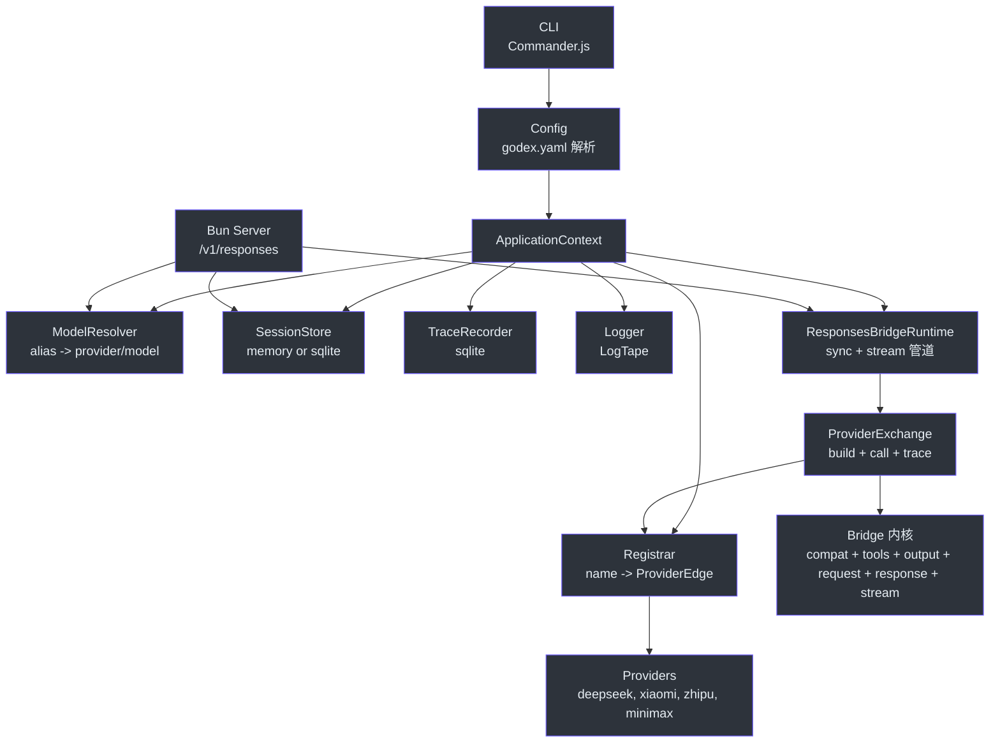
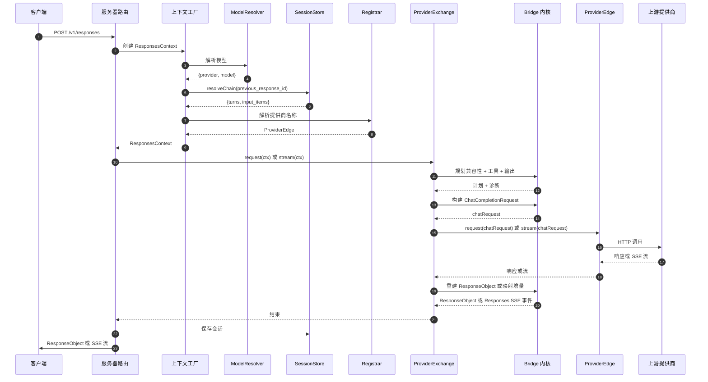
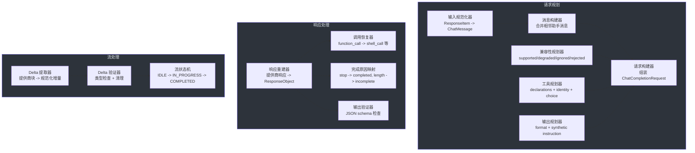

# 架构师指南

这是一份密集的、有明确立场的架构指南，面向需要在系统层面理解 GodeX 的工程师。它假设你已阅读贡献者指南，理解领域词汇，正在评估权衡取舍、扩展 bridge 内核或做横切架构决策。

---

## 核心洞察

GodeX 是一个**协议翻译层**，不是代理。代理以最小的转换转发请求。GodeX 拥有两个从未设计为兼容的 API 表面 — OpenAI 的 Responses API 和 Chat Completions API — 之间的兼容性契约。代码库中的每个架构决策都源于这一事实。

Responses API 使用 `previous_response_id` 实现多轮对话。Chat Completions 使用扁平的 `messages` 数组。Responses API 支持七种工具类型。Chat Completions 支持一种。Responses API 有带严格验证的 `json_schema`。大多数提供商最多只有 `json_object`。Responses 流式 API 发出结构化的生命周期事件。Chat Completions 流式传输发出没有事件语义的 SSE 块。

GodeX 不会在一个薄包装层后面隐藏这些差异。它在每一层 — 对每个请求，在运行时 — 进行规划、翻译、降级、验证和重建。

---

## 架构伪代码

完整的请求生命周期，以 Python 风格伪代码表达：

```python
def handle_responses_request(request):
    # 1. 应用作用域（启动时创建一次）
    app = ApplicationContext(config)

    # 2. 解析哪个提供商处理此模型
    resolved = app.resolver.resolve(request.model)  # -> {provider, model}

    # 3. 如果存在 previous_response_id 则解析会话链
    session = None
    if request.previous_response_id:
        session = app.session_store.resolve_chain(
            request.previous_response_id
        )  # -> {turns, input_items}

    # 4. 获取提供商边界
    provider = app.registrar.resolve(resolved.provider)  # -> ProviderEdge

    # 5. 创建请求作用域上下文
    ctx = ResponsesContext(app, request, session, resolved, provider)

    # 6. 规划兼容性
    compatibility = plan_bridge_compatibility(request, provider.spec.capabilities)
    # -> {parameters, responseFormat, diagnostics}
    # 每个决策为：supported | degraded | ignored | rejected

    # 7. 规划工具
    tool_plan = plan_tools(request.tools, request.tool_choice, provider.spec)
    # -> {declarations, providerToolChoice, decisions}
    # 工具类型为：supported | degraded (mapped) | ignored | rejected

    # 8. 规划输出合约
    output_contract = plan_output_contract(request.text.format, compatibility)
    # -> {requested, providerResponseFormat, syntheticInstruction, requiresValidJson}

    # 9. 构建 Chat Completions 请求
    chat_request = build_chat_request(
        model=resolved.model,
        messages=session.input_items + normalize(request.input),
        tools=tool_plan.declarations,
        tool_choice=tool_plan.providerToolChoice,
        response_format=output_contract.providerResponseFormat,
        options=request,  # temperature, top_p, max_output_tokens 等
    )

    # 10. 应用提供商特定补丁（hooks）
    if provider.spec.hooks.patchRequest:
        chat_request = provider.spec.hooks.patchRequest(chat_request)

    # 11. 调用上游提供商
    if request.stream:
        return handle_streaming(ctx, provider, chat_request, tool_plan, output_contract)
    else:
        return handle_sync(ctx, provider, chat_request, tool_plan, output_contract)


def handle_sync(ctx, provider, chat_request, tool_plan, output_contract):
    # 调用上游
    provider_response = provider.request(chat_request)

    # 通过提供商访问器提取数据（多态分派）
    text = provider.spec.response.outputText(provider_response)
    finish = provider.spec.response.finishReason(provider_response)
    usage = provider.spec.response.usage(provider_response)
    tool_calls = extract_tool_calls(provider_response)

    # 重建 ResponseObject
    response = ResponseObject(
        id=ctx.response_id,
        status=map_finish_reason(finish),  # stop -> completed, length -> incomplete
        output=reconstruct_output(text, tool_calls, tool_plan),
        usage=usage,
    )

    # 验证输出合约（如降级后的 JSON schema）
    if output_contract.requiresValidJson:
        validate_json_schema(response.output_text)  # 失败时抛出 BridgeError

    # 持久化会话（异步，错误记录但不致命）
    ctx.session_store.save(response)

    # 记录追踪
    ctx.trace_recorder.record_usage(response.usage)

    return response


def handle_streaming(ctx, provider, chat_request, tool_plan, output_contract):
    # 连接到上游 SSE 流
    provider_stream = provider.stream(chat_request)

    # 用工具身份初始化状态机用于调用恢复
    machine = ResponseStreamStateMachine(
        response_id=ctx.response_id,
        tool_identities=tool_plan.identities,
    )

    # 可组合 TransformStream 阶段管道：
    # 提供商 SSE 块
    #   -> Delta 提取 (provider.spec.stream.deltas)
    #   -> Delta 验证（类型检查，字段清理）
    #   -> 状态机（跟踪块，发出 Responses 事件）
    #   -> 错误包装（捕获异常，发出 response.failed）
    #   -> 输出合约验证（检查终端输出）
    #   -> 追踪记录（原始和转换后的事件）
    #   -> 响应日志（usage，时长）
    #   -> 会话持久化（如果 store != false）
    #   -> 兼容性诊断日志
    #   -> SSE 编码（在服务器路由中）

    return pipeline(
        provider_stream,
        extract_and_validate_deltas,
        feed_state_machine(machine),
        wrap_with_error_handler(machine),
        validate_terminal_output(output_contract),
        record_trace_raw,
        record_trace_transformed,
        log_response,
        persist_session,
        log_diagnostics,
    )
```

---

## 系统图

### 组件依赖图



### 请求数据流



### Bridge 内核详情



---

## Bridge 内核是最难的问题

`src/bridge/` 中的 bridge 内核是基础复杂性所在。理解它为什么难，需要理解两个 API 之间的语义鸿沟。

### 多轮语义不同

Responses API 使用 `previous_response_id` — 一个指向过去响应的服务器存储指针。客户端只发送当前轮次的输入。服务器负责重建完整的对话上下文。

Chat Completions API 使用扁平的 `messages` 数组。客户端每次发送所有消息。没有服务端状态。

GodeX 通过维护会话存储来弥合这个差距。当 `previous_response_id` 存在时：

1. 解析链 — 从最新到最旧跟随父指针
2. 将所有轮次扁平化为 API 形状的输入项（还不是 Chat 消息）
3. 通过输入规范化器将项规范化为 Chat Completions 消息
4. 通过消息构建器合并带有工具调用的相邻助手消息
5. 将历史前置到当前输入

输入规范化器处理 Responses API 中的每种项类型：普通消息、函数调用、函数调用输出、shell 调用、shell 调用输出、local shell 调用、apply patch 调用、自定义工具调用和推理项。每种类型有特定的规范化规则。例如，`shell_call` 项被规范化为带有函数工具调用的助手消息，其参数包含序列化为 JSON 的 shell 操作。

消息构建器合并相邻的助手消息。在 Responses API 中，每个工具调用是独立的项。在 Chat Completions 中，单个助手轮次上的多个工具调用必须在一条消息中。消息构建器检测相邻的 assistant+tool_call 消息并合并它们。

链解析必须处理循环、缺失的父节点、深度溢出和不完整的响应。会话存储必须存储 API 形状的快照 — 而不是提供商特定的聊天消息 — 因为提供商特定的转换属于 bridge。

### 工具类型不同

Responses API 支持 `function`、`shell`、`apply_patch`、`custom`、`mcp`、`tool_search` 和 `namespace` 工具。Chat Completions API 仅支持 `function` 工具。

GodeX 通过**工具计划**处理这个问题，将每个请求的工具分类为四个类别之一：

| 类别 | 含义 | 示例 |
|------|------|------|
| Supported | 提供商原生处理此类型 | 所有提供商上的 `function` |
| Degraded | 映射到不同类型 | DeepSeek 上 `shell` 映射为 `function` |
| Ignored | 静默跳过 | 未声明 `mcp` 的提供商上的 `mcp` |
| Rejected | 导致请求失败 | 对无法强制执行的降级工具使用显式 `tool_choice` |

将非 function 工具类型降级为 `function` 意味着 GodeX 还必须处理双向翻译：

**请求方向（Responses -> Chat Completions）：** 工具声明渲染器为降级的工具类型生成函数声明。对于自定义工具，它生成合成描述和参数 schema，指示模型将自定义输入作为字符串传递。对于 `shell` 和 `apply_patch` 等内置工具，它使用 tools 模块中的预定义函数 schema。

**响应方向（Chat Completions -> Responses）：** 工具调用恢复器使用工具身份映射来反转映射。当提供商返回名称为 `shell` 的函数调用时，恢复器查找身份，发现它是从 `shell` 降级的，并重建 `shell_call` 项。恢复将函数参数 JSON 解析回原始结构（例如，从 shell 调用中提取 `commands` 数组，或从 apply_patch 调用中提取 `operation` 对象）。

工具名称编解码器处理 Responses 工具名和提供商工具名之间的双向名称映射。这是必要的，因为某些提供商有命名限制（例如，最多 64 个字符，仅限字母数字加下划线和连字符）。默认编解码器清理名称以适应这些约束，并在冲突时去重提供商名称。

### 输出合约

Responses API 支持带严格验证的 `json_schema`。许多提供商仅支持 `json_object`（它仅指示模型返回 JSON）。

当提供商不支持 `json_schema` 时，GodeX 降级为 `json_object` 并：

1. 生成包含 JSON Schema、schema 名称、schema 描述和格式规则的**合成系统指令**
2. 指示模型返回符合 schema 的有效 JSON
3. 收到响应后，**验证输出 JSON** 的语法（用 JSON.parse 解析）
4. 如果验证失败且设置了 `strict`，响应被标记为失败

这种三步方法（降级 + 指令 + 验证）是务实的折衷。它不能像 OpenAI 原生的 `json_schema` 支持那样保证 schema 一致性，但提供了功能性回退。验证只是语法层面的（有效 JSON），不是语义层面的（符合 schema）。完整的 schema 验证可以在未来添加而不改变架构。

### 流式状态机

流式 bridge 是最复杂的子系统。Responses 流式 API 定义了严格的生命周期事件序列：

```
response.created
  -> response.in_progress
  -> [response.output_item.added
      -> response.content_part.added
      -> response.output_text.delta（重复）
      -> response.output_text.done
      -> response.content_part.done
      -> response.output_item.done]
  -> response.completed（或 response.incomplete 或 response.failed）
```

提供商 SSE 块不遵循此结构。提供商发送带有 `delta.content`、`delta.tool_calls` 和 `finish_reason` 的块 — 没有生命周期语义。

`ResponseStreamStateMachine` 弥合了这个差距。它：

- 跟踪当前**阶段**：`IDLE -> IN_PROGRESS -> COMPLETED | INCOMPLETE | FAILED`
- 管理文本、拒绝、推理和工具调用的**活动块**
- 为每个块转换发出正确序列的 Responses 事件
- **延迟终端事件** — 当 `finishReason` 增量到达时，状态机不会立即发出 `response.completed`。相反，它缓冲完成原因并继续处理剩余增量。当流结束（调用 `flush` 方法）时，状态机先关闭所有活动块，然后发出终端事件。

阶段转换是严格的。在 `IDLE` 状态或终端阶段之后尝试发出增量会抛出 `BridgeError`。这防止了格式错误的事件序列到达客户端。

状态机还处理**流式传输期间的工具调用身份恢复**。当提供商流式传输名称为 `shell` 的函数调用增量时，状态机查找工具身份映射并发出正确的 Responses 事件类型（function 工具的 `response.function_call_arguments.delta`，自定义工具的 `response.custom_tool_call_input.delta`）。

管道顺序很重要。提供商事件首先被 bridge 处理，输出合约在日志和持久化之前验证，然后 SSE 编码在服务器路由中完成。

---

## 设计权衡

| 特性 | 决策 | 原因 |
|------|------|------|
| ProviderSpec 作为类型化契约 | 提供商通过强类型对象声明能力 | 通用适配器（函数映射）失去类型安全，使兼容性规划脆弱。类型化 spec 支持编译时保证和 IDE 支持。 |
| 请求时兼容性规划 | 每个请求重新运行 `planBridgeCompatibility` | 静态配置无法考虑每请求特性，如实际使用了哪些工具类型。运行时规划产生精确的诊断信息。 |
| 会话作为 API 形状快照 | 存储 Responses API 类型，而非 Chat Completions 消息 | 提供商特定的转换属于 bridge。如果转换逻辑变更，存储的会话必须仍然可解释。API 形状快照是稳定的接口。 |
| 工具降级而非拒绝 | 静默将 `shell`/`apply_patch`/`custom` 映射为 `function` | 因为提供商不原生支持 `shell` 而拒绝请求会破坏太多工作流。带诊断的降级更有用。 |
| 流式传输中延迟终端事件 | 缓冲 `finishReason` 直到所有块关闭 | 在工具调用块关闭之前发出 `response.completed` 会产生无效事件序列。延迟保证正确排序。 |
| 异步追踪记录器 | 追踪写入是异步和批量的 | 每个事件上的同步写入会增加延迟。批量异步写入保持请求延迟低，同时提供可观测性。 |
| 单进程架构 | 无分布式状态，无消息队列 | GodeX 是网关，不是平台。单进程保持部署简单，消除分布式协调复杂性。 |
| SQLite 用于会话和追踪 | Bun 内置支持，无外部数据库依赖 | 零配置持久化。SQLite 很好地处理网关的写入模式（读多，小写）。 |
| `GodeXError` 层次结构 | 所有预期失败使用域特定的错误类 | 原始 `Error` 不提供域上下文、结构化日志或 HTTP 状态映射。层次结构支持跨层一致的错误处理。 |
| 不使用映射器森林 | 每个提供商只有 spec + client + hooks + 协议 DTO | 映射器森林（重复 bridge 逻辑的提供商特定适配器类）是此代码库明确避免的模式。bridge 内核拥有所有翻译。 |
| 测试同位置 | 测试作为 `*.test.ts` 放在源码旁边 | 提高可发现性。修改文件时，测试就在那里。无需目录搜索。 |
| Bun `ReadableStream` 管道 | 流式传输使用原生 `TransformStream` | Bun 的原生流是零拷贝的，无需 polyfill。可组合管道模式在 `TransformStream` 下很自然。 |

---

## 决策日志

### D1：ProviderSpec 作为提供商契约

**背景：** 提供商应如何声明其能力和行为？

**选项：**
- (a) 带函数映射的通用适配器模式
- (b) 带显式能力声明的类型化 `ProviderSpec` 接口
- (c) 带继承的每提供商适配器类

**决策：** 选项 (b) — 类型化 `ProviderSpec` 接口。

**理由：** bridge 内核需要在不知道特定提供商的情况下规划兼容性。类型化 spec 使能力声明显式化，支持 IDE 支持，并防止 bridge 意外依赖提供商特定行为。替代方案（通用适配器）失去类型安全，难以产生精确诊断。第三种选项（适配器类）导致映射器森林和代码重复。

**后果：** 添加新提供商需要定义包含所有必需字段的 `ProviderSpec`。spec 接口是稳定的，很少变更。bridge 内核仅在 Responses API 协议变更或横切关注点需要新基础设施时才变更。

### D2：运行时兼容性规划

**背景：** 何时应规划兼容性？

**选项：**
- (a) 启动时静态配置 — 全局拒绝不支持的功能
- (b) 每请求运行时规划 — 分析实际使用的内容

**决策：** 选项 (b) — 每请求运行时规划。

**理由：** 提供商可能支持 `function` 工具但不支持 `shell` 工具。静态配置无法表达"支持这种工具类型但不支持那种"。运行时规划产生每请求诊断，准确告诉调用者什么被支持、降级、忽略或拒绝。诊断信息附加到 `ResponsesContext` 并由管道记录。

**后果：** 每个请求运行兼容性规划、工具规划和输出合约规划。性能成本可忽略（全部是同步、内存操作，无 I/O）。诊断收益显著。

### D3：会话存储作为 API 快照

**背景：** 会话数据应以什么格式存储？

**选项：**
- (a) 提供商原生的 Chat Completions 消息
- (b) API 形状的 Responses 快照
- (c) 自定义中间格式

**决策：** 选项 (b) — API 形状的 Responses 快照。

**理由：** bridge 是唯一理解如何在 Responses 和 Chat Completions 之间转换的组件。如果存储的会话使用提供商原生消息，转换逻辑的变更会破坏存储的历史。API 形状快照是会话存储和 bridge 之间的稳定契约。

**后果：** 会话存储永远不需要理解提供商特定格式。bridge 必须在每个请求上重新转换存储的快照，但这对于多轮对话已经是必要的。`StoredResponseRequestSnapshot` 和 `StoredResponseSnapshot` 类型精确定义了存储的内容。

### D4：流式传输作为可组合 TransformStream 管道

**背景：** 流式事件应如何处理？

**选项：**
- (a) 单体流处理器
- (b) 可组合 `TransformStream` 阶段链

**决策：** 选项 (b) — 可组合 `TransformStream` 管道。

**理由：** 流管道必须：bridge 提供商增量到 Responses 事件，验证输出合约，记录追踪事件，记录 usage，持久化会话，发出兼容性诊断。单体处理器会是一个包含多个关注点的单一函数。可组合阶段保持每个关注点隔离且可测试。每个阶段可以通过管道传入测试数据独立测试。

**后果：** 管道顺序很重要，必须小心维护。重新排序阶段可能以微妙的方式改变行为。当前顺序为：追踪原始事件，bridge 增量到 Responses 事件，错误包装，输出合约验证，追踪转换后事件，响应日志，会话持久化，兼容性诊断。

### D5：带域代码的错误层次结构

**背景：** 错误应如何表示？

**选项：**
- (a) 带字符串消息的原始 `Error`
- (b) 带域、代码、状态和上下文的自定义错误类
- (c) Result 类型（永不抛出）

**决策：** 选项 (b) — 自定义错误类（`GodeXError` 层次结构）。

**理由：** GodeX 处理 HTTP 请求。错误必须映射到 HTTP 状态码，使用结构化上下文记录，并使用域特定代码追踪。原始 `Error` 不提供这些。Result 类型会增加复杂性，对于必须始终产生 HTTP 响应的网关没有明确收益。`GodeXError` 上的 `toLogEntry` 方法提供了清晰的结构化日志表示。

**后果：** 所有预期失败必须使用适当的 `GodeXError` 子类。意外失败（bug）仍然产生原始 `Error` 并在路由层被捕获。错误层次结构为：`GodeXError` -> `ServerError`（域：server），`BridgeError`（域：bridge），`ProviderError`（域：provider，状态：502），`SessionError`（域：session）。

### D6：工具降级而非拒绝

**背景：** 当提供商不原生支持工具类型时，应该拒绝请求还是降级？

**选项：**
- (a) 拒绝 — 以不支持的参数错误失败
- (b) 降级 — 映射到支持的类型并附带诊断

**决策：** 选项 (b) — 带诊断的降级。

**理由：** Responses API 支持大多数提供商永远不会原生支持的工具类型（`shell`、`apply_patch`、`custom`）。拒绝这些请求会使 GodeX 对许多实际用例无用。降级为 `function` 并附带清晰诊断更实际。工具声明渲染器生成合成描述，指示模型如何使用降级接口。

**后果：** 调用恢复必须反转响应的降级。工具身份映射必须跟踪哪些工具被降级，以便函数调用可以重建为原始工具类型。如果恢复失败（例如，模型没有生成有效的 JSON 参数），系统回退到通用函数调用。

---

## 与类似系统的比较

### GodeX vs LiteLLM

LiteLLM 是一个基于 Python 的代理，将 100+ LLM 提供商归一化到统一的 Chat Completions API 后面。GodeX 在三个根本方面不同：

1. **翻译方向。** LiteLLM 翻译 Chat Completions -> 提供商特定格式。GodeX 翻译 Responses API -> Chat Completions。GodeX 面向较新的 API 表面；LiteLLM 面向较旧的。

2. **翻译深度。** LiteLLM 专注于参数映射和响应归一化。GodeX 规划兼容性，降级工具类型，管理会话链，验证结构化输出，并运行流式状态机。翻译更深，因为语义鸿沟更大。

3. **会话所有权。** LiteLLM 是无状态的 — 客户端每次发送完整上下文。GodeX 通过 `previous_response_id` 链拥有会话状态。这使 GodeX 成为有状态的网关，而不是无状态代理。

### GodeX vs OpenRouter

OpenRouter 是一个托管服务，将请求路由到多个提供商。它提供统一的 Chat Completions API 并处理计费、速率限制和故障转移。

1. **API 表面。** OpenRouter 暴露 Chat Completions。GodeX 暴露 Responses API。它们服务不同的客户端生态。

2. **自托管 vs 托管。** OpenRouter 是托管服务。GodeX 是自托管软件。这影响信任模型、数据驻留和运营复杂性。

3. **翻译深度。** OpenRouter 专注于路由和计费。GodeX 专注于协议翻译和兼容性管理。

### GodeX vs 简单反向代理

像 nginx 或 Caddy 这样的反向代理可以将请求转发到上游提供商。这仅在客户端和服务器使用相同协议时有效。Responses API 和 Chat Completions API 有根本不同的语义。代理不能：

- 将 `previous_response_id` 转换为 `messages` 数组
- 将 `shell` 工具映射为 `function` 工具
- 将 `json_schema` 降级为带合成指令的 `json_object`
- 从 SSE 块重建流式生命周期事件
- 管理带循环检测和深度限制的会话链
- 产生兼容性诊断

GodeX 不是代理，因为两个 API 不兼容。它是一个拥有兼容性契约的翻译层。

---

## 风险领域

### 流式状态机正确性

`ResponseStreamStateMachine` 是最复杂的单一组件。它管理多个活动块（文本、拒绝、推理、工具调用），必须按正确顺序发出事件。延迟终端事件模式意味着 `finishReason` 被缓冲直到所有块关闭。如果一个块没有正确关闭，状态机会发出不正确的事件。

**尖锐边缘：** 如果提供商发送 `finishReason` 增量后跟着更多增量（不应发生但没有任何提供商保证），状态机会抛出代码为 `bridge.stream.delta_after_terminal` 的 `BridgeError`。这是正确的行为，但可能让期望晚期增量被静默丢弃的提供商作者感到意外。

**尖锐边缘：** 如果提供商在流结束前发送没有完整 `id` 和 `name` 的工具调用增量，状态机抛出代码为 `bridge.stream.incomplete_tool_call` 的 `BridgeError`。这表明提供商协议违规，不是 GodeX bug。

### 会话链完整性

会话链使用父指针。如果存储的会话被损坏或删除，从该点开始的整条链就会断裂。链解析处理 `not_found`、`cycle_detected` 和 `depth_exceeded` 错误，但无法从数据损坏中恢复。

**尖锐边缘：** 使用 `sqlite` 后端的会话存储受 SQLite 并发写入限制。在多进程部署中（目前不支持），写入竞争可能导致会话保存失败。内存后端是进程本地的，不在实例间共享。

**尖锐边缘：** 如果响应以 `status: "incomplete"` 存储，链解析默认跳过它（可通过 `include_incomplete` 配置）。这意味着不完整的响应对后续轮次不可见，这通常是正确的，但可能让期望部分输出出现在历史中的调用者感到意外。

### 降级后的输出合约验证

当 `json_schema` 降级为 `json_object` 时，GodeX 在收到响应后验证输出 JSON。此验证是尽力而为的 — 它不能保证模型会产生一致的 JSON。如果验证失败，响应被标记为失败，但调用者已经收到了流式增量。

**尖锐边缘：** 在流式模式下，输出合约验证在流基本完成后发生。客户端可能在验证错误作为终端事件发出之前已经处理了部分输出。这意味着客户端可能先看到 `response.output_text.delta` 事件，然后是 `response.failed` 而不是 `response.completed`。

### 提供商 Spec 能力准确性

兼容性计划仅与提供商声明的能力一样好。如果提供商 spec 声称支持 `json_object` 但提供商的实现不可靠，GodeX 会路由请求到该提供商并产生降级结果。

**尖锐边缘：** 提供商能力应针对真实上游行为测试，而不仅仅是文档声明。带模拟上游的 E2E 测试套件验证 bridge 逻辑，但不验证实际提供商行为。实时测试（`bun run test:zhipu` 等）是验证声明的能力是否符合现实的唯一方法。

### 追踪内容敏感性

当配置 `trace.capture_payload: true` 时，完整的请求和响应内容存储在 SQLite 中。这些内容可能包含头中的 API 密钥、消息中的用户内容和包含敏感信息的模型输出。

**尖锐边缘：** 追踪数据库必须被视为敏感数据。不要将它们提交到版本控制或通过不安全的端点暴露。默认配置下内容捕获是禁用的。

---

## 运维关注

### 可观测性

GodeX 提供三层可观测性：

1. **结构化日志** 通过 LogTape。每个请求产生包含结构化内容的日志条目，包括提供商、模型、状态、持续时间、usage 和缓存命中率。日志级别可按接收器（控制台、文件或两者）配置。

2. **追踪记录** 在 SQLite 中。每个请求产生请求、usage、事件和错误记录。内容捕获默认关闭；启用 `trace.capture_payload: true` 进行调试。追踪记录器支持批量写入和可配置的队列大小。

3. **兼容性诊断** 附加到每个请求。诊断枚举什么被支持、降级、忽略或拒绝，带有严重级别（`info`、`warn`、`error`）和元数据。这些由管道在每个请求结束时记录。

### 扩展

GodeX 是单进程应用。它使用 Bun 内置的 HTTP 服务器，通过事件循环处理并发请求。没有内置集群支持。

水平扩展方式：

- 在负载均衡器后面部署多个实例
- 使用带共享文件系统（如 NFS）的 `sqlite` 会话后端或切换到外部会话存储
- 追踪数据库默认是每实例的

会话存储是主要的扩展瓶颈。内存支持的会话是进程本地的。SQLite 支持的会话需要多实例部署的共享存储。

### 故障模式

| 故障 | 检测 | 恢复 |
|------|------|------|
| 上游提供商超时 | 带代码 `provider.upstream.timeout` 的 `ProviderError` | 向客户端返回 502 及错误详情 |
| 上游提供商速率限制 | 带代码 `provider.upstream.rate_limit` 的 `ProviderError` | 向客户端返回 502；调用者应退避重试 |
| 上游提供商服务器错误 | 带代码 `provider.upstream.server_error` 的 `ProviderError` | 向客户端返回 502 |
| 上游提供商通用错误 | 带代码 `provider.upstream.error` 的 `ProviderError` | 向客户端返回 502 及上游消息（如有） |
| 会话链未找到 | 带代码 `session.chain.not_found` 的 `SessionError` | 向客户端返回 400 |
| 会话链循环 | 带代码 `session.chain.cycle_detected` 的 `SessionError` | 向客户端返回 400；表明数据损坏或 bug |
| 会话链深度超限 | 带代码 `session.chain.depth_exceeded` 的 `SessionError` | 向客户端返回 400；配置 `max_depth` 增加限制 |
| Bridge 兼容性拒绝 | 带代码 `bridge.request.unsupported_parameter` 的 `BridgeError` | 向客户端返回 400 及诊断详情 |
| 流状态机违规 | 带代码 `bridge.stream.invalid_transition` 的 `BridgeError` | 向客户端返回 500；表明 bug 或提供商行为变更 |
| 输出合约验证失败 | 响应标记为 `incomplete` 或 `failed` | 客户端收到带错误的终端事件 |
| 提供商注册缺失 | 带代码 `server.provider.not_registered` 的 `ServerError` | 向客户端返回 400；检查配置中的 `spec` 字段 |
| 无效 JSON 请求体 | 带代码 `server.request.invalid_json` 的 `ServerError` | 向客户端返回 400 |

### 配置验证

GodeX 在启动时验证配置。无效配置（缺少必需字段、未识别的提供商 spec、格式错误的别名）会产生清晰的即时错误。使用 `godex config check --config ./godex.yaml` 在部署前验证配置。

没有 `spec` 字段的遗留提供商配置会被有意拒绝。这防止了无法确定提供商类型的模糊配置。

### 健康端点

`/health` 端点报告已注册和不支持的提供商。不支持的提供商是指其 `spec` 字段不匹配任何内置工厂的提供商。此端点可用于监控和负载均衡器健康检查。

---

## 架构不变量

这些是绝不能违反的规则。如果你发现自己即将违反其中一条，停下来重新考虑。

1. **bridge 内核永远不导入提供商特定代码。** `src/bridge/` 完全针对 `ProviderSpec` 接口操作。添加新提供商不需要对 bridge 内核做任何修改。

2. **兼容性决策不在提供商中重复。** 提供商 hooks 暴露协议差异（例如，如何提取 usage）。bridge 决定支持、降级、拒绝和诊断。

3. **会话存储保持 API 形状快照。** 提供商特定的转换属于 bridge，不属于会话存储。`StoredResponseRequestSnapshot` 和 `StoredResponseSnapshot` 类型是稳定契约。

4. **预期失败使用 `GodeXError` 子类。** 永远不要对预期运行时失败抛出原始 `Error`。使用带域代码的 `ServerError`、`BridgeError`、`ProviderError` 或 `SessionError`。

5. **流式管道顺序是有意设计的。** 追踪原始 -> bridge 增量 -> 错误包装 -> 输出验证 -> 追踪转换 -> 日志 -> 会话持久化 -> 诊断。不要在不理解依赖关系的情况下重新排序。

6. **不使用映射器森林。** 每个提供商只有 spec + client + hooks + 协议 DTO。没有适配器类，没有 bridge 外面的提供商特定翻译逻辑。

7. **版本控制中不含秘密。** API 密钥、追踪数据库、会话数据库和包含真实凭证的本地配置文件永远不被提交。

8. **提交前运行 `bun run check`。** 这是最基本的质量门禁。对于路由、提供商、会话、流式或追踪的更改，也要运行 `bun run test:e2e`。

## 模块边界强制

代码库通过 [src/module-boundaries.test.ts](https://github.com/Ahoo-Wang/GodeX/blob/main/src/module-boundaries.test.ts) 中的测试强制执行模块边界。此测试防止某些模块从其他模块导入，确保架构不变量在代码层面得到维护。

关键边界是 `src/bridge/` 永远不能从 `src/providers/` 导入。如果贡献者意外向 bridge 内核添加了提供商特定的导入，边界测试将在 CI 中失败。

## 请求流程演练

本节跟踪一个完整的请求通过系统，展示每一步涉及的文件。

### 步骤 1：服务器接收请求

Bun HTTP 服务器接收 `POST /v1/responses` 请求。`src/server/routes/responses/` 中的路由处理器将请求体解析为 `ResponseCreateRequest`，验证必需字段（model 是必需的），并通过上下文工厂创建 `ResponsesContext`。

### 步骤 2：上下文创建

`src/context/` 中的上下文工厂通过以下步骤创建 `ResponsesContext`：

1. 通过 `ModelResolver` 解析模型（别名查找或 `provider/model` 解析）
2. 通过 `Registrar.resolve(resolved.provider)` 查找提供商以获取 `ProviderEdge`
3. 如果存在 `previous_response_id` 则解析会话链
4. 生成请求 ID 和响应 ID
5. 创建 `OutputContractSlot`（输出合约的可变槽位）

### 步骤 3：提供商交换

`src/responses/provider-exchange.ts` 中的 `ProviderExchange` 编排 bridge 内核：

1. 从 `src/bridge/request/request-builder.ts` 调用 `buildChatCompletionRequest`
2. 在请求构建器内部，`planBridgeCompatibility` 分析提供商支持什么
3. `planTools` 映射工具声明和 tool_choice
4. `planOutputContract` 处理结构化输出降级
5. 输入规范化器将 Responses 项转换为 Chat 消息
6. 消息构建器合并相邻的助手消息
7. 请求构建器组装最终的 `ChatCompletionCreateRequest`
8. 交换记录追踪事件并调用 `ctx.provider.request()` 或 `ctx.provider.stream()`

### 步骤 4：提供商调用

`ProviderEdge` 委托给提供商的 `ChatProviderClient`，后者向上游提供商发送 HTTP 请求。客户端将 fetch 错误包装为带有正确域代码（超时、速率限制、服务器错误或通用错误）的 `ProviderError` 实例。

### 步骤 5：响应重建（同步）

对于同步请求，`src/bridge/response/response-reconstructor.ts` 中的 `reconstructResponseObject`：

1. 通过提供商的响应访问器提取数据
2. 将完成原因映射到终端状态
3. 使用工具身份映射恢复工具调用
4. 验证输出合约（降级 `json_schema` 的 JSON 验证）
5. 构建 `ResponseObject`

### 步骤 6：流处理（流式）

对于流式请求，`StreamPipeline` 创建 `TransformStream` 阶段管道：

1. `TraceTransformer`（原始）— 记录原始上游事件
2. `ProviderStreamEventBridge` — 将增量送入状态机，发出 Responses 事件
3. 错误包装 — 捕获异常，发出 `response.failed`
4. `ResponseOutputContractValidationTransformer` — 验证终端输出
5. `TraceTransformer`（转换后）— 记录转换后事件
6. `ResponseLogTransformer` — 记录 usage 和持续时间
7. `ResponseSessionPersistenceTransformer` — 持久化完成的会话
8. `CompatibilityLogTransformer` — 记录兼容性诊断

### 步骤 7：会话持久化

会话存储持久化包含请求和响应的 API 形状快照的 `StoredResponseSession`。会话持久化错误作为警告记录但不使请求失败。

### 步骤 8：追踪记录

追踪记录器将请求、usage、事件和错误记录写入 SQLite。追踪写入是异步和批量的，以最小化延迟影响。

## 扩展 Bridge 内核

扩展 bridge 内核时，遵循以下原则：

### 添加新的兼容性维度

1. 在 `src/bridge/compatibility/compatibility-plan.ts` 的 `ProviderCapabilities` 中添加能力字段
2. 在 `src/bridge/compatibility/planner.ts` 中添加规划函数
3. 将计划接入 `src/bridge/request/request-builder.ts` 的 `buildChatCompletionRequest`
4. 更新所有提供商 spec 以声明新能力
5. 为 supported、degraded、ignored 和 rejected 路径添加测试

### 添加新的流事件类型

1. 在 `src/protocol/openai/responses/` 的 Responses 协议类型中添加事件类型
2. 在 `ResponseStreamStateMachine` 中添加新的块类型
3. 在 `src/bridge/stream/stream-delta.ts` 的 `ProviderStreamDelta` 中添加增量字段
4. 将增量接入 `src/bridge/stream/stream-reconstructor.ts` 的 `mapProviderDeltasToEvents`
5. 确保状态机在 `closeActiveBlocks` 中关闭新的块类型
6. 更新所有提供商的 `streamDeltas` hooks 以发出新的增量类型

### 添加新的会话后端

1. 实现 `src/session/types.ts` 中的 `ResponseSessionStore` 接口
2. 处理链遍历、循环检测、深度限制和冲突检查
3. 在 `src/context/session-store-factory.ts` 中添加后端工厂
4. 将后端名称添加到配置 schema
5. 编写覆盖所有错误路径（未找到、循环、深度、冲突）的测试

## 数据模型深入

### ProviderCapabilities 结构

`ProviderCapabilities` 类型是提供商和 bridge 内核之间的核心数据契约。理解其结构对任何扩展系统的人都是必要的。

```
ProviderCapabilities
  parameters: { supported: Set<string> }
  tools: { supported: Set<string>, degraded?: Map<string, string>, maxTools?: number }
  toolChoice: { supported: Set<string> }
  responseFormats: { supported: Set<string> }
  reasoning: { effort: "none" | "boolean" | "native" }
  streaming: { usage: boolean }
```

`reasoning.effort` 字段控制推理的处理方式：

| 模式 | 行为 |
|------|------|
| `"none"` | 推理被静默忽略。`reasoning_effort` 参数不被转发。 |
| `"boolean"` | 推理映射为布尔 `thinking` 字段（`"none"` -> 禁用，其他值 -> 启用）。 |
| `"native"` | `reasoning_effort` 参数原样转发给提供商。 |

`tools.degraded` 映射对工具身份系统至关重要。每个条目将 Responses 工具类型映射到提供商工具类型。bridge 内核在工具规划期间使用此映射生成正确的函数声明并构建调用恢复的工具身份映射。

### CompatibilityPlan 结构

`CompatibilityPlan` 由 `planBridgeCompatibility` 为每个请求生成：

```
CompatibilityPlan
  capabilities: ProviderCapabilities           # 提供商声明的能力
  diagnostics: CompatibilityDiagnostic[]       # 警告和错误
  parameters: Record<string, CompatibilityDecision>  # 每参数决策
  responseFormat?: CompatibilityDecision       # 响应格式决策
  reasoning?: CompatibilityDecision            # 推理决策
```

每个 `CompatibilityDecision` 有一个 `action`（supported、degraded、ignored、rejected），可选的 `effectiveValue`，和一个 `reason`。计划由请求构建器消费，决定哪些参数转发、哪些丢弃。

### ToolPlan 结构

`ToolPlan` 由 `planTools` 为每个请求生成：

```
ToolPlan
  enabled: boolean                             # 是否有任何工具活跃
  declarations: ToolDeclarationPlan[]          # 映射的工具声明
  providerToolChoice?: ResponseToolChoice      # 映射的 tool_choice
  decisions: PlannedToolDecision[]             # 每工具决策
```

每个 `ToolDeclarationPlan` 记录请求类型/名称和提供商类型/名称之间的映射：

```
ToolDeclarationPlan
  requestedType: string    # 例如 "shell"
  providerType: string     # 例如 "function"
  requestedName: string    # 例如 "shell"
  providerName: string     # 例如 "shell"（或清理后的版本）
  tool: ResponseTool       # 原始工具定义
```

此映射在调用恢复期间由工具身份映射使用。

### OutputContractPlan 结构

`OutputContractPlan` 由 `planOutputContract` 为每个请求生成：

```
OutputContractPlan
  requested: ResponseFormatTextConfig | undefined   # 调用者请求的
  providerResponseFormat?: unknown                  # 发送给提供商的
  syntheticInstruction?: string                     # 降级 schema 时注入的系统指令
  requiresValidJson: boolean                        # 是否验证输出 JSON
```

当 `json_schema` 降级为 `json_object`：
- `providerResponseFormat` 设置为 `{ type: "json_object" }`
- `syntheticInstruction` 包含 schema 作为带格式规则的字符串
- 如果原始请求有 `strict: true`，则 `requiresValidJson` 为 `true`

### 追踪数据模型

追踪系统在 SQLite 中记录四种类型的事件：

| 记录类型 | 字段 | 用途 |
|---------|------|------|
| `request` | request_id, response_id, provider, model, stream, payload? | 记录发出的提供商请求 |
| `usage` | request_id, response_id, provider, model, input_tokens, output_tokens, total_tokens, cached_tokens?, reasoning_tokens? | 记录 token 用量 |
| `event` | request_id, response_id, provider, model, event_name, sequence?, payload? | 记录原始和转换后的流事件 |
| `error` | request_id, response_id, provider, model, event_name, error_type, domain, code, message, status?, payload? | 记录错误 |

所有记录共享 `request_id`、`response_id`、`provider`、`model` 和 `created_at` 字段用于关联。

### 会话数据模型

会话存储持久化 `StoredResponseSession` 条目：

```
StoredResponseSession
  id: ResponseId
  previous_response_id?: ResponseId | null
  conversation_id?: ConversationId | null
  created_at: number
  completed_at?: number | null
  status: ResponseStatus
  request: StoredResponseRequestSnapshot
  response: StoredResponseSnapshot
  metadata?: Record<string, unknown>
```

`StoredResponseRequestSnapshot` 保留原始的 `input`、`instructions`、`model`、`tools`、`tool_choice`、`reasoning`、`text` 和 `truncation` 字段。`StoredResponseSnapshot` 保留 `output` 条目、`output_text`、`usage`、`error` 和 `incomplete_details`。

链解析返回 `ResponseSessionSnapshot`：

```
ResponseSessionSnapshot
  previous_response_id: ResponseId
  turns: StoredResponseSession[]       # 从最旧到最新排序
  input_items: ResponseItem[]          # 用于历史重建的扁平化项
```

## 性能考量

### 热路径

每个请求的热路径为：上下文创建 -> 兼容性规划 -> 工具规划 -> 输出规划 -> 请求构建 -> 提供商调用 -> 响应重建。前五步是同步的内存操作。它们的组合成本与提供商 HTTP 调用相比可忽略。

### 分配模式

bridge 内核每个请求创建多个中间对象（CompatibilityPlan、ToolPlan、OutputContractPlan、规范化消息、工具声明）。这些是短生命周期的，在请求完成后有资格被垃圾回收。流式管道每个请求创建一个 `ResponseStreamStateMachine`，加上每个活动文本/推理/工具调用块的对象。

### I/O 边界

GodeX 是 I/O 密集型的，不是 CPU 密集型的。主要延迟是上游提供商 HTTP 调用。会话持久化和追踪记录的 SQLite 操作是异步的，不阻塞响应路径。

### 内存使用

主要内存消费者：
- 会话链（与存储的响应数量成比例）
- 活跃流式连接（每个持有状态机和活动块对象）
- 追踪批量缓冲区（可配置的队列大小）

内存支持的会话无限增长，直到进程重启。SQLite 支持的会话持久化到磁盘，不会随历史长度成比例增长内存。
