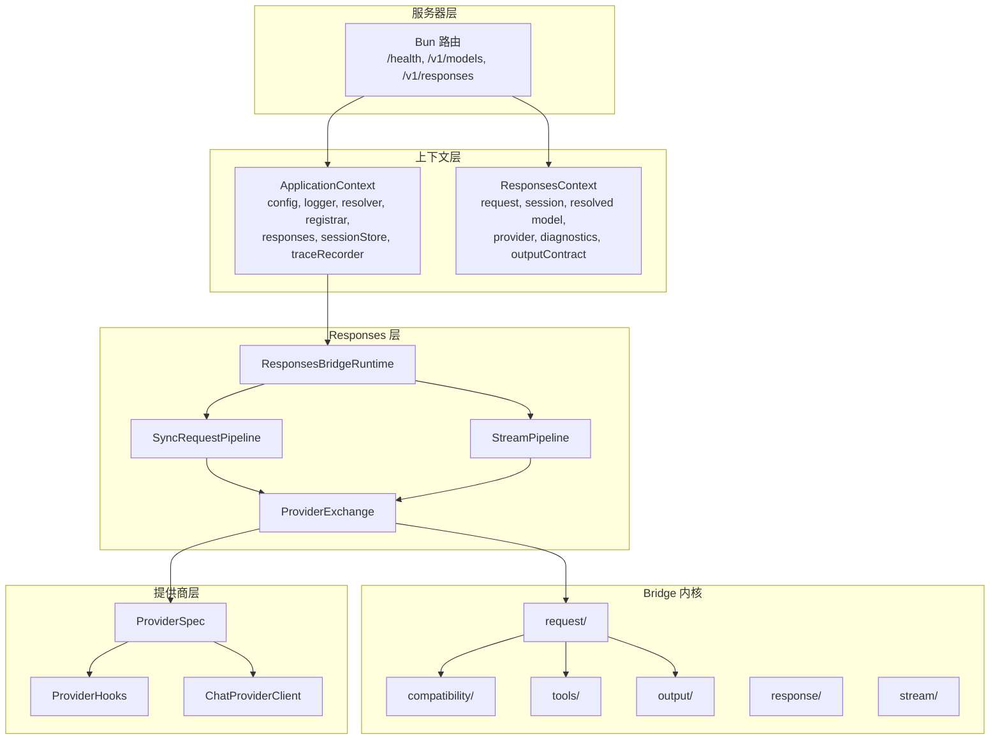

# 架师指南

本指南涵盖塑造 GodeX 的架构决策、类型安全模型和设计模式。面向需要深入了解系统后再进行扩展或修改的高级工程师。

## 类型安全模型

Bridge 内核在 `ProviderSpec` 和 `ProviderEdge` 上使用少量泛型类型参数：

```ts
ProviderSpec<TBridgeRequest, TResponse, TChunk, TProviderRequest>
ProviderEdge<TBridgeRequest, TResponse, TChunk, TProviderRequest>
```

- `TBridgeRequest` — bridge 的 Chat Completions 请求类型（通常为 `ChatCompletionCreateRequest`）。
- `TResponse` — 提供商的响应类型。
- `TChunk` — 提供商的流块类型。
- `TProviderRequest` — 提供商的原生请求类型（当 `hooks.patchRequest` 转换时）。

Bridge 内核针对 `TBridgeRequest` 和 `ProviderSpec` 访问器工作。`Registrar` 将泛型擦除为 `ProviderEdge<unknown, unknown, unknown>` 进行运行时存储。类型安全通过 spec 的类型化访问器在提供商边界处保留。

## 架构层



## 关键设计决策

| 决策 | 理由 |
|------|------|
| Bridge 内核拥有所有兼容性策略 | 防止跨提供商重复；提供商只暴露协议差异 |
| `ProviderSpec` 是数据对象，不是类 | 易于组合、测试和序列化；无继承层次 |
| 可组合 `TransformStream` 阶段 | 零依赖、原生平台 API；每个关注点隔离 |
| `ResponseStreamStateMachine` 拥有事件生产 | 流状态的单一事实来源；提供商只提供增量 |
| `OutputContractSlot` 模式 | 延迟输出合约初始化，bridge 设置、管道读取 |
| 每请求累积兼容性诊断 | 非侵入式日志记录；bridge 和日志之间无侧通道耦合 |

## 流式管道拓扑

流式管道通过 `pipeTransform()` 连接八个阶段：

```
提供商 SSE 流
  → TraceTransformer (原始)
  → ProviderStreamEventBridge (状态机)
  → StreamErrorHandler
  → OutputContractValidation
  → TraceTransformer (转换后)
  → ResponseLogTransformer
  → SessionPersistence (可选)
  → CompatibilityLog
  → ResponseSseEncoder (在服务器路由中)
```

管道顺序很重要：提供商事件先被桥接，输出合约在日志和持久化之前验证，然后 SSE 编码在服务器路由中完成。

## 关键代码路径

1. [src/bridge/request/request-builder.ts](https://github.com/Ahoo-Wang/GodeX/blob/main/src/bridge/request/request-builder.ts) — 带兼容性、工具和输出规划的请求构建
2. [src/responses/stream-pipeline.ts](https://github.com/Ahoo-Wang/GodeX/blob/main/src/responses/stream-pipeline.ts) — 流式编排
3. [src/bridge/stream/response-stream-state-machine.ts](https://github.com/Ahoo-Wang/GodeX/blob/main/src/bridge/stream/response-stream-state-machine.ts) — 流状态机
4. [src/responses/sync-request-pipeline.ts](https://github.com/Ahoo-Wang/GodeX/blob/main/src/responses/sync-request-pipeline.ts) — 同步编排
5. [src/responses/stream-transforms/](https://github.com/Ahoo-Wang/GodeX/blob/main/src/responses/stream-transforms/) — 可组合转换器阶段

[系统总览](/zh/02-architecture/overview) · [流式管道](/zh/02-architecture/stream-pipeline) · [Bridge 内核](/zh/02-architecture/bridge-kernel)
