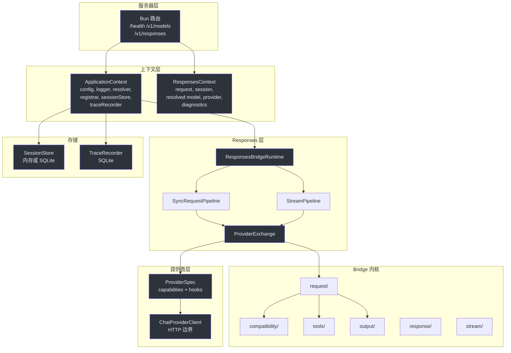
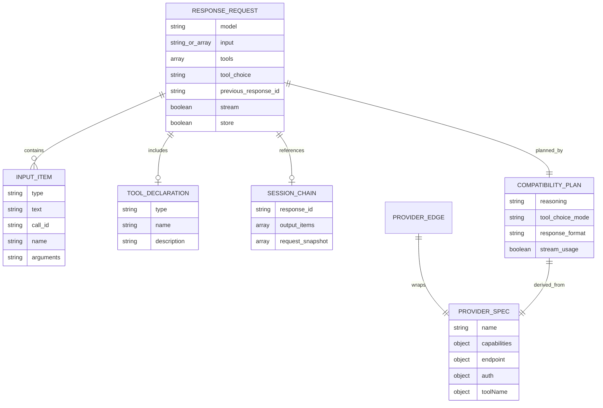
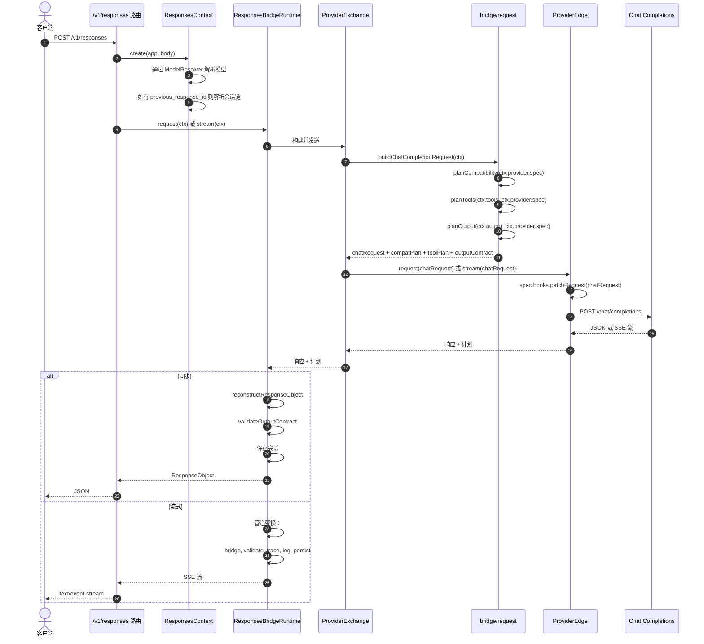
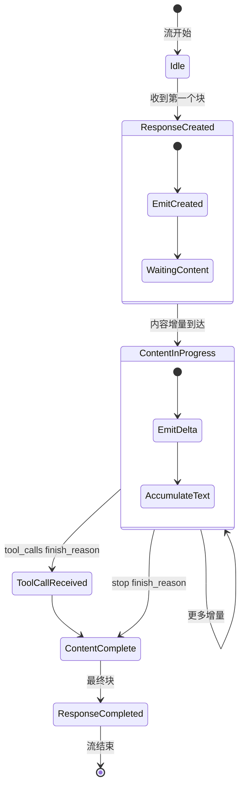
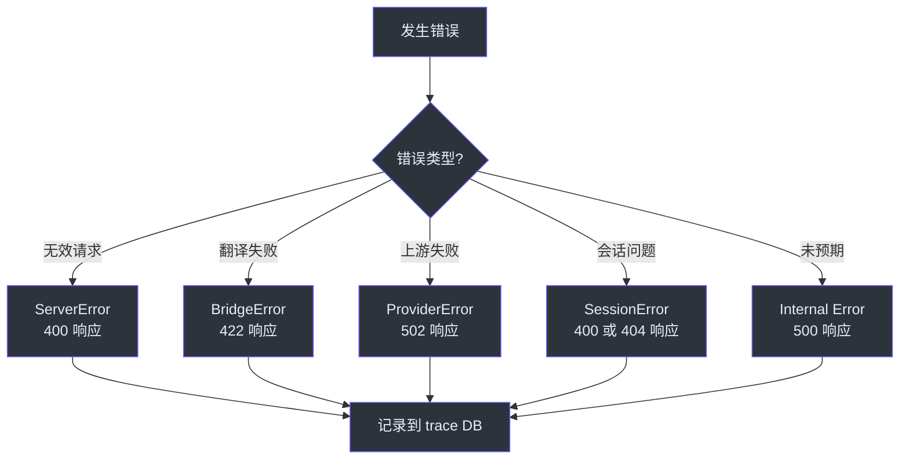

# 架构师指南

本指南涵盖塑造 GodeX 的架构决策、类型安全模型和设计模式。面向需要深入了解系统后再进行扩展或修改的高级工程师。

## 概要

GodeX 是一个单进程 Bun HTTP 网关，将 OpenAI Responses API 调用翻译为提供商特定的 Chat Completions API 调用。它负责协议翻译、会话链管理、工具身份映射和结构化输出验证。模型推理完全委托给上游提供商（DeepSeek、MiniMax、智谱）。核心架构洞察是：bridge 内核完全与提供商无关 — 提供商是数据驱动的 spec 加上可选的 hooks。

## 核心架构洞察

Bridge 内核（`src/bridge/`）对具体提供商一无所知。它操作 `ProviderSpec` 接口，该接口声明能力和访问器。提供商特定的行为通过 hooks 注入。这意味着添加新提供商不需要修改 bridge 内核。

概念上，用 Python 伪代码表达：

```python
# Bridge 不知道 DeepSeek 或 MiniMax 的存在。
# 它只知道 Spec 协议。
class ProviderSpec(Protocol):
    name: str
    capabilities: Capabilities
    hooks: Optional[Hooks]

    def first_choice(self, response) -> dict: ...
    def finish_reason(self, response) -> str: ...
    def output_text(self, response) -> str: ...

# 添加新提供商只需实现此协议，
# 不需要修改 bridge。
```

这种分离意味着 bridge 内核只在 Responses API 协议变更或横切关注点（如结构化输出）需要新基础设施时才需要修改。

## 系统架构

<!-- Sources: src/context/application-context.ts, src/responses/runtime.ts, src/bridge/provider-spec/contract.ts -->


系统的"心脏"是 `src/responses/provider-exchange.ts` 中的 `ProviderExchange`。它编排：通过 bridge 构建请求，通过 `ProviderEdge` 应用提供商补丁，调用上游，并返回带有兼容性计划的响应。

## 类型安全模型

Bridge 内核在 `ProviderSpec` 和 `ProviderEdge` 上使用少量泛型类型参数：

```typescript
ProviderSpec<TBridgeRequest, TResponse, TChunk, TProviderRequest>
ProviderEdge<TBridgeRequest, TResponse, TChunk, TProviderRequest>
```

| 参数 | 用途 |
|------|------|
| `TBridgeRequest` | Bridge 的 Chat Completions 请求类型（`ChatCompletionCreateRequest`） |
| `TResponse` | 提供商的特定响应类型 |
| `TChunk` | 提供商的特定流块类型 |
| `TProviderRequest` | 提供商的原生请求类型（当 `hooks.patchRequest` 转换时） |

`Registrar` 将泛型擦除为 `ProviderEdge<unknown, unknown, unknown>` 进行运行时存储。类型安全通过 spec 的类型化访问器在提供商边界处保留。这是有意的设计权衡：Registrar 层的运行时灵活性，提供商层的编译时安全。

与 Python 类型的对比：

| TypeScript | Python 等价 |
|-----------|-------------|
| `ProviderSpec<TReq, TRes, TChunk, TProvReq>` | `ProviderSpec[Req, Res, Chunk, ProvReq]` (Generic) |
| `ProviderEdge<unknown, unknown, unknown>` | `ProviderEdge[Any, Any, Any, Any]` (运行时擦除) |
| `readonly` 属性 | `Final` 属性或 frozen dataclass |
| 可辨识联合 | `Literal` 类型收窄 |

## 领域模型

<!-- Sources: src/protocol/openai/responses.ts, src/bridge/compatibility/compatibility-plan.ts, src/session/ -->


数据不变量：

| 不变量 | 强制方式 | 来源 |
|--------|---------|------|
| 能力创建后不可变 | Spec 所有字段 `readonly` | `src/bridge/provider-spec/contract.ts` |
| 会话链无循环 | 链解析中的循环检测 | `src/session/` |
| 工具身份在响应前恢复 | Bridge 管道中的调用恢复器 | `src/bridge/tools/call-restorer.ts` |
| 结构化输出对 `json_object` 进行验证 | 响应重建后的输出验证器 | `src/bridge/output/` |
| 提供商请求在上游调用前被修补 | `ProviderEdge.request()` / `stream()` | `src/bridge/provider-spec/factory.ts` |

## 组件类型与执行路径

| 组件 | 类型 | 执行路径 | 关键文件 |
|------|------|---------|---------|
| `ApplicationContext` | 单例 | 服务器启动时创建一次 | `src/context/application-context.ts` |
| `ResponsesContext` | 每请求工厂 | 每次 `/v1/responses` 调用创建 | `src/context/responses-context.ts` |
| `ModelResolver` | 单例服务 | 上下文创建期间调用 | `src/resolver/model-resolver.ts` |
| `CompatibilityPlanner` | 纯函数 | 请求构建期间调用 | `src/bridge/compatibility/planner.ts` |
| `ProviderEdge` | 注册单例 | 通过提供商名从 registrar 解析 | `src/bridge/provider-spec/factory.ts` |
| `ResponseStreamStateMachine` | 每流 | 每个流式请求创建 | `src/bridge/stream/response-stream-state-machine.ts` |
| `SessionStore` | 单例服务 | 每请求读/写 | `src/session/` |
| `TraceRecorder` | 单例，异步队列 | 写后批处理队列 | `src/trace/` |

## 请求生命周期

<!-- Sources: src/responses/runtime.ts, src/responses/sync-request-pipeline.ts, src/responses/stream-pipeline.ts -->


## 状态转换

`ResponseStreamStateMachine` 管理流状态：

<!-- Sources: src/bridge/stream/response-stream-state-machine.ts -->


## 决策日志

| 决策 | 考虑的替代方案 | 理由 |
|------|--------------|------|
| 选择 Bun 而非 Node.js | Node.js, Deno | 原生 `ReadableStream`、内置 SQLite、快速启动、原生 TypeScript |
| 基于 spec 的提供商 | 类继承、插件系统 | 数据驱动的 spec 更易于测试和组合；无继承层次 |
| 可组合 `TransformStream` | EventEmitter、中间件链 | 原生平台 API、零依赖、支持背压 |
| SQLite 用于会话和追踪 | PostgreSQL、Redis、平面文件 | 零配置、单文件、Bun 内置、适合单网关规模 |
| 每请求兼容性规划 | 静态提供商配置 | 运行时参数（工具、输出格式）影响兼容性；静态配置无法捕获每请求变化 |
| 工具身份恢复 | 透传函数调用 | Codex 期望结构化工具类型；透传会破坏客户端 |
| Registrar 擦除泛型 | 运行时保留泛型 | TypeScript 泛型是编译时的；Registrar 需要运行时类型擦除以支持异构存储 |
| 写后追踪记录器 | 同步追踪写入 | 异步批量写入避免阻塞请求路径；可接受因为追踪是诊断性的而非操作性的 |
| `previous_response_id` 链 | 客户端消息历史 | 匹配 OpenAI Responses API 契约；服务端管理的会话减少客户端复杂度 |

## 依赖理由

| 依赖 | 用途 | 替代的方案 |
|------|------|-----------|
| `@ahoo-wang/fetcher-eventstream` | 上游流的 SSE 解析 | 自定义 SSE 解析器 |
| `commander` | CLI 参数解析 | `process.argv` 手动解析 |
| `yaml` | `godex.yaml` 配置解析 | JSON 配置、TOML |
| `biome` | 代码检查和格式化 | ESLint + Prettier |
| `bun:sqlite` | 会话和追踪存储 | 外部 SQLite 库 |

## 存储与数据架构

| 存储 | 引擎 | 写入模式 | 数据 |
|------|------|---------|------|
| 会话存储 | SQLite 或内存 | 每请求同步写入 | 响应对象、请求快照、输出条目 |
| 追踪记录器 | SQLite | 异步批量写入 | 请求元数据、响应 payload、流事件、usage、错误 |

一致性模型：追踪为最终一致性（写后批处理），会话为强一致性（响应前同步写入）。

## 失败模式与错误处理

<!-- Sources: src/error/ -->


每个错误包含：域代码、人类可读消息和结构化上下文（提供商名称、模型、上游状态、操作）。此上下文写入 trace DB 用于事后分析。

## API 接口

| 方法 | 路径 | 处理器 | 认证 |
|------|------|--------|------|
| GET | `/health` | 健康检查 | 无 |
| GET | `/v1/models` | 列出已配置的别名 | 无 |
| POST | `/v1/responses` | 创建响应（同步或流式） | Bearer token（透传） |

认证是透传的 — GodeX 将 API key 转发给上游提供商。它本身不认证客户端。

## 配置

| 键 | 默认值 | 描述 |
|-----|--------|------|
| `server.port` | `5678` | HTTP 监听端口 |
| `server.host` | `0.0.0.0` | HTTP 监听地址 |
| `default_provider` | — | 当模型选择器没有别名或提供商前缀时使用的提供商 |
| `models.aliases` | `{}` | 模型名到 `provider/model` 的映射 |
| `session.backend` | `memory` | `memory` 或 `sqlite` |
| `session.sqlite.path` | — | 会话 SQLite 文件路径 |
| `trace.enabled` | `true` | 是否记录追踪 |
| `trace.path` | `./data/trace.db` | 追踪 SQLite 文件路径 |
| `trace.capture_payload` | `false` | 是否持久化请求/响应 body |
| `trace.payload_max_bytes` | `65536` | 每个 payload 条目的最大字节数 |
| `logging.level` | `info` | 日志级别 |

## 性能特征

| 路径 | 瓶颈 | 备注 |
|------|------|------|
| 同步请求 | 上游延迟 | GodeX 翻译开销 <1ms |
| 流式传输 | 上游首 token 延迟 | 状态机每块 O(1) 处理 |
| 会话解析 | SQLite 读取 | 按 response_id 索引；通常 <1ms |
| 追踪记录 | 异步批量写入 | 非阻塞；按间隔或队列大小刷新 |

热路径：带 `stream: true` 的 `POST /v1/responses`。这是延迟最敏感的路径。Bridge 内核和流状态机针对每块最小分配进行了优化。

扩展限制：单进程、单线程事件循环。仅垂直扩展。对于多实例部署，使用带粘性会话的负载均衡器（支持 `previous_response_id`）或将 SQLite 放在共享存储上。

## 测试策略

| 级别 | 范围 | 覆盖内容 |
|------|------|---------|
| 单元 | 同位置 `*.test.ts` | 单个函数、访问器、hooks |
| 契约 | `provider-conformance.test.ts` | 跨提供商行为一致性 |
| 集成 | 模块级测试 | 管道 + bridge 交互 |
| E2E | `src/e2e/*.e2e.test.ts` | 带模拟上游的完整服务器 |

未测试的内容：实时提供商 API 调用（这些是单独的 `test:deepseek`/`test:minimax`/`test:zhipu` 脚本）、负载测试、多实例场景。

## 已知技术债务

| 问题 | 风险 | 影响区域 |
|------|------|---------|
| 无认证层 | 中 — 依赖网络安全 | `src/server/` |
| 无限流 | 低 — 单网关，上游提供商处理限制 | `src/server/` |
| 无每提供商请求超时配置 | 低 — 使用 fetch 默认值 | `src/providers/shared/` |
| 追踪记录器关机时不可刷新 | 低 — 可能丢失最后一批 | `src/trace/` |
| 无 OpenTelemetry 集成 | 低 — 自定义追踪格式 | `src/trace/` |

## 深入阅读建议

按顺序阅读以下文件以构建完整心智模型：

1. [src/bridge/provider-spec/contract.ts](https://github.com/Ahoo-Wang/GodeX/blob/main/src/bridge/provider-spec/contract.ts) — 一切都实现这些接口
2. [src/bridge/compatibility/planner.ts](https://github.com/Ahoo-Wang/GodeX/blob/main/src/bridge/compatibility/planner.ts) — 参数如何被规划
3. [src/bridge/request/request-builder.ts](https://github.com/Ahoo-Wang/GodeX/blob/main/src/bridge/request/request-builder.ts) — 主 bridge 入口
4. [src/bridge/stream/response-stream-state-machine.ts](https://github.com/Ahoo-Wang/GodeX/blob/main/src/bridge/stream/response-stream-state-machine.ts) — 流状态管理
5. [src/responses/runtime.ts](https://github.com/Ahoo-Wang/GodeX/blob/main/src/responses/runtime.ts) — 同步/流式编排
6. [src/providers/minimax/hooks.ts](https://github.com/Ahoo-Wang/GodeX/blob/main/src/providers/minimax/hooks.ts) — 提供商 hooks 示例
7. [src/context/application-context.ts](https://github.com/Ahoo-Wang/GodeX/blob/main/src/context/application-context.ts) — DI 容器

[系统总览](/zh/02-architecture/overview) · [流式管道](/zh/02-architecture/stream-pipeline) · [Bridge 内核](/zh/02-architecture/bridge-kernel)
