# 架构师指南

## 概要

GodeX 是一个**协议翻译网关**，接受 OpenAI Responses API 请求（`/v1/responses`）并转换为上游提供商的 Chat Completions API 调用。它负责请求映射、流式管道编排、会话持久化和模型解析——将 HTTP 传输委托给 provider，将会话存储委托给可插拔后端（内存或 SQLite）。

## 核心架构洞察

整个系统围绕**三个泛型参数**——`TReq`、`TRes`、`TChunk`——构建，通过完整的 adapter 链绑定 provider 的具体类型。这是编译时保证映射错误在运行时之前被捕获的关键：

```python
# 伪代码（Python）— 类型契约
class ProviderMapper[TReq, TRes, TChunk]:
    request:  RequestMapper[TReq]      # ResponsesContext → TReq
    response: ResponseMapper[TRes]      # (ctx, TRes) → ResponseObject
    stream:   StreamMapper[TChunk]      # (ctx, TChunk) → list[StreamEvent]
```

## 关键抽象

| 抽象 | 文件 | 职责 |
|------|------|------|
| `ApplicationContext` | [src/context/application-context.ts](https://github.com/Ahoo-Wang/GodeX/blob/main/src/context/application-context.ts) | 组合根，组装所有组件 |
| `ResponsesContext` | [src/context/responses-context.ts](https://github.com/Ahoo-Wang/GodeX/blob/main/src/context/responses-context.ts) | 每请求上下文、校验、属性袋 |
| `Adapter` | [src/adapter/adapter.ts](https://github.com/Ahoo-Wang/GodeX/blob/main/src/adapter/adapter.ts) | 编排请求/流路径 |
| `Provider<TReq, TRes, TChunk>` | [src/adapter/provider.ts](https://github.com/Ahoo-Wang/GodeX/blob/main/src/adapter/provider.ts) | 打包 mapper + client + capabilities |
| `ModelResolver` | [src/resolver/index.ts](https://github.com/Ahoo-Wang/GodeX/blob/main/src/resolver/index.ts) | 解析 "provider/model" 选择器 |

## 技术决策日志

| 决策 | 备选方案 | 理由 | 来源 |
|------|---------|------|------|
| Bun 运行时 | Node.js, Deno | 原生 TS、`Bun.serve()` 路由、`bun:sqlite`、单二进制编译 | [package.json](https://github.com/Ahoo-Wang/GodeX/blob/main/package.json) |
| Web Streams TransformStream | RxJS、自定义 EventEmitter | 零依赖、原生平台 API、可组合 pipe() | [src/adapter/transformers/](https://github.com/Ahoo-Wang/GodeX/blob/main/src/adapter/transformers/) |
| SQLite 会话后端 | Redis、文件存储 | 通过 `bun:sqlite` 零外部依赖、ACID、部署简单 | [src/session/sqlite.ts](https://github.com/Ahoo-Wang/GodeX/blob/main/src/session/sqlite.ts) |
| 三泛型 Provider 类型 | any/动态类型 | 编译时安全覆盖整个 adapter 链 | [src/adapter/provider.ts](https://github.com/Ahoo-Wang/GodeX/blob/main/src/adapter/provider.ts) |

## 流式管道

```mermaid
graph LR
    UPSTREAM["上游 SSE"] --> T1["ProviderEventToResponseTransformer"]
    T1 --> T2["ResponseSessionPersistenceTransformer"]
    T2 --> T3["ResponseSseEncodeTransformer"]
    T3 --> CLIENT["客户端响应"]

    style UPSTREAM fill:#2d333b,stroke:#8b949e,color:#e6edf3
    style T1 fill:#2d333b,stroke:#6d5dfc,color:#e6edf3
    style T2 fill:#2d333b,stroke:#6d5dfc,color:#e6edf3
    style T3 fill:#2d333b,stroke:#6d5dfc,color:#e6edf3
    style CLIENT fill:#2d333b,stroke:#8b949e,color:#e6edf3
```



<!-- Sources: src/adapter/transformers/stream-utils.ts -->

每个转换器单一职责：
1. **协议翻译** — 上游 SSE chunk → `ResponseStreamEvent[]`
2. **会话持久化** — 拦截终止事件，保存会话
3. **SSE 编码** — `ResponseStreamEvent` → `event: type\ndata: JSON\n\n`

## 故障模式

| 故障 | 处理 | 错误码 |
|------|------|--------|
| 无效 JSON body | `ServerError` → 400 | `server.request.invalid_json` |
| 缺少 model | `ServerError` → 400 | `server.request.missing_model` |
| 上游超时 | `ProviderError` → 504 | `provider.upstream.timeout` |
| 上游限流 | `ProviderError` → 429 | `provider.upstream.rate_limit` |
| 会话链未找到 | `SessionError` → 404 | `session.chain.not_found` |

## 深入阅读推荐

1. [src/adapter/provider.ts](https://github.com/Ahoo-Wang/GodeX/blob/main/src/adapter/provider.ts) — 核心类型契约
2. [src/adapter/default-adapter.ts](https://github.com/Ahoo-Wang/GodeX/blob/main/src/adapter/default-adapter.ts) — 编排逻辑
3. [src/context/application-context.ts](https://github.com/Ahoo-Wang/GodeX/blob/main/src/context/application-context.ts) — 组件组装
4. [src/providers/zhipu/](https://github.com/Ahoo-Wang/GodeX/blob/main/src/providers/zhipu/) — 完整参考实现
5. [src/adapter/transformers/](https://github.com/Ahoo-Wang/GodeX/blob/main/src/adapter/transformers/) — 流式管道内部

[架构概览](/zh/02-architecture/overview) · [流式管道](/zh/02-architecture/stream-pipeline) · [适配器模式](/zh/02-architecture/adapter-pattern)
